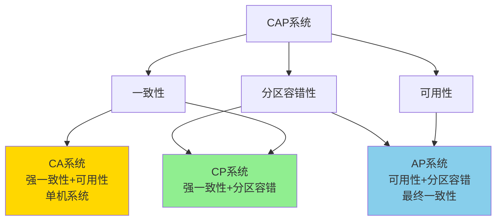

# 1.3.5 NoSQL分布式一致性与CAP

## 📑 目录

- [1.3.5 NoSQL分布式一致性与CAP](#135-nosql分布式一致性与cap)
  - [📑 目录](#-目录)
  - [1. 概述](#1-概述)
    - [1.1. 分布式一致性定义](#11-分布式一致性定义)
    - [1.2. CAP定理](#12-cap定理)
  - [2. CAP原理详解](#2-cap原理详解)
    - [2.1. 一致性（Consistency）](#21-一致性consistency)
    - [2.2. 可用性（Availability）](#22-可用性availability)
    - [2.3. 分区容错性（Partition Tolerance）](#23-分区容错性partition-tolerance)
    - [2.4. CAP权衡](#24-cap权衡)
  - [3. 一致性模型](#3-一致性模型)
    - [3.1. 强一致性](#31-强一致性)
    - [3.2. 最终一致性](#32-最终一致性)
    - [3.3. 会话一致性](#33-会话一致性)
    - [3.4. 因果一致性](#34-因果一致性)
    - [3.5. 单调一致性](#35-单调一致性)
  - [4. BASE理论](#4-base理论)
    - [4.1. BA（Basically Available）](#41-babasically-available)
    - [4.2. S（Soft State）](#42-ssoft-state)
    - [4.3. E（Eventually Consistent）](#43-eeventually-consistent)
  - [5. 实际系统实现](#5-实际系统实现)
    - [5.1. 强一致性系统](#51-强一致性系统)
      - [5.1.1. HBase](#511-hbase)
      - [5.1.2. MongoDB副本集](#512-mongodb副本集)
    - [5.2. 最终一致性系统](#52-最终一致性系统)
      - [5.2.1. DynamoDB](#521-dynamodb)
      - [5.2.2. Cassandra](#522-cassandra)
    - [5.3. 混合一致性系统](#53-混合一致性系统)
      - [5.3.1. MongoDB](#531-mongodb)
  - [6. 一致性协议](#6-一致性协议)
    - [6.1. 向量时钟](#61-向量时钟)
    - [6.2. 版本向量](#62-版本向量)
    - [6.3. CRDT](#63-crdt)
  - [7. 实际应用案例](#7-实际应用案例)
    - [7.1. 互联网行业：DynamoDB最终一致性](#71-互联网行业dynamodb最终一致性)
    - [7.2. 金融行业：HBase强一致性](#72-金融行业hbase强一致性)
  - [8. 形式化定义](#8-形式化定义)
    - [8.1. CAP定理形式化](#81-cap定理形式化)
    - [8.2. 一致性形式化](#82-一致性形式化)
  - [9. 多表征](#9-多表征)
  - [10. 总结与展望](#10-总结与展望)
    - [10.1. 总结](#101-总结)
    - [10.2. 发展趋势](#102-发展趋势)

---

## 1. 概述

### 1.1. 分布式一致性定义

**分布式一致性**是指在分布式系统中，多个节点对同一数据的访问结果应该是一致的。

**一致性类型**：

1. **强一致性**：所有节点同时看到相同的数据
2. **弱一致性**：允许暂时不一致
3. **最终一致性**：最终会达到一致状态

### 1.2. CAP定理

**CAP定理（Brewer's Theorem）**：在分布式系统中，一致性（Consistency）、可用性（Availability）和分区容错性（Partition Tolerance）三者不可兼得。

**形式化表述**：

$$C + A + P \nleq 2$$

即：在分布式系统中，最多只能同时满足CAP中的两个属性。

---

## 2. CAP原理详解

### 2.1. 一致性（Consistency）

**一致性定义**：所有节点在同一时刻看到相同的数据。

**一致性要求**：

- **读一致性**：读取操作返回最新写入的数据
- **写一致性**：写入操作在所有节点上同步

**一致性实现**：

```python
class ConsistentRead:
    def __init__(self, nodes):
        self.nodes = nodes

    def read(self, key):
        """强一致性读取"""
        # 从所有节点读取，确保一致性
        values = [node.read(key) for node in self.nodes]

        # 检查是否一致
        if len(set(values)) == 1:
            return values[0]
        else:
            # 不一致，需要修复
            return self.resolve_conflict(values)
```

### 2.2. 可用性（Availability）

**可用性定义**：系统在任意时刻都能响应请求。

**可用性要求**：

- **高可用性**：系统99.9%以上时间可用
- **快速响应**：请求在合理时间内响应
- **无单点故障**：系统无单点故障

**可用性计算**：

$$Availability = \frac{MTBF}{MTBF + MTTR}$$

其中：

- MTBF：平均故障间隔时间
- MTTR：平均修复时间

### 2.3. 分区容错性（Partition Tolerance）

**分区容错性定义**：系统在网络分区情况下仍能继续工作。

**分区容错性要求**：

- **网络分区检测**：能够检测网络分区
- **分区恢复**：分区恢复后能够同步数据
- **数据一致性**：分区期间保证数据一致性

### 2.4. CAP权衡

**CAP权衡图**：



**系统选择**：

| 系统类型 | 选择 | 典型系统 |
|---------|------|----------|
| **CP** | 一致性 + 分区容错 | HBase、MongoDB（副本集） |
| **AP** | 可用性 + 分区容错 | Cassandra、DynamoDB |
| **CA** | 一致性 + 可用性 | 单机数据库 |

---

## 3. 一致性模型

### 3.1. 强一致性

**强一致性定义**：所有节点在同一时刻看到相同的数据。

**强一致性特点**：

- **线性一致性**：所有操作按全局顺序执行
- **顺序一致性**：所有节点看到相同的操作顺序
- **因果一致性**：保证因果关系的操作顺序

**实现方式**：

1. **主从复制**：主节点写入，从节点同步
2. **多数派写入**：写入多数节点后返回
3. **两阶段提交**：2PC协议保证一致性

**示例**：

```python
class StrongConsistency:
    def __init__(self, nodes):
        self.nodes = nodes
        self.quorum = len(nodes) // 2 + 1

    def write(self, key, value):
        """强一致性写入"""
        # 写入多数节点
        success_count = 0
        for node in self.nodes:
            if node.write(key, value):
                success_count += 1
                if success_count >= self.quorum:
                    return True
        return False
```

### 3.2. 最终一致性

**最终一致性定义**：系统最终会达到一致状态，但允许暂时不一致。

**最终一致性特点**：

- **允许暂时不一致**：短时间内可能不一致
- **最终一致**：最终会达到一致状态
- **高可用性**：保证系统可用性

**实现方式**：

1. **异步复制**：异步同步数据
2. **冲突解决**：解决数据冲突
3. **版本控制**：使用版本号控制

**示例**：

```python
class EventuallyConsistent:
    def __init__(self, nodes):
        self.nodes = nodes
        self.version = {}

    def write(self, key, value):
        """最终一致性写入"""
        # 写入本地节点
        version = self.version.get(key, 0) + 1
        self.version[key] = version

        # 异步复制到其他节点
        for node in self.nodes:
            node.async_replicate(key, value, version)

    def read(self, key):
        """最终一致性读取"""
        # 从本地节点读取
        return self.nodes[0].read(key)
```

### 3.3. 会话一致性

**会话一致性定义**：在同一会话内保证一致性。

**会话一致性特点**：

- **会话内一致**：同一会话内读取一致
- **会话间可能不一致**：不同会话可能看到不同数据
- **适合Web应用**：适合Web应用场景

**实现方式**：

1. **粘性会话**：同一会话路由到同一节点
2. **会话缓存**：在会话中缓存数据
3. **版本控制**：使用版本号控制

### 3.4. 因果一致性

**因果一致性定义**：保证因果相关的操作在所有节点上以相同顺序执行。

**因果一致性特点**：

- **因果关系**：保证因果关系的操作顺序
- **并发操作**：允许并发操作
- **向量时钟**：使用向量时钟跟踪因果关系

### 3.5. 单调一致性

**单调一致性定义**：保证单调读和单调写。

**单调一致性特点**：

- **单调读**：后续读取不会看到旧数据
- **单调写**：写入操作按顺序执行
- **适合缓存**：适合缓存场景

---

## 4. BASE理论

### 4.1. BA（Basically Available）

**基本可用性**：系统在大部分时间可用，允许部分功能降级。

**基本可用性特点**：

- **降级服务**：部分功能降级
- **快速响应**：快速响应请求
- **容错设计**：容错设计

### 4.2. S（Soft State）

**软状态**：系统状态可以暂时不一致。

**软状态特点**：

- **允许不一致**：允许暂时不一致
- **自动修复**：自动修复不一致
- **最终一致**：最终达到一致状态

### 4.3. E（Eventually Consistent）

**最终一致性**：系统最终会达到一致状态。

**最终一致性特点**：

- **最终一致**：最终达到一致状态
- **时间窗口**：在时间窗口内可能不一致
- **冲突解决**：解决数据冲突

**BASE vs ACID**：

| 特性 | ACID | BASE |
|------|------|------|
| **一致性** | 强一致性 | 最终一致性 |
| **可用性** | 低（事务阻塞） | 高（无阻塞） |
| **性能** | 低 | 高 |
| **适用场景** | 金融交易 | Web应用 |

---

## 5. 实际系统实现

### 5.1. 强一致性系统

#### 5.1.1. HBase

**HBase一致性**：

- **强一致性**：使用HDFS保证强一致性
- **行级一致性**：保证行级一致性
- **主从架构**：主从复制架构

**配置示例**：

```xml
<!-- HBase配置 -->
<configuration>
  <property>
    <name>hbase.regionserver.handler.count</name>
    <value>30</value>
  </property>
  <property>
    <name>hbase.hregion.memstore.flush.size</name>
    <value>134217728</value>
  </property>
</configuration>
```

#### 5.1.2. MongoDB副本集

**MongoDB一致性**：

- **主从复制**：主节点写入，从节点同步
- **读偏好**：可配置读偏好
- **写关注**：可配置写关注级别

**配置示例**：

```javascript
// MongoDB副本集配置
rs.initiate({
  _id: "rs0",
  members: [
    { _id: 0, host: "mongodb1:27017" },
    { _id: 1, host: "mongodb2:27017" },
    { _id: 2, host: "mongodb3:27017" }
  ]
})

// 写关注：多数节点确认
db.orders.insert(
  { order_id: 1, amount: 100 },
  { writeConcern: { w: "majority" } }
)
```

### 5.2. 最终一致性系统

#### 5.2.1. DynamoDB

**DynamoDB一致性**：

- **最终一致性**：默认最终一致性
- **强一致性读取**：可选强一致性读取
- **多区域复制**：多区域异步复制

**配置示例**：

```json
{
  "TableName": "orders",
  "ConsistentRead": false,
  "Key": {
    "order_id": "123"
  }
}
```

#### 5.2.2. Cassandra

**Cassandra一致性**：

- **可调一致性**：可配置一致性级别
- **最终一致性**：默认最终一致性
- **向量时钟**：使用向量时钟跟踪版本

**配置示例**：

```cql
-- Cassandra一致性级别
CONSISTENCY QUORUM;  -- 多数节点

-- 写入
INSERT INTO orders (order_id, amount) VALUES (1, 100);

-- 读取
SELECT * FROM orders WHERE order_id = 1;
```

### 5.3. 混合一致性系统

#### 5.3.1. MongoDB

**MongoDB一致性**：

- **副本集**：强一致性（主从复制）
- **分片集群**：最终一致性（分片间）
- **可配置**：可配置一致性级别

---

## 6. 一致性协议

### 6.1. 向量时钟

**向量时钟定义**：用于跟踪事件因果关系的逻辑时钟。

**向量时钟实现**：

```python
class VectorClock:
    def __init__(self, node_id, num_nodes):
        self.node_id = node_id
        self.clock = [0] * num_nodes

    def tick(self):
        """本地事件"""
        self.clock[self.node_id] += 1

    def update(self, other_clock):
        """接收消息，更新时钟"""
        for i in range(len(self.clock)):
            self.clock[i] = max(self.clock[i], other_clock[i])
        self.clock[self.node_id] += 1

    def happens_before(self, other_clock):
        """判断是否发生在之前"""
        return all(self.clock[i] <= other_clock[i] for i in range(len(self.clock))) and \
               any(self.clock[i] < other_clock[i] for i in range(len(self.clock)))
```

### 6.2. 版本向量

**版本向量定义**：用于跟踪数据版本的向量。

**版本向量实现**：

```python
class VersionVector:
    def __init__(self):
        self.versions = {}

    def increment(self, node_id):
        """增加版本号"""
        self.versions[node_id] = self.versions.get(node_id, 0) + 1

    def merge(self, other):
        """合并版本向量"""
        for node_id, version in other.versions.items():
            self.versions[node_id] = max(
                self.versions.get(node_id, 0),
                version
            )

    def compare(self, other):
        """比较版本向量"""
        # 判断是否并发
        self_greater = any(
            self.versions.get(n, 0) > other.versions.get(n, 0)
            for n in set(self.versions.keys()) | set(other.versions.keys())
        )
        other_greater = any(
            other.versions.get(n, 0) > self.versions.get(n, 0)
            for n in set(self.versions.keys()) | set(other.versions.keys())
        )

        if self_greater and other_greater:
            return "concurrent"
        elif self_greater:
            return "after"
        elif other_greater:
            return "before"
        else:
            return "equal"
```

### 6.3. CRDT

**CRDT（Conflict-free Replicated Data Type）**：无冲突复制数据类型。

**CRDT类型**：

1. **G-CRDT**：基于状态的CRDT
2. **C-CRDT**：基于操作的CRDT

**CRDT示例**：

```python
class GSet:
    """Grow-only Set CRDT"""
    def __init__(self):
        self.elements = set()

    def add(self, element):
        """添加元素"""
        self.elements.add(element)

    def merge(self, other):
        """合并集合"""
        self.elements |= other.elements

    def contains(self, element):
        """检查元素"""
        return element in self.elements
```

---

## 7. 实际应用案例

### 7.1. 互联网行业：DynamoDB最终一致性

**场景**：

- 高可用性要求
- 可接受最终一致性
- 大规模分布式系统

**实现**：

```json
{
  "TableName": "orders",
  "ConsistentRead": false,
  "Key": {
    "order_id": "123"
  }
}
```

### 7.2. 金融行业：HBase强一致性

**场景**：

- 强一致性要求
- 金融交易数据
- 行级一致性

**实现**：

- 使用HDFS保证强一致性
- 主从复制架构
- 行级事务支持

---

## 8. 形式化定义

### 8.1. CAP定理形式化

**CAP定理形式化**：

设分布式系统 $S = (N, R, C)$，其中：

- $N$：节点集合
- $R$：请求集合
- $C$：一致性约束

则：

$$\neg(C \land A \land P)$$

即：不能同时满足一致性、可用性和分区容错性。

### 8.2. 一致性形式化

**强一致性定义**：

$$\forall n_1, n_2 \in N, \forall t: \text{Read}(n_1, k, t) = \text{Read}(n_2, k, t)$$

**最终一致性定义**：

$$\lim_{t \to \infty} \forall n_1, n_2: \text{Read}(n_1, k, t) = \text{Read}(n_2, k, t)$$

---

## 9. 多表征

本主题支持多种表征方式：

1. **符号表征**：CAP定理公式、一致性定义
2. **图结构**：CAP权衡图、一致性模型图
3. **代码实现**：一致性协议实现、系统配置
4. **自然语言**：概念定义、系统描述
5. **可视化**：一致性模型可视化、系统架构图

---

## 10. 总结与展望

### 10.1. 总结

NoSQL分布式一致性与CAP的核心要点：

1. **CAP定理**：一致性、可用性、分区容错性不可兼得
2. **一致性模型**：强一致性、最终一致性、会话一致性等
3. **BASE理论**：基本可用、软状态、最终一致性
4. **一致性协议**：向量时钟、版本向量、CRDT

### 10.2. 发展趋势

**未来发展方向**：

1. **新的一致性模型**：更灵活的一致性模型
2. **混合一致性**：不同场景使用不同一致性级别
3. **自动一致性调优**：根据场景自动调整一致性级别

---

**参考文献**：

1. Brewer, E. (2012). "CAP Twelve Years Later: How the 'Rules' Have Changed"
2. Gilbert, S., & Lynch, N. (2002). "Brewer's Conjecture and the Feasibility of Consistent, Available, Partition-Tolerant Web Services"

---

[返回NoSQL导航](README.md)
