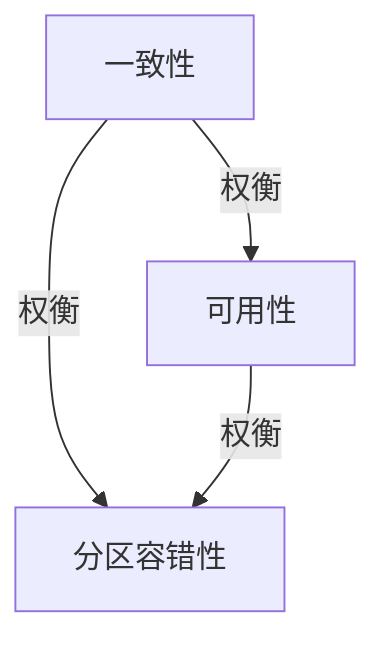

# 1.3.5 分布式一致性与CAP

## 1.3.5.1 CAP原理

- CAP定理：一致性（C）、可用性（A）、分区容错性（P）三者不可兼得。
- 不同NoSQL系统在三者间权衡。

## 1.3.5.2 一致性模型

| 模型 | 说明 | 典型系统 |
|------|------|----------|
| 强一致性 | 所有节点数据一致 | HBase、Zookeeper |
| 最终一致性 | 最终达到一致 | DynamoDB、Cassandra |
| 会话一致性 | 单会话内一致 | MongoDB |

## 1.3.5.3 行业案例与多表征

### 互联网行业：DynamoDB最终一致性

```json
{
  "TableName": "orders",
  "ConsistentRead": false
}
```

### 金融行业：HBase强一致性

- 见[3.5.7-数据存储与访问](../../3-数据模型与算法/3.5-数据分析与ETL/3.5.7-数据存储与访问.md)

### Mermaid CAP权衡图



### Latex公式

$$
C + A + P \nleq 2
$$

[返回NoSQL导航](README.md)
