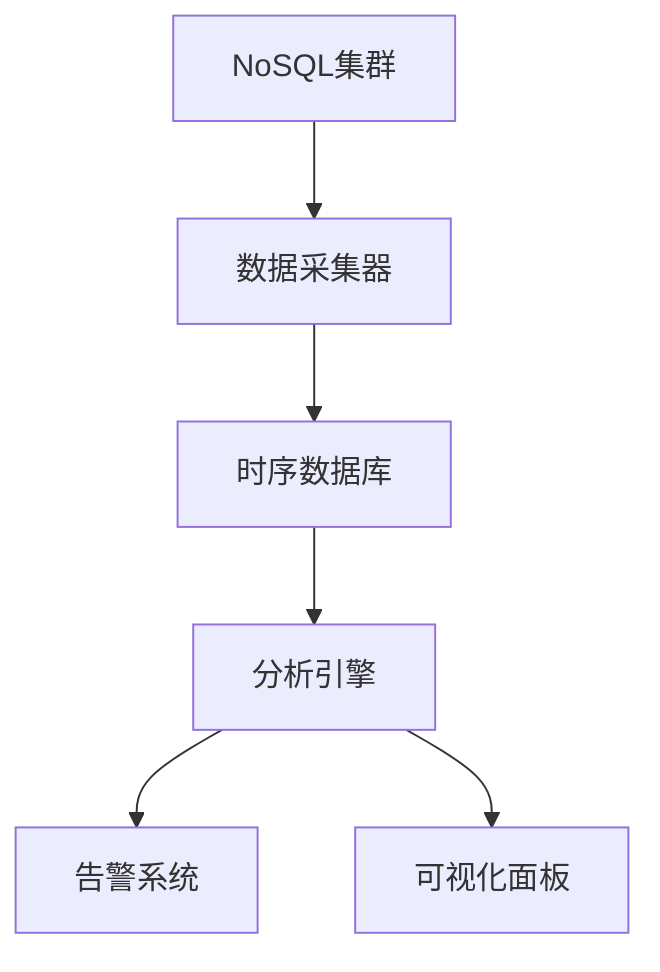
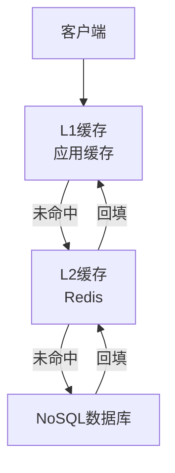
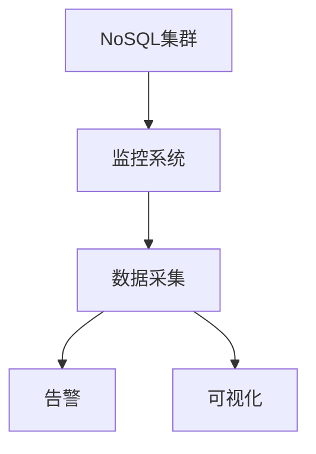

# 1.3.6 NoSQL性能调优与监控

## 📑 目录

- [1.3.6 NoSQL性能调优与监控](#136-nosql性能调优与监控)
  - [📑 目录](#-目录)
  - [1. 概述](#1-概述)
    - [1.1. 性能调优目标](#11-性能调优目标)
    - [1.2. 监控体系](#12-监控体系)
  - [2. 性能调优方法](#2-性能调优方法)
    - [2.1. 索引优化](#21-索引优化)
      - [2.1.1. 索引类型选择](#211-索引类型选择)
      - [2.1.2. 索引优化策略](#212-索引优化策略)
    - [2.2. 分片策略](#22-分片策略)
      - [2.2.1. 分片键选择](#221-分片键选择)
    - [2.3. 读写分离](#23-读写分离)
      - [2.3.1. 读写分离架构](#231-读写分离架构)
    - [2.4. 缓存优化](#24-缓存优化)
      - [2.4.1. 多级缓存](#241-多级缓存)
    - [2.5. 连接池调优](#25-连接池调优)
      - [2.5.1. 连接池配置](#251-连接池配置)
    - [2.6. 硬件资源优化](#26-硬件资源优化)
      - [2.6.1. CPU优化](#261-cpu优化)
      - [2.6.2. 内存优化](#262-内存优化)
      - [2.6.3. I/O优化](#263-io优化)
  - [3. 监控与诊断](#3-监控与诊断)
    - [3.1. 性能指标监控](#31-性能指标监控)
      - [3.1.1. QPS/TPS监控](#311-qpstps监控)
      - [3.1.2. 延迟监控](#312-延迟监控)
    - [3.2. 资源使用监控](#32-资源使用监控)
      - [3.2.1. CPU监控](#321-cpu监控)
      - [3.2.2. 内存监控](#322-内存监控)
      - [3.2.3. I/O监控](#323-io监控)
    - [3.3. 集群状态监控](#33-集群状态监控)
      - [3.3.1. 节点健康监控](#331-节点健康监控)
    - [3.4. 慢查询分析](#34-慢查询分析)
      - [3.4.1. 慢查询识别](#341-慢查询识别)
  - [4. 实际系统优化](#4-实际系统优化)
    - [4.1. MongoDB性能优化](#41-mongodb性能优化)
      - [4.1.1. 索引优化](#411-索引优化)
      - [4.1.2. 分片优化](#412-分片优化)
    - [4.2. Cassandra性能优化](#42-cassandra性能优化)
      - [4.2.1. 分区键优化](#421-分区键优化)
      - [4.2.2. 压缩优化](#422-压缩优化)
    - [4.3. Redis性能优化](#43-redis性能优化)
      - [4.3.1. 内存优化](#431-内存优化)
      - [4.3.2. 持久化优化](#432-持久化优化)
  - [5. 实际应用案例](#5-实际应用案例)
    - [5.1. 互联网行业：NoSQL性能监控](#51-互联网行业nosql性能监控)
    - [5.2. 金融行业：NoSQL性能调优](#52-金融行业nosql性能调优)
  - [6. 形式化定义](#6-形式化定义)
    - [6.1. 性能指标形式化](#61-性能指标形式化)
    - [6.2. 性能优化目标](#62-性能优化目标)
  - [7. 多表征](#7-多表征)
  - [8. 总结与展望](#8-总结与展望)
    - [8.1. 总结](#81-总结)
    - [8.2. 发展趋势](#82-发展趋势)

---

## 1. 概述

### 1.1. 性能调优目标

**NoSQL性能调优的目标**：

1. **提高吞吐量**：增加QPS（每秒查询数）
2. **降低延迟**：减少P50、P95、P99延迟
3. **提高资源利用率**：优化CPU、内存、I/O使用
4. **保证稳定性**：避免性能波动

**性能指标定义**：

- **QPS（Queries Per Second）**：每秒查询数
  $$QPS = \frac{\text{总查询数}}{\text{时间（秒）}}$$

- **延迟（Latency）**：查询响应时间
  - P50：50%的查询延迟
  - P95：95%的查询延迟
  - P99：99%的查询延迟

### 1.2. 监控体系

**监控体系架构**：



---

## 2. 性能调优方法

### 2.1. 索引优化

#### 2.1.1. 索引类型选择

**索引类型**：

1. **哈希索引**：快速点查询
2. **B树索引**：范围查询
3. **位图索引**：低基数列
4. **全文索引**：文本搜索

**索引选择原则**：

- **点查询**：使用哈希索引
- **范围查询**：使用B树索引
- **多字段查询**：使用复合索引

#### 2.1.2. 索引优化策略

**MongoDB索引优化**：

```javascript
// 创建索引
db.orders.createIndex({ user_id: 1, order_date: -1 })

// 查看索引使用情况
db.orders.find({ user_id: 123 }).explain("executionStats")

// 复合索引优化
db.orders.createIndex({ user_id: 1, status: 1, order_date: -1 })
```

**Cassandra索引优化**：

```cql
-- 创建二级索引
CREATE INDEX idx_user_email ON users(email);

-- 使用SASI索引（文本搜索）
CREATE CUSTOM INDEX idx_user_name ON users(name)
USING 'org.apache.cassandra.index.sasi.SASIIndex'
WITH OPTIONS = {
    'mode': 'CONTAINS',
    'analyzer_class': 'org.apache.cassandra.index.sasi.analyzer.StandardAnalyzer',
    'case_sensitive': 'false'
};
```

### 2.2. 分片策略

#### 2.2.1. 分片键选择

**分片键选择原则**：

1. **均匀分布**：数据均匀分布到各分片
2. **查询模式匹配**：匹配主要查询模式
3. **避免热点**：避免单分片成为热点

**MongoDB分片**：

```javascript
// 启用分片
sh.enableSharding("mydb")

// 创建分片集合
sh.shardCollection("mydb.orders", { user_id: 1 })

// 查看分片状态
sh.status()
```

**Cassandra分区键**：

```cql
-- 创建分区表
CREATE TABLE orders (
    order_id UUID,
    user_id UUID,
    order_date TIMESTAMP,
    amount DECIMAL,
    PRIMARY KEY (user_id, order_date, order_id)
) WITH CLUSTERING ORDER BY (order_date DESC);

-- 分区键：user_id
-- 聚类键：order_date, order_id
```

### 2.3. 读写分离

#### 2.3.1. 读写分离架构

**读写分离实现**：

```python
class ReadWriteSplitter:
    def __init__(self, master, slaves):
        self.master = master
        self.slaves = slaves
        self.slave_index = 0

    def execute(self, query, is_write=False):
        """执行查询"""
        if is_write:
            return self.master.execute(query)
        else:
            # 轮询选择从节点
            slave = self.slaves[self.slave_index]
            self.slave_index = (self.slave_index + 1) % len(self.slaves)
            return slave.execute(query)
```

**MongoDB读写分离**：

```javascript
// 读偏好设置
db.orders.find({ user_id: 123 })
  .readPref("secondary")  // 从从节点读取

// 写关注设置
db.orders.insert({ order_id: 1, amount: 100 }, {
  writeConcern: { w: "majority", wtimeout: 5000 }
})
```

### 2.4. 缓存优化

#### 2.4.1. 多级缓存

**缓存层次**：



**Redis缓存实现**：

```python
import redis
import json

class CacheManager:
    def __init__(self, redis_client, db):
        self.redis = redis_client
        self.db = db

    def get(self, key):
        """获取数据"""
        # 先查缓存
        cached = self.redis.get(key)
        if cached:
            return json.loads(cached)

        # 查数据库
        data = self.db.get(key)
        if data:
            # 写入缓存
            self.redis.setex(key, 3600, json.dumps(data))

        return data
```

### 2.5. 连接池调优

#### 2.5.1. 连接池配置

**连接池参数**：

- **最大连接数**：max_connections
- **最小连接数**：min_connections
- **连接超时**：connection_timeout
- **空闲超时**：idle_timeout

**MongoDB连接池**：

```python
from pymongo import MongoClient

# 连接池配置
client = MongoClient(
    'mongodb://localhost:27017/',
    maxPoolSize=50,
    minPoolSize=10,
    maxIdleTimeMS=45000,
    connectTimeoutMS=2000
)
```

### 2.6. 硬件资源优化

#### 2.6.1. CPU优化

**CPU优化策略**：

1. **CPU绑定**：将进程绑定到特定CPU核心
2. **并行度调优**：调整并行查询数量
3. **NUMA优化**：考虑NUMA架构

#### 2.6.2. 内存优化

**内存配置**：

- **堆内存**：JVM堆内存配置
- **缓存大小**：缓存内存配置
- **内存映射**：内存映射文件

**MongoDB内存优化**：

```yaml
# mongod.conf
storage:
  wiredTiger:
    engineConfig:
      cacheSizeGB: 8  # 缓存大小
```

#### 2.6.3. I/O优化

**I/O优化策略**：

1. **SSD存储**：使用SSD提高I/O性能
2. **RAID配置**：使用RAID提高I/O吞吐量
3. **I/O调度器**：优化I/O调度算法

---

## 3. 监控与诊断

### 3.1. 性能指标监控

#### 3.1.1. QPS/TPS监控

**监控指标**：

- **QPS**：每秒查询数
- **TPS**：每秒事务数
- **查询类型分布**：SELECT、INSERT、UPDATE、DELETE比例

**MongoDB监控**：

```javascript
// 查看操作统计
db.serverStatus().opcounters

// 查看慢查询
db.setProfilingLevel(1, { slowms: 100 })
db.system.profile.find().sort({ ts: -1 }).limit(10)
```

#### 3.1.2. 延迟监控

**延迟指标**：

- **P50延迟**：50%的查询延迟
- **P95延迟**：95%的查询延迟
- **P99延迟**：99%的查询延迟

**Cassandra监控**：

```cql
-- 查看延迟统计
SELECT * FROM system.local;

-- 查看表统计
SELECT * FROM system.size_estimates;
```

### 3.2. 资源使用监控

#### 3.2.1. CPU监控

**CPU指标**：

- **CPU使用率**：各节点的CPU使用率
- **CPU负载**：系统负载

#### 3.2.2. 内存监控

**内存指标**：

- **内存使用率**：各节点的内存使用率
- **内存分配**：各组件内存分配

**Redis内存监控**：

```bash
# 查看内存使用
redis-cli INFO memory

# 查看内存统计
redis-cli --bigkeys
```

#### 3.2.3. I/O监控

**I/O指标**：

- **I/O吞吐量**：读写吞吐量
- **I/O延迟**：I/O操作延迟
- **磁盘使用率**：磁盘空间使用

### 3.3. 集群状态监控

#### 3.3.1. 节点健康监控

**监控指标**：

- **节点状态**：在线/离线
- **节点负载**：CPU、内存、I/O负载
- **网络延迟**：节点间网络延迟

**MongoDB集群监控**：

```javascript
// 查看副本集状态
rs.status()

// 查看分片状态
sh.status()
```

### 3.4. 慢查询分析

#### 3.4.1. 慢查询识别

**慢查询标准**：

- **执行时间**：超过阈值的查询
- **扫描行数**：扫描大量行的查询
- **资源消耗**：消耗大量资源的查询

**MongoDB慢查询**：

```javascript
// 启用慢查询日志
db.setProfilingLevel(1, { slowms: 100 })

// 查看慢查询
db.system.profile.find({
  millis: { $gt: 100 }
}).sort({ millis: -1 }).limit(10)
```

---

## 4. 实际系统优化

### 4.1. MongoDB性能优化

#### 4.1.1. 索引优化

```javascript
// 创建复合索引
db.orders.createIndex({ user_id: 1, order_date: -1 })

// 使用覆盖索引
db.orders.find(
  { user_id: 123 },
  { user_id: 1, order_date: 1, _id: 0 }
).hint({ user_id: 1, order_date: -1 })
```

#### 4.1.2. 分片优化

```javascript
// 分片键选择
sh.shardCollection("mydb.orders", { user_id: 1, order_date: 1 })

// 预分片
sh.enableSharding("mydb")
sh.shardCollection("mydb.orders", { user_id: "hashed" })
```

### 4.2. Cassandra性能优化

#### 4.2.1. 分区键优化

```cql
-- 选择合适的分区键
CREATE TABLE orders (
    user_id UUID,
    order_date TIMESTAMP,
    order_id UUID,
    amount DECIMAL,
    PRIMARY KEY (user_id, order_date, order_id)
) WITH CLUSTERING ORDER BY (order_date DESC);
```

#### 4.2.2. 压缩优化

```cql
-- 配置压缩
ALTER TABLE orders WITH compression = {
    'sstable_compression': 'LZ4Compressor',
    'chunk_length_kb': 64
};
```

### 4.3. Redis性能优化

#### 4.3.1. 内存优化

```bash
# 配置最大内存
maxmemory 2gb
maxmemory-policy allkeys-lru

# 使用压缩
hash-max-ziplist-entries 512
hash-max-ziplist-value 64
```

#### 4.3.2. 持久化优化

```bash
# RDB配置
save 900 1
save 300 10
save 60 10000

# AOF配置
appendonly yes
appendfsync everysec
```

---

## 5. 实际应用案例

### 5.1. 互联网行业：NoSQL性能监控

**场景**：

- 高并发Web应用
- 大规模数据存储
- 实时监控需求

**监控方案**：



### 5.2. 金融行业：NoSQL性能调优

**场景**：

- 高可用性要求
- 低延迟要求
- 数据一致性要求

**优化方案**：

1. **索引优化**：创建合适的索引
2. **分片优化**：合理分片策略
3. **缓存优化**：多级缓存

---

## 6. 形式化定义

### 6.1. 性能指标形式化

**QPS定义**：

$$QPS(t) = \lim_{\Delta t \to 0} \frac{Q(t + \Delta t) - Q(t)}{\Delta t}$$

**延迟定义**：

$$L_p = \inf\{l: P(\text{latency} \leq l) \geq p\}$$

### 6.2. 性能优化目标

**优化目标**：

$$\max \text{QPS} \quad \text{s.t.} \quad L_{95} \leq \tau$$

---

## 7. 多表征

本主题支持多种表征方式：

1. **符号表征**：性能指标公式、优化算法
2. **图结构**：监控架构图、性能曲线图
3. **代码实现**：监控代码、优化代码
4. **自然语言**：概念定义、最佳实践
5. **可视化**：监控面板、性能图表

---

## 8. 总结与展望

### 8.1. 总结

NoSQL性能调优与监控的核心要点：

1. **性能调优**：索引、分片、读写分离、缓存
2. **监控体系**：QPS/TPS、延迟、资源使用、集群状态
3. **诊断方法**：慢查询分析、性能分析、故障排查

### 8.2. 发展趋势

**未来发展方向**：

1. **AI驱动优化**：机器学习自动优化
2. **实时监控**：实时性能分析和预测
3. **自动化调优**：自动参数调优

---

**参考文献**：

1. MongoDB Performance Best Practices
2. Cassandra Performance Tuning

---

[返回NoSQL导航](README.md)
