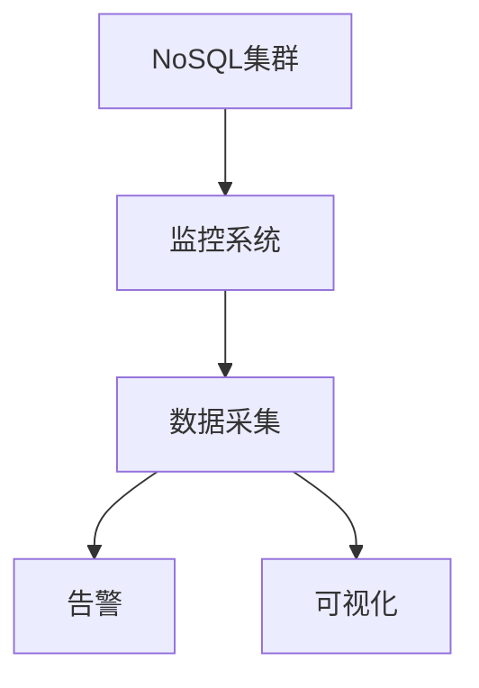

# 1.3.6 性能调优与监控

## 1.3.6.1 性能调优方法

- 索引优化、分片策略、读写分离。
- 缓存优化、连接池调优、硬件资源优化。

## 1.3.6.2 监控与诊断

| 监控维度 | 指标 | 工具 |
|----------|------|------|
| 性能指标 | QPS、延迟、吞吐量 | 内置监控 |
| 资源使用 | CPU、内存、IO | 系统监控 |
| 集群状态 | 节点健康、分片状态 | 集群监控 |

## 1.3.6.3 行业案例与多表征

### 互联网行业：NoSQL性能监控



### 金融行业：NoSQL性能调优

- 见[7.4.1-CI_CD最佳实践](../../../../7-持续集成与演进/7.4-CI_CD/7.4.1-CI_CD最佳实践.md)

### Latex公式

$$
\text{性能提升} = \frac{\text{优化后QPS}}{\text{优化前QPS}}
$$

### 监控查询示例

```javascript
// MongoDB性能监控
db.getCollection('system.profile').find({
  millis: {$gt: 100}
}).sort({millis: -1}).limit(10)
```

[返回NoSQL导航](README.md)
