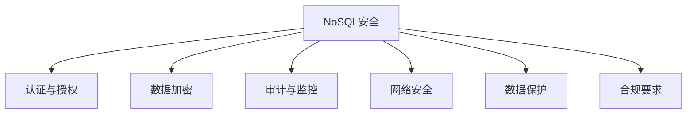
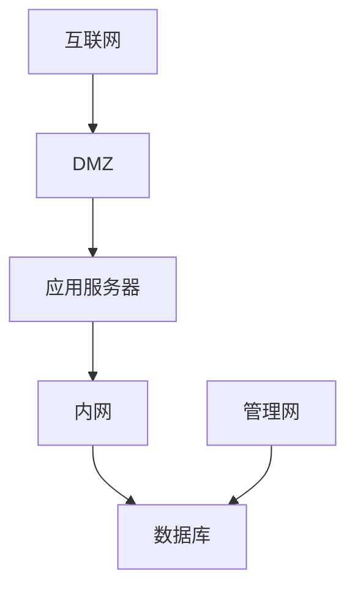

# 1.3.7 NoSQL安全与合规

## 📑 目录

- [1.3.7 NoSQL安全与合规](#137-nosql安全与合规)
  - [📑 目录](#-目录)
  - [1. 概述](#1-概述)
    - [1.1. NoSQL安全挑战](#11-nosql安全挑战)
    - [1.2. 安全框架](#12-安全框架)
  - [2. 认证与授权](#2-认证与授权)
    - [2.1. 身份认证](#21-身份认证)
      - [2.1.1. 认证机制](#211-认证机制)
      - [2.1.2. 密码策略](#212-密码策略)
    - [2.2. 访问控制](#22-访问控制)
      - [2.2.1. 访问控制模型](#221-访问控制模型)
      - [2.2.2. 权限管理](#222-权限管理)
    - [2.3. 角色管理](#23-角色管理)
      - [2.3.1. 角色定义](#231-角色定义)
      - [2.3.2. 角色继承](#232-角色继承)
  - [3. 数据加密](#3-数据加密)
    - [3.1. 传输加密](#31-传输加密)
      - [3.1.1. TLS/SSL加密](#311-tlsssl加密)
      - [3.1.2. 证书管理](#312-证书管理)
    - [3.2. 存储加密](#32-存储加密)
      - [3.2.1. 静态数据加密](#321-静态数据加密)
    - [3.3. 字段级加密](#33-字段级加密)
      - [3.3.1. 客户端字段级加密](#331-客户端字段级加密)
  - [4. 审计与监控](#4-审计与监控)
    - [4.1. 审计日志](#41-审计日志)
      - [4.1.1. 审计事件](#411-审计事件)
      - [4.1.2. 日志分析](#412-日志分析)
    - [4.2. 安全监控](#42-安全监控)
      - [4.2.1. 监控指标](#421-监控指标)
    - [4.3. 异常检测](#43-异常检测)
      - [4.3.1. 异常检测算法](#431-异常检测算法)
  - [5. 网络安全](#5-网络安全)
    - [5.1. 网络隔离](#51-网络隔离)
      - [5.1.1. 网络分段](#511-网络分段)
    - [5.2. 防火墙配置](#52-防火墙配置)
      - [5.2.1. 防火墙规则](#521-防火墙规则)
    - [5.3. VPN与专线](#53-vpn与专线)
      - [5.3.1. 安全连接](#531-安全连接)
  - [6. 数据保护](#6-数据保护)
    - [6.1. 数据脱敏](#61-数据脱敏)
      - [6.1.1. 脱敏策略](#611-脱敏策略)
    - [6.2. 数据备份](#62-数据备份)
      - [6.2.1. 备份策略](#621-备份策略)
    - [6.3. 数据恢复](#63-数据恢复)
      - [6.3.1. 恢复流程](#631-恢复流程)
  - [7. 合规要求](#7-合规要求)
    - [7.1. GDPR合规](#71-gdpr合规)
      - [7.1.1. GDPR要求](#711-gdpr要求)
    - [7.2. SOX合规](#72-sox合规)
      - [7.2.1. SOX要求](#721-sox要求)
    - [7.3. PCI DSS合规](#73-pci-dss合规)
      - [7.3.1. PCI DSS要求](#731-pci-dss要求)
    - [7.4. HIPAA合规](#74-hipaa合规)
      - [7.4.1. HIPAA要求](#741-hipaa要求)
  - [8. 实际系统实现](#8-实际系统实现)
    - [8.1. MongoDB安全](#81-mongodb安全)
      - [8.1.1. MongoDB安全配置](#811-mongodb安全配置)
    - [8.2. Cassandra安全](#82-cassandra安全)
      - [8.2.1. Cassandra安全配置](#821-cassandra安全配置)
    - [8.3. Redis安全](#83-redis安全)
      - [8.3.1. Redis安全配置](#831-redis安全配置)
  - [9. 安全最佳实践](#9-安全最佳实践)
    - [9.1. 安全清单](#91-安全清单)
  - [10. 形式化定义](#10-形式化定义)
    - [10.1. 安全模型形式化](#101-安全模型形式化)
  - [11. 多表征](#11-多表征)
  - [12. 总结与展望](#12-总结与展望)
    - [12.1. 总结](#121-总结)
    - [12.2. 发展趋势](#122-发展趋势)

---

## 1. 概述

### 1.1. NoSQL安全挑战

**NoSQL安全挑战**：

1. **默认不安全**：许多NoSQL系统默认配置不安全
2. **复杂架构**：分布式架构增加安全复杂性
3. **缺乏标准**：缺乏统一的安全标准
4. **工具不足**：安全工具和最佳实践不足

### 1.2. 安全框架

**NoSQL安全框架**：



---

## 2. 认证与授权

### 2.1. 身份认证

#### 2.1.1. 认证机制

**认证机制类型**：

1. **用户名密码**：传统用户名密码认证
2. **证书认证**：X.509证书认证
3. **LDAP/AD集成**：与企业目录集成
4. **OAuth/SAML**：单点登录

**MongoDB认证**：

```javascript
// 创建用户
db.createUser({
  user: "admin",
  pwd: "password",
  roles: ["root"]
})

// 启用认证
// mongod.conf
security:
  authorization: enabled
```

**Cassandra认证**：

```yaml
# cassandra.yaml
authenticator: PasswordAuthenticator
authorizer: CassandraAuthorizer
```

#### 2.1.2. 密码策略

**密码策略**：

1. **复杂度要求**：最小长度、字符类型
2. **过期策略**：定期更换密码
3. **锁定策略**：失败尝试锁定账户

**实现示例**：

```python
class PasswordPolicy:
    def __init__(self):
        self.min_length = 8
        self.require_uppercase = True
        self.require_lowercase = True
        self.require_digits = True
        self.require_special = True
        self.max_age_days = 90

    def validate(self, password):
        """验证密码"""
        if len(password) < self.min_length:
            return False
        if self.require_uppercase and not any(c.isupper() for c in password):
            return False
        if self.require_lowercase and not any(c.islower() for c in password):
            return False
        if self.require_digits and not any(c.isdigit() for c in password):
            return False
        if self.require_special and not any(c in "!@#$%^&*" for c in password):
            return False
        return True
```

### 2.2. 访问控制

#### 2.2.1. 访问控制模型

**访问控制模型**：

1. **RBAC（基于角色）**：基于角色的访问控制
2. **ABAC（基于属性）**：基于属性的访问控制
3. **ACL（访问控制列表）**：访问控制列表

**MongoDB角色**：

```javascript
// 创建角色
db.createRole({
  role: "readWriteOrders",
  privileges: [
    {
      resource: { db: "mydb", collection: "orders" },
      actions: ["find", "insert", "update"]
    }
  ],
  roles: []
})

// 分配角色
db.grantRolesToUser("user1", ["readWriteOrders"])
```

#### 2.2.2. 权限管理

**权限类型**：

1. **读权限**：SELECT、FIND
2. **写权限**：INSERT、UPDATE、DELETE
3. **管理权限**：CREATE、DROP、ALTER

**权限矩阵**：

| 操作 | 读权限 | 写权限 | 管理权限 |
|------|--------|--------|----------|
| **SELECT** | ✅ | ❌ | ✅ |
| **INSERT** | ❌ | ✅ | ✅ |
| **UPDATE** | ❌ | ✅ | ✅ |
| **DELETE** | ❌ | ✅ | ✅ |
| **CREATE** | ❌ | ❌ | ✅ |

### 2.3. 角色管理

#### 2.3.1. 角色定义

**角色定义**：

```javascript
// MongoDB内置角色
// 数据库用户角色
read
readWrite
dbAdmin
userAdmin

// 数据库管理角色
dbOwner
readAnyDatabase
readWriteAnyDatabase
userAdminAnyDatabase
dbAdminAnyDatabase

// 集群管理角色
clusterAdmin
clusterManager
clusterMonitor
hostManager
```

#### 2.3.2. 角色继承

**角色继承**：

```javascript
// 创建自定义角色
db.createRole({
  role: "orderManager",
  privileges: [
    {
      resource: { db: "mydb", collection: "orders" },
      actions: ["find", "insert", "update", "remove"]
    }
  ],
  roles: ["read"]  // 继承read角色
})
```

---

## 3. 数据加密

### 3.1. 传输加密

#### 3.1.1. TLS/SSL加密

**TLS/SSL配置**：

```yaml
# MongoDB TLS配置
net:
  tls:
    mode: requireTLS
    certificateKeyFile: /path/to/server.pem
    CAFile: /path/to/ca.pem
```

**Cassandra TLS配置**：

```yaml
# cassandra.yaml
client_encryption_options:
  enabled: true
  optional: false
  keystore: /path/to/keystore
  keystore_password: password
```

#### 3.1.2. 证书管理

**证书管理**：

1. **证书生成**：生成服务器证书
2. **证书分发**：分发证书到客户端
3. **证书更新**：定期更新证书

**证书生成**：

```bash
# 生成CA证书
openssl req -x509 -newkey rsa:4096 -keyout ca-key.pem -out ca-cert.pem -days 365

# 生成服务器证书
openssl req -newkey rsa:4096 -keyout server-key.pem -out server-req.pem
openssl x509 -req -in server-req.pem -CA ca-cert.pem -CAkey ca-key.pem -out server-cert.pem -days 365
```

### 3.2. 存储加密

#### 3.2.1. 静态数据加密

**静态数据加密**：

1. **文件系统加密**：使用文件系统加密
2. **数据库加密**：数据库内置加密
3. **透明数据加密（TDE）**：透明数据加密

**MongoDB加密存储引擎**：

```yaml
# mongod.conf
storage:
  wiredTiger:
    encryptionKeyFile: /path/to/keyfile
```

**Redis加密**：

```bash
# Redis AOF加密
# 使用外部工具加密AOF文件
```

### 3.3. 字段级加密

#### 3.3.1. 客户端字段级加密

**客户端字段级加密**：

```javascript
// MongoDB客户端字段级加密
const client = new MongoClient(uri, {
  autoEncryption: {
    keyVaultNamespace: "encryption.__keyVault",
    kmsProviders: {
      local: {
        key: Buffer.from("...")  // 96字节密钥
      }
    }
  }
})
```

---

## 4. 审计与监控

### 4.1. 审计日志

#### 4.1.1. 审计事件

**审计事件类型**：

1. **认证事件**：登录、登出、认证失败
2. **授权事件**：权限检查、权限拒绝
3. **数据操作**：查询、插入、更新、删除
4. **管理操作**：创建、删除、修改

**MongoDB审计日志**：

```yaml
# mongod.conf
auditLog:
  destination: file
  format: JSON
  path: /var/log/mongodb/audit.json
  filter: '{ atype: { $in: [ "authenticate", "authCheck" ] } }'
```

#### 4.1.2. 日志分析

**日志分析**：

```python
import json

class AuditLogAnalyzer:
    def __init__(self, log_file):
        self.log_file = log_file

    def analyze_failed_logins(self):
        """分析失败登录"""
        failed_logins = []
        with open(self.log_file) as f:
            for line in f:
                event = json.loads(line)
                if event.get('atype') == 'authenticate' and event.get('result') != 0:
                    failed_logins.append(event)
        return failed_logins

    def detect_anomalies(self):
        """检测异常"""
        # 检测异常访问模式
        pass
```

### 4.2. 安全监控

#### 4.2.1. 监控指标

**安全监控指标**：

1. **认证失败率**：认证失败次数
2. **异常访问**：异常访问模式
3. **权限使用**：权限使用情况
4. **数据访问**：数据访问模式

**监控实现**：

```python
class SecurityMonitor:
    def __init__(self):
        self.metrics = {
            'failed_logins': 0,
            'suspicious_queries': 0,
            'privilege_escalations': 0
        }

    def monitor_login(self, username, success):
        """监控登录"""
        if not success:
            self.metrics['failed_logins'] += 1
            if self.metrics['failed_logins'] > 5:
                self.alert('Multiple failed login attempts')

    def monitor_query(self, query):
        """监控查询"""
        if self.is_suspicious(query):
            self.metrics['suspicious_queries'] += 1
            self.alert('Suspicious query detected')
```

### 4.3. 异常检测

#### 4.3.1. 异常检测算法

**异常检测**：

1. **统计方法**：基于统计的异常检测
2. **机器学习**：基于机器学习的异常检测
3. **规则引擎**：基于规则的异常检测

**实现示例**：

```python
class AnomalyDetector:
    def __init__(self):
        self.baseline = {}

    def detect_anomaly(self, event):
        """检测异常"""
        # 统计异常检测
        if event['type'] == 'query':
            query_pattern = self.extract_pattern(event['query'])
            if query_pattern not in self.baseline:
                return True
            if self.baseline[query_pattern] < event['frequency'] * 2:
                return True
        return False
```

---

## 5. 网络安全

### 5.1. 网络隔离

#### 5.1.1. 网络分段

**网络分段**：

1. **DMZ**：非军事区
2. **内网**：内部网络
3. **管理网**：管理网络

**网络架构**：



### 5.2. 防火墙配置

#### 5.2.1. 防火墙规则

**防火墙规则**：

```bash
# 只允许特定IP访问
iptables -A INPUT -p tcp --dport 27017 -s 10.0.0.0/8 -j ACCEPT
iptables -A INPUT -p tcp --dport 27017 -j DROP

# 限制连接数
iptables -A INPUT -p tcp --dport 27017 -m connlimit --connlimit-above 10 -j DROP
```

### 5.3. VPN与专线

#### 5.3.1. 安全连接

**VPN配置**：

1. **IPSec VPN**：IPSec VPN连接
2. **SSL VPN**：SSL VPN连接
3. **专线**：专线连接

---

## 6. 数据保护

### 6.1. 数据脱敏

#### 6.1.1. 脱敏策略

**数据脱敏**：

1. **掩码**：部分掩码
2. **替换**：替换为假数据
3. **加密**：加密敏感数据
4. **删除**：删除敏感字段

**实现示例**：

```python
class DataMasking:
    def mask_email(self, email):
        """掩码邮箱"""
        parts = email.split('@')
        return f"{parts[0][:2]}***@{parts[1]}"

    def mask_phone(self, phone):
        """掩码手机号"""
        return f"{phone[:3]}****{phone[-4:]}"

    def mask_credit_card(self, card):
        """掩码信用卡"""
        return f"****-****-****-{card[-4:]}"
```

### 6.2. 数据备份

#### 6.2.1. 备份策略

**备份策略**：

1. **全量备份**：定期全量备份
2. **增量备份**：增量备份
3. **异地备份**：异地备份

**MongoDB备份**：

```bash
# 全量备份
mongodump --host localhost:27017 --out /backup

# 增量备份（使用oplog）
mongodump --host localhost:27017 --oplog --out /backup
```

### 6.3. 数据恢复

#### 6.3.1. 恢复流程

**恢复流程**：

1. **停止服务**：停止数据库服务
2. **恢复数据**：恢复备份数据
3. **验证数据**：验证数据完整性
4. **启动服务**：启动数据库服务

**MongoDB恢复**：

```bash
# 恢复数据
mongorestore --host localhost:27017 /backup
```

---

## 7. 合规要求

### 7.1. GDPR合规

#### 7.1.1. GDPR要求

**GDPR要求**：

1. **数据主体权利**：访问、删除、更正数据
2. **数据保护**：数据加密、访问控制
3. **数据泄露通知**：72小时内通知
4. **数据处理记录**：记录数据处理活动

**实现**：

```python
class GDPRCompliance:
    def handle_data_access_request(self, user_id):
        """处理数据访问请求"""
        data = self.get_user_data(user_id)
        return self.export_data(data)

    def handle_data_deletion_request(self, user_id):
        """处理数据删除请求"""
        self.delete_user_data(user_id)
        self.log_deletion(user_id)
```

### 7.2. SOX合规

#### 7.2.1. SOX要求

**SOX要求**：

1. **访问控制**：严格的访问控制
2. **审计日志**：完整的审计日志
3. **数据完整性**：保证数据完整性
4. **变更管理**：变更管理流程

### 7.3. PCI DSS合规

#### 7.3.1. PCI DSS要求

**PCI DSS要求**：

1. **数据加密**：传输和存储加密
2. **访问控制**：严格的访问控制
3. **网络安全**：网络安全措施
4. **监控测试**：定期监控和测试

### 7.4. HIPAA合规

#### 7.4.1. HIPAA要求

**HIPAA要求**：

1. **PHI保护**：保护受保护健康信息
2. **访问控制**：访问控制措施
3. **审计日志**：审计日志要求
4. **加密**：加密要求

---

## 8. 实际系统实现

### 8.1. MongoDB安全

#### 8.1.1. MongoDB安全配置

**安全配置**：

```yaml
# mongod.conf
security:
  authorization: enabled
  keyFile: /path/to/keyfile

net:
  tls:
    mode: requireTLS
    certificateKeyFile: /path/to/server.pem

auditLog:
  destination: file
  path: /var/log/mongodb/audit.json
```

### 8.2. Cassandra安全

#### 8.2.1. Cassandra安全配置

**安全配置**：

```yaml
# cassandra.yaml
authenticator: PasswordAuthenticator
authorizer: CassandraAuthorizer

client_encryption_options:
  enabled: true
  keystore: /path/to/keystore

server_encryption_options:
  internode_encryption: all
  keystore: /path/to/keystore
```

### 8.3. Redis安全

#### 8.3.1. Redis安全配置

**安全配置**：

```bash
# redis.conf
requirepass your_password

# 禁用危险命令
rename-command FLUSHDB ""
rename-command FLUSHALL ""
rename-command CONFIG ""

# 绑定IP
bind 127.0.0.1
```

---

## 9. 安全最佳实践

### 9.1. 安全清单

**安全清单**：

1. ✅ 启用认证和授权
2. ✅ 使用TLS/SSL加密
3. ✅ 定期更新密码
4. ✅ 启用审计日志
5. ✅ 配置防火墙
6. ✅ 定期备份数据
7. ✅ 监控异常活动
8. ✅ 遵循最小权限原则

---

## 10. 形式化定义

### 10.1. 安全模型形式化

**访问控制形式化**：

设访问控制模型 $AC = (U, R, P, A)$，其中：

- $U$：用户集合
- $R$：角色集合
- $P$：权限集合
- $A$：分配关系

**访问控制规则**：

$$Access(u, p) = \exists r \in R: (u, r) \in A \land (r, p) \in A$$

---

## 11. 多表征

本主题支持多种表征方式：

1. **符号表征**：形式化定义、安全模型
2. **图结构**：安全架构图、网络拓扑图
3. **代码实现**：安全配置代码
4. **自然语言**：安全策略、最佳实践
5. **可视化**：安全监控可视化

---

## 12. 总结与展望

### 12.1. 总结

NoSQL安全与合规的核心要点：

1. **认证与授权**：身份认证、访问控制、角色管理
2. **数据加密**：传输加密、存储加密、字段级加密
3. **审计与监控**：审计日志、安全监控、异常检测
4. **合规要求**：GDPR、SOX、PCI DSS、HIPAA

### 12.2. 发展趋势

**未来发展方向**：

1. **零信任架构**：零信任安全模型
2. **自动化安全**：自动化安全检测和响应
3. **AI安全**：AI驱动的安全分析

---

**参考文献**：

1. MongoDB Security: <https://docs.mongodb.com/manual/security/>
2. Cassandra Security: <https://cassandra.apache.org/doc/latest/cassandra/security/>

---

[返回NoSQL导航](README.md)
