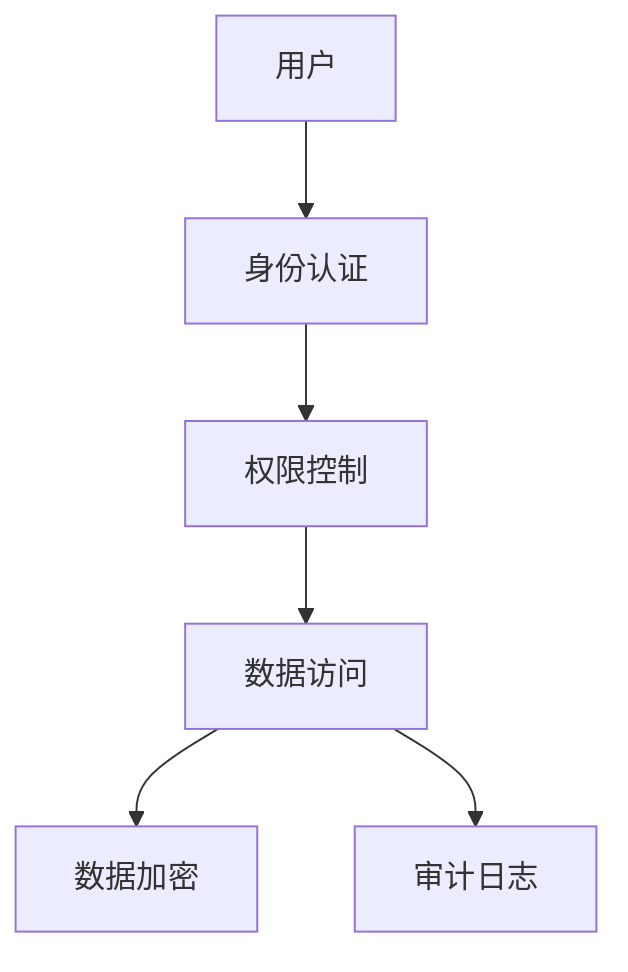

# 1.3.7 安全与合规

## 1.3.7.1 安全机制

- 身份认证、权限控制、数据加密。
- 审计日志、网络安全、数据脱敏。

## 1.3.7.2 合规要求

| 合规标准 | 要求 | NoSQL支持 |
|----------|------|-----------|
| GDPR     | 数据保护 | 加密、访问控制 |
| SOX      | 审计追踪 | 审计日志 |
| PCI DSS  | 支付安全 | 数据加密 |

## 1.3.7.3 行业案例与多表征

### 金融行业：NoSQL安全架构



### 互联网行业：数据安全合规

- 见[5.1.1-金融数据科学基础理论](../../../../5-行业应用与场景/5.1-金融数据分析/5.1.1-金融数据科学基础理论.md)

### Latex公式

$$
\text{安全等级} = \text{认证强度} \times \text{加密强度} \times \text{审计完整性}
$$

### 安全配置示例

```javascript
// MongoDB安全配置
use admin
db.createUser({
  user: "admin",
  pwd: "password",
  roles: ["userAdminAnyDatabase", "dbAdminAnyDatabase"]
})

// 启用审计日志
db.adminCommand({
  setParameter: 1,
  auditAuthorizationSuccess: true
})
```

[返回NoSQL导航](README.md)
