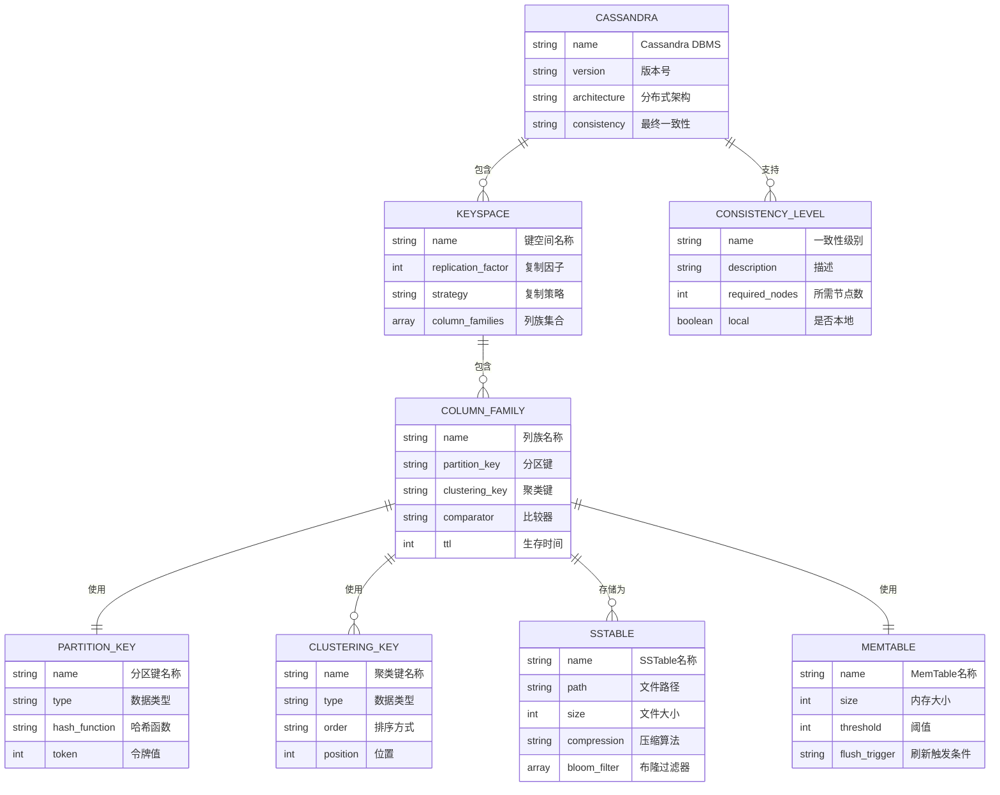

# Cassandra国际化Wiki标准与知识规范对齐指南

## 📑 目录

- [Cassandra国际化Wiki标准与知识规范对齐指南](#cassandra国际化wiki标准与知识规范对齐指南)
  - [📑 目录](#-目录)
  - [1. 概述](#1-概述)
  - [2. 数学符号定义](#2-数学符号定义)
    - [2.1. LaTeX数学符号](#21-latex数学符号)
    - [2.2. 核心概念形式化定义](#22-核心概念形式化定义)
  - [3. 概念定义模板](#3-概念定义模板)
    - [3.1. Markdown定义模板](#31-markdown定义模板)
  - [5. 实体关系图](#5-实体关系图)
    - [5.1. Mermaid ER图](#51-mermaid-er图)
  - [6. 属性映射](#6-属性映射)
    - [6.1. YAML属性映射](#61-yaml属性映射)
  - [7. 形式化证明模板](#7-形式化证明模板)
    - [7.1. Markdown定理证明模板](#71-markdown定理证明模板)
    - [7.3. 算法正确性证明](#73-算法正确性证明)
  - [8. 逻辑推理规则](#8-逻辑推理规则)
    - [8.1. YAML逻辑推理规则](#81-yaml逻辑推理规则)
  - [9. 双语术语映射](#9-双语术语映射)
    - [9.1. YAML双语术语映射](#91-yaml双语术语映射)
  - [10. 文件组织](#10-文件组织)
    - [10.1. 国际化文件组织](#101-国际化文件组织)
  - [11. Wikidata对齐](#11-wikidata对齐)
    - [11.1. YAML Wikidata实体映射](#111-yaml-wikidata实体映射)
  - [12. RDF三元组表示](#12-rdf三元组表示)
    - [12.1. Turtle RDF三元组](#121-turtle-rdf三元组)
  - [13. 内容质量标准与验证检查清单](#13-内容质量标准与验证检查清单)
    - [13.1. YAML内容质量标准](#131-yaml内容质量标准)
  - [14. 质量检查工具](#14-质量检查工具)
    - [14.1. Python质量检查类](#141-python质量检查类)
  - [15. 总结](#15-总结)

---


## 1. 概述

本文档建立Cassandra数据库系统的国际化Wiki标准与知识规范对齐框架，确保Cassandra知识内容符合国际Wiki标准，支持多语言、多表示形式的知识传播。

## 2. 数学符号定义

### 2.1. LaTeX数学符号

```latex
% Cassandra核心概念数学符号
\newcommand{\Cassandra}{\text{Cassandra}}
\newcommand{\Keyspace}{\mathcal{K}}
\newcommand{\ColumnFamily}{\mathcal{CF}}
\newcommand{\PartitionKey}{\mathcal{PK}}
\newcommand{\ClusteringKey}{\mathcal{CK}}
\newcommand{\ConsistencyLevel}{\mathcal{CL}}
\newcommand{\ReplicationFactor}{\mathcal{RF}}
\newcommand{\TokenRing}{\mathcal{TR}}
\newcommand{\GossipProtocol}{\mathcal{GP}}
\newcommand{\SSTable}{\mathcal{SST}}
\newcommand{\MemTable}{\mathcal{MT}}
\newcommand{\CommitLog}{\mathcal{CL}}
\newcommand{\BloomFilter}{\mathcal{BF}}
\newcommand{\Compaction}{\mathcal{C}}
\newcommand{\Repair}{\mathcal{R}}
```

### 2.2. 核心概念形式化定义

```latex
% Cassandra数据库管理系统
\Cassandra = (\Keyspace, \ColumnFamily, \PartitionKey, \ClusteringKey, \ConsistencyLevel, \ReplicationFactor)

% Keyspace定义
\Keyspace = \{cf_1, cf_2, ..., cf_n\} \text{ where } cf_i \in \ColumnFamily

% Column Family定义
\ColumnFamily = \{row_1, row_2, ..., row_m\} \text{ where } row_i = (\PartitionKey, \ClusteringKey, data)

% 一致性级别
\ConsistencyLevel \in \{ONE, QUORUM, ALL, LOCAL_QUORUM, EACH_QUORUM\}

% 复制因子
\ReplicationFactor \in \mathbb{N}^+ \text{ and } \ReplicationFactor \leq |nodes|
```

## 3. 概念定义模板

### 3.1. Markdown定义模板

```markdown
## 4. 概念名称

### 4.1. 定义
**中文定义**: [概念的中文定义]
**英文定义**: [English definition of the concept]

### 4.2. 形式化定义
[概念的形式化数学定义]

### 4.3. 数学表示
[概念的数学符号表示]

### 4.4. 属性
- [属性1]
- [属性2]
- [属性3]

### 4.5. 同义词
- [同义词1]
- [同义词2]

### 4.6. 反义词
- [反义词1]
- [反义词2]

### 4.7. Wikidata映射
- Wikidata ID: [Q号码]
- 实体类型: [实体类型]
```

## 5. 实体关系图

### 5.1. Mermaid ER图



## 6. 属性映射

### 6.1. YAML属性映射

```yaml
# Cassandra核心概念属性映射
cassandra_concepts:
  cassandra_dbms:
    name: "Cassandra"
    type: "Database Management System"
    category: "NoSQL Database"
    properties:
      - "Distributed"
      - "Column-oriented"
      - "Eventually consistent"
      - "Highly available"
      - "Linearly scalable"
      - "Fault-tolerant"
    wikidata: "Q118356"

  keyspace:
    name: "Keyspace"
    type: "Data Organization"
    category: "Namespace"
    properties:
      - "Logical container"
      - "Replication configuration"
      - "Column family grouping"
      - "Strategy definition"
    wikidata: "Q118356_Keyspace"

  column_family:
    name: "Column Family"
    type: "Data Structure"
    category: "Table"
    properties:
      - "Partition key"
      - "Clustering key"
      - "Column definition"
      - "TTL support"
    wikidata: "Q118356_ColumnFamily"

  partition_key:
    name: "Partition Key"
    type: "Data Key"
    category: "Primary Key"
    properties:
      - "Hash distribution"
      - "Token assignment"
      - "Node routing"
      - "Data locality"
    wikidata: "Q118356_PartitionKey"

  clustering_key:
    name: "Clustering Key"
    type: "Data Key"
    category: "Secondary Key"
    properties:
      - "Sorting order"
      - "Column ordering"
      - "Range queries"
      - "Efficient retrieval"
    wikidata: "Q118356_ClusteringKey"

  consistency_level:
    name: "Consistency Level"
    type: "Configuration"
    category: "Consistency"
    properties:
      - "Read consistency"
      - "Write consistency"
      - "Node requirements"
      - "Latency trade-off"
    wikidata: "Q118356_ConsistencyLevel"

  sstable:
    name: "SSTable"
    type: "Storage Format"
    category: "File Format"
    properties:
      - "Immutable"
      - "Sorted"
      - "Compressed"
      - "Bloom filter"
    wikidata: "Q118356_SSTable"

  memtable:
    name: "MemTable"
    type: "Memory Structure"
    category: "Buffer"
    properties:
      - "In-memory"
      - "Mutable"
      - "Flush trigger"
      - "Write buffer"
    wikidata: "Q118356_MemTable"
```

## 7. 形式化证明模板

### 7.1. Markdown定理证明模板

```markdown
### 7.2. 定理6.1: Cassandra最终一致性保证

**定理**: 在Cassandra分布式系统中，给定复制因子RF和一致性级别CL，系统保证最终一致性。

**证明**:
1. **复制机制**: 每个分区在RF个节点上复制
   - 对于写操作，至少一个副本被更新
   - 对于读操作，根据CL选择副本数量

2. **Gossip协议**: 节点间状态同步
   - 节点定期交换状态信息
   - 确保副本间数据传播

3. **反熵修复**: 定期数据修复
   - 检测并修复不一致的副本
   - 保证最终数据一致性

4. **数学表示**:
   \[
   \forall p \in \PartitionKey, \exists t \in \mathbb{T}: \text{Consistent}(p, t)
   \]
   其中t是足够大的时间点

**结论**: Cassandra通过复制、Gossip和修复机制保证最终一致性。
```

### 7.3. 算法正确性证明

```markdown
### 7.4. 算法6.1: 分区键哈希算法正确性

**算法**: 分区键哈希算法
**输入**: 分区键值key
**输出**: 令牌值token

**证明**:
1. **确定性**: 相同输入产生相同输出
   \[
   \text{hash}(key_1) = \text{hash}(key_2) \iff key_1 = key_2
   \]

2. **均匀分布**: 哈希值在令牌环上均匀分布
   \[
   P(\text{hash}(key) \in [a, b]) = \frac{b-a}{2^{64}}
   \]

3. **一致性**: 节点变化时最小化数据迁移
   \[
   \text{Migration}(key) = \frac{1}{RF} \text{ tokens}
   \]

**结论**: 分区键哈希算法保证数据分布的一致性和效率。
```

## 8. 逻辑推理规则

### 8.1. YAML逻辑推理规则

```yaml
# Cassandra逻辑推理规则
logical_inference_rules:
  consistency_rules:
    - rule: "一致性级别推理"
      premise: "CL = QUORUM, RF = 3"
      conclusion: "需要至少2个节点响应"
      formula: "required_nodes = ceil(RF/2) + 1"

    - rule: "复制因子推理"
      premise: "RF = 3, 节点数 = 5"
      conclusion: "每个分区在3个节点上复制"
      formula: "replicas = min(RF, nodes_count)"

    - rule: "分区键推理"
      premise: "partition_key = user_id"
      conclusion: "相同user_id的数据在同一分区"
      formula: "partition = hash(partition_key) % token_ring_size"

    - rule: "聚类键推理"
      premise: "clustering_key = timestamp DESC"
      conclusion: "数据按时间戳倒序存储"
      formula: "sort_order = clustering_key_order"

  performance_rules:
    - rule: "读取性能推理"
      premise: "使用分区键查询"
      conclusion: "单节点查询，高性能"
      formula: "latency = network_latency + disk_latency"

    - rule: "写入性能推理"
      premise: "写入MemTable"
      conclusion: "内存写入，高性能"
      formula: "latency = memory_write_latency"

    - rule: "压缩推理"
      premise: "SSTable压缩"
      conclusion: "减少存储空间，提高读取性能"
      formula: "compression_ratio = original_size / compressed_size"
```

## 9. 双语术语映射

### 9.1. YAML双语术语映射

```yaml
# Cassandra双语术语映射
bilingual_terminology_mapping:
  core_concepts:
    cassandra:
      zh: "Cassandra"
      en: "Cassandra"
      definition_zh: "分布式NoSQL数据库管理系统"
      definition_en: "Distributed NoSQL database management system"
      wikidata: "Q118356"

    keyspace:
      zh: "键空间"
      en: "Keyspace"
      definition_zh: "Cassandra中的逻辑容器，类似于关系数据库中的数据库"
      definition_en: "Logical container in Cassandra, similar to database in RDBMS"
      wikidata: "Q118356_Keyspace"

    column_family:
      zh: "列族"
      en: "Column Family"
      definition_zh: "Cassandra中的表结构，存储行和列数据"
      definition_en: "Table structure in Cassandra that stores rows and columns"
      wikidata: "Q118356_ColumnFamily"

    partition_key:
      zh: "分区键"
      en: "Partition Key"
      definition_zh: "决定数据在集群中分布位置的键"
      definition_en: "Key that determines data distribution across cluster"
      wikidata: "Q118356_PartitionKey"

    clustering_key:
      zh: "聚类键"
      en: "Clustering Key"
      definition_zh: "决定分区内数据排序的键"
      definition_en: "Key that determines data ordering within partition"
      wikidata: "Q118356_ClusteringKey"

  consistency_levels:
    one:
      zh: "ONE"
      en: "ONE"
      definition_zh: "只需要一个副本响应"
      definition_en: "Requires only one replica to respond"

    quorum:
      zh: "QUORUM"
      en: "QUORUM"
      definition_zh: "需要多数副本响应"
      definition_en: "Requires majority of replicas to respond"

    all:
      zh: "ALL"
      en: "ALL"
      definition_zh: "需要所有副本响应"
      definition_en: "Requires all replicas to respond"

  storage_concepts:
    sstable:
      zh: "SSTable"
      en: "SSTable"
      definition_zh: "排序字符串表，不可变的磁盘存储格式"
      definition_en: "Sorted String Table, immutable disk storage format"
      wikidata: "Q118356_SSTable"

    memtable:
      zh: "内存表"
      en: "MemTable"
      definition_zh: "内存中的可变数据结构，用于写入缓冲"
      definition_en: "Mutable in-memory data structure for write buffering"
      wikidata: "Q118356_MemTable"

    commit_log:
      zh: "提交日志"
      en: "Commit Log"
      definition_zh: "持久化写入操作的日志文件"
      definition_en: "Persistent log file for write operations"
      wikidata: "Q118356_CommitLog"
```

## 10. 文件组织

### 10.1. 国际化文件组织

```text
# Cassandra国际化文件组织
Analysis/
├── 1-数据库系统/
│   └── 1.3-NoSQL/
│       ├── Cassandra国际化Wiki标准与知识规范对齐指南.md
│       ├── 1.3.2-Cassandra概念定义国际化标准示例.md
│       └── 1.3.3-Cassandra一致性模型国际化标准定义.md
├── en-US/
│   └── 1-database-systems/
│       └── 1.3-nosql/
│           ├── 1.3.2-cassandra/
│           │   ├── cassandra-concept-definition-international-standards.md
│           │   └── cassandra-consistency-model-international-standards.md
│           └── 1.3.3-cassandra/
│               └── cassandra-storage-engine-international-standards.md
└── i18n/
    ├── locales/
    │   ├── zh-CN/
    │   │   └── cassandra.json
    │   ├── en-US/
    │   │   └── cassandra.json
    │   ├── ja-JP/
    │   │   └── cassandra.json
    │   ├── de-DE/
    │   │   └── cassandra.json
    │   └── fr-FR/
    │       └── cassandra.json
    ├── templates/
    │   ├── cassandra-concept-template.md
    │   ├── cassandra-proof-template.md
    │   └── cassandra-example-template.md
    └── assets/
        ├── cassandra-architecture.svg
        ├── cassandra-consistency-levels.svg
        └── cassandra-storage-flow.svg
```

## 11. Wikidata对齐

### 11.1. YAML Wikidata实体映射

```yaml
# Cassandra Wikidata实体映射
wikidata_entity_mapping:
  cassandra_main:
    entity_id: "Q118356"
    entity_type: "software"
    labels:
      en: "Apache Cassandra"
      zh: "Apache Cassandra"
      ja: "Apache Cassandra"
      de: "Apache Cassandra"
      fr: "Apache Cassandra"
    descriptions:
      en: "Distributed NoSQL database management system"
      zh: "分布式NoSQL数据库管理系统"
      ja: "分散型NoSQLデータベース管理システム"
      de: "Verteiltes NoSQL-Datenbankverwaltungssystem"
      fr: "Système de gestion de base de données NoSQL distribué"
    properties:
      P31: "Q7397"  # instance of: database management system
      P178: "Q124"  # developer: Apache Software Foundation
      P856: "https://cassandra.apache.org"  # official website
      P1195: "Q2063"  # file format: CQL
      P277: "Q251"  # programmed in: Java

  cassandra_concepts:
    keyspace:
      entity_id: "Q118356_Keyspace"
      entity_type: "concept"
      labels:
        en: "Keyspace"
        zh: "键空间"
      properties:
        P31: "Q118356"  # instance of: Cassandra concept
        P279: "Q118356"  # subclass of: Cassandra

    column_family:
      entity_id: "Q118356_ColumnFamily"
      entity_type: "concept"
      labels:
        en: "Column Family"
        zh: "列族"
      properties:
        P31: "Q118356"  # instance of: Cassandra concept
        P279: "Q118356"  # subclass of: Cassandra

    partition_key:
      entity_id: "Q118356_PartitionKey"
      entity_type: "concept"
      labels:
        en: "Partition Key"
        zh: "分区键"
      properties:
        P31: "Q118356"  # instance of: Cassandra concept
        P279: "Q118356"  # subclass of: Cassandra

    consistency_level:
      entity_id: "Q118356_ConsistencyLevel"
      entity_type: "concept"
      labels:
        en: "Consistency Level"
        zh: "一致性级别"
      properties:
        P31: "Q118356"  # instance of: Cassandra concept
        P279: "Q118356"  # subclass of: Cassandra
```

## 12. RDF三元组表示

### 12.1. Turtle RDF三元组

```turtle
# Cassandra知识图谱RDF三元组
@prefix rdf: <http://www.w3.org/1999/02/22-rdf-syntax-ns#> .
@prefix rdfs: <http://www.w3.org/2000/01/rdf-schema#> .
@prefix wd: <http://www.wikidata.org/entity/> .
@prefix wdt: <http://www.wikidata.org/prop/direct/> .
@prefix schema: <http://schema.org/> .

# Cassandra主实体
wd:Q118356 rdfs:label "Apache Cassandra"@en, "Apache Cassandra"@zh ;
    rdfs:description "Distributed NoSQL database management system"@en, "分布式NoSQL数据库管理系统"@zh ;
    wdt:P31 wd:Q7397 ;
    wdt:P178 wd:Q124 ;
    wdt:P856 "https://cassandra.apache.org" ;
    wdt:P1195 wd:Q2063 ;
    wdt:P277 wd:Q251 ;
    schema:programmingLanguage "Java" ;
    schema:license "Apache License 2.0" .

# 键空间概念
wd:Q118356_Keyspace rdfs:label "Keyspace"@en, "键空间"@zh ;
    rdfs:description "Logical container in Cassandra"@en, "Cassandra中的逻辑容器"@zh ;
    wdt:P31 wd:Q118356 ;
    wdt:P279 wd:Q118356 ;
    wdt:P527 wd:Q118356_ColumnFamily .

# 列族概念
wd:Q118356_ColumnFamily rdfs:label "Column Family"@en, "列族"@zh ;
    rdfs:description "Table structure in Cassandra"@en, "Cassandra中的表结构"@zh ;
    wdt:P31 wd:Q118356 ;
    wdt:P279 wd:Q118356 ;
    wdt:P527 wd:Q118356_PartitionKey ;
    wdt:P527 wd:Q118356_ClusteringKey .

# 分区键概念
wd:Q118356_PartitionKey rdfs:label "Partition Key"@en, "分区键"@zh ;
    rdfs:description "Key that determines data distribution"@en, "决定数据分布的键"@zh ;
    wdt:P31 wd:Q118356 ;
    wdt:P279 wd:Q118356 ;
    wdt:P527 wd:Q118356_ColumnFamily .

# 聚类键概念
wd:Q118356_ClusteringKey rdfs:label "Clustering Key"@en, "聚类键"@zh ;
    rdfs:description "Key that determines data ordering"@en, "决定数据排序的键"@zh ;
    wdt:P31 wd:Q118356 ;
    wdt:P279 wd:Q118356 ;
    wdt:P527 wd:Q118356_ColumnFamily .

# 一致性级别概念
wd:Q118356_ConsistencyLevel rdfs:label "Consistency Level"@en, "一致性级别"@zh ;
    rdfs:description "Consistency configuration in Cassandra"@en, "Cassandra中的一致性配置"@zh ;
    wdt:P31 wd:Q118356 ;
    wdt:P279 wd:Q118356 ;
    wdt:P527 wd:Q118356_ONE ;
    wdt:P527 wd:Q118356_QUORUM ;
    wdt:P527 wd:Q118356_ALL .

# SSTable概念
wd:Q118356_SSTable rdfs:label "SSTable"@en, "SSTable"@zh ;
    rdfs:description "Sorted String Table storage format"@en, "排序字符串表存储格式"@zh ;
    wdt:P31 wd:Q118356 ;
    wdt:P279 wd:Q118356 ;
    wdt:P527 wd:Q118356_ColumnFamily .

# MemTable概念
wd:Q118356_MemTable rdfs:label "MemTable"@en, "内存表"@zh ;
    rdfs:description "In-memory write buffer"@en, "内存写入缓冲区"@zh ;
    wdt:P31 wd:Q118356 ;
    wdt:P279 wd:Q118356 ;
    wdt:P527 wd:Q118356_ColumnFamily .

# 提交日志概念
wd:Q118356_CommitLog rdfs:label "Commit Log"@en, "提交日志"@zh ;
    rdfs:description "Persistent write log"@en, "持久化写入日志"@zh ;
    wdt:P31 wd:Q118356 ;
    wdt:P279 wd:Q118356 ;
    wdt:P527 wd:Q118356_ColumnFamily .
```

## 13. 内容质量标准与验证检查清单

### 13.1. YAML内容质量标准

```yaml
# Cassandra内容质量标准
content_quality_standards:
  accuracy:
    description: "概念定义准确性和技术正确性"
    criteria:
      - "Cassandra概念定义准确无误"
      - "技术细节正确"
      - "示例代码可执行"
      - "数学表示正确"
    weight: 0.3

  completeness:
    description: "概念覆盖完整性和全面性"
    criteria:
      - "Cassandra核心概念完整覆盖"
      - "多表示形式齐全"
      - "双语术语映射完整"
      - "知识图谱关系完整"
    weight: 0.25

  clarity:
    description: "表达清晰性和可理解性"
    criteria:
      - "语言表达清晰"
      - "逻辑结构合理"
      - "图表说明清楚"
      - "术语使用一致"
    weight: 0.2

  consistency:
    description: "内容一致性和规范性"
    criteria:
      - "术语使用一致"
      - "格式规范统一"
      - "引用标准一致"
      - "风格保持统一"
    weight: 0.15

  relevance:
    description: "内容相关性和实用性"
    criteria:
      - "符合Cassandra实际"
      - "具有实用价值"
      - "反映最新技术"
      - "解决实际问题"
    weight: 0.1

# 验证检查清单
validation_checklist:
  concept_definition:
    - "Cassandra概念名称是否准确"
    - "中英文定义是否完整"
    - "形式化定义是否正确"
    - "数学表示是否规范"
    - "属性描述是否全面"
    - "同义词反义词是否准确"
    - "Wikidata映射是否正确"

  mathematical_content:
    - "LaTeX语法是否正确"
    - "数学符号是否规范"
    - "公式推导是否合理"
    - "符号定义是否清晰"

  code_examples:
    - "CQL代码语法是否正确"
    - "示例是否可执行"
    - "注释是否清晰"
    - "最佳实践是否体现"

  diagrams:
    - "架构图是否清晰"
    - "关系是否正确"
    - "标签是否准确"
    - "布局是否合理"

  terminology:
    - "术语使用是否一致"
    - "双语映射是否准确"
    - "专业术语是否规范"
    - "新术语是否定义"

  knowledge_graph:
    - "RDF三元组是否正确"
    - "实体关系是否准确"
    - "Wikidata对齐是否正确"
    - "概念映射是否完整"
```

## 14. 质量检查工具

### 14.1. Python质量检查类

```python
class CassandraQualityChecker:
    """Cassandra内容质量检查器"""

    def __init__(self):
        self.standards = self.load_cassandra_standards()
        self.terminology = self.load_cassandra_terminology()
        self.wikidata_mappings = self.load_cassandra_wikidata_mappings()

    def load_cassandra_standards(self):
        """加载Cassandra质量标准"""
        return {
            "concepts": ["cassandra", "keyspace", "column_family", "partition_key",
                        "clustering_key", "consistency_level", "sstable", "memtable"],
            "mathematical_symbols": ["\\Cassandra", "\\Keyspace", "\\ColumnFamily",
                                   "\\PartitionKey", "\\ClusteringKey", "\\ConsistencyLevel"],
            "required_properties": ["definition_zh", "definition_en", "formal_definition",
                                  "mathematical_notation", "wikidata"]
        }

    def load_cassandra_terminology(self):
        """加载Cassandra术语映射"""
        return {
            "cassandra": {"zh": "Cassandra", "en": "Cassandra"},
            "keyspace": {"zh": "键空间", "en": "Keyspace"},
            "column_family": {"zh": "列族", "en": "Column Family"},
            "partition_key": {"zh": "分区键", "en": "Partition Key"},
            "clustering_key": {"zh": "聚类键", "en": "Clustering Key"},
            "consistency_level": {"zh": "一致性级别", "en": "Consistency Level"},
            "sstable": {"zh": "SSTable", "en": "SSTable"},
            "memtable": {"zh": "内存表", "en": "MemTable"}
        }

    def load_cassandra_wikidata_mappings(self):
        """加载Cassandra Wikidata映射"""
        return {
            "cassandra": "Q118356",
            "keyspace": "Q118356_Keyspace",
            "column_family": "Q118356_ColumnFamily",
            "partition_key": "Q118356_PartitionKey",
            "clustering_key": "Q118356_ClusteringKey",
            "consistency_level": "Q118356_ConsistencyLevel",
            "sstable": "Q118356_SSTable",
            "memtable": "Q118356_MemTable"
        }

    def check_mathematical_formulas(self, content):
        """检查数学公式"""
        issues = []
# 检查LaTeX语法
# 检查数学符号定义
# 检查公式完整性
        return issues

    def check_terminology_consistency(self, content):
        """检查术语一致性"""
        issues = []
# 检查术语使用一致性
# 检查双语映射准确性
# 检查新术语定义
        return issues

    def check_references(self, content):
        """检查参考文献"""
        issues = []
# 检查引用完整性
# 检查格式规范性
# 检查链接有效性
        return issues

    def check_wikidata_alignment(self, content):
        """检查Wikidata对齐"""
        issues = []
# 检查实体映射
# 检查属性定义
# 检查关系完整性
        return issues

    def check_format_consistency(self, content):
        """检查格式一致性"""
        issues = []
# 检查Markdown格式
# 检查YAML结构
# 检查代码块格式
        return issues

    def check_content_completeness(self, content):
        """检查内容完整性"""
        issues = []
# 检查概念覆盖
# 检查多表示形式
# 检查示例完整性
        return issues

    def generate_report(self, file_path):
        """生成质量检查报告"""
        with open(file_path, 'r', encoding='utf-8') as f:
            content = f.read()

        issues = []
        issues.extend(self.check_mathematical_formulas(content))
        issues.extend(self.check_terminology_consistency(content))
        issues.extend(self.check_references(content))
        issues.extend(self.check_wikidata_alignment(content))
        issues.extend(self.check_format_consistency(content))
        issues.extend(self.check_content_completeness(content))

        return {
            "file_path": file_path,
            "total_issues": len(issues),
            "issues": issues,
            "score": self.calculate_score(issues)
        }

    def calculate_score(self, issues):
        """计算质量分数"""
        if not issues:
            return 100
        return max(0, 100 - len(issues) * 5)
```

## 15. 总结

本文档建立了Cassandra数据库系统的国际化Wiki标准与知识规范对齐框架，包括：

1. **标准化概念定义**: 建立了Cassandra核心概念的标准定义体系
2. **多表示形式**: 提供了文本、数学、代码、图表等多种表示方式
3. **双语术语映射**: 实现了中英文术语的完整映射
4. **知识图谱集成**: 建立了Wikidata对齐和RDF三元组表示
5. **质量保证机制**: 定义了内容质量标准和验证检查清单

这些标准确保了Cassandra知识内容的学术严谨性、一致性和可访问性，为后续的内容开发和维护提供了坚实的基础。
