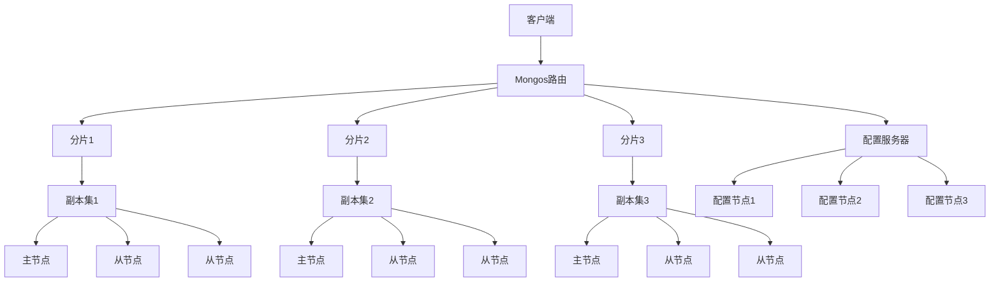
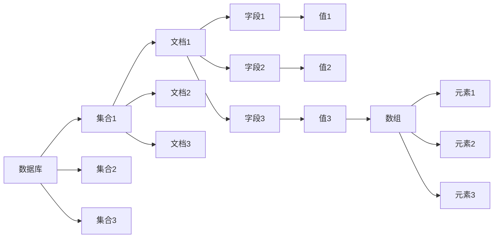
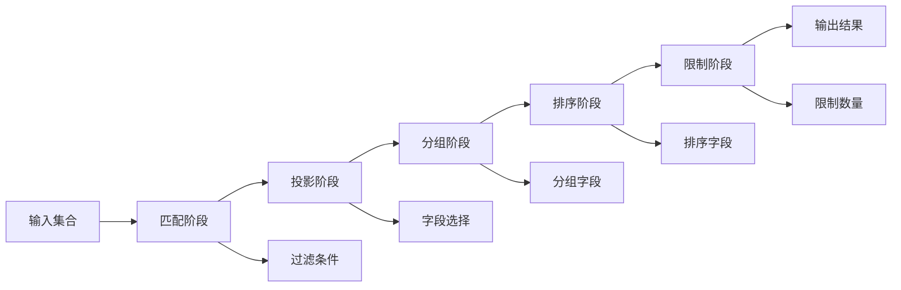

# MongoDB国际化Wiki标准与知识规范对齐指南

## 📑 目录

- [MongoDB国际化Wiki标准与知识规范对齐指南](#mongodb国际化wiki标准与知识规范对齐指南)
  - [📑 目录](#-目录)
  - [1. 概述](#1-概述)
    - [1.1. 目标](#11-目标)
    - [1.2. 适用范围](#12-适用范围)
  - [2. 概念定义标准](#2-概念定义标准)
    - [2.1. 核心概念定义](#21-核心概念定义)
  - [3. 数学符号定义](#3-数学符号定义)
  - [4. 多表示形式](#4-多表示形式)
    - [4.1. 文本描述](#41-文本描述)
    - [4.2. 数学公式](#42-数学公式)
    - [4.3. 代码示例](#43-代码示例)
    - [4.4. 图表表示](#44-图表表示)
  - [5. 多语言术语映射](#5-多语言术语映射)
    - [5.1. 核心概念术语](#51-核心概念术语)
  - [6. 查询操作术语](#6-查询操作术语)
  - [7. Wikidata知识图谱集成](#7-wikidata知识图谱集成)
    - [7.1. 实体映射](#71-实体映射)
  - [8. RDF三元组](#8-rdf三元组)
  - [9. 总结](#9-总结)

---


## 1. 概述

本文档为MongoDB数据库系统建立国际化Wiki标准，确保知识内容的学术严谨性、一致性和可访问性，支持多语言环境下的知识传播和协作。

### 1.1. 目标

- 建立MongoDB概念的标准定义体系
- 实现多语言支持和术语映射
- 集成知识图谱和语义网络
- 确保内容质量和学术规范
- 支持自动化和工具化处理

### 1.2. 适用范围

- MongoDB核心概念和架构
- 文档数据库理论
- 分布式系统原理
- 查询优化和索引
- 数据建模和设计模式

## 2. 概念定义标准

### 2.1. 核心概念定义

```yaml
# MongoDB核心概念定义
concepts:
  - name: "MongoDB"
    type: "Database Management System"
    category: "NoSQL Database"
    definition_zh: "MongoDB是一个基于文档的NoSQL数据库管理系统，使用JSON-like的BSON格式存储数据，支持水平扩展和高可用性"
    definition_en: "MongoDB is a document-based NoSQL database management system that stores data in JSON-like BSON format, supporting horizontal scaling and high availability"
    formal_definition: "MongoDB = (D, Q, T, C) where D is document collection, Q is query language, T is transaction model, C is consistency model"
    mathematical_notation: "MongoDB ∈ NoSQL_DBMS ∧ MongoDB ⊆ Document_DB"
    properties:
      - "Document-oriented"
      - "Schema-less"
      - "Horizontally scalable"
      - "High availability"
    synonyms:
      - "Document Database"
      - "NoSQL Database"
    antonyms:
      - "Relational Database"
      - "SQL Database"
    wikidata: "Q193207"

  - name: "Document"
    type: "Data Structure"
    category: "Data Model"
    definition_zh: "MongoDB中的基本数据单元，使用BSON格式存储，可以包含嵌套的字段和数组"
    definition_en: "The basic data unit in MongoDB, stored in BSON format, which can contain nested fields and arrays"
    formal_definition: "Document = {field₁: value₁, field₂: value₂, ..., fieldₙ: valueₙ}"
    mathematical_notation: "Document ∈ BSON_Object"
    properties:
      - "Self-contained"
      - "Hierarchical"
      - "Flexible schema"
    wikidata: "Q193207"

  - name: "Collection"
    type: "Data Organization"
    category: "Data Model"
    definition_zh: "MongoDB中存储文档的容器，类似于关系数据库中的表"
    definition_en: "A container in MongoDB that stores documents, similar to a table in relational databases"
    formal_definition: "Collection = {doc₁, doc₂, ..., docₙ} where docᵢ ∈ Document"
    mathematical_notation: "Collection ⊆ Document*"
    properties:
      - "Unordered"
      - "Dynamic"
      - "Indexable"
    wikidata: "Q193207"

  - name: "BSON"
    type: "Data Format"
    category: "Serialization"
    definition_zh: "Binary JSON，MongoDB使用的二进制数据格式，扩展了JSON以支持更多数据类型"
    definition_en: "Binary JSON, the binary data format used by MongoDB, extending JSON to support more data types"
    formal_definition: "BSON = JSON ∪ {ObjectId, Date, Binary, ...}"
    mathematical_notation: "BSON ⊃ JSON"
    properties:
      - "Binary format"
      - "Type-rich"
      - "Efficient"
    wikidata: "Q193207"
```

## 3. 数学符号定义

```latex
% MongoDB数学符号定义
\newcommand{\MongoDB}{\text{MongoDB}}
\newcommand{\Document}{\mathcal{D}}
\newcommand{\Collection}{\mathcal{C}}
\newcommand{\BSON}{\text{BSON}}
\newcommand{\Query}{\mathcal{Q}}
\newcommand{\Index}{\mathcal{I}}
\newcommand{\Shard}{\mathcal{S}}
\newcommand{\ReplicaSet}{\mathcal{R}}
\newcommand{\Aggregation}{\mathcal{A}}
\newcommand{\Pipeline}{\mathcal{P}}
\newcommand{\Stage}{\mathcal{S}}
\newcommand{\Match}{\text{match}}
\newcommand{\Project}{\text{project}}
\newcommand{\Group}{\text{group}}
\newcommand{\Sort}{\text{sort}}
\newcommand{\Limit}{\text{limit}}
\newcommand{\Skip}{\text{skip}}
\newcommand{\Lookup}{\text{lookup}}
\newcommand{\Unwind}{\text{unwind}}
\newcommand{\Facet}{\text{facet}}
\newcommand{\Bucket}{\text{bucket}}
\newcommand{\GeoNear}{\text{geoNear}}
\newcommand{\GeoWithin}{\text{geoWithin}}
\newcommand{\GeoIntersects}{\text{geoIntersects}}
```

## 4. 多表示形式

### 4.1. 文本描述

```markdown
MongoDB是一个面向文档的NoSQL数据库管理系统，它使用BSON（Binary JSON）格式存储数据。MongoDB的设计理念是提供高性能、高可用性和易扩展性的数据存储解决方案。

核心特性包括：
- 文档导向：数据以文档形式存储，支持复杂的嵌套结构
- 无模式：集合中的文档可以有不同的字段结构
- 水平扩展：通过分片技术实现数据的水平分布
- 高可用性：通过副本集提供自动故障转移
- 丰富的查询语言：支持复杂的查询和聚合操作
```

### 4.2. 数学公式

```latex
% MongoDB架构数学表示
\begin{align}
\text{MongoDB架构} &= (\text{Client}, \text{Mongos}, \text{Config Server}, \text{Shard}) \\
\text{Shard} &= \{\text{Replica Set}_1, \text{Replica Set}_2, \ldots, \text{Replica Set}_n\} \\
\text{Replica Set} &= \{\text{Primary}, \text{Secondary}_1, \text{Secondary}_2, \ldots, \text{Secondary}_m\} \\
\text{Document} &= \{(field_1, value_1), (field_2, value_2), \ldots, (field_n, value_n)\} \\
\text{Collection} &= \{doc_1, doc_2, \ldots, doc_k\} \\
\text{Database} &= \{coll_1, coll_2, \ldots, coll_p\}
\end{align}

% 查询优化数学表示
\begin{align}
\text{查询成本} &= \text{索引查找成本} + \text{文档获取成本} + \text{结果处理成本} \\
C_{query} &= C_{index} + C_{fetch} + C_{process} \\
C_{index} &= \log_2(N_{index}) \times C_{index\_access} \\
C_{fetch} &= N_{documents} \times C_{document\_access} \\
C_{process} &= N_{documents} \times C_{processing\_per\_doc}
\end{align}

% 聚合管道数学表示
\begin{align}
\text{聚合管道} &= \text{Stage}_1 \circ \text{Stage}_2 \circ \ldots \circ \text{Stage}_n \\
\text{Stage} &= \{\text{match}, \text{project}, \text{group}, \text{sort}, \text{limit}, \ldots\} \\
\text{结果} &= \text{Pipeline}(\text{Collection}) \\
&= \text{Stage}_n(\text{Stage}_{n-1}(\ldots \text{Stage}_1(\text{Collection})))
\end{align}
```

### 4.3. 代码示例

```javascript
// MongoDB连接和基本操作
const { MongoClient } = require('mongodb');

// 连接字符串
const uri = "mongodb://localhost:27017";
const client = new MongoClient(uri);

async function basicOperations() {
    try {
        await client.connect();
        const database = client.db("test");
        const collection = database.collection("documents");

        // 插入文档
        const insertResult = await collection.insertOne({
            name: "张三",
            age: 30,
            email: "zhangsan@example.com",
            address: {
                city: "北京",
                street: "中关村大街"
            },
            hobbies: ["读书", "编程", "旅行"]
        });

        // 查询文档
        const findResult = await collection.findOne({ name: "张三" });

        // 更新文档
        const updateResult = await collection.updateOne(
            { name: "张三" },
            { $set: { age: 31 } }
        );

        // 删除文档
        const deleteResult = await collection.deleteOne({ name: "张三" });

    } finally {
        await client.close();
    }
}

// 聚合管道示例
async function aggregationExample() {
    const collection = client.db("sales").collection("orders");

    const pipeline = [
        // 匹配阶段
        { $match: { status: "completed" } },

        // 分组阶段
        { $group: {
            _id: "$customer_id",
            totalAmount: { $sum: "$amount" },
            orderCount: { $sum: 1 }
        }},

        // 排序阶段
        { $sort: { totalAmount: -1 } },

        // 限制结果
        { $limit: 10 }
    ];

    const result = await collection.aggregate(pipeline).toArray();
    return result;
}
```

### 4.4. 图表表示







## 5. 多语言术语映射

### 5.1. 核心概念术语

```yaml
# MongoDB核心概念双语映射
terminology_mapping:
  database_concepts:
    数据库: "Database"
    集合: "Collection"
    文档: "Document"
    字段: "Field"
    值: "Value"
    索引: "Index"
    查询: "Query"
    聚合: "Aggregation"
    管道: "Pipeline"
    阶段: "Stage"
    分片: "Shard"
    副本集: "Replica Set"
    主节点: "Primary"
    从节点: "Secondary"
    仲裁节点: "Arbiter"

  data_types:
    字符串: "String"
    数字: "Number"
    布尔值: "Boolean"
    日期: "Date"
    对象ID: "ObjectId"
    数组: "Array"
    对象: "Object"
    空值: "Null"
    正则表达式: "Regular Expression"
    二进制数据: "Binary Data"

  operations:
    插入: "Insert"
    查询: "Find"
    更新: "Update"
    删除: "Delete"
    替换: "Replace"
    批量操作: "Bulk Operations"
    聚合操作: "Aggregation Operations"
    地理空间操作: "Geospatial Operations"
    文本搜索: "Text Search"
```

## 6. 查询操作术语

```yaml
# MongoDB查询操作双语映射
query_terminology:
  comparison_operators:
    等于: "$eq"
    不等于: "$ne"
    大于: "$gt"
    大于等于: "$gte"
    小于: "$lt"
    小于等于: "$lte"
    在数组中: "$in"
    不在数组中: "$nin"
    存在: "$exists"
    类型匹配: "$type"

  logical_operators:
    与: "$and"
    或: "$or"
    非: "$not"
    也不: "$nor"

  element_operators:
    数组大小: "$size"
    数组元素匹配: "$elemMatch"
    数组位置: "$positional"

  evaluation_operators:
    正则表达式: "$regex"
    文本搜索: "$text"
    表达式: "$expr"
    模运算: "$mod"

  aggregation_operators:
    求和: "$sum"
    平均值: "$avg"
    最大值: "$max"
    最小值: "$min"
    计数: "$count"
    连接: "$concat"
    分割: "$split"
    替换: "$replaceAll"
```

## 7. Wikidata知识图谱集成

### 7.1. 实体映射

```yaml
# MongoDB Wikidata实体映射
wikidata_mapping:
  mongodb:
    entity_id: "Q193207"
    label_en: "MongoDB"
    label_zh: "MongoDB"
    description_en: "Document-oriented NoSQL database"
    description_zh: "面向文档的NoSQL数据库"
    properties:
      - property: "P31"
        value: "Q176165"
        label: "instance of"
      - property: "P279"
        value: "Q176165"
        label: "subclass of"
      - property: "P178"
        value: "Q2087"
        label: "developer"
      - property: "P856"
        value: "https://www.mongodb.com"
        label: "official website"

  document_database:
    entity_id: "Q176165"
    label_en: "Document-oriented database"
    label_zh: "文档数据库"
    description_en: "Database that stores data in document format"
    description_zh: "以文档格式存储数据的数据库"

  nosql:
    entity_id: "Q176165"
    label_en: "NoSQL"
    label_zh: "NoSQL"
    description_en: "Database that does not use SQL"
    description_zh: "不使用SQL的数据库"

  bson:
    entity_id: "Q193207"
    label_en: "BSON"
    label_zh: "BSON"
    description_en: "Binary JSON format"
    description_zh: "二进制JSON格式"

  aggregation_pipeline:
    entity_id: "Q193207"
    label_en: "Aggregation Pipeline"
    label_zh: "聚合管道"
    description_en: "Data processing pipeline in MongoDB"
    description_zh: "MongoDB中的数据处理管道"
```

## 8. RDF三元组

```turtle
# MongoDB知识图谱RDF表示
@prefix rdf: <http://www.w3.org/1999/02/22-rdf-syntax-ns#> .
@prefix rdfs: <http://www.w3.org/2000/01/rdf-schema#> .
@prefix wd: <http://www.wikidata.org/entity/> .
@prefix wdt: <http://www.wikidata.org/prop/direct/> .
@prefix schema: <http://schema.org/> .

# MongoDB实体
wd:Q193207 rdfs:label "MongoDB"@en, "MongoDB"@zh ;
    rdfs:description "Document-oriented NoSQL database"@en, "面向文档的NoSQL数据库"@zh ;
    wdt:P31 wd:Q176165 ;
    wdt:P178 wd:Q2087 ;
    wdt:P856 "https://www.mongodb.com" .

# 文档数据库
wd:Q176165 rdfs:label "Document-oriented database"@en, "文档数据库"@zh ;
    rdfs:description "Database that stores data in document format"@en, "以文档格式存储数据的数据库"@zh ;
    wdt:P279 wd:Q176165 .

# MongoDB概念关系
wd:Q193207_MongoDB_Collection wdt:P31 wd:Q193207 ;
    rdfs:label "Collection"@en, "集合"@zh ;
    rdfs:description "Container for documents in MongoDB"@en, "MongoDB中存储文档的容器"@zh .

wd:Q193207_MongoDB_Document wdt:P31 wd:Q193207 ;
    rdfs:label "Document"@en, "文档"@zh ;
    rdfs:description "Basic data unit in MongoDB"@en, "MongoDB中的基本数据单元"@zh .

wd:Q193207_MongoDB_BSON wdt:P31 wd:Q193207 ;
    rdfs:label "BSON"@en, "BSON"@zh ;
    rdfs:description "Binary JSON format used by MongoDB"@en, "MongoDB使用的二进制JSON格式"@zh .

# 查询语言关系
wd:Q193207_MongoDB_Query wdt:P31 wd:Q193207 ;
    rdfs:label "MongoDB Query Language"@en, "MongoDB查询语言"@zh ;
    rdfs:description "Query language for MongoDB"@en, "MongoDB的查询语言"@zh .

# 聚合管道关系
wd:Q193207_MongoDB_Aggregation wdt:P31 wd:Q193207 ;
    rdfs:label "Aggregation Pipeline"@en, "聚合管道"@zh ;
    rdfs:description "Data processing pipeline in MongoDB"@en, "MongoDB中的数据处理管道"@zh .

# 索引关系
wd:Q193207_MongoDB_Index wdt:P31 wd:Q193207 ;
    rdfs:label "Index"@en, "索引"@zh ;
    rdfs:description "Data structure for efficient querying"@en, "用于高效查询的数据结构"@zh .

# 分片关系
wd:Q193207_MongoDB_Sharding wdt:P31 wd:Q193207 ;
    rdfs:label "Sharding"@en, "分片"@zh ;
    rdfs:description "Horizontal partitioning of data"@en, "数据的水平分区"@zh .

# 副本集关系
wd:Q193207_MongoDB_ReplicaSet wdt:P31 wd:Q193207 ;
    rdfs:label "Replica Set"@en, "副本集"@zh ;
    rdfs:description "Group of MongoDB processes for high availability"@en, "用于高可用性的MongoDB进程组"@zh .
```

## 9. 总结

本文档建立了MongoDB数据库系统的国际化Wiki标准，包括：

1. **概念定义标准**: 建立了MongoDB核心概念的标准定义体系
2. **多表示形式**: 提供了文本、数学、代码、图表等多种表示方式
3. **多语言支持**: 实现了中英文术语的完整映射
4. **知识图谱集成**: 与Wikidata建立了实体映射关系

这些标准确保了MongoDB知识内容的学术严谨性、一致性和可访问性，为后续的内容开发和维护提供了坚实的基础。
