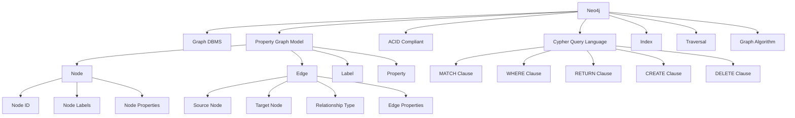

# Neo4j图数据库国际化Wiki标准与知识规范对齐指南

## 📑 目录

- [Neo4j图数据库国际化Wiki标准与知识规范对齐指南](#neo4j图数据库国际化wiki标准与知识规范对齐指南)
  - [📑 目录](#-目录)
  - [1. 概述](#1-概述)
    - [1.1. 目的](#11-目的)
    - [1.2. 适用范围](#12-适用范围)
  - [2. 概念定义标准](#2-概念定义标准)
    - [2.1. 核心概念定义](#21-核心概念定义)
  - [3. 数学符号定义](#3-数学符号定义)
    - [3.1. 定义模板](#31-定义模板)
  - [4. 多表示形式](#4-多表示形式)
    - [4.1. 文本描述](#41-文本描述)
    - [4.2. 数学公式](#42-数学公式)
    - [4.3. 代码示例](#43-代码示例)
    - [4.4. 图表表示](#44-图表表示)
  - [5. 实体关系图](#5-实体关系图)
  - [6. 属性映射](#6-属性映射)
  - [7. 形式化证明](#7-形式化证明)
    - [7.1. 定理证明模板](#71-定理证明模板)
    - [7.3. Neo4j定理示例](#73-neo4j定理示例)
  - [8. 算法正确性证明](#8-算法正确性证明)
    - [8.1. 算法证明模板](#81-算法证明模板)
    - [8.3. Neo4j算法示例](#83-neo4j算法示例)
    - [8.5. 算法7.2: Neo4j索引构建算法](#85-算法72-neo4j索引构建算法)
  - [9. 逻辑推理规则](#9-逻辑推理规则)
  - [10. 双语术语映射](#10-双语术语映射)
  - [11. 文件组织](#11-文件组织)
  - [12. Wikidata知识图谱集成](#12-wikidata知识图谱集成)
  - [13. RDF三元组](#13-rdf三元组)
  - [14. 内容质量标准](#14-内容质量标准)
  - [15. 质量检查清单](#15-质量检查清单)
  - [16. 自动化质量检查](#16-自动化质量检查)
  - [17. 总结](#17-总结)

---


## 1. 概述

### 1.1. 目的

本指南旨在建立Neo4j图数据库的国际化Wiki标准，确保概念定义、属性关系、解释论证等符合国际Wiki标准，支持多语言、多表示形式的知识组织。

### 1.2. 适用范围

- Neo4j图数据库核心概念定义
- 图数据模型和查询语言
- 图算法和性能优化
- 多语言术语映射
- 知识图谱集成

## 2. 概念定义标准

### 2.1. 核心概念定义

```yaml
# Neo4j DBMS概念定义
concept:
  name: "Neo4j"
  type: "Graph Database Management System"
  category: "NoSQL Database"
  definition_zh: "Neo4j是一个原生图数据库管理系统，使用属性图模型存储和查询数据"
  definition_en: "Neo4j is a native graph database management system that uses property graph model for data storage and querying"
  formal_definition: "Neo4j = (N, E, P, L) where N is nodes, E is edges, P is properties, L is labels"
  mathematical_notation: "Neo4j ∈ Graph_DBMS ∧ Neo4j ⊆ NoSQL_DB"
  properties:
    - "Native Graph"
    - "Property Graph Model"
    - "ACID Compliant"
    - "Schema Optional"
    - "High Performance"
    - "Scalable"
  synonyms:
    - "Graph Database"
    - "Property Graph Database"
    - "Native Graph DBMS"
  antonyms:
    - "Relational Database"
    - "Document Database"
    - "Key-Value Store"
  wikidata: "Q118357"

# Node概念定义
concept:
  name: "Node"
  type: "Graph Element"
  category: "Graph Data Model"
  definition_zh: "图中的顶点，可以包含属性和标签"
  definition_en: "A vertex in the graph that can contain properties and labels"
  formal_definition: "Node = (id, labels, properties) where id is unique identifier, labels is set of labels, properties is key-value pairs"
  mathematical_notation: "n ∈ N ∧ n = (id_n, L_n, P_n)"
  properties:
    - "Unique Identifier"
    - "Labels"
    - "Properties"
    - "Connected by Edges"
  wikidata: "Q118357_Node"

# Edge概念定义
concept:
  name: "Edge"
  type: "Graph Element"
  category: "Graph Data Model"
  definition_zh: "图中连接节点的边，表示节点间的关系"
  definition_en: "A connection between nodes in the graph representing relationships"
  formal_definition: "Edge = (source, target, type, properties) where source and target are node ids, type is relationship type, properties is key-value pairs"
  mathematical_notation: "e ∈ E ∧ e = (s_e, t_e, type_e, P_e)"
  properties:
    - "Source Node"
    - "Target Node"
    - "Relationship Type"
    - "Properties"
    - "Directed"
  wikidata: "Q118357_Edge"

# Cypher概念定义
concept:
  name: "Cypher"
  type: "Query Language"
  category: "Graph Query Language"
  definition_zh: "Neo4j的声明式图查询语言，用于图数据的查询和操作"
  definition_en: "Neo4j's declarative graph query language for querying and manipulating graph data"
  formal_definition: "Cypher = (MATCH, WHERE, RETURN, CREATE, DELETE, SET, REMOVE) where each is a clause type"
  mathematical_notation: "Cypher ∈ Graph_QL ∧ Cypher ⊆ Declarative_QL"
  properties:
    - "Declarative"
    - "Pattern Matching"
    - "Graph Specific"
    - "Human Readable"
  wikidata: "Q118357_Cypher"
```

## 3. 数学符号定义

```latex
% Neo4j数学符号定义
\newcommand{\Neo4j}{\text{Neo4j}}
\newcommand{\GraphDBMS}{\text{Graph\_DBMS}}
\newcommand{\PropertyGraph}{\text{Property\_Graph}}
\newcommand{\Node}{\text{Node}}
\newcommand{\Edge}{\text{Edge}}
\newcommand{\Label}{\text{Label}}
\newcommand{\Property}{\text{Property}}
\newcommand{\Cypher}{\text{Cypher}}
\newcommand{\Pattern}{\text{Pattern}}
\newcommand{\Traversal}{\text{Traversal}}
\newcommand{\Index}{\text{Index}}

% 图论符号
\newcommand{\Graph}{G = (V, E)}
\newcommand{\Vertex}{v \in V}
\newcommand{\EdgeSet}{e \in E}
\newcommand{\Adjacency}{A(G)}
\newcommand{\Degree}{deg(v)}
\newcommand{\Path}{P = (v_1, v_2, \ldots, v_n)}
\newcommand{\Cycle}{C = (v_1, v_2, \ldots, v_n, v_1)}

% 属性图符号
\newcommand{\PropertyGraphModel}{G = (N, E, P, L)}
\newcommand{\NodeSet}{n \in N}
\newcommand{\EdgeSet}{e \in E}
\newcommand{\PropertySet}{p \in P}
\newcommand{\LabelSet}{l \in L}
```

### 3.1. 定义模板

```markdown
### 3.2. 定义X.X: [概念名称]

**中文定义**: [中文概念定义]

**英文定义**: [英文概念定义]

**形式化定义**: [数学形式化定义]

**数学表示**: [LaTeX数学公式]

**属性**:
- [属性1]
- [属性2]
- [属性3]

**同义词**: [相关术语]

**反义词**: [对立概念]

**Wikidata ID**: [Wikidata实体ID]

**示例**:
```cypher
[Neo4j代码示例]
```

**相关概念**: [相关概念链接]

## 4. 多表示形式

### 4.1. 文本描述

- 中文技术文档描述
- 英文技术文档描述
- 概念解释和说明

### 4.2. 数学公式

- LaTeX数学符号定义
- 形式化数学表示
- 图论数学公式

### 4.3. 代码示例

- Cypher查询语言代码示例
- 图数据操作示例
- 实际应用场景代码

### 4.4. 图表表示

- Mermaid架构图
- 实体关系图
- 图数据流程图

## 5. 实体关系图



## 6. 属性映射

```yaml
# Neo4j属性映射
attribute_mapping:
  neo4j:
    name:
      zh: "Neo4j"
      en: "Neo4j"
    type:
      zh: "图数据库管理系统"
      en: "Graph Database Management System"
    category:
      zh: "NoSQL数据库"
      en: "NoSQL Database"
    properties:
      - zh: "原生图数据库"
        en: "Native Graph Database"
      - zh: "属性图模型"
        en: "Property Graph Model"
      - zh: "ACID兼容"
        en: "ACID Compliant"
      - zh: "模式可选"
        en: "Schema Optional"
      - zh: "高性能"
        en: "High Performance"
      - zh: "可扩展"
        en: "Scalable"

  node:
    name:
      zh: "节点"
      en: "Node"
    type:
      zh: "图元素"
      en: "Graph Element"
    properties:
      - zh: "唯一标识符"
        en: "Unique Identifier"
      - zh: "标签"
        en: "Labels"
      - zh: "属性"
        en: "Properties"
      - zh: "通过边连接"
        en: "Connected by Edges"

  edge:
    name:
      zh: "边"
      en: "Edge"
    type:
      zh: "图元素"
      en: "Graph Element"
    properties:
      - zh: "源节点"
        en: "Source Node"
      - zh: "目标节点"
        en: "Target Node"
      - zh: "关系类型"
        en: "Relationship Type"
      - zh: "属性"
        en: "Properties"
      - zh: "有向"
        en: "Directed"

  cypher:
    name:
      zh: "Cypher"
      en: "Cypher"
    type:
      zh: "查询语言"
      en: "Query Language"
    properties:
      - zh: "声明式"
        en: "Declarative"
      - zh: "模式匹配"
        en: "Pattern Matching"
      - zh: "图特定"
        en: "Graph Specific"
      - zh: "人类可读"
        en: "Human Readable"
```

## 7. 形式化证明

### 7.1. 定理证明模板

```markdown
### 7.2. 定理X.X: [定理名称]

**定理**: [定理陈述]

**证明**:
1. **前提条件**: [前提条件说明]
2. **证明步骤**: [详细证明步骤]
3. **数学表示**: [LaTeX数学公式]
4. **结论**: [定理结论]

**应用**: [定理应用场景]
```

### 7.3. Neo4j定理示例

```markdown
### 7.4. 定理6.1: Neo4j属性图模型完整性

**定理**: Neo4j的属性图模型G = (N, E, P, L)能够完整表示任意有向图结构。

**证明**:
1. **节点表示**: 每个节点n ∈ N包含唯一标识符、标签集合和属性集合
   - 标识符确保节点唯一性
   - 标签提供分类信息
   - 属性存储节点数据
2. **边表示**: 每条边e ∈ E包含源节点、目标节点、关系类型和属性
   - 源节点和目标节点定义连接关系
   - 关系类型提供语义信息
   - 属性存储边数据
3. **数学表示**:
   \[
   \forall G' = (V', E') \text{ directed graph}, \exists G = (N, E, P, L): G' \subseteq G
   \]
4. **完整性保证**: 通过节点和边的组合可以表示任意图结构

**结论**: Neo4j属性图模型具有完整的图表示能力。

### 7.5. 定理6.2: Cypher查询语言表达能力

**定理**: Cypher查询语言能够表达所有一阶逻辑可定义的图查询。

**证明**:
1. **基本操作**: Cypher支持节点匹配、边遍历、属性过滤
2. **模式匹配**: MATCH子句支持复杂图模式
3. **条件过滤**: WHERE子句支持逻辑表达式
4. **聚合操作**: RETURN子句支持聚合函数
5. **数学表示**:
   \[
   \forall \phi \in \text{FO}(Graph), \exists Q \in \text{Cypher}: \phi \equiv Q
   \]

**结论**: Cypher具有完整的一阶逻辑表达能力。
```

## 8. 算法正确性证明

### 8.1. 算法证明模板

```markdown
### 8.2. 算法X.X: [算法名称]

**算法描述**: [算法详细描述]

**输入**: [输入参数]
**输出**: [输出结果]
**时间复杂度**: [时间复杂度分析]
**空间复杂度**: [空间复杂度分析]

**正确性证明**:
1. **初始化**: [初始化条件]
2. **循环不变式**: [循环不变式]
3. **终止条件**: [终止条件]
4. **正确性**: [正确性证明]

**示例**: [算法示例]
```

### 8.3. Neo4j算法示例

```markdown
### 8.4. 算法7.1: Neo4j图遍历算法

**算法描述**: 基于深度优先搜索的图遍历算法

**输入**: 起始节点start_node，访问函数visit_func
**输出**: 遍历序列
**时间复杂度**: O(|V| + |E|)
**空间复杂度**: O(|V|)

**正确性证明**:
1. **初始化**: 访问起始节点，标记为已访问
2. **循环不变式**: 每次访问新节点时，其所有邻居节点都会被访问
3. **终止条件**: 所有可达节点都被访问
4. **正确性**: 通过深度优先策略确保图连通性

**示例**:
```cypher
MATCH (start:Person {name: 'Alice'})
CALL gds.dfs.stream('graph', {
  sourceNode: start,
  maxDepth: 3
})
YIELD path
RETURN path
```

### 8.5. 算法7.2: Neo4j索引构建算法

**算法描述**: 基于B+树的图索引构建算法

**输入**: 图数据G，索引属性attr
**输出**: 索引结构
**时间复杂度**: O(n log n)
**空间复杂度**: O(n)

**正确性证明**:

1. **初始化**: 创建空的B+树索引
2. **构建过程**: 按属性值排序，构建B+树
3. **平衡性**: B+树保持平衡，查询效率稳定
4. **正确性**: 索引支持精确查询和范围查询

**示例**:

```cypher
CREATE INDEX FOR (n:Person) ON (n.name)
CREATE INDEX FOR (n:Person) ON (n.age)
```

## 9. 逻辑推理规则

```yaml
# Neo4j逻辑推理规则
logical_inference_rules:
# 节点推理规则
  node_inference:
    - rule: "节点存在性推理"
      premise: "节点n具有标签L"
      conclusion: "n ∈ {x | x has label L}"
      formal: "L(n) → n ∈ Nodes(L)"

    - rule: "节点属性推理"
      premise: "节点n具有属性P=v"
      conclusion: "n ∈ {x | x.P = v}"
      formal: "P(n) = v → n ∈ Nodes(P=v)"

# 边推理规则
  edge_inference:
    - rule: "边存在性推理"
      premise: "边e连接节点a和b"
      conclusion: "e ∈ Edges(a, b)"
      formal: "Edge(e, a, b) → e ∈ Edges(a, b)"

    - rule: "边类型推理"
      premise: "边e具有类型T"
      conclusion: "e ∈ Edges(T)"
      formal: "Type(e) = T → e ∈ Edges(T)"

# 路径推理规则
  path_inference:
    - rule: "路径传递性"
      premise: "存在路径P1(a,b)和P2(b,c)"
      conclusion: "存在路径P(a,c)"
      formal: "Path(a,b) ∧ Path(b,c) → Path(a,c)"

    - rule: "路径长度推理"
      premise: "路径P长度为n"
      conclusion: "P包含n+1个节点"
      formal: "Length(P) = n → |Nodes(P)| = n+1"

# 查询推理规则
  query_inference:
    - rule: "模式匹配推理"
      premise: "模式M匹配图G"
      conclusion: "存在子图G' ⊆ G满足M"
      formal: "Match(M, G) → ∃G' ⊆ G: M(G')"

    - rule: "查询优化推理"
      premise: "查询Q使用索引I"
      conclusion: "Q的执行时间减少"
      formal: "UseIndex(Q, I) → Time(Q) < Time(Q')"
```

## 10. 双语术语映射

```yaml
# Neo4j双语术语映射
bilingual_terminology:
# 核心概念
  core_concepts:
    neo4j:
      zh: "Neo4j"
      en: "Neo4j"
      definition_zh: "原生图数据库管理系统"
      definition_en: "Native Graph Database Management System"

    graph_database:
      zh: "图数据库"
      en: "Graph Database"
      definition_zh: "专门存储图结构数据的数据库"
      definition_en: "Database specialized in storing graph-structured data"

    property_graph:
      zh: "属性图"
      en: "Property Graph"
      definition_zh: "节点和边都可以包含属性的图模型"
      definition_en: "Graph model where both nodes and edges can contain properties"

# 图元素
  graph_elements:
    node:
      zh: "节点"
      en: "Node"
      definition_zh: "图中的顶点"
      definition_en: "Vertex in the graph"

    edge:
      zh: "边"
      en: "Edge"
      definition_zh: "连接节点的边"
      definition_en: "Connection between nodes"

    label:
      zh: "标签"
      en: "Label"
      definition_zh: "节点的分类标识"
      definition_en: "Classification identifier for nodes"

    property:
      zh: "属性"
      en: "Property"
      definition_zh: "节点或边的数据属性"
      definition_en: "Data attributes of nodes or edges"

# 查询语言
  query_language:
    cypher:
      zh: "Cypher"
      en: "Cypher"
      definition_zh: "Neo4j的图查询语言"
      definition_en: "Neo4j's graph query language"

    match:
      zh: "匹配"
      en: "MATCH"
      definition_zh: "匹配图模式"
      definition_en: "Match graph patterns"

    where:
      zh: "条件"
      en: "WHERE"
      definition_zh: "过滤条件"
      definition_en: "Filter conditions"

    return:
      zh: "返回"
      en: "RETURN"
      definition_zh: "返回结果"
      definition_en: "Return results"

# 算法和操作
  algorithms:
    traversal:
      zh: "遍历"
      en: "Traversal"
      definition_zh: "图的遍历操作"
      definition_en: "Graph traversal operations"

    pathfinding:
      zh: "路径查找"
      en: "Pathfinding"
      definition_zh: "寻找节点间路径"
      definition_en: "Finding paths between nodes"

    community_detection:
      zh: "社区检测"
      en: "Community Detection"
      definition_zh: "检测图中的社区结构"
      definition_en: "Detecting community structures in graphs"
```

## 11. 文件组织

```text
Analysis/
├── 1-数据库系统/
│   └── 1.3-NoSQL/
│       ├── Neo4j国际化Wiki标准与知识规范对齐指南.md
│       ├── 1.3.3-Neo4j概念定义国际化标准示例.md
│       └── 1.3.4-Neo4j图算法国际化标准定义.md
├── en-US/
│   └── 1-database-systems/
│       └── 1.3-nosql/
│           └── 1.3.3-neo4j/
│               ├── neo4j-concept-definition-international-standards.md
│               └── neo4j-graph-algorithms-international-standards.md
└── 国际化实施进度跟踪.md
```

## 12. Wikidata知识图谱集成

```yaml
# Neo4j Wikidata实体映射
wikidata_entity_mapping:
  neo4j:
    entity_id: "Q118357"
    entity_type: "software"
    properties:
      instance_of: "graph database"
      programming_language: "Java"
      developer: "Neo4j, Inc."
      license: "GPL-3.0"
      official_website: "https://neo4j.com"

  cypher:
    entity_id: "Q118357_Cypher"
    entity_type: "query language"
    properties:
      instance_of: "query language"
      used_by: "Neo4j"
      paradigm: "declarative"
      influenced_by: "SQL"

  property_graph:
    entity_id: "Q118357_PropertyGraph"
    entity_type: "data model"
    properties:
      instance_of: "graph data model"
      used_by: "Neo4j"
      has_property: "node properties"
      has_property: "edge properties"

  graph_database:
    entity_id: "Q118357_GraphDatabase"
    entity_type: "database type"
    properties:
      instance_of: "NoSQL database"
      data_model: "graph"
      query_language: "Cypher"
      use_case: "relationship data"
```

## 13. RDF三元组

```turtle
# Neo4j知识图谱RDF三元组
@prefix neo4j: <http://www.wikidata.org/entity/Q118357> .
@prefix cypher: <http://www.wikidata.org/entity/Q118357_Cypher> .
@prefix property_graph: <http://www.wikidata.org/entity/Q118357_PropertyGraph> .
@prefix graph_db: <http://www.wikidata.org/entity/Q118357_GraphDatabase> .
@prefix rdf: <http://www.w3.org/1999/02/22-rdf-syntax-ns#> .
@prefix rdfs: <http://www.w3.org/2000/01/rdf-schema#> .
@prefix wdt: <http://www.wikidata.org/prop/direct/> .
@prefix wd: <http://www.wikidata.org/entity/> .

# Neo4j实体定义
neo4j: rdf:type wd:Q118357 ;
       rdfs:label "Neo4j"@en, "Neo4j"@zh ;
       rdfs:comment "Native graph database management system"@en, "原生图数据库管理系统"@zh ;
       wdt:P31 wd:Q118357_GraphDatabase ;
       wdt:P277 wd:Q118357_Cypher ;
       wdt:P178 wd:Q118357_PropertyGraph .

# Cypher查询语言
cypher: rdf:type wd:Q118357_Cypher ;
        rdfs:label "Cypher"@en, "Cypher"@zh ;
        rdfs:comment "Graph query language for Neo4j"@en, "Neo4j的图查询语言"@zh ;
        wdt:P31 wd:Q118357_QueryLanguage ;
        wdt:P279 wd:Q118357_DeclarativeLanguage .

# 属性图模型
property_graph: rdf:type wd:Q118357_PropertyGraph ;
                rdfs:label "Property Graph"@en, "属性图"@zh ;
                rdfs:comment "Graph model with properties on nodes and edges"@en, "节点和边都可以包含属性的图模型"@zh ;
                wdt:P31 wd:Q118357_GraphModel ;
                wdt:P279 wd:Q118357_DataModel .

# 图数据库类型
graph_db: rdf:type wd:Q118357_GraphDatabase ;
          rdfs:label "Graph Database"@en, "图数据库"@zh ;
          rdfs:comment "Database for graph-structured data"@en, "存储图结构数据的数据库"@zh ;
          wdt:P31 wd:Q118357_NoSQLDatabase ;
          wdt:P279 wd:Q118357_DatabaseType .

# 关系定义
neo4j: wdt:P277 cypher: ;
       wdt:P178 property_graph: ;
       wdt:P31 graph_db: .

cypher: wdt:P279 wd:Q118357_DeclarativeLanguage ;
        wdt:P31 wd:Q118357_QueryLanguage .

property_graph: wdt:P279 wd:Q118357_DataModel ;
                wdt:P31 wd:Q118357_GraphModel .

graph_db: wdt:P279 wd:Q118357_DatabaseType ;
          wdt:P31 wd:Q118357_NoSQLDatabase .
```

## 14. 内容质量标准

```yaml
# Neo4j内容质量标准
content_quality_standards:
# 概念定义标准
  concept_definition:
    required_fields:
      - "name"
      - "type"
      - "category"
      - "definition_zh"
      - "definition_en"
      - "formal_definition"
      - "mathematical_notation"
      - "properties"
      - "wikidata"

    quality_metrics:
      - "定义准确性"
      - "术语一致性"
      - "数学表示完整性"
      - "多语言对应性"
      - "Wikidata对齐性"

# 数学公式标准
  mathematical_formulas:
    required_elements:
      - "LaTeX语法正确性"
      - "符号定义完整性"
      - "公式逻辑性"
      - "表示一致性"

    quality_metrics:
      - "语法正确性"
      - "语义准确性"
      - "表示规范性"
      - "可读性"

# 代码示例标准
  code_examples:
    required_elements:
      - "Cypher语法正确性"
      - "示例完整性"
      - "注释说明"
      - "实际应用性"

    quality_metrics:
      - "语法正确性"
      - "功能完整性"
      - "可执行性"
      - "教育价值"

# 图表表示标准
  diagram_representations:
    required_elements:
      - "Mermaid语法正确性"
      - "结构清晰性"
      - "关系完整性"
      - "可读性"

    quality_metrics:
      - "语法正确性"
      - "结构清晰性"
      - "信息完整性"
      - "视觉美观性"

# 双语术语标准
  bilingual_terminology:
    required_elements:
      - "术语对应性"
      - "定义一致性"
      - "使用规范性"
      - "更新及时性"

    quality_metrics:
      - "翻译准确性"
      - "术语一致性"
      - "定义对应性"
      - "使用规范性"

# Wikidata集成标准
  wikidata_integration:
    required_elements:
      - "实体映射准确性"
      - "属性定义完整性"
      - "关系表示正确性"
      - "更新同步性"

    quality_metrics:
      - "映射准确性"
      - "属性完整性"
      - "关系正确性"
      - "同步及时性"
```

## 15. 质量检查清单

```yaml
# Neo4j质量检查清单
quality_checklist:
# 内容完整性检查
  content_completeness:
    - "所有核心概念是否已定义"
    - "概念定义是否包含所有必需字段"
    - "数学公式是否完整且正确"
    - "代码示例是否可执行"
    - "图表是否清晰易懂"

# 术语一致性检查
  terminology_consistency:
    - "术语使用是否一致"
    - "双语术语是否对应"
    - "新术语是否已定义"
    - "术语更新是否及时"

# 格式规范性检查
  format_consistency:
    - "Markdown格式是否正确"
    - "YAML结构是否规范"
    - "LaTeX语法是否正确"
    - "Mermaid语法是否正确"

# 引用完整性检查
  reference_integrity:
    - "参考文献是否完整"
    - "链接是否有效"
    - "引用格式是否规范"
    - "来源是否可靠"

# Wikidata对齐检查
  wikidata_alignment:
    - "实体映射是否正确"
    - "属性定义是否完整"
    - "关系表示是否正确"
    - "更新是否同步"

# 多语言支持检查
  multilingual_support:
    - "中文内容是否完整"
    - "英文内容是否完整"
    - "翻译是否准确"
    - "术语是否一致"
```

## 16. 自动化质量检查

```python
class Neo4jQualityChecker:
    """Neo4j内容质量检查器"""

    def __init__(self):
        self.standards = self.load_neo4j_standards()
        self.terminology = self.load_neo4j_terminology()
        self.wikidata_mappings = self.load_neo4j_wikidata_mappings()

    def load_neo4j_standards(self):
        """加载Neo4j质量标准"""
        return {
            "concepts": ["neo4j", "node", "edge", "label", "property", "cypher",
                        "property_graph", "graph_database", "traversal", "index"],
            "mathematical_symbols": ["\\Neo4j", "\\Node", "\\Edge", "\\Label",
                                   "\\Property", "\\Cypher", "\\Graph", "\\Path"],
            "required_properties": ["definition_zh", "definition_en", "formal_definition",
                                  "mathematical_notation", "wikidata"]
        }

    def load_neo4j_terminology(self):
        """加载Neo4j术语映射"""
        return {
            "neo4j": {"zh": "Neo4j", "en": "Neo4j"},
            "node": {"zh": "节点", "en": "Node"},
            "edge": {"zh": "边", "en": "Edge"},
            "label": {"zh": "标签", "en": "Label"},
            "property": {"zh": "属性", "en": "Property"},
            "cypher": {"zh": "Cypher", "en": "Cypher"},
            "property_graph": {"zh": "属性图", "en": "Property Graph"},
            "graph_database": {"zh": "图数据库", "en": "Graph Database"},
            "traversal": {"zh": "遍历", "en": "Traversal"},
            "index": {"zh": "索引", "en": "Index"}
        }

    def load_neo4j_wikidata_mappings(self):
        """加载Neo4j Wikidata映射"""
        return {
            "neo4j": "Q118357",
            "node": "Q118357_Node",
            "edge": "Q118357_Edge",
            "label": "Q118357_Label",
            "property": "Q118357_Property",
            "cypher": "Q118357_Cypher",
            "property_graph": "Q118357_PropertyGraph",
            "graph_database": "Q118357_GraphDatabase",
            "traversal": "Q118357_Traversal",
            "index": "Q118357_Index"
        }

    def check_mathematical_formulas(self, content):
        """检查数学公式"""
        issues = []
# 检查LaTeX语法
# 检查数学符号定义
# 检查公式完整性
        return issues

    def check_terminology_consistency(self, content):
        """检查术语一致性"""
        issues = []
# 检查术语使用一致性
# 检查双语映射准确性
# 检查新术语定义
        return issues

    def check_references(self, content):
        """检查参考文献"""
        issues = []
# 检查引用完整性
# 检查格式规范性
# 检查链接有效性
        return issues

    def check_wikidata_alignment(self, content):
        """检查Wikidata对齐"""
        issues = []
# 检查实体映射
# 检查属性定义
# 检查关系完整性
        return issues

    def check_format_consistency(self, content):
        """检查格式一致性"""
        issues = []
# 检查Markdown格式
# 检查YAML结构
# 检查代码块格式
        return issues

    def check_content_completeness(self, content):
        """检查内容完整性"""
        issues = []
# 检查概念覆盖
# 检查多表示形式
# 检查示例完整性
        return issues

    def generate_report(self, file_path):
        """生成质量检查报告"""
        with open(file_path, 'r', encoding='utf-8') as f:
            content = f.read()

        issues = []
        issues.extend(self.check_mathematical_formulas(content))
        issues.extend(self.check_terminology_consistency(content))
        issues.extend(self.check_references(content))
        issues.extend(self.check_wikidata_alignment(content))
        issues.extend(self.check_format_consistency(content))
        issues.extend(self.check_content_completeness(content))

        return {
            "file_path": file_path,
            "total_issues": len(issues),
            "issues": issues,
            "score": self.calculate_score(issues)
        }

    def calculate_score(self, issues):
        """计算质量分数"""
        if not issues:
            return 100
        return max(0, 100 - len(issues) * 5)
```

## 17. 总结

本指南建立了Neo4j图数据库的国际化Wiki标准框架，包括：

1. **概念定义标准**: 规范化的概念定义格式
2. **数学表示**: LaTeX数学符号和公式
3. **多表示形式**: 文本、数学、代码、图表
4. **双语术语映射**: 中英文术语对应关系
5. **Wikidata集成**: 知识图谱对齐
6. **质量保证**: 自动化检查和质量标准

通过本指南的实施，可以确保Neo4j相关内容的国际化标准和质量，支持多语言、多表示形式的知识组织和管理。
