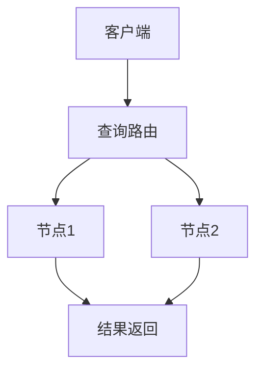

# 1.3 NoSQL 主题导航与多表征案例

## 目录结构与本地跳转

- 1.3.1 形式模型（预留）
- 1.3.2 系统架构（预留）
- 1.3.3 数据模型（预留）
- 1.3.4 查询与索引（预留）
- 1.3.5 分布式一致性与CAP（预留）

---

## 行业案例与多表征

### 1.3.x 典型行业案例

- 大数据存储与高可用（详见3.5-数据分析与ETL、4.3-微服务架构、7-持续集成与演进）
- 互联网日志分析：MongoDB/ElasticSearch应用（详见3.5.7-数据存储与访问、6-知识图谱与可视化）
- 实时推荐与缓存：Redis分布式架构（详见3.4-AI与机器学习算法、5.3-机器学习）

### 1.3.x 多表征示例

- CAP原理图、分布式一致性流程、NoSQL数据模型对比、查询与索引结构、Latex公式等

---

[返回数据库系统导航](../README.md)
