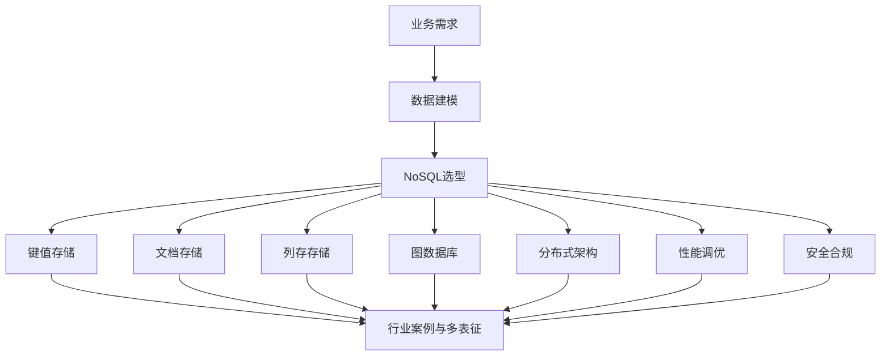
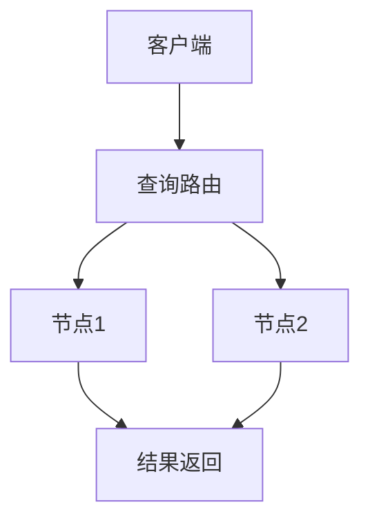

# 1.3-NoSQL 分支导航

## 目录结构与本地跳转

- [1.3.1-形式模型](1.3.1-形式模型.md)
- [1.3.2-系统架构](1.3.2-系统架构.md)
- [1.3.3-数据模型](1.3.3-数据模型.md)
- [1.3.4-查询与索引](1.3.4-查询与索引.md)
- [1.3.5-分布式一致性与CAP](1.3.5-分布式一致性与CAP.md)
- [1.3.6-性能调优与监控](1.3.6-性能调优与监控.md)
- [1.3.7-安全与合规](1.3.7-安全与合规.md)

---

## 主题交叉引用

| 主题      | 形式模型 | 系统架构 | 数据模型 | 查询与索引 | 分布式一致性 | 性能调优 | 安全合规 |
|-----------|----------|----------|----------|------------|-------------|----------|----------|
| NoSQL     | ✓        | ✓        | ✓        | ✓          | ✓           | ✓        | ✓        |

- 交叉引用：[3.5-数据分析与ETL](../../../3-数据模型与算法/3.5-数据分析与ETL/README.md)、[4.3-微服务架构](../../../4-软件架构与工程/4.3-微服务架构/README.md)、[7-持续集成与演进](../../../7-持续集成与演进/README.md)

---

## 全链路知识流（Mermaid流程图）

---

## 行业案例与多表征

### 1.3.x 典型行业案例

- 大数据存储与高可用（详见3.5-数据分析与ETL、4.3-微服务架构、7-持续集成与演进）
- 互联网日志分析：MongoDB/ElasticSearch应用（详见3.5.7-数据存储与访问、6-知识图谱与可视化）
- 实时推荐与缓存：Redis分布式架构（详见3.4-AI与机器学习算法、5.3-机器学习）

### 1.3.x 多表征示例

- CAP原理图、分布式一致性流程、NoSQL数据模型对比、查询与索引结构、Latex公式等

---

[返回数据库系统总导航](../README.md)
