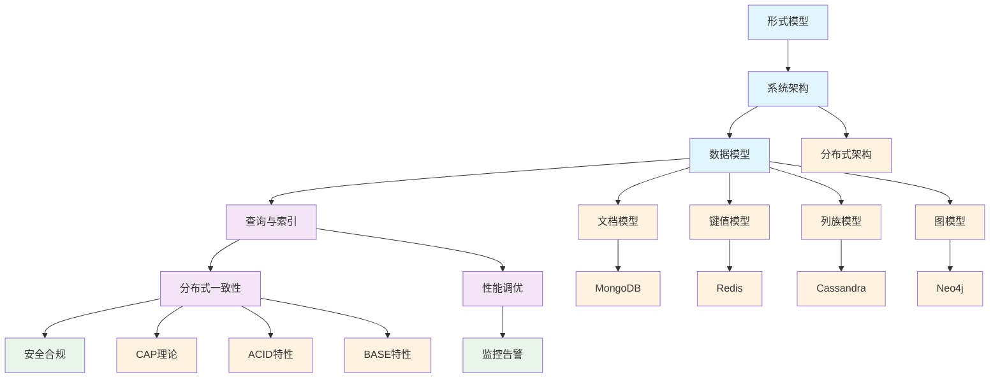

# 1.3-NoSQL - 知识导航索引

## 📚 目录结构

```
1.3-NoSQL/
├── README.md                           # 本导航文件
├── 1.3.1-形式模型.md                   # NoSQL形式化模型
├── 1.3.2-系统架构.md                   # NoSQL系统架构
├── 1.3.3-数据模型.md                   # NoSQL数据模型
├── 1.3.4-查询与索引.md                 # NoSQL查询与索引
├── 1.3.5-分布式一致性与CAP.md         # 分布式一致性
├── 1.3.6-性能调优与监控.md             # 性能优化
└── 1.3.7-安全与合规.md                 # 安全合规
```

## 🔗 主题交叉引用表

| 技术分支 | 核心概念 | 关联理论 | 应用领域 |
|---------|---------|---------|---------|
| **形式模型** | 形式化定义、理论证明 | 形式科学理论、数学基础 | 系统验证、理论研究 |
| **系统架构** | 分布式设计、水平扩展 | 分布式系统理论、软件架构 | 大规模系统、架构优化 |
| **数据模型** | 文档、键值、列族、图 | 数据模型算法、图论 | 数据建模、应用开发 |
| **查询与索引** | 查询语言、索引策略 | 算法实现、搜索理论 | 数据检索、性能优化 |
| **分布式一致性** | CAP理论、一致性模型 | 分布式系统理论、时态逻辑 | 分布式应用、容错设计 |
| **性能调优** | 参数优化、监控告警 | 性能分析、运维工程 | 系统优化、问题诊断 |
| **安全合规** | 访问控制、数据加密 | 安全理论、合规标准 | 数据保护、审计追踪 |

## 🌊 全链路知识流图



## 🎯 知识体系特色

### 🏗️ **理论严谨性**

- 基于形式化模型的严格定义
- CAP理论的数学证明
- 一致性模型的分类体系

### 🚀 **高性能设计**

- 水平扩展架构
- 分布式数据分片
- 高效索引结构

### 🔄 **灵活性**

- 多种数据模型支持
- Schema-less设计
- 动态数据结构

### 🌐 **分布式特性**

- 分布式一致性保证
- 故障自动恢复
- 跨地域部署

## 📖 学习路径建议

### 🥇 **入门路径**

1. **形式模型** → 理解理论基础
2. **系统架构** → 掌握分布式设计
3. **数据模型** → 学习不同模型特点

### 🥈 **进阶路径**

1. **查询与索引** → 深入数据检索
2. **分布式一致性** → 理解CAP理论
3. **性能调优** → 系统优化技术

### 🥉 **专家路径**

1. **分布式系统** → 深入分布式理论
2. **安全合规** → 数据安全保护
3. **监控运维** → 生产环境管理

## 🔍 快速导航

- **[形式模型](./1.3.1-形式模型.md)** - NoSQL形式化模型
- **[系统架构](./1.3.2-系统架构.md)** - NoSQL系统架构
- **[数据模型](./1.3.3-数据模型.md)** - NoSQL数据模型
- **[查询与索引](./1.3.4-查询与索引.md)** - NoSQL查询与索引
- **[分布式一致性与CAP](./1.3.5-分布式一致性与CAP.md)** - 分布式一致性
- **[性能调优与监控](./1.3.6-性能调优与监控.md)** - 性能优化
- **[安全与合规](./1.3.7-安全与合规.md)** - 安全合规

## 🚀 技术栈映射

### 🏗️ **数据模型**

- **文档数据库**：MongoDB、CouchDB
- **键值数据库**：Redis、DynamoDB
- **列族数据库**：Cassandra、HBase
- **图数据库**：Neo4j、ArangoDB

### 🔧 **分布式架构**

- **分片策略**：范围分片、哈希分片
- **复制机制**：主从复制、多主复制
- **一致性协议**：Raft、Paxos
- **故障检测**：心跳机制、Gossip协议

### 🔍 **查询语言**

- **文档查询**：MongoDB Query Language
- **图查询**：Cypher、Gremlin
- **键值操作**：Redis Commands
- **列族查询**：CQL、HBase Shell

### 🔄 **一致性模型**

- **强一致性**：线性化、顺序一致性
- **弱一致性**：最终一致性、因果一致性
- **会话一致性**：单调读、单调写
- **读写一致性**：读写一致性、写后读一致性

## 📈 应用场景体系

### 🏢 **企业应用**

- **内容管理**：文档存储、版本控制
- **用户画像**：用户行为数据
- **推荐系统**：用户偏好数据
- **实时分析**：流数据处理

### 📊 **大数据应用**

- **日志分析**：系统日志存储
- **时序数据**：监控数据存储
- **搜索引擎**：全文索引
- **数据仓库**：大规模数据存储

### 🌐 **互联网应用**

- **社交网络**：用户关系图
- **电商平台**：商品目录、订单数据
- **游戏系统**：玩家数据、游戏状态
- **IoT应用**：设备数据、传感器数据

### 🔒 **安全应用**

- **数据加密**：透明数据加密
- **访问控制**：细粒度权限管理
- **审计日志**：操作记录追踪
- **合规存储**：数据保留策略

---

*本导航为NoSQL技术体系提供系统化的知识组织框架，支持从基础理论到实际应用的完整学习路径。*
