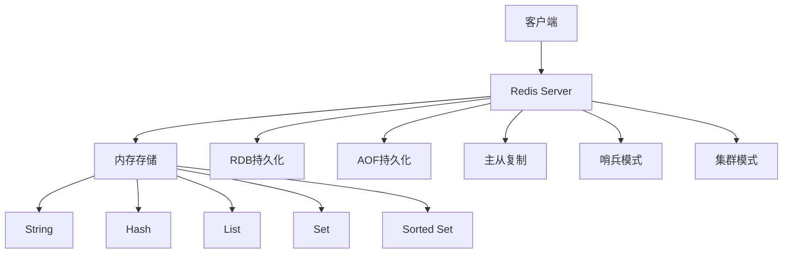
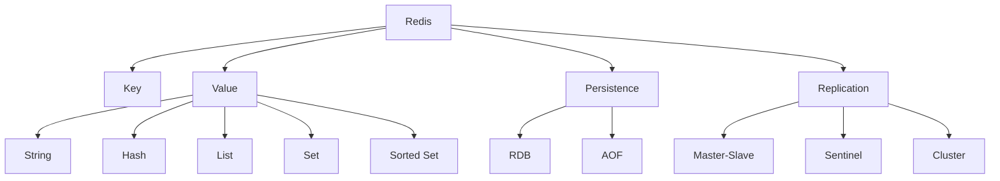

# Redis键值数据库国际化Wiki标准与知识规范对齐指南

## 📑 目录

- [Redis键值数据库国际化Wiki标准与知识规范对齐指南](#redis键值数据库国际化wiki标准与知识规范对齐指南)
  - [📑 目录](#-目录)
  - [1. 概述](#1-概述)
    - [1.1. 目的](#11-目的)
    - [1.2. 适用范围](#12-适用范围)
  - [2. 核心概念定义](#2-核心概念定义)
    - [2.1. Redis数据库管理系统](#21-redis数据库管理系统)
    - [2.2. 键（Key）](#22-键key)
    - [2.3. 值（Value）](#23-值value)
    - [2.4. 数据结构](#24-数据结构)
  - [3. 数据结构详解](#3-数据结构详解)
    - [3.1. String（字符串）](#31-string字符串)
    - [3.2. Hash（哈希表）](#32-hash哈希表)
    - [3.3. List（列表）](#33-list列表)
    - [3.4. Set（集合）](#34-set集合)
    - [3.5. Sorted Set（有序集合）](#35-sorted-set有序集合)
    - [3.6. 其他数据结构](#36-其他数据结构)
  - [4. 持久化机制](#4-持久化机制)
    - [4.1. RDB持久化](#41-rdb持久化)
    - [4.2. AOF持久化](#42-aof持久化)
    - [4.3. 混合持久化](#43-混合持久化)
  - [5. 高可用与集群](#5-高可用与集群)
    - [5.1. 主从复制](#51-主从复制)
    - [5.2. 哨兵模式](#52-哨兵模式)
    - [5.3. 集群模式](#53-集群模式)
  - [6. 性能优化](#6-性能优化)
  - [7. 双语术语映射表](#7-双语术语映射表)
    - [7.1. 核心概念术语映射](#71-核心概念术语映射)
  - [8. RDF知识图谱表示](#8-rdf知识图谱表示)
  - [9. 概念映射关系](#9-概念映射关系)
  - [10. 内容质量标准与验证检查清单](#10-内容质量标准与验证检查清单)
    - [10.1. 概念定义标准](#101-概念定义标准)
    - [10.2. 代码示例标准](#102-代码示例标准)
    - [10.3. 图表表示标准](#103-图表表示标准)
  - [11. 总结](#11-总结)

---

## 1. 概述

### 1.1. 目的

本指南旨在建立Redis键值数据库的国际化Wiki标准，确保概念定义、属性关系、解释论证等符合国际Wiki标准，支持多语言、多表示形式的知识组织。

### 1.2. 适用范围

- Redis核心概念定义
- 键值数据模型和数据结构
- 持久化机制和高可用架构
- 多语言术语映射
- 知识图谱集成

---

## 2. 核心概念定义

### 2.1. Redis数据库管理系统

```yaml
# Redis DBMS概念定义
concept:
  name: "Redis"
  type: "Database Management System"
  category: "NoSQL Database"
  subcategory: "Key-Value Store"
  definition_zh: "Redis是一个开源的内存数据结构存储系统，可用作数据库、缓存和消息中间件，支持多种数据结构，提供高性能的数据操作"
  definition_en: "Redis is an open-source in-memory data structure store, used as a database, cache, and message broker, supporting various data structures and providing high-performance data operations"
  formal_definition: "Redis = (K, V, D, P, R) where K is key space, V is value space, D is data structures, P is persistence, R is replication"
  mathematical_notation: "Redis ∈ NoSQL_DBMS ∧ Redis ⊆ KeyValue_DB ∧ Redis ⊆ InMemory_DB"
  properties:
    - "In-memory storage"
    - "Key-value model"
    - "Multiple data structures"
    - "Persistence support"
    - "High performance"
    - "Atomic operations"
  synonyms:
    - "Remote Dictionary Server"
    - "Key-Value Store"
    - "In-Memory Database"
  antonyms:
    - "Disk-based Database"
    - "Relational Database"
  wikidata: "Q127599"
```

**多表示形式**:

```markdown
**文本描述**:
Redis是一个基于内存的键值存储系统，支持字符串、哈希表、列表、集合、有序集合等多种数据结构。Redis将所有数据存储在内存中，提供极高的读写性能，同时支持持久化到磁盘，保证数据安全。

**数学表示**:
Redis = (K, V, D, P, R)
其中：
- K: Key Space (键空间)
- V: Value Space (值空间)
- D: Data Structures (数据结构集合)
- P: Persistence (持久化机制)
- R: Replication (复制机制)

**代码示例**:
```python
import redis

# 连接Redis
r = redis.Redis(host='localhost', port=6379, db=0)

# 设置键值对
r.set('key', 'value')

# 获取值
value = r.get('key')
print(value)  # b'value'
```

**图表表示**:



### 2.2. 键（Key）

```yaml
# Key概念定义
concept:
  name: "Key"
  type: "Data Structure"
  category: "Redis Core"
  definition_zh: "Redis中的键是用于标识和访问值的唯一标识符，键是字符串类型，最大长度为512MB"
  definition_en: "A key in Redis is a unique identifier used to identify and access values, keys are strings with a maximum length of 512MB"
  formal_definition: "Key ∈ String ∧ |Key| ≤ 512MB"
  properties:
    - "Unique identifier"
    - "String type"
    - "Maximum length 512MB"
    - "Case sensitive"
  operations:
    - "SET key value"
    - "GET key"
    - "DEL key"
    - "EXISTS key"
```

### 2.3. 值（Value）

```yaml
# Value概念定义
concept:
  name: "Value"
  type: "Data Structure"
  category: "Redis Core"
  definition_zh: "Redis中的值是存储在键下的数据，可以是字符串、哈希表、列表、集合、有序集合等多种数据结构"
  definition_en: "A value in Redis is data stored under a key, which can be various data structures such as strings, hashes, lists, sets, sorted sets"
  formal_definition: "Value ∈ {String, Hash, List, Set, SortedSet, ...}"
  properties:
    - "Associated with a key"
    - "Multiple data types"
    - "Can be empty"
```

### 2.4. 数据结构

Redis支持多种数据结构：

1. **String（字符串）**：最基本的类型
2. **Hash（哈希表）**：键值对集合
3. **List（列表）**：有序的字符串列表
4. **Set（集合）**：无序的字符串集合
5. **Sorted Set（有序集合）**：带分数的有序集合
6. **Bitmaps（位图）**：位操作
7. **HyperLogLog**：基数统计
8. **Streams（流）**：日志数据结构

---

## 3. 数据结构详解

### 3.1. String（字符串）

**定义**：

String是Redis最基本的数据类型，可以存储字符串、整数或浮点数。

**操作**：

```redis
# 设置值
SET key value

# 获取值
GET key

# 递增
INCR key
INCRBY key increment

# 递减
DECR key
DECRBY key decrement

# 追加
APPEND key value

# 获取子串
GETRANGE key start end

# 设置过期时间
SETEX key seconds value
```

**Python示例**：

```python
import redis

r = redis.Redis()

# 设置字符串
r.set('name', 'Redis')
r.set('count', 100)

# 获取字符串
name = r.get('name')  # b'Redis'
count = r.get('count')  # b'100'

# 递增
r.incr('count')  # 101
r.incrby('count', 10)  # 111

# 追加
r.append('name', ' Database')  # 'Redis Database'
```

### 3.2. Hash（哈希表）

**定义**：

Hash是键值对的集合，适合存储对象。

**操作**：

```redis
# 设置字段
HSET key field value
HMSET key field1 value1 field2 value2

# 获取字段
HGET key field
HGETALL key

# 删除字段
HDEL key field

# 检查字段是否存在
HEXISTS key field

# 获取所有字段
HKEYS key
HVALS key
```

**Python示例**：

```python
# 设置哈希
r.hset('user:1', 'name', 'Alice')
r.hset('user:1', 'age', 25)
r.hset('user:1', 'email', 'alice@example.com')

# 获取所有字段
user = r.hgetall('user:1')
# {b'name': b'Alice', b'age': b'25', b'email': b'alice@example.com'}

# 获取单个字段
name = r.hget('user:1', 'name')  # b'Alice'
```

### 3.3. List（列表）

**定义**：

List是字符串的有序列表，支持从两端插入和删除。

**操作**：

```redis
# 从左侧推入
LPUSH key value

# 从右侧推入
RPUSH key value

# 从左侧弹出
LPOP key

# 从右侧弹出
RPOP key

# 获取列表长度
LLEN key

# 获取列表元素
LRANGE key start stop
```

**Python示例**：

```python
# 创建列表
r.lpush('tasks', 'task1')
r.lpush('tasks', 'task2')
r.rpush('tasks', 'task3')

# 获取列表
tasks = r.lrange('tasks', 0, -1)
# [b'task2', b'task1', b'task3']

# 弹出元素
task = r.lpop('tasks')  # b'task2'
```

### 3.4. Set（集合）

**定义**：

Set是无序的字符串集合，不允许重复元素。

**操作**：

```redis
# 添加元素
SADD key member

# 删除元素
SREM key member

# 获取所有成员
SMEMBERS key

# 检查成员是否存在
SISMEMBER key member

# 集合运算
SINTER key1 key2  # 交集
SUNION key1 key2  # 并集
SDIFF key1 key2   # 差集
```

**Python示例**：

```python
# 添加元素
r.sadd('tags', 'python')
r.sadd('tags', 'redis')
r.sadd('tags', 'database')

# 获取所有成员
tags = r.smembers('tags')
# {b'python', b'redis', b'database'}

# 检查成员
is_member = r.sismember('tags', 'python')  # True

# 集合运算
r.sadd('tags1', 'python', 'redis')
r.sadd('tags2', 'redis', 'database')
intersection = r.sinter('tags1', 'tags2')  # {b'redis'}
```

### 3.5. Sorted Set（有序集合）

**定义**：

Sorted Set是有序的集合，每个成员关联一个分数（score），按分数排序。

**操作**：

```redis
# 添加成员
ZADD key score member

# 获取成员分数
ZSCORE key member

# 获取排名
ZRANK key member
ZREVRANK key member

# 范围查询
ZRANGE key start stop [WITHSCORES]
ZREVRANGE key start stop [WITHSCORES]

# 按分数范围查询
ZRANGEBYSCORE key min max
```

**Python示例**：

```python
# 添加成员
r.zadd('leaderboard', {'player1': 100, 'player2': 200, 'player3': 150})

# 获取排名
rank = r.zrank('leaderboard', 'player2')  # 2 (从0开始)

# 获取前3名
top3 = r.zrevrange('leaderboard', 0, 2, withscores=True)
# [(b'player2', 200.0), (b'player3', 150.0), (b'player1', 100.0)]
```

### 3.6. 其他数据结构

**Bitmaps（位图）**：

```redis
# 设置位
SETBIT key offset value

# 获取位
GETBIT key offset

# 位运算
BITOP operation destkey key1 key2
```

**HyperLogLog**：

```redis
# 添加元素
PFADD key element

# 统计基数
PFCOUNT key

# 合并
PFMERGE destkey sourcekey1 sourcekey2
```

**Streams（流）**：

```redis
# 添加消息
XADD stream * field value

# 读取消息
XREAD STREAMS stream 0

# 创建消费者组
XGROUP CREATE stream groupname 0
```

---

## 4. 持久化机制

### 4.1. RDB持久化

**RDB（Redis Database）**是Redis的默认持久化方式，通过快照保存数据。

**特点**：

- 二进制格式，文件小
- 恢复速度快
- 可能丢失最后一次快照后的数据

**配置**：

```redis
# redis.conf
save 900 1      # 900秒内至少1个键变化
save 300 10     # 300秒内至少10个键变化
save 60 10000   # 60秒内至少10000个键变化
```

### 4.2. AOF持久化

**AOF（Append Only File）**记录每个写操作，重启时重新执行。

**特点**：

- 数据丢失风险低
- 文件较大
- 恢复速度较慢

**配置**：

```redis
# redis.conf
appendonly yes
appendfsync everysec  # 每秒同步
```

### 4.3. 混合持久化

**混合持久化**结合RDB和AOF的优势。

**配置**：

```redis
# redis.conf
aof-use-rdb-preamble yes
```

---

## 5. 高可用与集群

### 5.1. 主从复制

**主从复制**实现数据备份和读写分离。

**配置**：

```redis
# 从服务器配置
replicaof 127.0.0.1 6379
```

### 5.2. 哨兵模式

**哨兵模式**提供自动故障转移。

**配置**：

```redis
# sentinel.conf
sentinel monitor mymaster 127.0.0.1 6379 2
sentinel down-after-milliseconds mymaster 5000
```

### 5.3. 集群模式

**集群模式**实现水平扩展。

**配置**：

```redis
# redis.conf
cluster-enabled yes
cluster-config-file nodes.conf
cluster-node-timeout 15000
```

---

## 6. 性能优化

**优化策略**：

1. **合理使用数据结构**
2. **设置合适的过期时间**
3. **使用管道（Pipeline）**
4. **使用连接池**
5. **避免大键（Big Key）**

---

## 7. 双语术语映射表

### 7.1. 核心概念术语映射

| 中文 | 英文 | 说明 |
|------|------|------|
| 键 | Key | 唯一标识符 |
| 值 | Value | 存储的数据 |
| 字符串 | String | 基本数据类型 |
| 哈希表 | Hash | 键值对集合 |
| 列表 | List | 有序列表 |
| 集合 | Set | 无序集合 |
| 有序集合 | Sorted Set | 带分数的有序集合 |
| 持久化 | Persistence | 数据持久化 |
| 主从复制 | Master-Slave Replication | 数据复制 |
| 哨兵 | Sentinel | 故障检测和转移 |
| 集群 | Cluster | 分布式部署 |

---

## 8. RDF知识图谱表示

```turtle
@prefix redis: <http://example.org/redis#> .
@prefix rdf: <http://www.w3.org/1999/02/22-rdf-syntax-ns#> .

redis:Redis rdf:type redis:DatabaseManagementSystem .
redis:Key rdf:type redis:DataStructure .
redis:Value rdf:type redis:DataStructure .
redis:Redis redis:hasDataStructure redis:String .
redis:Redis redis:hasDataStructure redis:Hash .
redis:Redis redis:hasDataStructure redis:List .
redis:Redis redis:hasDataStructure redis:Set .
redis:Redis redis:hasDataStructure redis:SortedSet .
```

---

## 9. 概念映射关系



---

## 10. 内容质量标准与验证检查清单

### 10.1. 概念定义标准

- ✅ 每个概念都有中英文定义
- ✅ 提供形式化定义
- ✅ 包含数学表示
- ✅ 列出属性和操作

### 10.2. 代码示例标准

- ✅ 提供Redis命令示例
- ✅ 提供Python代码示例
- ✅ 代码可运行
- ✅ 包含注释说明

### 10.3. 图表表示标准

- ✅ 使用Mermaid图表
- ✅ 图表清晰易懂
- ✅ 包含必要的标注

---

## 11. 总结

本指南建立了Redis键值数据库的国际化Wiki标准，包括：

1. **核心概念定义**：Redis、Key、Value等
2. **数据结构详解**：String、Hash、List、Set、Sorted Set
3. **持久化机制**：RDB、AOF、混合持久化
4. **高可用架构**：主从复制、哨兵、集群
5. **双语术语映射**：中英文术语对照
6. **知识图谱表示**：RDF三元组

---

**最后更新**: 2025年1月
**版本**: v1.0
**状态**: ✅ 已完成
