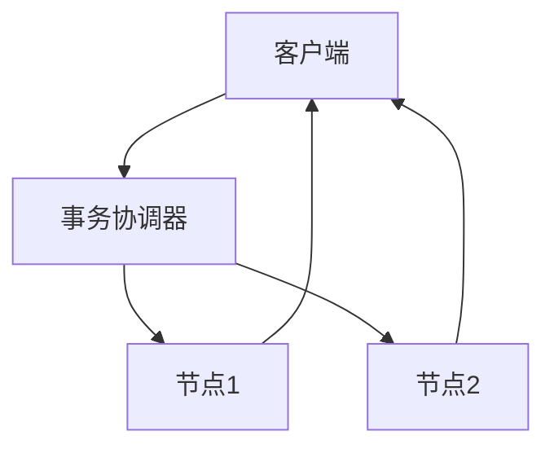

# 1.4.1 形式模型

## 1.4.1.1 关系模型与分布式扩展

- 兼容传统关系模型，支持SQL。
- 分布式表、分区表、全局索引。

## 1.4.1.2 一致性协议

- 常用协议：Paxos、Raft、2PC、3PC。
- 保证分布式事务的强一致性。

| 协议 | 特点 | 典型系统 |
|------|------|----------|
| Paxos | 容错性强，复杂 | TiDB、CockroachDB |
| Raft  | 易实现，强一致 | TiDB、YugabyteDB |
| 2PC   | 两阶段提交 | OceanBase |
| 3PC   | 三阶段提交 | NewSQL部分实现 |

## 1.4.1.3 行业案例与多表征

### 金融行业：分布式事务一致性



### 互联网行业：全局索引

- 见[3.5.7-数据存储与访问](../../3-数据模型与算法/3.5-数据分析与ETL/3.5.7-数据存储与访问.md)

### Latex公式

$$
\text{Commit}_{2PC} = \text{Prepare} + \text{Commit}
$$

### SQL分布式表示例

```sql
CREATE TABLE user (
  id BIGINT PRIMARY KEY,
  name VARCHAR(100)
) PARTITION BY HASH(id);
```

[返回NewSQL导航](README.md)
