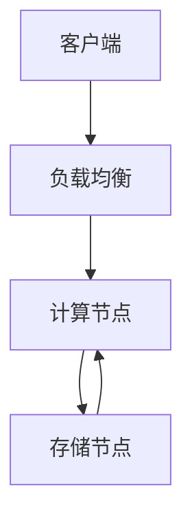

# 1.4.2 系统架构

## 1.4.2.1 云原生架构

- 支持容器化、弹性扩展、自动运维。
- 典型架构：TiDB、CockroachDB、YugabyteDB。

## 1.4.2.2 计算与存储分离

- 计算节点与存储节点独立扩展。
- 提升资源利用率与弹性。

| 架构特性 | 说明 | 典型系统 |
|----------|------|----------|
| 云原生   | 容器化、自动化 | TiDB、CockroachDB |
| 计算存储分离 | 独立扩展 | OceanBase、TiDB |
| 多副本   | 容错高可用 | CockroachDB |

## 1.4.2.3 行业案例与多表征

### 金融行业：多副本高可用架构



### 互联网行业：弹性扩展

- 见[4.3.1-微服务架构基础理论](../../4-软件架构与工程/4.3-微服务架构/4.3.1-微服务架构基础理论.md)

### Latex公式

$$
Availability = 1 - (1 - p)^n
$$

### 配置示例

```yaml
replicas: 3
storageClass: fast
```

[返回NewSQL导航](README.md)
