# 1.4.2 NewSQL系统架构

## 📑 目录

- [1.4.2 NewSQL系统架构](#142-newsql系统架构)
  - [📑 目录](#-目录)
  - [1. 概述](#1-概述)
    - [1.1. 系统架构定义](#11-系统架构定义)
    - [1.2. NewSQL架构特点](#12-newsql架构特点)
  - [2. 云原生架构](#2-云原生架构)
    - [2.1. 云原生定义](#21-云原生定义)
    - [2.2. 容器化架构](#22-容器化架构)
      - [2.2.1. 容器化优势](#221-容器化优势)
      - [2.2.2. Kubernetes架构](#222-kubernetes架构)
    - [2.3. 弹性扩展](#23-弹性扩展)
      - [2.3.1. 水平扩展](#231-水平扩展)
      - [2.3.2. 自动扩缩容](#232-自动扩缩容)
    - [2.4. 自动运维](#24-自动运维)
      - [2.4.1. 自动化运维](#241-自动化运维)
  - [3. 计算与存储分离](#3-计算与存储分离)
    - [3.1. 分离架构](#31-分离架构)
      - [3.1.1. 架构设计](#311-架构设计)
      - [3.1.2. 分离优势](#312-分离优势)
    - [3.2. 独立扩展](#32-独立扩展)
      - [3.2.1. 计算层扩展](#321-计算层扩展)
      - [3.2.2. 存储层扩展](#322-存储层扩展)
    - [3.3. 资源优化](#33-资源优化)
      - [3.3.1. 资源分配](#331-资源分配)
  - [4. 分布式架构模式](#4-分布式架构模式)
    - [4.1. 共享存储架构](#41-共享存储架构)
      - [4.1.1. 架构特点](#411-架构特点)
    - [4.2. 共享无架构](#42-共享无架构)
      - [4.2.1. 架构特点](#421-架构特点)
    - [4.3. 混合架构](#43-混合架构)
      - [4.3.1. 架构特点](#431-架构特点)
  - [5. 高可用架构](#5-高可用架构)
    - [5.1. 多副本架构](#51-多副本架构)
      - [5.1.1. 副本策略](#511-副本策略)
    - [5.2. 故障转移](#52-故障转移)
      - [5.2.1. 自动故障转移](#521-自动故障转移)
    - [5.3. 数据复制](#53-数据复制)
      - [5.3.1. 复制策略](#531-复制策略)
  - [6. 实际系统架构](#6-实际系统架构)
    - [6.1. TiDB架构](#61-tidb架构)
      - [6.1.1. 架构组件](#611-架构组件)
      - [6.1.2. 数据流](#612-数据流)
    - [6.2. CockroachDB架构](#62-cockroachdb架构)
      - [6.2.1. 架构特点](#621-架构特点)
    - [6.3. OceanBase架构](#63-oceanbase架构)
      - [6.3.1. 架构特点](#631-架构特点)
    - [6.4. YugabyteDB架构](#64-yugabytedb架构)
      - [6.4.1. 架构特点](#641-架构特点)
  - [7. 架构设计原则](#7-架构设计原则)
    - [7.1. 可扩展性](#71-可扩展性)
      - [7.1.1. 水平扩展](#711-水平扩展)
    - [7.2. 高可用性](#72-高可用性)
      - [7.2.1. 高可用设计](#721-高可用设计)
    - [7.3. 性能优化](#73-性能优化)
      - [7.3.1. 性能设计](#731-性能设计)
  - [8. 形式化定义](#8-形式化定义)
    - [8.1. 系统架构形式化](#81-系统架构形式化)
  - [9. 多表征](#9-多表征)
  - [10. 总结与展望](#10-总结与展望)
    - [10.1. 总结](#101-总结)
    - [10.2. 发展趋势](#102-发展趋势)

---

## 1. 概述

### 1.1. 系统架构定义

**系统架构**是系统各组件的组织结构、相互关系以及设计原则。

**NewSQL系统架构的核心要素**：

1. **计算层**：SQL解析、查询优化、事务处理
2. **存储层**：数据存储、索引管理、持久化
3. **元数据层**：元数据管理、路由信息、配置管理
4. **协调层**：一致性协议、事务协调、负载均衡

### 1.2. NewSQL架构特点

**NewSQL架构特点**：

1. **分布式**：多节点分布式部署
2. **可扩展**：水平扩展能力
3. **高可用**：自动故障恢复
4. **云原生**：容器化、自动化运维

---

## 2. 云原生架构

### 2.1. 云原生定义

**云原生（Cloud Native）**是一种构建和运行应用程序的方法，充分利用云计算的优势。

**云原生特征**：

1. **容器化**：使用容器打包应用
2. **微服务**：应用拆分为微服务
3. **动态编排**：使用编排系统管理
4. **DevOps**：持续集成和部署

### 2.2. 容器化架构

#### 2.2.1. 容器化优势

**容器化的优势**：

1. **环境一致性**：开发、测试、生产环境一致
2. **快速部署**：秒级启动和停止
3. **资源隔离**：进程级资源隔离
4. **易于扩展**：水平扩展简单

**容器化架构**：

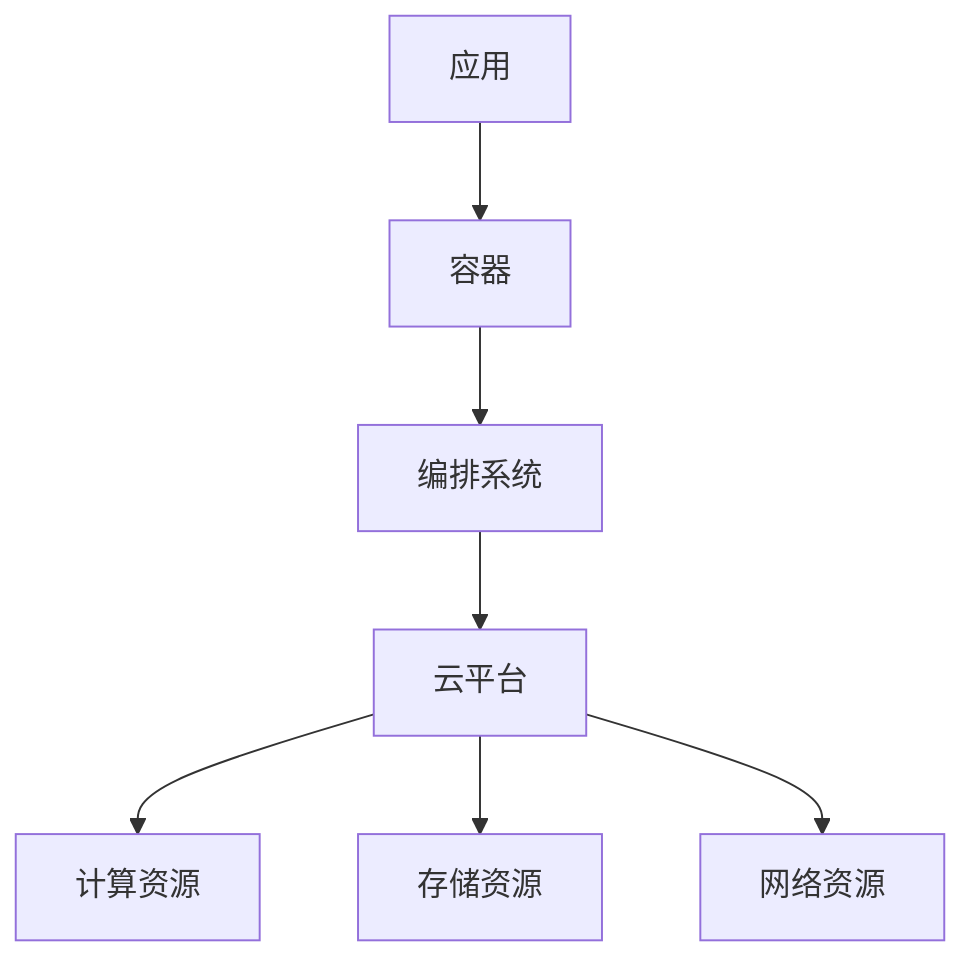

#### 2.2.2. Kubernetes架构

**Kubernetes组件**：

1. **Master节点**：
   - API Server：API服务
   - Scheduler：调度器
   - Controller Manager：控制器管理器
   - etcd：元数据存储

2. **Node节点**：
   - Kubelet：节点代理
   - Kube Proxy：网络代理
   - Container Runtime：容器运行时

**Kubernetes架构图**：

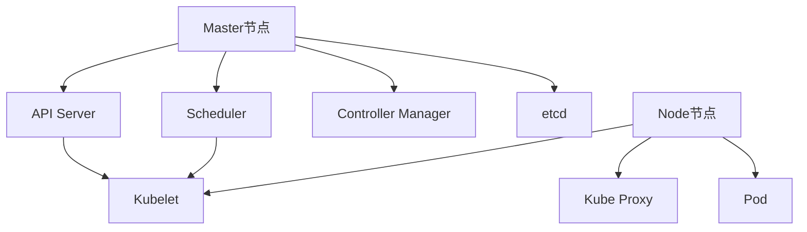

### 2.3. 弹性扩展

#### 2.3.1. 水平扩展

**水平扩展（Horizontal Scaling）**：通过增加节点数量扩展系统。

**扩展公式**：

$$\text{Capacity} = n \times \text{NodeCapacity}$$

其中 $n$ 是节点数量。

**扩展示例**：

```yaml
# 扩展TiDB集群
apiVersion: apps/v1
kind: StatefulSet
metadata:
  name: tidb-cluster
spec:
  replicas: 5  # 从3个扩展到5个
```

#### 2.3.2. 自动扩缩容

**HPA（Horizontal Pod Autoscaler）配置**：

```yaml
apiVersion: autoscaling/v2
kind: HorizontalPodAutoscaler
metadata:
  name: tidb-hpa
spec:
  scaleTargetRef:
    apiVersion: apps/v1
    kind: StatefulSet
    name: tidb-cluster
  minReplicas: 2
  maxReplicas: 10
  metrics:
  - type: Resource
    resource:
      name: cpu
      target:
        type: Utilization
        averageUtilization: 70
```

### 2.4. 自动运维

#### 2.4.1. 自动化运维

**自动化运维功能**：

1. **自动部署**：CI/CD自动部署
2. **自动监控**：自动监控和告警
3. **自动恢复**：自动故障恢复
4. **自动升级**：滚动升级

**运维自动化流程**：

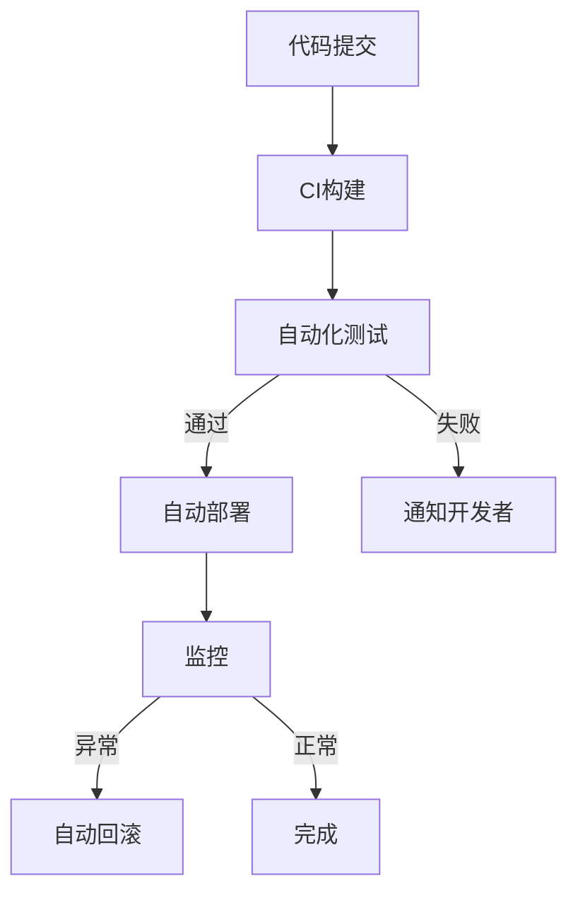

---

## 3. 计算与存储分离

### 3.1. 分离架构

#### 3.1.1. 架构设计

**计算与存储分离**：计算节点和存储节点独立部署和管理。

**分离架构图**：

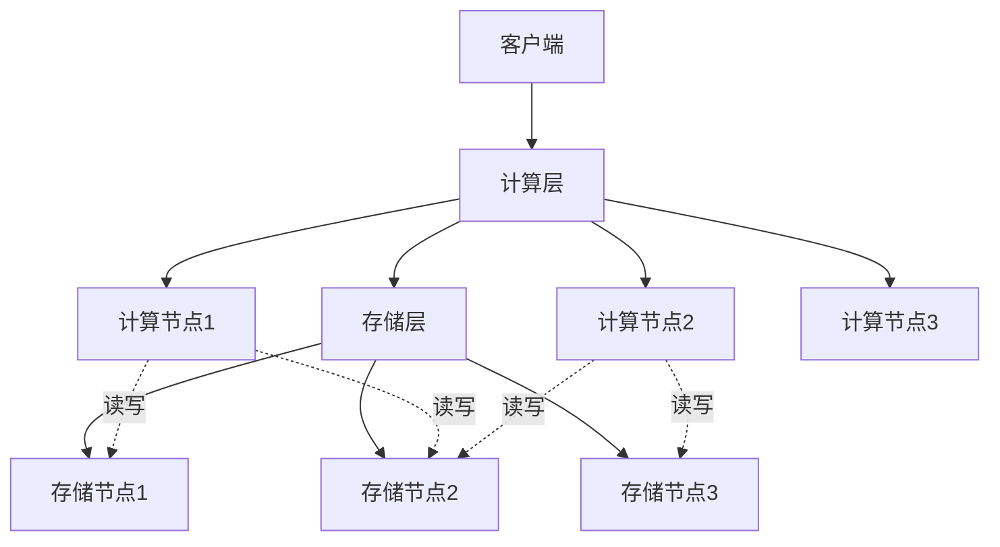

#### 3.1.2. 分离优势

**分离架构的优势**：

1. **独立扩展**：计算和存储独立扩展
2. **资源优化**：按需分配资源
3. **成本优化**：降低总体成本
4. **灵活性**：更灵活的部署方式

### 3.2. 独立扩展

#### 3.2.1. 计算层扩展

**计算层扩展**：

- **无状态**：计算节点无状态，易于扩展
- **负载均衡**：通过负载均衡分发请求
- **弹性伸缩**：根据负载自动伸缩

**扩展示例**：

```yaml
# 扩展计算节点
apiVersion: apps/v1
kind: Deployment
metadata:
  name: tidb-compute
spec:
  replicas: 5  # 扩展到5个计算节点
  template:
    spec:
      containers:
      - name: tidb
        image: pingcap/tidb:latest
```

#### 3.2.2. 存储层扩展

**存储层扩展**：

- **数据分片**：数据分片到多个存储节点
- **副本管理**：管理数据副本
- **容量扩展**：增加存储容量

**扩展示例**：

```yaml
# 扩展存储节点
apiVersion: apps/v1
kind: StatefulSet
metadata:
  name: tikv-storage
spec:
  replicas: 6  # 扩展到6个存储节点
  template:
    spec:
      containers:
      - name: tikv
        image: pingcap/tikv:latest
```

### 3.3. 资源优化

#### 3.3.1. 资源分配

**资源分配策略**：

- **计算密集型**：分配更多CPU资源
- **存储密集型**：分配更多存储资源
- **网络密集型**：优化网络配置

**资源配置**：

```yaml
# 计算节点资源配置
resources:
  requests:
    cpu: 2000m
    memory: 4Gi
  limits:
    cpu: 4000m
    memory: 8Gi

# 存储节点资源配置
resources:
  requests:
    cpu: 1000m
    memory: 8Gi
    storage: 500Gi
  limits:
    cpu: 2000m
    memory: 16Gi
```

---

## 4. 分布式架构模式

### 4.1. 共享存储架构

#### 4.1.1. 架构特点

**共享存储架构**：多个计算节点共享同一存储系统。

**架构图**：

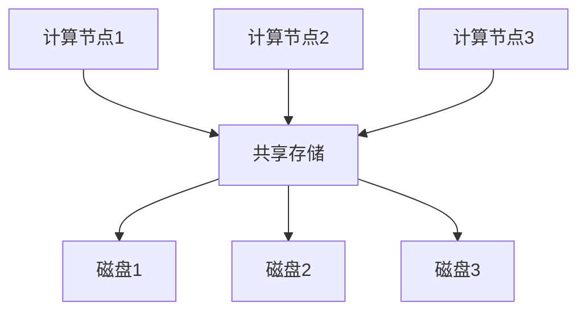

**优势**：

- 数据一致性容易保证
- 存储管理简单
- 适合读多写少场景

**劣势**：

- 存储可能成为瓶颈
- 扩展性受限

### 4.2. 共享无架构

#### 4.2.1. 架构特点

**共享无架构（Shared-Nothing）**：每个节点独立存储和处理。

**架构图**：

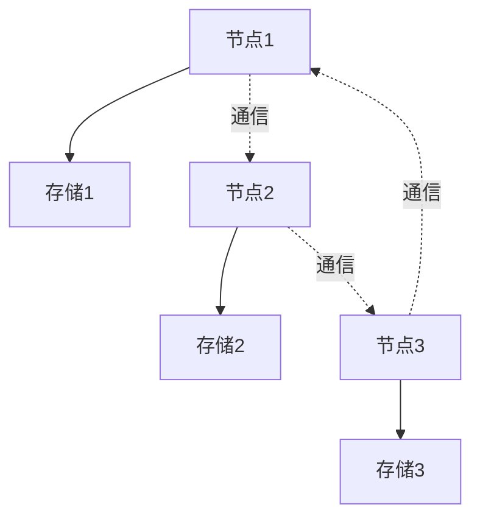

**优势**：

- 扩展性好
- 无单点故障
- 性能高

**劣势**：

- 数据一致性复杂
- 跨节点查询性能差

### 4.3. 混合架构

#### 4.3.1. 架构特点

**混合架构**：结合共享存储和共享无架构的优势。

**架构图**：

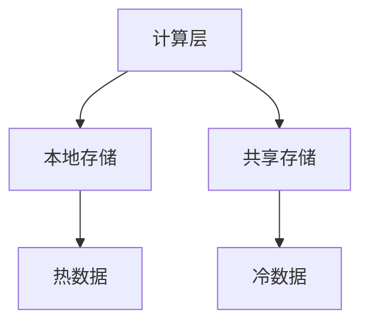

**优势**：

- 兼顾性能和一致性
- 灵活的存储策略
- 成本优化

---

## 5. 高可用架构

### 5.1. 多副本架构

#### 5.1.1. 副本策略

**多副本架构**：数据在多个节点上保存副本。

**副本架构图**：

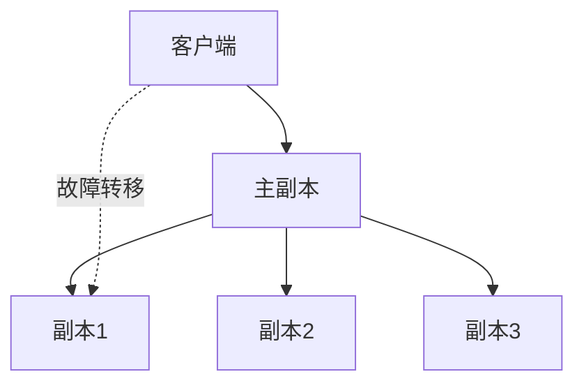

**副本数量**：

通常使用3个或5个副本，保证在部分节点故障时系统仍可用。

**可用性计算**：

$$Availability = 1 - (1 - p)^n$$

其中 $p$ 是单节点可用性，$n$ 是副本数量。

### 5.2. 故障转移

#### 5.2.1. 自动故障转移

**故障转移流程**：

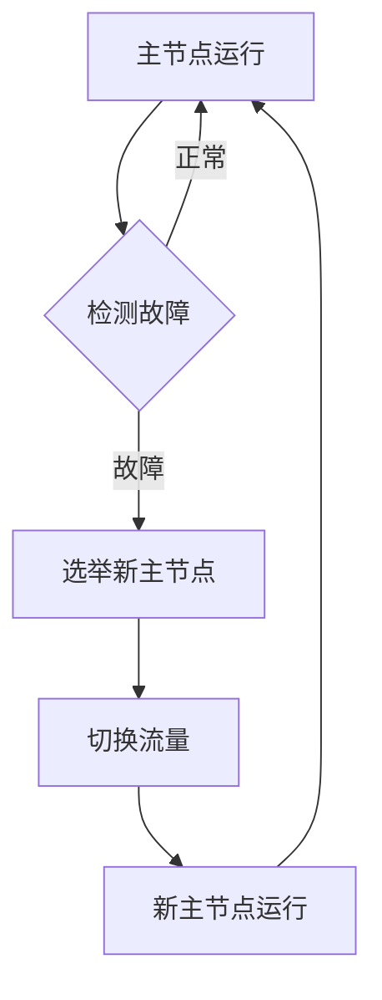

**故障检测**：

- **心跳检测**：定期发送心跳
- **超时检测**：超时未响应视为故障
- **健康检查**：检查节点健康状态

### 5.3. 数据复制

#### 5.3.1. 复制策略

**同步复制**：

- 主节点等待所有副本确认后才返回
- 强一致性保证
- 延迟较高

**异步复制**：

- 主节点不等待副本确认
- 延迟低
- 可能丢失数据

**半同步复制**：

- 主节点等待至少一个副本确认
- 平衡一致性和性能

---

## 6. 实际系统架构

### 6.1. TiDB架构

#### 6.1.1. 架构组件

**TiDB架构**：

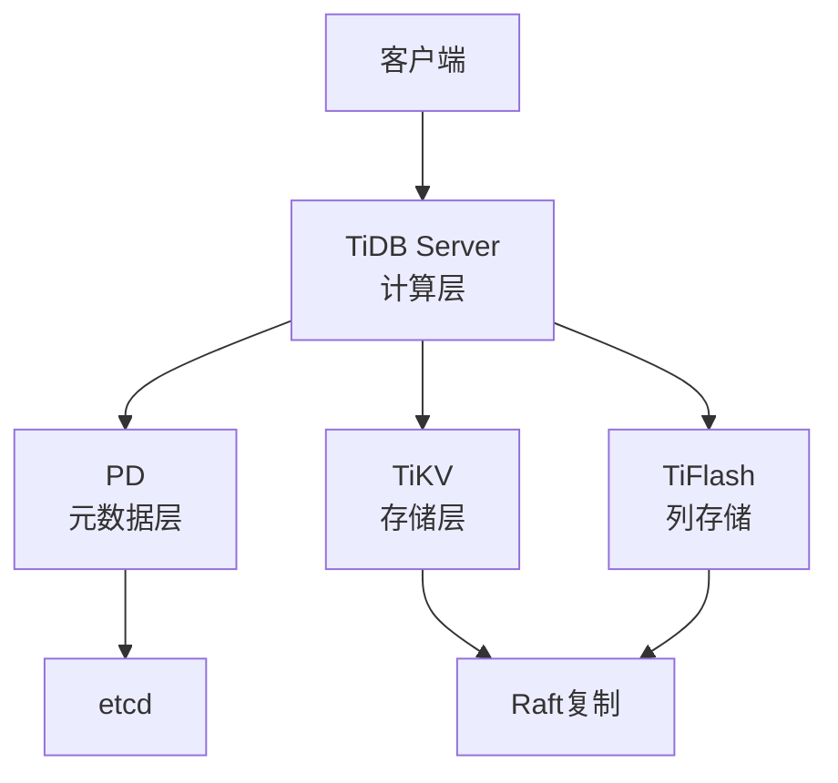

**组件说明**：

1. **TiDB Server**：无状态计算节点，处理SQL请求
2. **PD（Placement Driver）**：元数据管理，使用Raft
3. **TiKV**：分布式键值存储，使用Raft
4. **TiFlash**：列存储引擎，用于分析查询

#### 6.1.2. 数据流

**查询流程**：

1. 客户端发送SQL请求到TiDB Server
2. TiDB Server解析SQL，生成执行计划
3. TiDB Server从PD获取路由信息
4. TiDB Server向TiKV发送数据请求
5. TiKV返回数据给TiDB Server
6. TiDB Server处理数据，返回结果

### 6.2. CockroachDB架构

#### 6.2.1. 架构特点

**CockroachDB架构**：

- **对等架构**：所有节点对等
- **Raft一致性**：使用Raft保证一致性
- **多区域部署**：支持多区域部署

**架构图**：

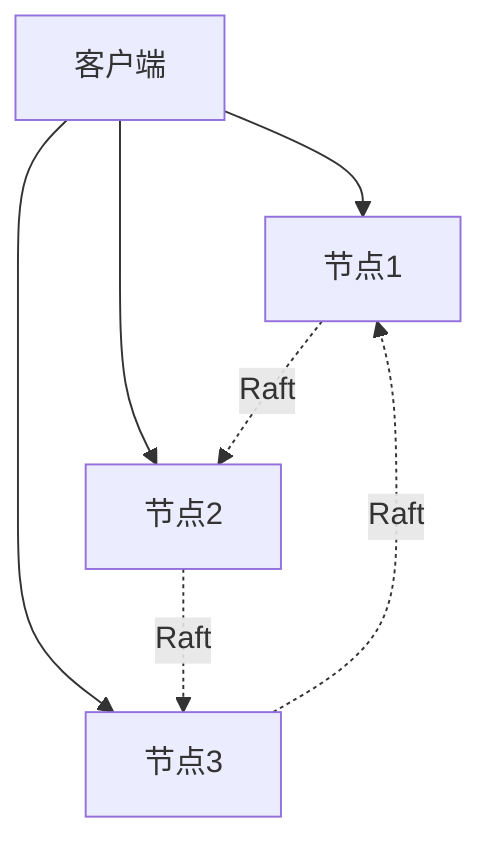

### 6.3. OceanBase架构

#### 6.3.1. 架构特点

**OceanBase架构**：

- **计算存储分离**：计算节点和存储节点分离
- **Paxos一致性**：使用Paxos保证一致性
- **多租户**：支持多租户架构

**架构图**：

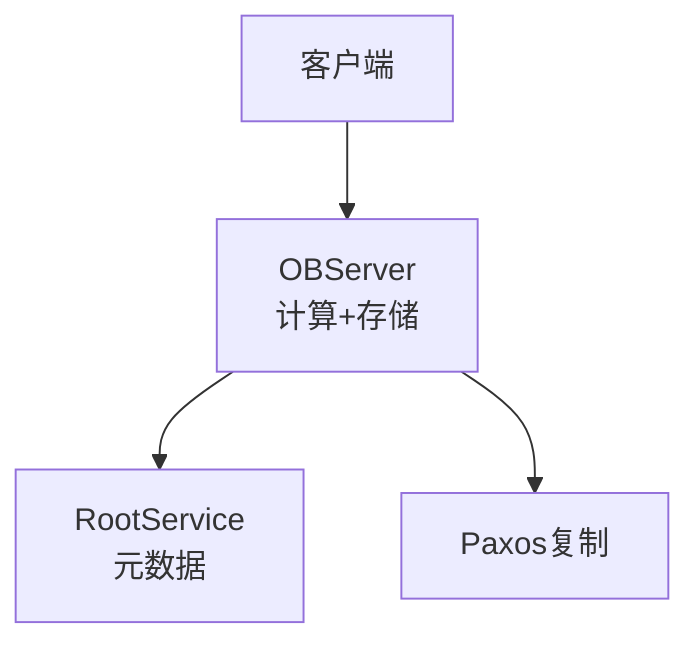

### 6.4. YugabyteDB架构

#### 6.4.1. 架构特点

**YugabyteDB架构**：

- **分布式PostgreSQL**：兼容PostgreSQL
- **Raft一致性**：使用Raft保证一致性
- **多模型支持**：支持关系型和文档型

---

## 7. 架构设计原则

### 7.1. 可扩展性

#### 7.1.1. 水平扩展

**水平扩展原则**：

1. **无状态设计**：计算节点无状态
2. **数据分片**：数据分片到多个节点
3. **负载均衡**：均匀分配负载

### 7.2. 高可用性

#### 7.2.1. 高可用设计

**高可用原则**：

1. **多副本**：数据多副本存储
2. **故障检测**：快速故障检测
3. **自动恢复**：自动故障恢复

### 7.3. 性能优化

#### 7.3.1. 性能设计

**性能优化原则**：

1. **本地化**：数据本地化访问
2. **缓存**：多级缓存
3. **并行处理**：并行查询处理

---

## 8. 形式化定义

### 8.1. 系统架构形式化

**系统架构定义**：

设NewSQL系统为 $S = (C, M, D, N)$，其中：

- $C$：计算节点集合
- $M$：元数据节点集合
- $D$：数据节点集合
- $N$：网络拓扑

**可用性定义**：

$$Availability(S) = \prod_{i=1}^{n} Availability(N_i)$$

其中 $N_i$ 是系统组件。

---

## 9. 多表征

本主题支持多种表征方式：

1. **符号表征**：形式化定义、数学公式
2. **图结构**：架构图、组件图、部署图
3. **代码实现**：配置代码、部署脚本
4. **自然语言**：概念定义、设计原则
5. **可视化**：架构可视化、监控面板

---

## 10. 总结与展望

### 10.1. 总结

NewSQL系统架构的核心要点：

1. **云原生**：容器化、弹性扩展、自动运维
2. **计算存储分离**：独立扩展、资源优化
3. **分布式架构**：共享存储、共享无、混合架构
4. **高可用**：多副本、故障转移、数据复制

### 10.2. 发展趋势

**未来发展方向**：

1. **Serverless架构**：无服务器架构
2. **边缘计算**：边缘部署
3. **AI驱动**：AI驱动的自动化运维
4. **混合云**：混合云部署

---

**参考文献**：

1. TiDB Architecture: <https://docs.pingcap.com/tidb/stable/architecture-overview>
2. CockroachDB Architecture: <https://www.cockroachlabs.com/docs/stable/architecture/overview>
3. OceanBase Architecture: <https://en.oceanbase.com/docs/>

---

[返回NewSQL导航](README.md)
