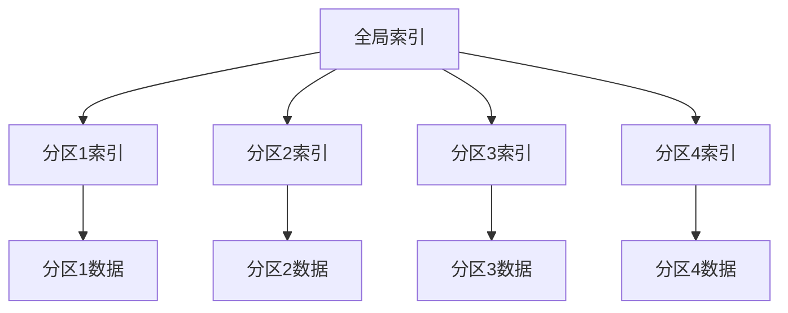
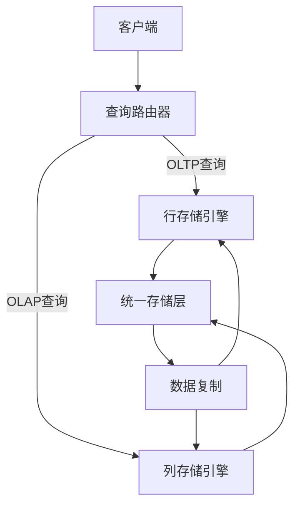

# 1.4.3 NewSQL数据模型

## 📑 目录

- [1.4.3 NewSQL数据模型](#143-newsql数据模型)
  - [📑 目录](#-目录)
  - [1. 概述](#1-概述)
    - [1.1. 定义与背景](#11-定义与背景)
    - [1.2. 数据模型特点](#12-数据模型特点)
    - [1.3. 与传统数据库的对比](#13-与传统数据库的对比)
  - [2. 关系模型与分布式扩展](#2-关系模型与分布式扩展)
    - [2.1. 关系模型基础](#21-关系模型基础)
    - [2.2. 分布式扩展](#22-分布式扩展)
    - [2.3. 兼容性保证](#23-兼容性保证)
  - [3. 分布式表设计](#3-分布式表设计)
    - [3.1. 分区策略](#31-分区策略)
      - [3.1.1. 哈希分区（Hash Partitioning）](#311-哈希分区hash-partitioning)
      - [3.1.2. 范围分区（Range Partitioning）](#312-范围分区range-partitioning)
      - [3.1.3. 列表分区（List Partitioning）](#313-列表分区list-partitioning)
    - [3.2. 分片键选择](#32-分片键选择)
    - [3.3. 分布式主键](#33-分布式主键)
      - [3.3.1. 自增ID](#331-自增id)
      - [3.3.2. UUID](#332-uuid)
      - [3.3.3. Snowflake ID](#333-snowflake-id)
    - [3.4. 全局唯一ID生成](#34-全局唯一id生成)
      - [3.4.1. 数据库序列](#341-数据库序列)
      - [3.4.2. 分布式ID生成器](#342-分布式id生成器)
      - [3.4.3. 基于Raft的ID生成](#343-基于raft的id生成)
  - [4. 索引系统](#4-索引系统)
    - [4.1. 全局索引](#41-全局索引)
    - [4.2. 局部索引](#42-局部索引)
    - [4.3. 二级索引](#43-二级索引)
    - [4.4. 索引维护与优化](#44-索引维护与优化)
  - [5. 混合存储模型](#5-混合存储模型)
    - [5.1. 行存储（Row Store）](#51-行存储row-store)
    - [5.2. 列存储（Column Store）](#52-列存储column-store)
    - [5.3. 混合存储架构](#53-混合存储架构)
  - [6. 数据分布与复制](#6-数据分布与复制)
    - [6.1. 数据分布策略](#61-数据分布策略)
      - [6.1.1. 一致性哈希](#611-一致性哈希)
      - [6.1.2. 范围分片](#612-范围分片)
    - [6.2. 副本管理](#62-副本管理)
    - [6.3. 数据一致性](#63-数据一致性)
  - [7. 实际系统实现](#7-实际系统实现)
    - [7.1. TiDB的数据模型](#71-tidb的数据模型)
    - [7.2. CockroachDB的数据模型](#72-cockroachdb的数据模型)
    - [7.3. OceanBase的数据模型](#73-oceanbase的数据模型)
    - [7.4. YugabyteDB的数据模型](#74-yugabytedb的数据模型)
  - [8. 数据建模最佳实践](#8-数据建模最佳实践)
    - [8.1. 表设计原则](#81-表设计原则)
    - [8.2. 分区设计](#82-分区设计)
    - [8.3. 索引设计](#83-索引设计)
    - [8.4. 性能优化](#84-性能优化)
  - [9. 形式化定义](#9-形式化定义)
    - [9.1. 分布式关系模型](#91-分布式关系模型)
    - [9.2. 索引结构](#92-索引结构)
  - [10. 多表征](#10-多表征)
  - [11. 总结与展望](#11-总结与展望)
    - [11.1. 总结](#111-总结)
    - [11.2. 发展趋势](#112-发展趋势)
    - [11.3. 挑战与机遇](#113-挑战与机遇)

---

## 1. 概述

### 1.1. 定义与背景

**NewSQL数据模型**是在传统关系模型基础上，为支持分布式、高可用、高性能而扩展的数据模型。它保持了SQL的兼容性和ACID特性，同时提供了水平扩展能力。

**核心特征**：

1. **关系模型兼容**：完全兼容SQL标准
2. **分布式扩展**：支持水平分片和分区
3. **混合存储**：支持行存储和列存储
4. **全局一致性**：保证分布式环境下的数据一致性

**形式化定义**：

设NewSQL数据模型为 $M = (R, P, I, S)$，其中：

- $R$：关系集合（Relations）
- $P$：分区函数（Partition Function）
- $I$：索引集合（Indexes）
- $S$：存储引擎（Storage Engine）

对于关系 $r \in R$，分区函数 $P: r \to \{p_1, p_2, \ldots, p_n\}$ 将关系映射到 $n$ 个分区。

### 1.2. 数据模型特点

**NewSQL数据模型的主要特点**：

1. **水平分区**：
   - 数据按分片键分布到多个节点
   - 支持范围分区、哈希分区、列表分区

2. **全局索引**：
   - 跨分区的索引结构
   - 保证全局唯一性和查询性能

3. **混合存储**：
   - 行存储用于OLTP工作负载
   - 列存储用于OLAP工作负载
   - HTAP系统支持混合存储

4. **自动分片**：
   - 自动数据分布和负载均衡
   - 动态添加和删除节点

### 1.3. 与传统数据库的对比

| 特性 | 传统关系数据库 | NewSQL数据库 |
|------|---------------|-------------|
| **扩展性** | 垂直扩展 | 水平扩展 |
| **分区** | 手动分区 | 自动分区 |
| **一致性** | 强一致性 | 可配置一致性 |
| **存储** | 行存储 | 行存储+列存储 |
| **索引** | 本地索引 | 全局索引+本地索引 |
| **SQL兼容** | 完全兼容 | 高度兼容 |

---

## 2. 关系模型与分布式扩展

### 2.1. 关系模型基础

**关系模型的核心概念**：

1. **关系（Relation）**：二维表结构
2. **元组（Tuple）**：表中的行
3. **属性（Attribute）**：表中的列
4. **域（Domain）**：属性的取值范围

**形式化定义**：

关系 $r$ 是域 $D_1, D_2, \ldots, D_n$ 的笛卡尔积的子集：

$$r \subseteq D_1 \times D_2 \times \cdots \times D_n$$

**关系模式**：

关系模式 $R(A_1, A_2, \ldots, A_n)$ 定义了关系的结构，其中 $A_i$ 是属性名。

### 2.2. 分布式扩展

**分布式关系模型**：

在分布式环境中，关系 $r$ 被划分为多个分区：

$$r = r_1 \cup r_2 \cup \cdots \cup r_n$$

其中 $r_i$ 是第 $i$ 个分区，满足：

$$\forall i \neq j: r_i \cap r_j = \emptyset$$

**分区函数**：

分区函数 $P: \text{Domain}(K) \to \{1, 2, \ldots, n\}$ 将分片键 $K$ 的值映射到分区编号。

**常见分区函数**：

1. **哈希分区**：
   $$P(k) = \text{hash}(k) \bmod n$$

2. **范围分区**：
   $$P(k) = \begin{cases}
   1 & \text{if } k < t_1 \\
   2 & \text{if } t_1 \leq k < t_2 \\
   \vdots \\
   n & \text{if } k \geq t_{n-1}
   \end{cases}$$

3. **列表分区**：
   $$P(k) = \begin{cases}
   1 & \text{if } k \in L_1 \\
   2 & \text{if } k \in L_2 \\
   \vdots \\
   n & \text{if } k \in L_n
   \end{cases}$$

### 2.3. 兼容性保证

**SQL兼容性**：

NewSQL系统保证：

1. **语法兼容**：支持标准SQL语法
2. **语义兼容**：SQL语义与标准一致
3. **功能兼容**：支持大部分SQL功能

**兼容性级别**：

- **完全兼容**：所有SQL功能都支持
- **高度兼容**：大部分SQL功能支持，部分扩展
- **部分兼容**：核心SQL功能支持

---

## 3. 分布式表设计

### 3.1. 分区策略

**分区策略的选择**：

#### 3.1.1. 哈希分区（Hash Partitioning）

**特点**：

- 数据均匀分布
- 适合点查询
- 不适合范围查询

**实现**：

```sql
-- TiDB哈希分区
CREATE TABLE users (
    id BIGINT PRIMARY KEY,
    name VARCHAR(100),
    email VARCHAR(100)
) PARTITION BY HASH(id) PARTITIONS 4;
```

**数学表示**：

$$P(k) = \text{hash}(k) \bmod n$$

其中 $n$ 是分区数。

#### 3.1.2. 范围分区（Range Partitioning）

**特点**：

- 适合范围查询
- 数据可能不均匀
- 支持分区裁剪

**实现**：

```sql
-- TiDB范围分区
CREATE TABLE orders (
    id BIGINT PRIMARY KEY,
    user_id BIGINT,
    order_date DATE,
    amount DECIMAL(10,2)
) PARTITION BY RANGE (YEAR(order_date)) (
    PARTITION p2020 VALUES LESS THAN (2021),
    PARTITION p2021 VALUES LESS THAN (2022),
    PARTITION p2022 VALUES LESS THAN (2023),
    PARTITION p2023 VALUES LESS THAN (2024),
    PARTITION p2024 VALUES LESS THAN (2025)
);
```

**数学表示**：

$$P(k) = \min\{i: k < t_i\}$$

其中 $t_i$ 是分区边界值。

#### 3.1.3. 列表分区（List Partitioning）

**特点**：

- 按离散值分区
- 适合分类数据
- 分区数量有限

**实现**：

```sql
-- CockroachDB列表分区（通过应用层实现）
CREATE TABLE products (
    id BIGINT PRIMARY KEY,
    category VARCHAR(50),
    name VARCHAR(100),
    price DECIMAL(10,2)
);

-- 通过应用层路由到不同表
CREATE TABLE products_electronics (...) LIKE products;
CREATE TABLE products_clothing (...) LIKE products;
```

### 3.2. 分片键选择

**分片键选择原则**：

1. **均匀分布**：数据均匀分布到各分区
2. **查询模式**：匹配主要查询模式
3. **避免热点**：避免单分区成为热点
4. **JOIN优化**：相关数据尽量在同一分区

**分片键选择示例**：

```sql
-- 用户表：使用用户ID作为分片键
CREATE TABLE users (
    id BIGINT PRIMARY KEY,  -- 分片键
    name VARCHAR(100),
    email VARCHAR(100)
) PARTITION BY HASH(id);

-- 订单表：使用用户ID作为分片键（与用户表共分区）
CREATE TABLE orders (
    id BIGINT PRIMARY KEY,
    user_id BIGINT,  -- 分片键，与users.id共分区
    order_date DATE,
    amount DECIMAL(10,2)
) PARTITION BY HASH(user_id);

-- 这样用户和订单可以在同一分区，减少跨分区JOIN
```

**分片键选择错误示例**：

```sql
-- ❌ 错误：使用时间戳作为分片键
CREATE TABLE events (
    id BIGINT PRIMARY KEY,
    timestamp TIMESTAMP,  -- 所有新数据都写入最后一个分区
    event_type VARCHAR(50),
    data JSONB
) PARTITION BY HASH(timestamp);

-- ✅ 正确：使用事件ID或组合键
CREATE TABLE events (
    id BIGINT PRIMARY KEY,  -- 分片键
    timestamp TIMESTAMP,
    event_type VARCHAR(50),
    data JSONB
) PARTITION BY HASH(id);
```

### 3.3. 分布式主键

**分布式主键的特点**：

1. **全局唯一**：跨所有分区唯一
2. **有序性**：可能有序或无序
3. **性能**：生成效率高

**主键生成策略**：

#### 3.3.1. 自增ID

**特点**：

- 简单易用
- 需要中心化生成器
- 可能成为瓶颈

**实现**：

```sql
-- TiDB自增ID
CREATE TABLE users (
    id BIGINT PRIMARY KEY AUTO_INCREMENT,
    name VARCHAR(100)
);
```

#### 3.3.2. UUID

**特点**：

- 全局唯一
- 无序
- 存储空间大

**实现**：

```sql
-- CockroachDB UUID
CREATE TABLE users (
    id UUID PRIMARY KEY DEFAULT gen_random_uuid(),
    name VARCHAR(100)
);
```

#### 3.3.3. Snowflake ID

**特点**：

- 全局唯一
- 大致有序
- 包含时间信息

**实现**：

```python
# Snowflake ID生成器
import time

class SnowflakeGenerator:
    def __init__(self, datacenter_id, worker_id):
        self.datacenter_id = datacenter_id
        self.worker_id = worker_id
        self.sequence = 0
        self.last_timestamp = -1

    def generate(self):
        timestamp = int(time.time() * 1000)

        if timestamp < self.last_timestamp:
            raise ValueError("Clock moved backwards")

        if timestamp == self.last_timestamp:
            self.sequence = (self.sequence + 1) & 0xFFF
            if self.sequence == 0:
                timestamp = self.wait_next_millis(self.last_timestamp)
        else:
            self.sequence = 0

        self.last_timestamp = timestamp

        return ((timestamp - 1288834974657) << 22) | \
               (self.datacenter_id << 17) | \
               (self.worker_id << 12) | \
               self.sequence
```

### 3.4. 全局唯一ID生成

**全局唯一ID生成方案**：

#### 3.4.1. 数据库序列

```sql
-- PostgreSQL序列
CREATE SEQUENCE global_id_seq;

CREATE TABLE users (
    id BIGINT PRIMARY KEY DEFAULT nextval('global_id_seq'),
    name VARCHAR(100)
);
```

#### 3.4.2. 分布式ID生成器

```go
// 分布式ID生成器（Go实现）
type IDGenerator struct {
    nodeID    int64
    sequence  int64
    lastTime  int64
    mutex     sync.Mutex
}

func (g *IDGenerator) Generate() int64 {
    g.mutex.Lock()
    defer g.mutex.Unlock()

    now := time.Now().UnixMilli()

    if now == g.lastTime {
        g.sequence = (g.sequence + 1) & 0xFFF
        if g.sequence == 0 {
            now = g.waitNextMillis(g.lastTime)
        }
    } else {
        g.sequence = 0
    }

    g.lastTime = now

    return (now << 22) | (g.nodeID << 12) | g.sequence
}
```

#### 3.4.3. 基于Raft的ID生成

```rust
// 基于Raft的ID生成器
struct RaftIDGenerator {
    raft: RaftNode,
    current_id: u64,
}

impl RaftIDGenerator {
    fn generate(&mut self) -> Result<u64, Error> {
        // 通过Raft共识分配ID范围
        let range = self.raft.allocate_id_range(1000)?;
        self.current_id = range.start;
        Ok(self.current_id)
    }

    fn next(&mut self) -> Result<u64, Error> {
        if self.current_id >= self.range.end {
            self.generate()?;
        }
        let id = self.current_id;
        self.current_id += 1;
        Ok(id)
    }
}
```

---

## 4. 索引系统

### 4.1. 全局索引

**全局索引的特点**：

1. **跨分区**：索引数据分布在多个分区
2. **全局唯一**：保证全局唯一性约束
3. **查询优化**：支持跨分区查询优化

**全局索引结构**：



**全局索引实现**：

```sql
-- TiDB全局索引
CREATE TABLE users (
    id BIGINT PRIMARY KEY,
    email VARCHAR(100),
    name VARCHAR(100)
) PARTITION BY HASH(id) PARTITIONS 4;

-- 全局唯一索引
CREATE UNIQUE INDEX idx_email ON users(email);

-- 查询时自动路由到对应分区
SELECT * FROM users WHERE email = 'user@example.com';
```

**全局索引的维护**：

1. **写入时更新**：插入/更新/删除时更新索引
2. **异步维护**：后台异步构建和维护
3. **一致性保证**：通过分布式事务保证一致性

### 4.2. 局部索引

**局部索引的特点**：

1. **分区内**：索引只覆盖单个分区
2. **性能高**：查询和更新性能好
3. **存储效率**：索引数据不重复

**局部索引实现**：

```sql
-- CockroachDB局部索引
CREATE TABLE orders (
    id BIGINT PRIMARY KEY,
    user_id BIGINT,
    order_date DATE,
    status VARCHAR(20)
) PARTITION BY RANGE (order_date);

-- 局部索引（每个分区独立索引）
CREATE INDEX idx_status ON orders(status);

-- 查询时只扫描相关分区
SELECT * FROM orders
WHERE order_date >= '2024-01-01'
  AND status = 'pending';
```

**局部索引 vs 全局索引**：

| 特性 | 局部索引 | 全局索引 |
|------|---------|---------|
| **覆盖范围** | 单个分区 | 所有分区 |
| **唯一性** | 分区内唯一 | 全局唯一 |
| **查询性能** | 高（单分区） | 中（多分区） |
| **维护成本** | 低 | 高 |
| **适用场景** | 分区内查询 | 跨分区查询 |

### 4.3. 二级索引

**二级索引的类型**：

1. **唯一索引**：保证唯一性
2. **非唯一索引**：提高查询性能
3. **复合索引**：多列组合索引
4. **部分索引**：条件索引

**二级索引实现**：

```sql
-- 唯一索引
CREATE UNIQUE INDEX idx_email ON users(email);

-- 非唯一索引
CREATE INDEX idx_name ON users(name);

-- 复合索引
CREATE INDEX idx_user_date ON orders(user_id, order_date);

-- 部分索引（PostgreSQL风格）
CREATE INDEX idx_active_users ON users(email)
WHERE status = 'active';
```

**二级索引的维护**：

```sql
-- 索引维护操作
-- 重建索引
ALTER INDEX idx_email REBUILD;

-- 分析索引
ANALYZE INDEX idx_email;

-- 删除索引
DROP INDEX idx_email;
```

### 4.4. 索引维护与优化

**索引维护策略**：

1. **在线重建**：不阻塞读写操作
2. **增量更新**：只更新变化部分
3. **异步维护**：后台异步维护

**索引优化**：

```sql
-- 索引使用统计
SELECT
    index_name,
    table_name,
    num_rows,
    distinct_keys,
    avg_key_length
FROM information_schema.indexes
WHERE table_name = 'users';

-- 索引建议
EXPLAIN SELECT * FROM users WHERE email = 'user@example.com';
```

---

## 5. 混合存储模型

### 5.1. 行存储（Row Store）

**行存储的特点**：

1. **OLTP优化**：适合事务处理
2. **点查询快**：单行查询性能好
3. **更新效率高**：更新操作简单

**行存储结构**：

```text
Row 1: [id:1, name:"Alice", email:"alice@example.com"]
Row 2: [id:2, name:"Bob", email:"bob@example.com"]
Row 3: [id:3, name:"Charlie", email:"charlie@example.com"]
```

**行存储实现**：

```sql
-- TiDB行存储表
CREATE TABLE users (
    id BIGINT PRIMARY KEY,
    name VARCHAR(100),
    email VARCHAR(100),
    created_at TIMESTAMP
) ENGINE=InnoDB;  -- 行存储引擎
```

### 5.2. 列存储（Column Store）

**列存储的特点**：

1. **OLAP优化**：适合分析查询
2. **压缩率高**：列数据压缩效率高
3. **聚合查询快**：列式扫描性能好

**列存储结构**：

```text
Column id:     [1, 2, 3, 4, 5]
Column name:   ["Alice", "Bob", "Charlie", "David", "Eve"]
Column email:  ["alice@...", "bob@...", "charlie@...", ...]
```

**列存储实现**：

```sql
-- TiDB列存储表（TiFlash）
CREATE TABLE users_analytics (
    id BIGINT,
    name VARCHAR(100),
    email VARCHAR(100),
    created_at TIMESTAMP
) ENGINE=TiFlash;  -- 列存储引擎

-- 分析查询自动使用列存储
SELECT
    DATE(created_at) as date,
    COUNT(*) as user_count
FROM users_analytics
WHERE created_at >= '2024-01-01'
GROUP BY DATE(created_at);
```

### 5.3. 混合存储架构

**HTAP混合存储**：



**混合存储实现**：

```sql
-- TiDB HTAP表
CREATE TABLE orders (
    id BIGINT PRIMARY KEY,
    user_id BIGINT,
    order_date DATE,
    amount DECIMAL(10,2)
);

-- 自动同步到列存储
ALTER TABLE orders SET TIFLASH REPLICA 1;

-- OLTP查询使用行存储
SELECT * FROM orders WHERE id = 123;

-- OLAP查询使用列存储
SELECT
    DATE(order_date) as date,
    SUM(amount) as total_amount
FROM orders
WHERE order_date >= '2024-01-01'
GROUP BY DATE(order_date);
```

**混合存储的优势**：

1. **统一数据模型**：同一张表支持OLTP和OLAP
2. **实时同步**：行存储和列存储实时同步
3. **自动路由**：查询自动路由到合适的存储引擎

---

## 6. 数据分布与复制

### 6.1. 数据分布策略

**数据分布的目标**：

1. **负载均衡**：数据均匀分布
2. **局部性**：相关数据尽量靠近
3. **可扩展性**：支持动态扩展

**数据分布算法**：

#### 6.1.1. 一致性哈希

**一致性哈希算法**：

```python
import hashlib

class ConsistentHash:
    def __init__(self, nodes, replicas=3):
        self.replicas = replicas
        self.ring = {}
        self.sorted_keys = []

        for node in nodes:
            for i in range(replicas):
                key = self.hash(f"{node}:{i}")
                self.ring[key] = node
                self.sorted_keys.append(key)

        self.sorted_keys.sort()

    def hash(self, key):
        return int(hashlib.md5(key.encode()).hexdigest(), 16)

    def get_node(self, key):
        if not self.ring:
            return None

        hash_key = self.hash(key)

        for ring_key in self.sorted_keys:
            if hash_key <= ring_key:
                return self.ring[ring_key]

        return self.ring[self.sorted_keys[0]]
```

#### 6.1.2. 范围分片

**范围分片算法**：

```python
class RangeSharding:
    def __init__(self, ranges):
        self.ranges = sorted(ranges)

    def get_shard(self, key):
        for i, (start, end) in enumerate(self.ranges):
            if start <= key < end:
                return i
        return len(self.ranges) - 1
```

### 6.2. 副本管理

**副本策略**：

1. **主从复制**：一个主副本，多个从副本
2. **多主复制**：多个主副本
3. **无主复制**：所有副本平等

**副本一致性**：

```sql
-- TiDB副本配置
CREATE TABLE users (
    id BIGINT PRIMARY KEY,
    name VARCHAR(100)
) REPLICA 3;  -- 3个副本

-- CockroachDB副本配置
ALTER DATABASE test CONFIGURE ZONE USING
    num_replicas = 3,
    constraints = '{"+region=us-east-1": 1, "+region=us-west-1": 1, "+region=eu-west-1": 1}';
```

### 6.3. 数据一致性

**一致性级别**：

1. **强一致性**：所有副本同步更新
2. **最终一致性**：异步更新，最终一致
3. **会话一致性**：同一会话内一致

**一致性保证**：

```sql
-- 强一致性写入
BEGIN;
INSERT INTO users (id, name) VALUES (1, 'Alice');
COMMIT;  -- 等待所有副本确认

-- 最终一致性读取
SET SESSION consistency = 'eventual';
SELECT * FROM users WHERE id = 1;
```

---

## 7. 实际系统实现

### 7.1. TiDB的数据模型

**TiDB的特点**：

1. **兼容MySQL**：高度兼容MySQL协议
2. **水平扩展**：自动分片和负载均衡
3. **HTAP**：支持混合事务分析处理

**TiDB表设计**：

```sql
-- TiDB分区表
CREATE TABLE orders (
    id BIGINT PRIMARY KEY,
    user_id BIGINT,
    order_date DATE,
    amount DECIMAL(10,2)
) PARTITION BY HASH(id) PARTITIONS 4;

-- TiDB全局索引
CREATE UNIQUE INDEX idx_user_email ON users(email);

-- TiDB列存储（TiFlash）
ALTER TABLE orders SET TIFLASH REPLICA 1;
```

### 7.2. CockroachDB的数据模型

**CockroachDB的特点**：

1. **PostgreSQL兼容**：兼容PostgreSQL协议
2. **自动分片**：自动数据分布
3. **多区域部署**：支持跨区域部署

**CockroachDB表设计**：

```sql
-- CockroachDB表（自动分片）
CREATE TABLE users (
    id UUID PRIMARY KEY DEFAULT gen_random_uuid(),
    name VARCHAR(100),
    email VARCHAR(100) UNIQUE
);

-- CockroachDB分区表
CREATE TABLE orders (
    id UUID PRIMARY KEY DEFAULT gen_random_uuid(),
    user_id UUID REFERENCES users(id),
    order_date DATE,
    amount DECIMAL(10,2)
) PARTITION BY RANGE (order_date) (
    PARTITION p2024_01 VALUES FROM ('2024-01-01') TO ('2024-02-01'),
    PARTITION p2024_02 VALUES FROM ('2024-02-01') TO ('2024-03-01')
);
```

### 7.3. OceanBase的数据模型

**OceanBase的特点**：

1. **MySQL兼容**：兼容MySQL协议
2. **多租户**：支持多租户架构
3. **强一致性**：保证强一致性

**OceanBase表设计**：

```sql
-- OceanBase分区表
CREATE TABLE users (
    id BIGINT PRIMARY KEY,
    name VARCHAR(100),
    email VARCHAR(100)
) PARTITION BY HASH(id) PARTITIONS 4;

-- OceanBase全局索引
CREATE UNIQUE INDEX idx_email ON users(email);
```

### 7.4. YugabyteDB的数据模型

**YugabyteDB的特点**：

1. **PostgreSQL兼容**：兼容PostgreSQL协议
2. **Cassandra兼容**：兼容Cassandra API
3. **分布式SQL**：原生分布式SQL

**YugabyteDB表设计**：

```sql
-- YugabyteDB表（自动分片）
CREATE TABLE users (
    id BIGINT PRIMARY KEY,
    name VARCHAR(100),
    email VARCHAR(100)
) SPLIT INTO 4 TABLETS;

-- YugabyteDB索引
CREATE INDEX idx_email ON users(email);
```

---

## 8. 数据建模最佳实践

### 8.1. 表设计原则

**设计原则**：

1. **规范化**：遵循数据库规范化原则
2. **反规范化**：必要时反规范化以提高性能
3. **分区键选择**：选择合适的分区键
4. **索引设计**：合理设计索引

**表设计示例**：

```sql
-- ✅ 好的设计：选择合适的分区键
CREATE TABLE orders (
    id BIGINT PRIMARY KEY,
    user_id BIGINT,  -- 分区键，与用户表共分区
    order_date DATE,
    amount DECIMAL(10,2),
    INDEX idx_user_date (user_id, order_date)
) PARTITION BY HASH(user_id);

-- ❌ 不好的设计：分区键选择不当
CREATE TABLE orders (
    id BIGINT PRIMARY KEY,
    user_id BIGINT,
    order_date DATE,  -- 分区键，导致数据倾斜
    amount DECIMAL(10,2)
) PARTITION BY HASH(order_date);
```

### 8.2. 分区设计

**分区设计原则**：

1. **分区数量**：根据数据量和查询模式确定
2. **分区大小**：每个分区大小适中
3. **分区键**：选择高基数的列
4. **共分区**：相关表使用相同的分区键

**分区设计示例**：

```sql
-- 用户表和订单表共分区
CREATE TABLE users (
    id BIGINT PRIMARY KEY,
    name VARCHAR(100)
) PARTITION BY HASH(id) PARTITIONS 8;

CREATE TABLE orders (
    id BIGINT PRIMARY KEY,
    user_id BIGINT REFERENCES users(id),  -- 与users共分区
    order_date DATE,
    amount DECIMAL(10,2)
) PARTITION BY HASH(user_id) PARTITIONS 8;

-- 这样JOIN查询可以在同一分区内完成
SELECT u.name, o.amount
FROM users u
JOIN orders o ON u.id = o.user_id
WHERE u.id = 123;
```

### 8.3. 索引设计

**索引设计原则**：

1. **查询模式**：根据查询模式设计索引
2. **选择性**：选择高选择性的列
3. **复合索引**：合理使用复合索引
4. **索引维护**：考虑索引维护成本

**索引设计示例**：

```sql
-- 根据查询模式设计索引
-- 查询1: SELECT * FROM users WHERE email = ?
CREATE UNIQUE INDEX idx_email ON users(email);

-- 查询2: SELECT * FROM orders WHERE user_id = ? AND order_date >= ?
CREATE INDEX idx_user_date ON orders(user_id, order_date);

-- 查询3: SELECT * FROM orders WHERE status = ? AND order_date >= ?
CREATE INDEX idx_status_date ON orders(status, order_date);
```

### 8.4. 性能优化

**性能优化策略**：

1. **分区裁剪**：利用分区裁剪减少扫描
2. **索引覆盖**：使用覆盖索引避免回表
3. **批量操作**：使用批量操作提高性能
4. **查询优化**：优化查询语句

**性能优化示例**：

```sql
-- ✅ 好的查询：利用分区裁剪
SELECT * FROM orders
WHERE user_id = 123  -- 分区键，只扫描一个分区
  AND order_date >= '2024-01-01';

-- ❌ 不好的查询：全表扫描
SELECT * FROM orders
WHERE order_date >= '2024-01-01';  -- 需要扫描所有分区

-- ✅ 使用覆盖索引
CREATE INDEX idx_user_date_amount ON orders(user_id, order_date, amount);

SELECT user_id, SUM(amount)
FROM orders
WHERE user_id = 123
  AND order_date >= '2024-01-01'
GROUP BY user_id;  -- 使用覆盖索引，不需要回表
```

---

## 9. 形式化定义

### 9.1. 分布式关系模型

**形式化定义**：

设分布式关系模型为 $M = (R, P, I, S, C)$，其中：

- $R = \{r_1, r_2, \ldots, r_n\}$：关系集合
- $P: R \times K \to \{1, 2, \ldots, m\}$：分区函数
- $I = \{i_1, i_2, \ldots, i_k\}$：索引集合
- $S = \{s_1, s_2, \ldots, s_l\}$：存储引擎集合
- $C$：一致性约束

**分区关系**：

对于关系 $r \in R$，分区函数 $P$ 将其划分为 $m$ 个分区：

$$r = \bigcup_{i=1}^{m} r_i$$

其中 $r_i = \{t \in r: P(r, t[K]) = i\}$，$t[K]$ 是元组 $t$ 在分片键 $K$ 上的值。

### 9.2. 索引结构

**索引的形式化定义**：

索引 $i$ 是映射 $I: \text{Domain}(A) \to 2^T$，其中：

- $A$ 是索引属性
- $T$ 是元组集合
- $I(a) = \{t \in T: t[A] = a\}$

**全局索引**：

全局索引 $I_g$ 覆盖所有分区：

$$I_g(a) = \bigcup_{i=1}^{m} I_i(a)$$

其中 $I_i$ 是第 $i$ 个分区的局部索引。

---

## 10. 多表征

本主题支持多种表征方式：

1. **符号表征**：
   - SQL DDL语句
   - 形式化定义和数学公式

2. **图结构**：
   - 分区结构图
   - 索引结构图
   - 数据分布图

3. **代码实现**：
   - 分区算法实现
   - 索引维护代码
   - 查询优化示例

4. **自然语言**：
   - 概念定义和解释
   - 最佳实践指南

5. **可视化**：
   - 数据分布可视化
   - 查询执行计划
   - 性能监控图表

---

## 11. 总结与展望

### 11.1. 总结

NewSQL数据模型的核心特点：

1. **关系模型兼容**：保持SQL兼容性
2. **分布式扩展**：支持水平分片
3. **混合存储**：支持行存储和列存储
4. **全局一致性**：保证分布式一致性

### 11.2. 发展趋势

**未来发展方向**：

1. **自动优化**：自动分区和索引优化
2. **智能路由**：智能查询路由
3. **混合存储**：更好的HTAP支持
4. **云原生**：云原生数据模型

### 11.3. 挑战与机遇

**主要挑战**：

1. 数据分布和负载均衡
2. 跨分区查询优化
3. 索引维护成本

**发展机遇**：

1. 新硬件技术（NVMe、RDMA）
2. 机器学习驱动的优化
3. 云原生架构的成熟

---

**参考文献**：

1. TiDB Documentation: <https://docs.pingcap.com/tidb>
2. CockroachDB Documentation: <https://www.cockroachlabs.com/docs>
3. OceanBase Documentation: <https://en.oceanbase.com/docs>
4. YugabyteDB Documentation: <https://docs.yugabyte.com>

---

[返回NewSQL导航](README.md)
