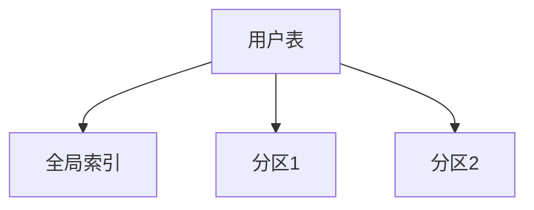

# 1.4.3 数据模型

## 1. 分布式表设计

- 支持分区表、分布式主键、全局唯一ID。
- 典型设计：用户表、订单表、商品表分区。

## 2. 全局索引与分区

| 类型 | 说明 | 适用场景 |
|------|------|----------|
| 全局索引 | 跨分区唯一性 | 大规模分布式 |
| 局部索引 | 分区内加速 | 热点分区 |
| 分区表   | 水平拆分 | 大表分区 |

## 3. 行业案例与多表征

### 3.1. 互联网行业：全局索引优化

```sql
CREATE UNIQUE INDEX idx_user_id ON user(id) GLOBAL;
```

### 3.2. 金融行业：分布式订单表

- 见[3.5.7-数据存储与访问](../../3-数据模型与算法/3.5-数据分析与ETL/3.5.7-数据存储与访问.md)

### 3.3. Mermaid分布式表结构图



### 3.4. Latex公式

$$
\text{分区数} = \lceil \frac{\text{总数据量}}{\text{单分区容量}} \rceil
$$

[返回NewSQL导航](README.md)
