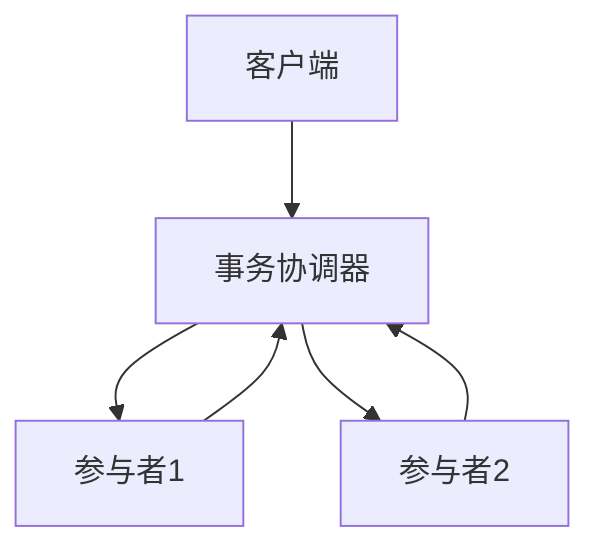

# 1.4.4 分布式事务与一致性

## 📑 目录

- [1.4.4 分布式事务与一致性](#144-分布式事务与一致性)
  - [📑 目录](#-目录)
  - [1. 分布式事务原理](#1-分布式事务原理)
  - [2. 一致性协议与实现](#2-一致性协议与实现)
  - [3. 行业案例与多表征](#3-行业案例与多表征)
    - [3.1. 金融行业：2PC分布式事务](#31-金融行业2pc分布式事务)
    - [3.2. 互联网行业：Raft一致性协议](#32-互联网行业raft一致性协议)
    - [3.3. Latex公式](#33-latex公式)
    - [3.4. 配置示例](#34-配置示例)

---


## 1. 分布式事务原理

- 跨节点/分区的原子性、隔离性、持久性。
- 两阶段提交（2PC）、三阶段提交（3PC）、Paxos/Raft等协议。

## 2. 一致性协议与实现

| 协议 | 特点 | 典型系统 |
|------|------|----------|
| 2PC   | 简单、阻塞 | OceanBase、TiDB |
| 3PC   | 非阻塞，复杂 | NewSQL部分实现 |
| Paxos | 容错性强 | CockroachDB |
| Raft  | 易实现，强一致 | TiDB、YugabyteDB |

## 3. 行业案例与多表征

### 3.1. 金融行业：2PC分布式事务



### 3.2. 互联网行业：Raft一致性协议

- 见[1.4.1-形式模型](1.4.1-形式模型.md)

### 3.3. Latex公式

$$
\text{Commit}_{2PC} = \text{Prepare} + \text{Commit}
$$

### 3.4. 配置示例

```yaml
transaction:
  protocol: 2PC
  timeout: 30s
```

[返回NewSQL导航](README.md)
