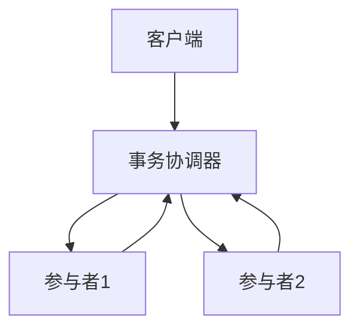

# 1.4.4 分布式事务与一致性

## 1.4.4.1 分布式事务原理

- 跨节点/分区的原子性、隔离性、持久性。
- 两阶段提交（2PC）、三阶段提交（3PC）、Paxos/Raft等协议。

## 1.4.4.2 一致性协议与实现

| 协议 | 特点 | 典型系统 |
|------|------|----------|
| 2PC   | 简单、阻塞 | OceanBase、TiDB |
| 3PC   | 非阻塞，复杂 | NewSQL部分实现 |
| Paxos | 容错性强 | CockroachDB |
| Raft  | 易实现，强一致 | TiDB、YugabyteDB |

## 1.4.4.3 行业案例与多表征

### 金融行业：2PC分布式事务



### 互联网行业：Raft一致性协议

- 见[1.4.1-形式模型](1.4.1-形式模型.md)

### Latex公式

$$
\text{Commit}_{2PC} = \text{Prepare} + \text{Commit}
$$

### 配置示例

```yaml
transaction:
  protocol: 2PC
  timeout: 30s
```

[返回NewSQL导航](README.md)
