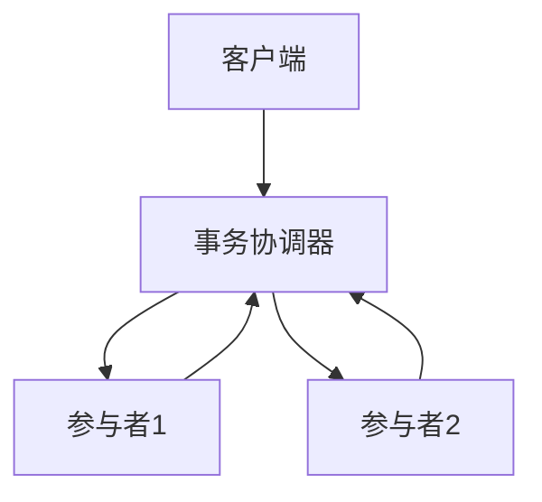

# 1.4.4 分布式事务与一致性

## 📑 目录

- [1.4.4 分布式事务与一致性](#144-分布式事务与一致性)
  - [📑 目录](#-目录)
  - [1. 分布式事务原理](#1-分布式事务原理)
  - [2. 一致性协议与实现](#2-一致性协议与实现)
  - [3. 行业案例与多表征](#3-行业案例与多表征)
    - [3.1. 金融行业：2PC分布式事务](#31-金融行业2pc分布式事务)
    - [3.2. 互联网行业：Raft一致性协议](#32-互联网行业raft一致性协议)
    - [3.3. Latex公式](#33-latex公式)
    - [3.4. 配置示例](#34-配置示例)

---


## 1. 分布式事务原理

- 跨节点/分区的原子性、隔离性、持久性。
- 两阶段提交（2PC）、三阶段提交（3PC）、Paxos/Raft等协议。

## 2. 一致性协议与实现

| 协议 | 特点 | 典型系统 |
|------|------|----------|
| 2PC   | 简单、阻塞 | OceanBase、TiDB |
| 3PC   | 非阻塞，复杂 | NewSQL部分实现 |
| Paxos | 容错性强 | CockroachDB |
| Raft  | 易实现，强一致 | TiDB、YugabyteDB |

## 3. 行业案例与多表征

### 3.1. 金融行业：2PC分布式事务


```mermaid
flowchart TD
  C[客户端] --> TC[事务协调器]
  TC --> P1[参与者1]
  TC --> P2[参与者2]
  P1 --> TC
  P2 --> TC
```

### 3.2. 互联网行业：Raft一致性协议

- 见[1.4.1-形式模型](1.4.1-形式模型.md)

### 3.3. Latex公式

$$
\text{Commit}_{2PC} = \text{Prepare} + \text{Commit}
$$

### 3.4. 配置示例

```yaml
transaction:
  protocol: 2PC
  timeout: 30s
```

---

## 4. 参考资料

### 4.1. 相关理论文档

- [NewSQL知识导航索引](./README.md) - NewSQL完整知识体系
- [数据库系统知识导航索引](../README.md) - 数据库系统知识导航
- [形式模型](./1.4.1-形式模型.md) - NewSQL形式化模型
- [系统架构](./1.4.2-系统架构.md) - NewSQL系统架构
- [分布式系统理论](../../2-形式科学理论/2.5-分布式系统理论/README.md) - 分布式系统理论基础
- [分布式系统理论深化](../../8-形式理论深化/8.5-分布式系统理论深化/README.md) - 分布式系统理论深化
- [最新共识算法理论](../../../Design/01-理论模型/01.11-最新共识算法理论.md) - 最新共识算法理论

### 4.2. 相关资源

- [分布式事务文档](https://en.wikipedia.org/wiki/Distributed_transaction)
- [2PC协议文档](https://en.wikipedia.org/wiki/Two-phase_commit_protocol)
- [Raft协议文档](https://raft.github.io/)

---

[返回NewSQL导航](README.md)
