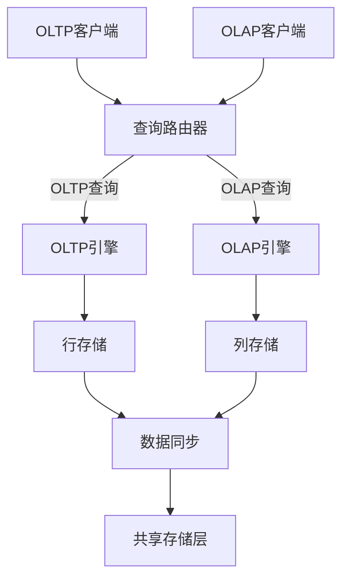
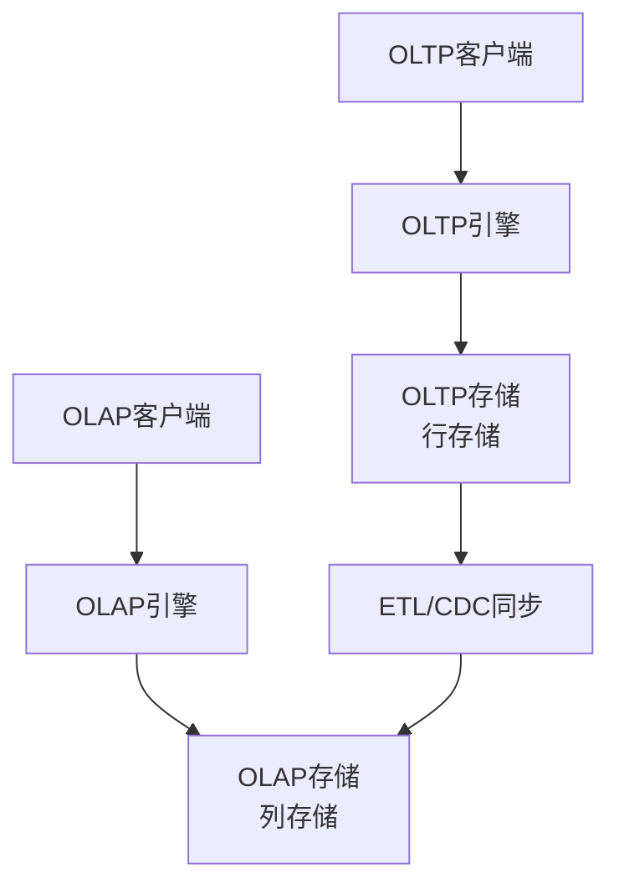
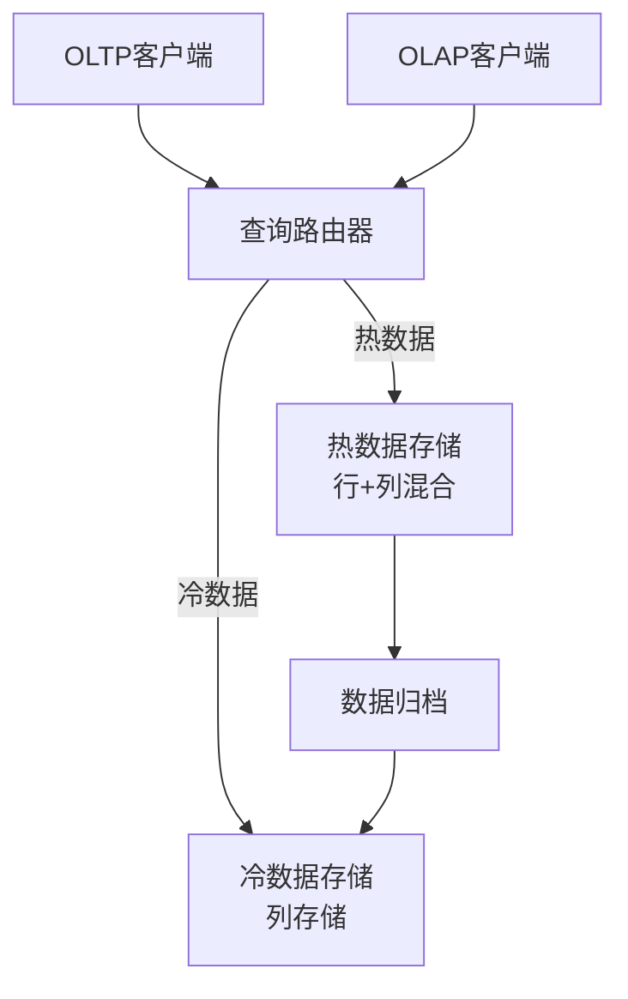
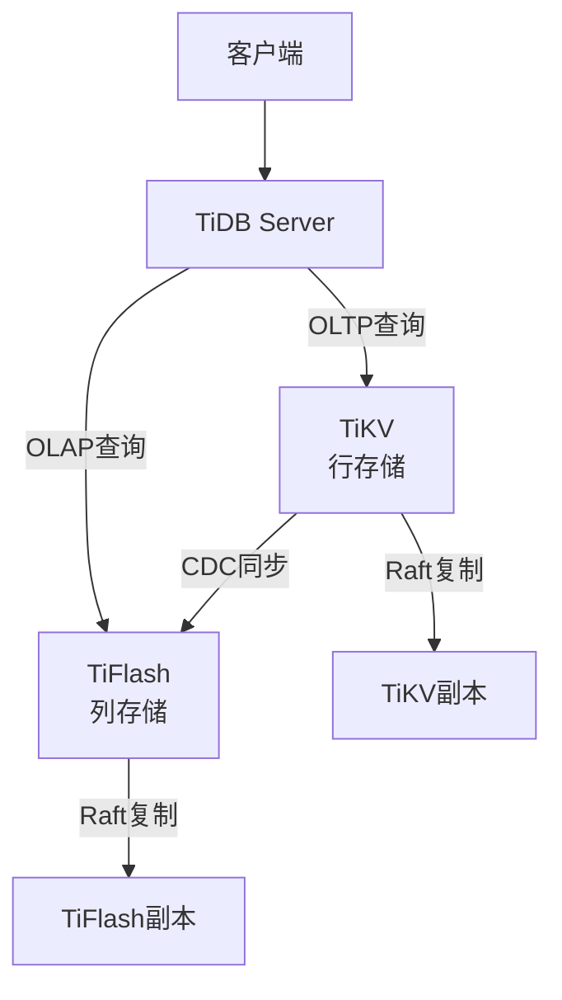
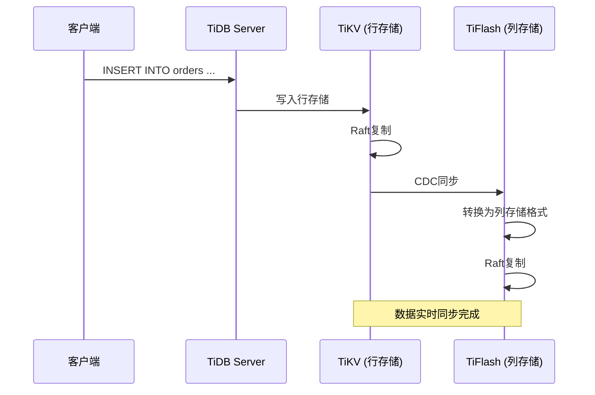

# 1.4.5 OLAP/OLTP融合（HTAP）

## 📑 目录

- [1.4.5 OLAP/OLTP融合（HTAP）](#145-olapoltp融合htap)
  - [📑 目录](#-目录)
  - [1. 概述](#1-概述)
    - [1.1. 定义与背景](#11-定义与背景)
    - [1.2. OLTP vs OLAP](#12-oltp-vs-olap)
    - [1.3. HTAP的挑战](#13-htap的挑战)
  - [2. HTAP架构设计](#2-htap架构设计)
    - [2.1. 架构模式](#21-架构模式)
      - [2.1.1. 共享存储架构](#211-共享存储架构)
      - [2.1.2. 分离存储架构](#212-分离存储架构)
      - [2.1.3. 混合架构](#213-混合架构)
    - [2.2. 数据同步机制](#22-数据同步机制)
      - [2.2.1. 实时同步](#221-实时同步)
      - [2.2.2. 批量同步](#222-批量同步)
      - [2.2.3. 增量同步](#223-增量同步)
    - [2.3. 查询路由](#23-查询路由)
      - [2.3.1. 基于查询特征](#231-基于查询特征)
      - [2.3.2. 基于提示（Hints）](#232-基于提示hints)
      - [2.3.3. 基于表配置](#233-基于表配置)
  - [3. 混合存储引擎](#3-混合存储引擎)
    - [3.1. 行存储引擎](#31-行存储引擎)
    - [3.2. 列存储引擎](#32-列存储引擎)
    - [3.3. 混合存储架构](#33-混合存储架构)
  - [4. 负载隔离与资源管理](#4-负载隔离与资源管理)
    - [4.1. 资源隔离](#41-资源隔离)
      - [4.1.1. CPU隔离](#411-cpu隔离)
      - [4.1.2. 内存隔离](#412-内存隔离)
      - [4.1.3. I/O隔离](#413-io隔离)
    - [4.2. 优先级调度](#42-优先级调度)
    - [4.3. 动态资源分配](#43-动态资源分配)
  - [5. 实际系统实现](#5-实际系统实现)
    - [5.1. TiDB HTAP](#51-tidb-htap)
    - [5.2. CockroachDB混合负载](#52-cockroachdb混合负载)
    - [5.3. SingleStore](#53-singlestore)
    - [5.4. OceanBase HTAP](#54-oceanbase-htap)
  - [6. 性能优化策略](#6-性能优化策略)
    - [6.1. 查询优化](#61-查询优化)
      - [6.1.1. 查询重写](#611-查询重写)
      - [6.1.2. 索引优化](#612-索引优化)
    - [6.2. 数据压缩](#62-数据压缩)
    - [6.3. 缓存策略](#63-缓存策略)
  - [7. 实际应用案例](#7-实际应用案例)
    - [7.1. 电商平台](#71-电商平台)
    - [7.2. 金融交易系统](#72-金融交易系统)
    - [7.3. 物联网平台](#73-物联网平台)
  - [8. 形式化定义与证明](#8-形式化定义与证明)
    - [8.1. HTAP系统形式化模型](#81-htap系统形式化模型)
    - [8.2. 数据一致性](#82-数据一致性)
  - [9. 多表征](#9-多表征)
  - [10. 总结与展望](#10-总结与展望)
    - [10.1. 总结](#101-总结)
    - [10.2. 发展趋势](#102-发展趋势)
    - [10.3. 挑战与机遇](#103-挑战与机遇)

---

## 1. 概述

### 1.1. 定义与背景

**HTAP（Hybrid Transactional/Analytical Processing）**是一种混合事务分析处理架构，能够在同一系统中同时支持OLTP（在线事务处理）和OLAP（在线分析处理）工作负载。

**历史背景**：

传统上，OLTP和OLAP系统是分离的：

1. **OLTP系统**：处理日常事务，要求低延迟、高并发
2. **OLAP系统**：处理分析查询，要求高吞吐量、复杂查询

这种分离导致：

- 数据需要ETL同步
- 数据延迟
- 系统复杂度高
- 资源浪费

**HTAP的优势**：

1. **统一数据模型**：同一份数据支持事务和分析
2. **实时分析**：无需ETL，实时查询最新数据
3. **资源优化**：共享存储和计算资源
4. **简化架构**：减少系统复杂度

**形式化定义**：

设HTAP系统为 $S = (E_{OLTP}, E_{OLAP}, R, Q)$，其中：

- $E_{OLTP}$：OLTP执行引擎
- $E_{OLAP}$：OLAP执行引擎
- $R$：资源管理器
- $Q$：查询路由器

对于查询 $q$，系统选择执行引擎：

$$
E(q) = \begin{cases}
E_{OLTP} & \text{if } \text{is\_oltp}(q) \\
E_{OLAP} & \text{if } \text{is\_olap}(q)
\end{cases}
$$

### 1.2. OLTP vs OLAP

**OLTP（Online Transactional Processing）特点**：

1. **工作负载**：
   - 大量短事务
   - 点查询为主
   - 读写混合
   - 高并发

2. **性能要求**：
   - 低延迟（毫秒级）
   - 高吞吐量
   - ACID保证

3. **数据特征**：
   - 当前数据
   - 频繁更新
   - 数据量相对较小

4. **查询模式**：

   ```sql
   -- 典型的OLTP查询
   SELECT * FROM users WHERE id = 123;
   UPDATE orders SET status = 'paid' WHERE id = 456;
   INSERT INTO transactions VALUES (...);
   ```

**OLAP（Online Analytical Processing）特点**：

1. **工作负载**：
   - 复杂分析查询
   - 聚合计算
   - 只读为主
   - 低并发

2. **性能要求**：
   - 高吞吐量
   - 可接受较高延迟
   - 一致性要求较低

3. **数据特征**：
   - 历史数据
   - 很少更新
   - 数据量巨大

4. **查询模式**：

   ```sql
   -- 典型的OLAP查询
   SELECT
       DATE(order_date) as date,
       SUM(amount) as total_amount,
       COUNT(*) as order_count
   FROM orders
   WHERE order_date >= '2024-01-01'
   GROUP BY DATE(order_date)
   ORDER BY date;
   ```

**对比表**：

| 特性 | OLTP | OLAP |
|------|------|------|
| **主要用途** | 日常业务操作 | 数据分析决策 |
| **查询类型** | 简单查询 | 复杂分析 |
| **数据量** | 相对较小 | 非常大 |
| **更新频率** | 频繁 | 很少 |
| **响应时间** | 毫秒级 | 秒到分钟级 |
| **并发用户** | 高 | 低 |
| **数据模型** | 规范化 | 星型/雪花型 |
| **索引策略** | B-Tree索引 | 位图索引、列索引 |

### 1.3. HTAP的挑战

**主要挑战**：

1. **资源竞争**：
   - OLTP和OLAP竞争CPU、内存、I/O
   - 需要智能资源调度

2. **数据一致性**：
   - 保证OLTP和OLAP看到一致的数据
   - 处理数据同步延迟

3. **性能隔离**：
   - OLAP查询不能影响OLTP性能
   - 需要负载隔离机制

4. **存储优化**：
   - 同时优化行存储和列存储
   - 平衡存储成本

5. **查询优化**：
   - 自动识别查询类型
   - 路由到合适的执行引擎

---

## 2. HTAP架构设计

### 2.1. 架构模式

#### 2.1.1. 共享存储架构

**特点**：

- OLTP和OLAP共享同一份数据
- 通过不同的存储格式（行存储/列存储）优化
- 数据实时同步

**架构图**：



**优势**：

- 数据实时一致
- 无需ETL
- 资源利用率高

**劣势**：

- 资源竞争
- 同步开销
- 架构复杂

#### 2.1.2. 分离存储架构

**特点**：

- OLTP和OLAP使用独立的存储
- 异步数据同步
- 更好的性能隔离

**架构图**：



**优势**：

- 性能隔离好
- 独立扩展
- 优化灵活

**劣势**：

- 数据延迟
- 需要ETL
- 存储成本高

#### 2.1.3. 混合架构

**特点**：

- 结合共享和分离的优势
- 热数据共享，冷数据分离
- 智能数据分层

**架构图**：



### 2.2. 数据同步机制

#### 2.2.1. 实时同步

**Change Data Capture (CDC)**：

```python
# CDC实现示例
class ChangeDataCapture:
    def __init__(self, source, target):
        self.source = source  # OLTP存储
        self.target = target  # OLAP存储
        self.replication_log = []

    def capture_changes(self):
        """捕获数据变更"""
        while True:
            changes = self.source.get_changes()
            for change in changes:
                self.replication_log.append(change)
                self.apply_to_target(change)

    def apply_to_target(self, change):
        """应用到目标存储"""
        if change.type == 'INSERT':
            self.target.insert(change.data)
        elif change.type == 'UPDATE':
            self.target.update(change.data)
        elif change.type == 'DELETE':
            self.target.delete(change.key)
```

**WAL（Write-Ahead Log）复制**：

```sql
-- PostgreSQL WAL复制示例
-- 主库（OLTP）
CREATE PUBLICATION olap_publication FOR TABLE orders, users;

-- 从库（OLAP）
CREATE SUBSCRIPTION olap_subscription
CONNECTION 'host=oltp_server dbname=mydb'
PUBLICATION olap_publication;
```

#### 2.2.2. 批量同步

**批量ETL**：

```python
# 批量ETL实现
def batch_etl(source, target, batch_size=10000):
    """批量ETL同步"""
    offset = 0
    while True:
        batch = source.fetch_batch(offset, batch_size)
        if not batch:
            break

        # 转换为列存储格式
        columnar_data = convert_to_columnar(batch)

        # 写入目标
        target.append(columnar_data)

        offset += batch_size
```

#### 2.2.3. 增量同步

**增量同步策略**：

1. **时间戳增量**：基于更新时间戳
2. **版本号增量**：基于版本号
3. **日志增量**：基于事务日志

**实现**：

```python
class IncrementalSync:
    def __init__(self, source, target):
        self.source = source
        self.target = target
        self.last_sync_time = None

    def sync(self):
        """增量同步"""
        if self.last_sync_time is None:
            # 全量同步
            self.full_sync()
        else:
            # 增量同步
            changes = self.source.get_changes_since(self.last_sync_time)
            self.target.apply_changes(changes)
            self.last_sync_time = datetime.now()
```

### 2.3. 查询路由

**查询路由策略**：

#### 2.3.1. 基于查询特征

```python
class QueryRouter:
    def route(self, query):
        """根据查询特征路由"""
        features = self.analyze_query(query)

        if features.is_oltp:
            return self.oltp_engine
        elif features.is_olap:
            return self.olap_engine
        else:
            # 混合查询，需要优化
            return self.optimize_and_route(query)

    def analyze_query(self, query):
        """分析查询特征"""
        features = QueryFeatures()

        # 检查查询类型
        if query.has_aggregation():
            features.is_olap = True
        if query.has_joins() and query.join_count > 3:
            features.is_olap = True
        if query.scan_ratio > 0.1:  # 扫描超过10%的数据
            features.is_olap = True

        # 检查是否为点查询
        if query.has_primary_key_filter():
            features.is_oltp = True
        if query.result_size < 100:
            features.is_oltp = True

        return features
```

#### 2.3.2. 基于提示（Hints）

```sql
-- 使用提示强制路由
-- OLTP查询
SELECT /*+ OLTP */ * FROM users WHERE id = 123;

-- OLAP查询
SELECT /*+ OLAP */
    DATE(order_date) as date,
    SUM(amount) as total
FROM orders
GROUP BY DATE(order_date);
```

#### 2.3.3. 基于表配置

```sql
-- 表级别配置
CREATE TABLE orders (
    id BIGINT PRIMARY KEY,
    user_id BIGINT,
    amount DECIMAL(10,2)
) WITH (
    olap_replica = true,  -- 启用OLAP副本
    sync_mode = 'realtime'  -- 实时同步
);
```

---

## 3. 混合存储引擎

### 3.1. 行存储引擎

**行存储特点**：

1. **数据组织**：按行存储，一行数据连续存储
2. **优势**：点查询快、更新效率高
3. **劣势**：列扫描慢、压缩率低

**行存储结构**：

```text
行存储文件结构：
┌─────────────────────────────────┐
│ 页头 (Page Header)               │
├─────────────────────────────────┤
│ 行指针数组 (Row Pointers)       │
├─────────────────────────────────┤
│ 行1: [id, name, email, age]     │
│ 行2: [id, name, email, age]     │
│ 行3: [id, name, email, age]     │
└─────────────────────────────────┘
```

**行存储实现**：

```sql
-- TiDB行存储表
CREATE TABLE users (
    id BIGINT PRIMARY KEY,
    name VARCHAR(100),
    email VARCHAR(100),
    age INT
) ENGINE=InnoDB;  -- 行存储引擎

-- OLTP查询（使用行存储）
SELECT * FROM users WHERE id = 123;
UPDATE users SET age = 25 WHERE id = 123;
```

### 3.2. 列存储引擎

**列存储特点**：

1. **数据组织**：按列存储，一列数据连续存储
2. **优势**：列扫描快、压缩率高、聚合查询快
3. **劣势**：点查询慢、更新效率低

**列存储结构**：

```text
列存储文件结构：
┌─────────────────────────────────┐
│ 列1 (id):    [1, 2, 3, 4, 5]    │
│ 列2 (name):  ["A", "B", "C"...] │
│ 列3 (email): ["a@...", "b@..."] │
│ 列4 (age):   [20, 25, 30, ...]  │
└─────────────────────────────────┘
```

**列存储实现**：

```sql
-- TiDB列存储表（TiFlash）
CREATE TABLE users_analytics (
    id BIGINT,
    name VARCHAR(100),
    email VARCHAR(100),
    age INT
) ENGINE=TiFlash;  -- 列存储引擎

-- OLAP查询（使用列存储）
SELECT
    age,
    COUNT(*) as user_count,
    AVG(LENGTH(name)) as avg_name_length
FROM users_analytics
GROUP BY age;
```

### 3.3. 混合存储架构

**TiDB HTAP架构**：



**混合存储配置**：

```sql
-- 创建HTAP表
CREATE TABLE orders (
    id BIGINT PRIMARY KEY,
    user_id BIGINT,
    order_date DATE,
    amount DECIMAL(10,2)
);

-- 启用列存储副本
ALTER TABLE orders SET TIFLASH REPLICA 1;

-- 查询自动路由
-- OLTP查询 → TiKV（行存储）
SELECT * FROM orders WHERE id = 123;

-- OLAP查询 → TiFlash（列存储）
SELECT
    DATE(order_date) as date,
    SUM(amount) as total_amount
FROM orders
WHERE order_date >= '2024-01-01'
GROUP BY DATE(order_date);
```

**数据同步流程**：



---

## 4. 负载隔离与资源管理

### 4.1. 资源隔离

#### 4.1.1. CPU隔离

**CPU资源分配**：

```yaml
# 资源分配配置
resources:
  oltp:
    cpu_cores: 8
    cpu_quota: 80%  # 80% CPU配额
  olap:
    cpu_cores: 16
    cpu_quota: 20%  # 20% CPU配额（可抢占）
```

**实现**：

```python
class ResourceIsolator:
    def __init__(self):
        self.oltp_cpus = set(range(0, 8))
        self.olap_cpus = set(range(8, 24))

    def assign_cpu(self, query_type):
        """分配CPU资源"""
        if query_type == 'OLTP':
            return self.oltp_cpus
        else:
            return self.olap_cpus
```

#### 4.1.2. 内存隔离

**内存配额管理**：

```sql
-- 设置内存限制
SET SESSION memory_limit = '2GB';  -- OLTP查询
SET SESSION memory_limit = '8GB';  -- OLAP查询

-- 表级别内存配置
ALTER TABLE orders SET (
    oltp_memory_limit = '1GB',
    olap_memory_limit = '4GB'
);
```

#### 4.1.3. I/O隔离

**I/O优先级**：

```python
class IOIsolator:
    def set_io_priority(self, query_type):
        """设置I/O优先级"""
        if query_type == 'OLTP':
            # OLTP查询高优先级
            os.set_ioprio(os.IOPRIO_CLASS_RT, 0)
        else:
            # OLAP查询低优先级
            os.set_ioprio(os.IOPRIO_CLASS_BE, 4)
```

### 4.2. 优先级调度

**查询优先级队列**：

```python
import heapq

class QueryScheduler:
    def __init__(self):
        self.oltp_queue = []  # 高优先级队列
        self.olap_queue = []  # 低优先级队列

    def schedule(self, query):
        """调度查询"""
        if query.is_oltp:
            heapq.heappush(self.oltp_queue, (query.priority, query))
        else:
            heapq.heappush(self.olap_queue, (query.priority, query))

    def get_next(self):
        """获取下一个查询"""
        # 优先处理OLTP查询
        if self.oltp_queue:
            return heapq.heappop[self.oltp_queue](1)
        elif self.olap_queue:
            return heapq.heappop[self.olap_queue](1)
        return None
```

### 4.3. 动态资源分配

**自适应资源分配**：

```python
class AdaptiveResourceManager:
    def __init__(self):
        self.oltp_load = 0.0
        self.olap_load = 0.0
        self.total_resources = 100

    def adjust_resources(self):
        """动态调整资源分配"""
        total_load = self.oltp_load + self.olap_load

        if total_load > 0:
            oltp_ratio = self.oltp_load / total_load
            olap_ratio = self.olap_load / total_load

            # 分配资源
            oltp_resources = int(self.total_resources * oltp_ratio)
            olap_resources = self.total_resources - oltp_resources

            self.allocate_resources(oltp_resources, olap_resources)

    def allocate_resources(self, oltp, olap):
        """分配资源"""
        # 更新资源配额
        self.update_oltp_quota(oltp)
        self.update_olap_quota(olap)
```

---

## 5. 实际系统实现

### 5.1. TiDB HTAP

**TiDB HTAP架构**：

- **TiKV**：行存储引擎，处理OLTP负载
- **TiFlash**：列存储引擎，处理OLAP负载
- **自动路由**：根据查询特征自动选择引擎

**配置示例**：

```sql
-- 创建表
CREATE TABLE orders (
    id BIGINT PRIMARY KEY,
    user_id BIGINT,
    order_date DATE,
    amount DECIMAL(10,2)
);

-- 启用TiFlash副本
ALTER TABLE orders SET TIFLASH REPLICA 1;

-- 查看同步状态
SELECT * FROM information_schema.tiflash_replica
WHERE table_name = 'orders';

-- 强制使用TiFlash（测试）
SELECT /*+ read_from_storage(tiflash[orders]) */
    DATE(order_date) as date,
    SUM(amount) as total
FROM orders
GROUP BY DATE(order_date);
```

**性能特点**：

- OLTP延迟：< 10ms
- OLAP吞吐量：10x提升
- 数据同步延迟：< 1秒

### 5.2. CockroachDB混合负载

**CockroachDB特点**：

- 统一存储引擎
- 通过索引优化OLAP查询
- 支持列式索引

**配置示例**：

```sql
-- 创建表
CREATE TABLE orders (
    id UUID PRIMARY KEY,
    user_id UUID,
    order_date DATE,
    amount DECIMAL(10,2),
    INDEX idx_date_amount (order_date, amount)
);

-- OLTP查询
SELECT * FROM orders WHERE id = '...';

-- OLAP查询（使用索引）
SELECT
    order_date,
    SUM(amount) as total
FROM orders
WHERE order_date >= '2024-01-01'
GROUP BY order_date;
```

### 5.3. SingleStore

**SingleStore特点**：

- 内存行存储 + 磁盘列存储
- 自动数据分层
- 统一SQL接口

**配置示例**：

```sql
-- 创建表（自动分层）
CREATE TABLE orders (
    id BIGINT PRIMARY KEY,
    user_id BIGINT,
    order_date DATE,
    amount DECIMAL(10,2),
    KEY (order_date) USING CLUSTERED COLUMNSTORE
);

-- 查询自动路由
SELECT * FROM orders WHERE id = 123;  -- 使用行存储
SELECT SUM(amount) FROM orders WHERE order_date > '2024-01-01';  -- 使用列存储
```

### 5.4. OceanBase HTAP

**OceanBase特点**：

- 统一存储引擎
- 通过分区优化
- 支持列式存储扩展

**配置示例**：

```sql
-- 创建分区表
CREATE TABLE orders (
    id BIGINT PRIMARY KEY,
    user_id BIGINT,
    order_date DATE,
    amount DECIMAL(10,2)
) PARTITION BY RANGE (order_date) (
    PARTITION p2024_01 VALUES LESS THAN ('2024-02-01'),
    PARTITION p2024_02 VALUES LESS THAN ('2024-03-01')
);

-- OLTP查询（单分区）
SELECT * FROM orders WHERE id = 123;

-- OLAP查询（多分区并行）
SELECT
    DATE(order_date) as date,
    SUM(amount) as total
FROM orders
WHERE order_date >= '2024-01-01'
GROUP BY DATE(order_date);
```

---

## 6. 性能优化策略

### 6.1. 查询优化

#### 6.1.1. 查询重写

**谓词下推**：

```sql
-- 原始查询
SELECT * FROM (
    SELECT * FROM orders WHERE order_date >= '2024-01-01'
) WHERE amount > 1000;

-- 优化后（谓词下推）
SELECT * FROM orders
WHERE order_date >= '2024-01-01' AND amount > 1000;
```

**投影下推**：

```sql
-- 原始查询
SELECT user_id, SUM(amount) FROM (
    SELECT * FROM orders
) GROUP BY user_id;

-- 优化后（只选择需要的列）
SELECT user_id, SUM(amount) FROM orders GROUP BY user_id;
```

#### 6.1.2. 索引优化

**列存储索引**：

```sql
-- 创建列存储索引
CREATE INDEX idx_date_amount ON orders (order_date, amount)
USING COLUMNSTORE;

-- 查询自动使用索引
SELECT
    order_date,
    SUM(amount) as total
FROM orders
WHERE order_date >= '2024-01-01'
GROUP BY order_date;
```

### 6.2. 数据压缩

**列存储压缩**：

```python
# 列存储压缩示例
class ColumnCompressor:
    def compress(self, column_data):
        """压缩列数据"""
        # 使用字典编码
        if self.is_low_cardinality(column_data):
            return self.dictionary_encode(column_data)

        # 使用RLE编码
        if self.is_sorted(column_data):
            return self.rle_encode(column_data)

        # 使用通用压缩
        return self.gzip_compress(column_data)

    def dictionary_encode(self, data):
        """字典编码"""
        unique_values = sorted(set(data))
        dictionary = {val: idx for idx, val in enumerate(unique_values)}
        encoded = [dictionary[val] for val in data]
        return {
            'dictionary': unique_values,
            'encoded': encoded
        }
```

**压缩率对比**：

| 数据类型 | 行存储压缩率 | 列存储压缩率 |
|---------|------------|------------|
| **整数** | 10-20% | 70-90% |
| **字符串** | 20-30% | 60-80% |
| **日期时间** | 15-25% | 80-95% |
| **浮点数** | 5-15% | 50-70% |

### 6.3. 缓存策略

**多级缓存**：

```python
class MultiLevelCache:
    def __init__(self):
        self.l1_cache = {}  # 内存缓存（热数据）
        self.l2_cache = {}  # SSD缓存（温数据）
        self.l3_storage = None  # 磁盘存储（冷数据）

    def get(self, key):
        """多级缓存查找"""
        # L1缓存
        if key in self.l1_cache:
            return self.l1_cache[key]

        # L2缓存
        if key in self.l2_cache:
            value = self.l2_cache[key]
            # 提升到L1
            self.l1_cache[key] = value
            return value

        # L3存储
        value = self.l3_storage.get(key)
        if value:
            # 提升到L2
            self.l2_cache[key] = value
        return value
```

---

## 7. 实际应用案例

### 7.1. 电商平台

**场景**：

- OLTP：订单处理、库存管理
- OLAP：销售分析、用户行为分析

**实现**：

```sql
-- 订单表（HTAP）
CREATE TABLE orders (
    id BIGINT PRIMARY KEY,
    user_id BIGINT,
    product_id BIGINT,
    order_date TIMESTAMP,
    amount DECIMAL(10,2),
    status VARCHAR(20)
);

-- 启用列存储副本
ALTER TABLE orders SET TIFLASH REPLICA 1;

-- OLTP：处理订单
INSERT INTO orders VALUES (1, 100, 200, NOW(), 99.99, 'pending');
UPDATE orders SET status = 'paid' WHERE id = 1;

-- OLAP：销售分析
SELECT
    DATE(order_date) as date,
    COUNT(*) as order_count,
    SUM(amount) as total_revenue
FROM orders
WHERE order_date >= '2024-01-01'
GROUP BY DATE(order_date)
ORDER BY date;
```

### 7.2. 金融交易系统

**场景**：

- OLTP：交易处理、账户管理
- OLAP：风险分析、交易统计

**实现**：

```sql
-- 交易表（HTAP）
CREATE TABLE transactions (
    id BIGINT PRIMARY KEY,
    account_id BIGINT,
    transaction_type VARCHAR(20),
    amount DECIMAL(15,2),
    transaction_time TIMESTAMP,
    status VARCHAR(20)
);

-- OLTP：处理交易
BEGIN;
INSERT INTO transactions VALUES (1, 100, 'DEPOSIT', 1000.00, NOW(), 'SUCCESS');
UPDATE accounts SET balance = balance + 1000.00 WHERE id = 100;
COMMIT;

-- OLAP：风险分析
SELECT
    account_id,
    COUNT(*) as transaction_count,
    SUM(amount) as total_amount,
    AVG(amount) as avg_amount
FROM transactions
WHERE transaction_time >= NOW() - INTERVAL '24 HOURS'
GROUP BY account_id
HAVING COUNT(*) > 100 OR SUM(amount) > 100000;
```

### 7.3. 物联网平台

**场景**：

- OLTP：设备数据写入
- OLAP：设备数据分析、异常检测

**实现**：

```sql
-- 设备数据表（HTAP）
CREATE TABLE device_data (
    id BIGINT PRIMARY KEY,
    device_id BIGINT,
    sensor_type VARCHAR(50),
    value DECIMAL(10,2),
    timestamp TIMESTAMP
);

-- OLTP：写入设备数据
INSERT INTO device_data VALUES
    (1, 100, 'temperature', 25.5, NOW()),
    (2, 100, 'humidity', 60.0, NOW());

-- OLAP：设备分析
SELECT
    device_id,
    sensor_type,
    AVG(value) as avg_value,
    MAX(value) as max_value,
    MIN(value) as min_value
FROM device_data
WHERE timestamp >= NOW() - INTERVAL '1 HOUR'
GROUP BY device_id, sensor_type;
```

---

## 8. 形式化定义与证明

### 8.1. HTAP系统形式化模型

**系统定义**：

设HTAP系统为 $S = (E, S, R, Q)$，其中：

- $E = \{E_{OLTP}, E_{OLAP}\}$：执行引擎集合
- $S = \{S_{row}, S_{col}\}$：存储引擎集合
- $R$：资源管理器
- $Q$：查询路由器

**查询执行**：

对于查询 $q$，执行过程为：

$$E(q) = Q(q) \rightarrow E_i(q) \rightarrow S_j(q)$$

其中 $E_i \in E$，$S_j \in S$。

**性能保证**：

$$\forall q_{OLTP}: \text{latency}(E(q_{OLTP})) < \tau_{OLTP}$$

$$\forall q_{OLAP}: \text{throughput}(E(q_{OLAP})) > \theta_{OLAP}$$

其中 $\tau_{OLTP}$ 是OLTP延迟阈值，$\theta_{OLAP}$ 是OLAP吞吐量阈值。

### 8.2. 数据一致性

**一致性定义**：

HTAP系统保证：

$$\forall t, \forall q: \text{read}(q, t) = \text{read}(q', t')$$

其中 $q$ 和 $q'$ 是同一查询，$t$ 和 $t'$ 是时间点，且 $|t - t'| < \delta$（同步延迟）。

---

## 9. 多表征

本主题支持多种表征方式：

1. **符号表征**：
   - SQL查询语句
   - 形式化定义和数学公式
   - 配置参数

2. **图结构**：
   - 架构图
   - 数据流图
   - 查询执行计划

3. **代码实现**：
   - 系统配置代码
   - 查询优化代码
   - 资源管理代码

4. **自然语言**：
   - 概念定义和解释
   - 最佳实践指南

5. **可视化**：
   - 性能对比图表
   - 架构示意图
   - 监控仪表板

---

## 10. 总结与展望

### 10.1. 总结

HTAP系统的核心特点：

1. **统一数据模型**：同一份数据支持OLTP和OLAP
2. **混合存储**：行存储+列存储
3. **智能路由**：自动选择执行引擎
4. **资源隔离**：保证性能隔离
5. **实时同步**：数据实时一致

### 10.2. 发展趋势

**未来发展方向**：

1. **更好的性能隔离**：硬件级隔离
2. **自动优化**：AI驱动的查询优化
3. **云原生**：更好的弹性扩展
4. **新硬件**：利用新硬件加速

### 10.3. 挑战与机遇

**主要挑战**：

1. 资源竞争
2. 数据一致性
3. 性能优化

**发展机遇**：

1. 新硬件技术
2. 分布式系统成熟
3. AI技术应用

---

**参考文献**：

1. TiDB Documentation: <https://docs.pingcap.com/tidb>
2. Gartner. (2014). Hybrid Transaction/Analytical Processing Will Foster Opportunities for Dramatic Business Innovation.
3. SingleStore Documentation: <https://docs.singlestore.com>

---

[返回NewSQL导航](README.md)
