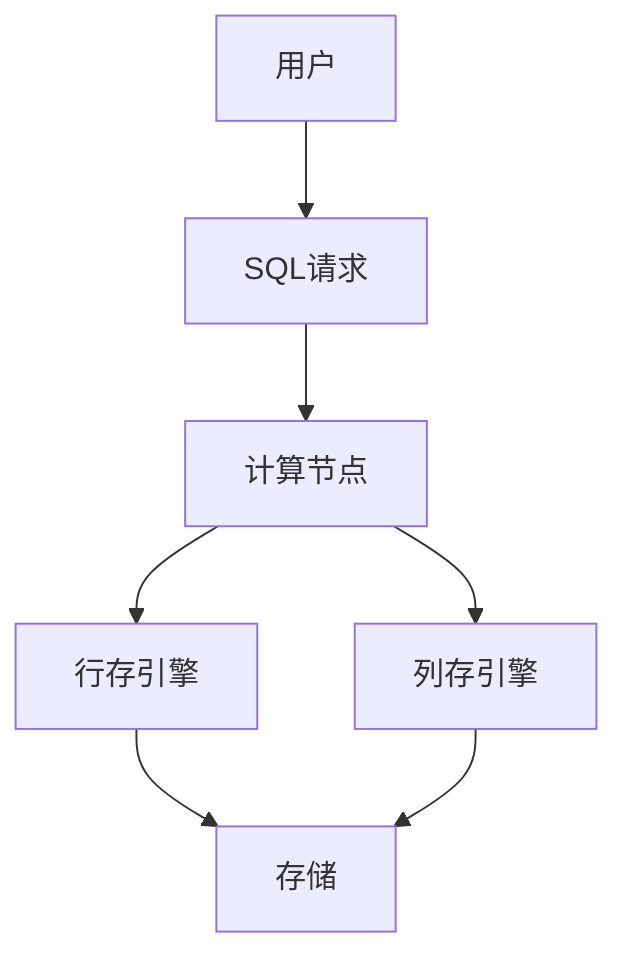

# 1.4.5 OLAP/OLTP融合

## 1. HTAP架构

- HTAP（Hybrid Transactional/Analytical Processing）支持事务与分析混合负载。
- 典型架构：TiDB、CockroachDB、SingleStore。

## 2. 混合负载优化

| 优化手段 | 说明 | 适用场景 |
|----------|------|----------|
| 列存引擎 | 提升分析性能 | 大数据分析 |
| 行存引擎 | 提升事务性能 | 高频写入 |
| 智能调度 | 动态分配资源 | 混合负载 |

## 3. 行业案例与多表征

### 3.1. 互联网行业：HTAP混合架构



### 3.2. 金融行业：混合负载调度

- 见[3.5.1-数据分析基础理论](../../3-数据模型与算法/3.5-数据分析与ETL/3.5.1-数据分析基础理论.md)

### 3.3. Latex公式

$$
\text{HTAP}_{性能} = f(\text{行存}, \text{列存}, \text{调度})
$$

### 3.4. SQL示例

```sql
SELECT user_id, SUM(amount) FROM orders WHERE order_date > '2024-01-01' GROUP BY user_id;
```

[返回NewSQL导航](README.md)
