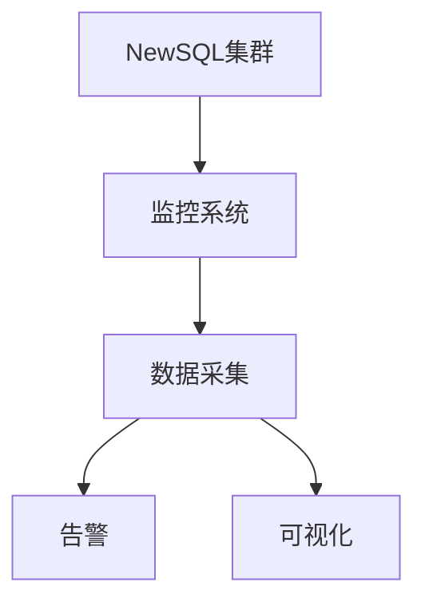

# 1.4.6 性能调优与监控

## 1. 性能调优方法

- 分布式事务优化、分片策略调优。
- 读写分离、缓存优化、硬件资源优化。

## 2. 监控与诊断

| 监控维度 | 指标 | 工具 |
|----------|------|------|
| 性能指标 | QPS、TPS、延迟 | 内置监控 |
| 资源使用 | CPU、内存、IO | 系统监控 |
| 集群状态 | 节点健康、分片状态 | 集群监控 |

## 3. 行业案例与多表征

### 3.1. 金融行业：NewSQL性能监控



### 3.2. 互联网行业：分布式事务性能调优

- 见[7.4.1-CI_CD最佳实践](../../../../7-持续集成与演进/7.4-CI_CD/7.4.1-CI_CD最佳实践.md)

### 3.3. Latex公式

$$
\text{性能提升} = \frac{\text{优化后TPS}}{\text{优化前TPS}}
$$

### 3.4. 监控查询示例

```sql
-- TiDB性能监控
SELECT * FROM information_schema.cluster_info;
SELECT * FROM information_schema.cluster_hardware;
```

[返回NewSQL导航](README.md)
