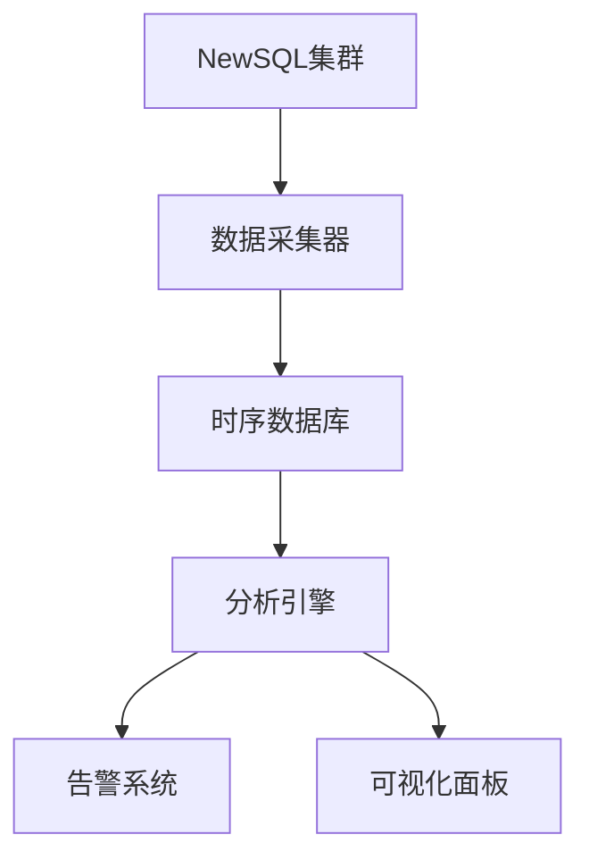
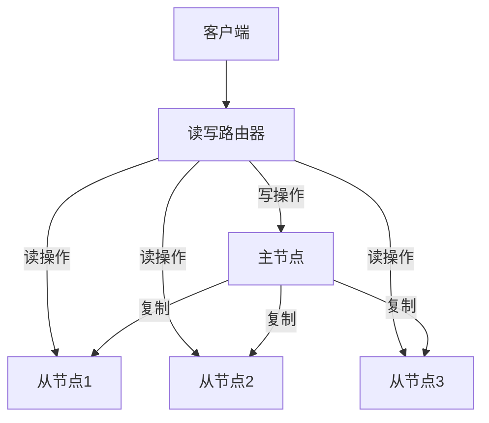
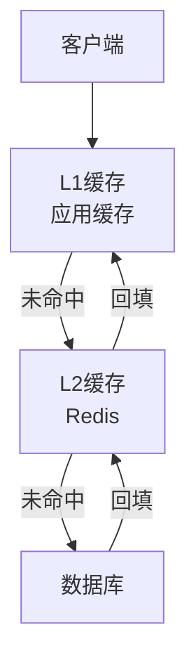
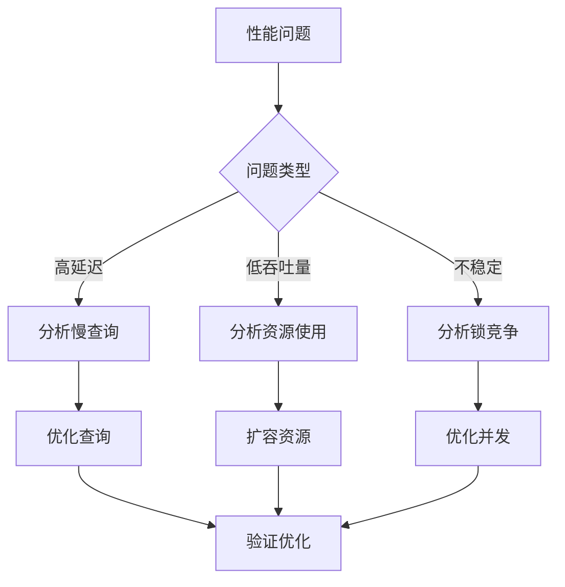

# 1.4.6 NewSQL性能调优与监控

## 📑 目录

- [1.4.6 NewSQL性能调优与监控](#146-newsql性能调优与监控)
  - [📑 目录](#-目录)
  - [1. 概述](#1-概述)
    - [1.1. 性能调优目标](#11-性能调优目标)
    - [1.2. 监控体系](#12-监控体系)
  - [2. 性能调优方法](#2-性能调优方法)
    - [2.1. 分布式事务优化](#21-分布式事务优化)
      - [2.1.1. 减少事务范围](#211-减少事务范围)
      - [2.1.2. 优化事务协调](#212-优化事务协调)
    - [2.2. 分片策略调优](#22-分片策略调优)
      - [2.2.1. 分片键选择](#221-分片键选择)
      - [2.2.2. 分片数量优化](#222-分片数量优化)
    - [2.3. 读写分离优化](#23-读写分离优化)
      - [2.3.1. 读写分离架构](#231-读写分离架构)
      - [2.3.2. 负载均衡](#232-负载均衡)
    - [2.4. 缓存优化](#24-缓存优化)
      - [2.4.1. 多级缓存](#241-多级缓存)
      - [2.4.2. 缓存策略](#242-缓存策略)
    - [2.5. 硬件资源优化](#25-硬件资源优化)
      - [2.5.1. CPU优化](#251-cpu优化)
      - [2.5.2. 内存优化](#252-内存优化)
      - [2.5.3. I/O优化](#253-io优化)
    - [2.6. 查询优化](#26-查询优化)
      - [2.6.1. 索引优化](#261-索引优化)
      - [2.6.2. 查询重写](#262-查询重写)
  - [3. 监控与诊断](#3-监控与诊断)
    - [3.1. 性能指标监控](#31-性能指标监控)
      - [3.1.1. QPS/TPS监控](#311-qpstps监控)
      - [3.1.2. 延迟监控](#312-延迟监控)
    - [3.2. 资源使用监控](#32-资源使用监控)
      - [3.2.1. CPU监控](#321-cpu监控)
      - [3.2.2. 内存监控](#322-内存监控)
      - [3.2.3. I/O监控](#323-io监控)
    - [3.3. 集群状态监控](#33-集群状态监控)
      - [3.3.1. 节点健康监控](#331-节点健康监控)
      - [3.3.2. 分片状态监控](#332-分片状态监控)
    - [3.4. 慢查询分析](#34-慢查询分析)
      - [3.4.1. 慢查询识别](#341-慢查询识别)
      - [3.4.2. 查询计划分析](#342-查询计划分析)
  - [4. 监控工具与平台](#4-监控工具与平台)
    - [4.1. TiDB监控](#41-tidb监控)
    - [4.2. CockroachDB监控](#42-cockroachdb监控)
    - [4.3. Prometheus + Grafana](#43-prometheus--grafana)
    - [4.4. 自定义监控](#44-自定义监控)
  - [5. 性能基准测试](#5-性能基准测试)
    - [5.1. 基准测试工具](#51-基准测试工具)
      - [5.1.1. Sysbench](#511-sysbench)
      - [5.1.2. TPC-C](#512-tpc-c)
    - [5.2. 测试场景设计](#52-测试场景设计)
    - [5.3. 性能评估](#53-性能评估)
  - [6. 故障诊断与排查](#6-故障诊断与排查)
    - [6.1. 常见性能问题](#61-常见性能问题)
      - [6.1.1. 高延迟](#611-高延迟)
      - [6.1.2. 低吞吐量](#612-低吞吐量)
    - [6.2. 诊断方法](#62-诊断方法)
      - [6.2.1. 性能分析流程](#621-性能分析流程)
      - [6.2.2. 诊断工具](#622-诊断工具)
    - [6.3. 优化案例](#63-优化案例)
      - [6.3.1. 案例1：慢查询优化](#631-案例1慢查询优化)
      - [6.3.2. 案例2：分片热点优化](#632-案例2分片热点优化)
  - [7. 实际应用案例](#7-实际应用案例)
    - [7.1. 金融行业：NewSQL性能监控](#71-金融行业newsql性能监控)
    - [7.2. 互联网行业：分布式事务性能调优](#72-互联网行业分布式事务性能调优)
  - [8. 形式化定义](#8-形式化定义)
    - [8.1. 性能指标形式化](#81-性能指标形式化)
    - [8.2. 性能优化目标](#82-性能优化目标)
  - [9. 多表征](#9-多表征)
  - [10. 总结与展望](#10-总结与展望)
    - [10.1. 总结](#101-总结)
    - [10.2. 发展趋势](#102-发展趋势)

---

## 1. 概述

### 1.1. 性能调优目标

**NewSQL性能调优的目标**：

1. **提高吞吐量**：增加QPS（每秒查询数）和TPS（每秒事务数）
2. **降低延迟**：减少P50、P95、P99延迟
3. **提高资源利用率**：优化CPU、内存、I/O使用
4. **保证稳定性**：避免性能波动和系统不稳定

**性能指标定义**：

- **QPS（Queries Per Second）**：每秒查询数
  $$QPS = \frac{\text{总查询数}}{\text{时间（秒）}}$$

- **TPS（Transactions Per Second）**：每秒事务数
  $$TPS = \frac{\text{总事务数}}{\text{时间（秒）}}$$

- **延迟（Latency）**：查询响应时间
  - P50：50%的查询延迟
  - P95：95%的查询延迟
  - P99：99%的查询延迟

### 1.2. 监控体系

**监控体系架构**：



---

## 2. 性能调优方法

### 2.1. 分布式事务优化

#### 2.1.1. 减少事务范围

**优化策略**：

1. **缩短事务时间**：减少事务内的操作
2. **减少跨分片事务**：尽量在单分片内完成
3. **批量操作**：合并多个操作

**示例**：

```sql
-- ❌ 低效：多个小事务
BEGIN;
INSERT INTO orders VALUES (1, 100, 99.99);
COMMIT;

BEGIN;
INSERT INTO order_items VALUES (1, 200, 2);
COMMIT;

-- ✅ 高效：单个事务
BEGIN;
INSERT INTO orders VALUES (1, 100, 99.99);
INSERT INTO order_items VALUES (1, 200, 2);
COMMIT;
```

#### 2.1.2. 优化事务协调

**策略**：

1. **本地事务优先**：优先使用本地事务
2. **异步提交**：非关键路径异步化
3. **并行提交**：并行提交多个事务

**实现**：

```python
class TransactionOptimizer:
    def optimize_transaction(self, operations):
        """优化事务执行"""
        # 按分片分组
        shard_groups = self.group_by_shard(operations)

        # 并行执行各分片事务
        results = []
        for shard, ops in shard_groups.items():
            if len(ops) == 1:
                # 单分片事务，直接执行
                results.append(self.execute_local_transaction(shard, ops))
            else:
                # 多分片事务，使用2PC
                results.append(self.execute_distributed_transaction(ops))

        return results
```

### 2.2. 分片策略调优

#### 2.2.1. 分片键选择

**选择原则**：

1. **均匀分布**：数据均匀分布到各分片
2. **查询模式匹配**：匹配主要查询模式
3. **避免热点**：避免单分片成为热点

**示例**：

```sql
-- ✅ 好的分片键：用户ID（均匀分布）
CREATE TABLE orders (
    id BIGINT PRIMARY KEY,
    user_id BIGINT,  -- 分片键
    amount DECIMAL(10,2)
) PARTITION BY HASH(user_id);

-- ❌ 不好的分片键：时间戳（数据倾斜）
CREATE TABLE orders (
    id BIGINT PRIMARY KEY,
    order_date TIMESTAMP,  -- 分片键，导致热点
    amount DECIMAL(10,2)
) PARTITION BY HASH(order_date);
```

#### 2.2.2. 分片数量优化

**分片数量选择**：

- **太少**：单分片数据量大，性能差
- **太多**：管理复杂度高，跨分片查询多
- **合适**：根据数据量和查询模式确定

**计算公式**：

$$\text{分片数} = \lceil \frac{\text{总数据量}}{\text{单分片容量}} \rceil$$

其中单分片容量通常为10-50GB。

### 2.3. 读写分离优化

#### 2.3.1. 读写分离架构

**架构设计**：



**实现**：

```python
class ReadWriteSplitter:
    def __init__(self, master, slaves):
        self.master = master
        self.slaves = slaves
        self.slave_index = 0

    def execute(self, query, is_write=False):
        """执行查询"""
        if is_write:
            return self.master.execute(query)
        else:
            # 轮询选择从节点
            slave = self.slaves[self.slave_index]
            self.slave_index = (self.slave_index + 1) % len(self.slaves)
            return slave.execute(query)
```

#### 2.3.2. 负载均衡

**负载均衡策略**：

1. **轮询（Round Robin）**：依次选择
2. **加权轮询（Weighted Round Robin）**：根据权重选择
3. **最少连接（Least Connections）**：选择连接数最少的
4. **响应时间（Response Time）**：选择响应时间最短的

### 2.4. 缓存优化

#### 2.4.1. 多级缓存

**缓存层次**：



**实现**：

```python
class MultiLevelCache:
    def __init__(self, l1_cache, l2_cache, db):
        self.l1_cache = l1_cache  # 本地缓存
        self.l2_cache = l2_cache  # Redis
        self.db = db

    def get(self, key):
        """多级缓存查找"""
        # L1缓存
        value = self.l1_cache.get(key)
        if value:
            return value

        # L2缓存
        value = self.l2_cache.get(key)
        if value:
            self.l1_cache.set(key, value)
            return value

        # 数据库
        value = self.db.get(key)
        if value:
            self.l2_cache.set(key, value, ttl=3600)
            self.l1_cache.set(key, value, ttl=60)

        return value
```

#### 2.4.2. 缓存策略

**缓存更新策略**：

1. **Cache-Aside**：应用负责缓存更新
2. **Write-Through**：写入时同时更新缓存
3. **Write-Back**：先写缓存，异步写数据库

### 2.5. 硬件资源优化

#### 2.5.1. CPU优化

**优化策略**：

1. **CPU绑定**：将进程绑定到特定CPU核心
2. **NUMA优化**：考虑NUMA架构
3. **并行度调优**：调整并行查询数量

**配置示例**：

```yaml
# TiDB配置
[performance]
max-procs = 16  # CPU核心数
```

#### 2.5.2. 内存优化

**内存配置**：

```yaml
# TiDB配置
[performance]
max-memory = "32GB"  # 最大内存
```

**内存使用优化**：

1. **连接池**：限制连接数
2. **查询缓存**：合理使用查询缓存
3. **排序缓冲区**：调整排序缓冲区大小

#### 2.5.3. I/O优化

**I/O优化策略**：

1. **SSD存储**：使用SSD提高I/O性能
2. **RAID配置**：使用RAID提高I/O吞吐量
3. **I/O调度器**：优化I/O调度算法

### 2.6. 查询优化

#### 2.6.1. 索引优化

**索引策略**：

```sql
-- 创建合适的索引
CREATE INDEX idx_user_date ON orders(user_id, order_date);

-- 使用覆盖索引
CREATE INDEX idx_covering ON orders(user_id, order_date, amount);
-- 查询可以使用覆盖索引，避免回表
SELECT user_id, SUM(amount)
FROM orders
WHERE user_id = 123
GROUP BY user_id;
```

#### 2.6.2. 查询重写

**优化示例**：

```sql
-- ❌ 低效：全表扫描
SELECT * FROM orders WHERE YEAR(order_date) = 2024;

-- ✅ 高效：使用索引
SELECT * FROM orders
WHERE order_date >= '2024-01-01'
  AND order_date < '2025-01-01';
```

---

## 3. 监控与诊断

### 3.1. 性能指标监控

#### 3.1.1. QPS/TPS监控

**监控指标**：

- **QPS**：每秒查询数
- **TPS**：每秒事务数
- **查询类型分布**：SELECT、INSERT、UPDATE、DELETE比例

**监控查询**：

```sql
-- TiDB QPS监控
SELECT
    instance,
    type,
    SUM(value) as qps
FROM metrics_schema.query_summary
WHERE time >= NOW() - INTERVAL 1 MINUTE
GROUP BY instance, type;
```

#### 3.1.2. 延迟监控

**延迟指标**：

- **P50延迟**：50%的查询延迟
- **P95延迟**：95%的查询延迟
- **P99延迟**：99%的查询延迟
- **平均延迟**：平均查询延迟

**监控查询**：

```sql
-- TiDB延迟监控
SELECT
    instance,
    type,
    QUANTILE(0.50, duration) as p50,
    QUANTILE(0.95, duration) as p95,
    QUANTILE(0.99, duration) as p99,
    AVG(duration) as avg_duration
FROM metrics_schema.query_summary
WHERE time >= NOW() - INTERVAL 1 MINUTE
GROUP BY instance, type;
```

### 3.2. 资源使用监控

#### 3.2.1. CPU监控

**CPU指标**：

- **CPU使用率**：各节点的CPU使用率
- **CPU负载**：系统负载
- **CPU等待**：I/O等待时间

**监控查询**：

```sql
-- TiDB CPU监控
SELECT
    instance,
    AVG(cpu_usage) as avg_cpu,
    MAX(cpu_usage) as max_cpu
FROM metrics_schema.hardware_metrics
WHERE time >= NOW() - INTERVAL 1 MINUTE
GROUP BY instance;
```

#### 3.2.2. 内存监控

**内存指标**：

- **内存使用率**：各节点的内存使用率
- **内存分配**：各组件内存分配
- **内存泄漏**：检测内存泄漏

**监控查询**：

```sql
-- TiDB内存监控
SELECT
    instance,
    AVG(memory_usage) as avg_memory,
    MAX(memory_usage) as max_memory
FROM metrics_schema.hardware_metrics
WHERE time >= NOW() - INTERVAL 1 MINUTE
GROUP BY instance;
```

#### 3.2.3. I/O监控

**I/O指标**：

- **I/O吞吐量**：读写吞吐量
- **I/O延迟**：I/O操作延迟
- **磁盘使用率**：磁盘空间使用

### 3.3. 集群状态监控

#### 3.3.1. 节点健康监控

**监控指标**：

- **节点状态**：在线/离线
- **节点负载**：CPU、内存、I/O负载
- **网络延迟**：节点间网络延迟

**监控查询**：

```sql
-- TiDB集群状态
SELECT * FROM information_schema.cluster_info;

-- 节点健康状态
SELECT
    instance,
    status,
    uptime,
    version
FROM information_schema.cluster_hardware;
```

#### 3.3.2. 分片状态监控

**监控指标**：

- **分片分布**：各分片数据量
- **分片负载**：各分片查询负载
- **分片健康**：分片副本状态

### 3.4. 慢查询分析

#### 3.4.1. 慢查询识别

**慢查询标准**：

- **执行时间**：超过阈值的查询
- **扫描行数**：扫描大量行的查询
- **资源消耗**：消耗大量资源的查询

**慢查询查询**：

```sql
-- TiDB慢查询
SELECT
    digest,
    digest_text,
    COUNT(*) as count,
    AVG(exec_time) as avg_time,
    MAX(exec_time) as max_time,
    SUM(scan_rows) as total_scan_rows
FROM information_schema.slow_query
WHERE time >= NOW() - INTERVAL 1 HOUR
GROUP BY digest, digest_text
ORDER BY avg_time DESC
LIMIT 10;
```

#### 3.4.2. 查询计划分析

**执行计划分析**：

```sql
-- 查看执行计划
EXPLAIN ANALYZE
SELECT
    user_id,
    SUM(amount) as total
FROM orders
WHERE order_date >= '2024-01-01'
GROUP BY user_id;
```

---

## 4. 监控工具与平台

### 4.1. TiDB监控

**TiDB监控组件**：

1. **PD（Placement Driver）**：集群元数据管理
2. **TiKV**：存储节点监控
3. **TiDB Server**：计算节点监控
4. **TiFlash**：列存储监控

**监控面板**：

- **Grafana Dashboard**：可视化监控面板
- **Prometheus**：指标收集和存储
- **AlertManager**：告警管理

**关键指标**：

```sql
-- 集群概览
SELECT * FROM information_schema.cluster_info;

-- 硬件信息
SELECT * FROM information_schema.cluster_hardware;

-- 慢查询
SELECT * FROM information_schema.slow_query;
```

### 4.2. CockroachDB监控

**CockroachDB监控**：

1. **Admin UI**：Web管理界面
2. **Prometheus指标**：标准Prometheus指标
3. **日志系统**：结构化日志

**监控查询**：

```sql
-- 集群状态
SHOW CLUSTER SETTING cluster.organization;

-- 节点状态
SELECT * FROM crdb_internal.kv_node_status;

-- 查询统计
SELECT * FROM crdb_internal.node_statement_statistics;
```

### 4.3. Prometheus + Grafana

**Prometheus配置**：

```yaml
# prometheus.yml
global:
  scrape_interval: 15s

scrape_configs:
  - job_name: 'tidb'
    static_configs:
      - targets: ['tidb:10080']

  - job_name: 'tikv'
    static_configs:
      - targets: ['tikv:20180']

  - job_name: 'pd'
    static_configs:
      - targets: ['pd:2379']
```

**Grafana Dashboard**：

- **QPS/TPS面板**：查询和事务吞吐量
- **延迟面板**：P50、P95、P99延迟
- **资源面板**：CPU、内存、I/O使用
- **集群面板**：集群状态和健康

### 4.4. 自定义监控

**自定义指标收集**：

```python
from prometheus_client import Counter, Histogram, Gauge

# 定义指标
qps_counter = Counter('queries_total', 'Total queries', ['type'])
latency_histogram = Histogram('query_duration_seconds', 'Query duration')
active_connections = Gauge('active_connections', 'Active connections')

# 记录指标
def execute_query(query_type, query_func):
    with latency_histogram.time():
        result = query_func()
        qps_counter.labels(type=query_type).inc()
        return result
```

---

## 5. 性能基准测试

### 5.1. 基准测试工具

#### 5.1.1. Sysbench

**Sysbench配置**：

```bash
# 准备数据
sysbench oltp_read_write \
  --mysql-host=localhost \
  --mysql-port=4000 \
  --mysql-user=root \
  --mysql-password= \
  --mysql-db=test \
  --tables=10 \
  --table-size=100000 \
  prepare

# 运行测试
sysbench oltp_read_write \
  --mysql-host=localhost \
  --mysql-port=4000 \
  --mysql-user=root \
  --mysql-password= \
  --mysql-db=test \
  --tables=10 \
  --table-size=100000 \
  --threads=16 \
  --time=300 \
  run
```

#### 5.1.2. TPC-C

**TPC-C基准测试**：

- **标准基准**：事务处理性能委员会标准
- **OLTP场景**：模拟真实OLTP工作负载
- **指标**：tpmC（每分钟事务数）

### 5.2. 测试场景设计

**测试场景**：

1. **读写混合**：70%读，30%写
2. **只读场景**：100%读
3. **只写场景**：100%写
4. **复杂查询**：JOIN、聚合查询

### 5.3. 性能评估

**评估指标**：

- **吞吐量**：QPS、TPS
- **延迟**：P50、P95、P99
- **资源使用**：CPU、内存、I/O
- **可扩展性**：水平扩展能力

---

## 6. 故障诊断与排查

### 6.1. 常见性能问题

#### 6.1.1. 高延迟

**原因**：

1. **慢查询**：查询执行时间长
2. **网络延迟**：跨节点网络延迟
3. **资源瓶颈**：CPU、内存、I/O瓶颈
4. **锁竞争**：锁等待时间长

**诊断方法**：

```sql
-- 查看慢查询
SELECT * FROM information_schema.slow_query
ORDER BY exec_time DESC
LIMIT 10;

-- 查看锁等待
SELECT * FROM information_schema.deadlocks;
```

#### 6.1.2. 低吞吐量

**原因**：

1. **连接数不足**：连接池配置不当
2. **资源不足**：CPU、内存不足
3. **网络瓶颈**：网络带宽不足
4. **锁竞争**：锁竞争严重

### 6.2. 诊断方法

#### 6.2.1. 性能分析流程



#### 6.2.2. 诊断工具

**工具列表**：

1. **慢查询日志**：分析慢查询
2. **执行计划**：分析查询计划
3. **性能监控**：实时性能监控
4. **日志分析**：分析系统日志

### 6.3. 优化案例

#### 6.3.1. 案例1：慢查询优化

**问题**：查询延迟高

**诊断**：

```sql
-- 发现慢查询
SELECT
    digest_text,
    AVG(exec_time) as avg_time
FROM information_schema.slow_query
GROUP BY digest_text
ORDER BY avg_time DESC
LIMIT 1;
-- 结果：SELECT * FROM orders WHERE user_id = ? AND order_date > ?
```

**优化**：

```sql
-- 创建索引
CREATE INDEX idx_user_date ON orders(user_id, order_date);

-- 优化后查询使用索引
EXPLAIN SELECT * FROM orders
WHERE user_id = 123 AND order_date > '2024-01-01';
```

**效果**：查询延迟从500ms降低到10ms

#### 6.3.2. 案例2：分片热点优化

**问题**：单分片成为热点

**诊断**：

```sql
-- 发现热点分片
SELECT
    partition_name,
    COUNT(*) as query_count
FROM query_log
GROUP BY partition_name
ORDER BY query_count DESC;
```

**优化**：

```sql
-- 重新选择分片键
ALTER TABLE orders
PARTITION BY HASH(user_id) PARTITIONS 8;
-- 从按时间分片改为按用户ID分片
```

**效果**：负载均匀分布，吞吐量提升3倍

---

## 7. 实际应用案例

### 7.1. 金融行业：NewSQL性能监控

**场景**：

- 高并发交易处理
- 实时风险分析
- 严格SLA要求

**监控方案**：

```yaml
# 监控配置
monitoring:
  metrics:
    - qps
    - tps
    - latency_p50
    - latency_p95
    - latency_p99
    - error_rate

  alerts:
    - name: high_latency
      condition: latency_p95 > 100ms
      severity: critical

    - name: low_throughput
      condition: tps < 1000
      severity: warning
```

### 7.2. 互联网行业：分布式事务性能调优

**场景**：

- 大规模分布式系统
- 混合工作负载
- 弹性扩展需求

**优化方案**：

1. **读写分离**：主从复制，读操作路由到从节点
2. **缓存优化**：多级缓存，减少数据库压力
3. **分片优化**：合理分片，避免热点

---

## 8. 形式化定义

### 8.1. 性能指标形式化

**QPS定义**：

$$QPS(t) = \lim_{\Delta t \to 0} \frac{Q(t + \Delta t) - Q(t)}{\Delta t}$$

其中 $Q(t)$ 是时间 $t$ 的累计查询数。

**延迟定义**：

$$L_p = \inf\{l: P(\text{latency} \leq l) \geq p\}$$

其中 $L_p$ 是 $p$ 分位数的延迟。

### 8.2. 性能优化目标

**优化目标**：

$$\max \text{QPS} \quad \text{s.t.} \quad L_{95} \leq \tau$$

其中 $\tau$ 是延迟阈值。

---

## 9. 多表征

本主题支持多种表征方式：

1. **符号表征**：性能指标公式、优化算法
2. **图结构**：监控架构图、性能曲线图
3. **代码实现**：监控代码、优化代码
4. **自然语言**：概念定义、最佳实践
5. **可视化**：监控面板、性能图表

---

## 10. 总结与展望

### 10.1. 总结

NewSQL性能调优与监控的核心要点：

1. **性能调优**：分布式事务、分片、读写分离、缓存
2. **监控体系**：QPS/TPS、延迟、资源使用、集群状态
3. **诊断方法**：慢查询分析、性能分析、故障排查
4. **工具平台**：Prometheus、Grafana、自定义监控

### 10.2. 发展趋势

**未来发展方向**：

1. **AI驱动优化**：机器学习自动优化
2. **实时监控**：实时性能分析和预测
3. **自动化调优**：自动参数调优
4. **云原生监控**：更好的云原生集成

---

**参考文献**：

1. TiDB Performance Tuning: <https://docs.pingcap.com/tidb/stable/performance-tuning>
2. CockroachDB Performance: <https://www.cockroachlabs.com/docs/stable/performance>

---

[返回NewSQL导航](README.md)
