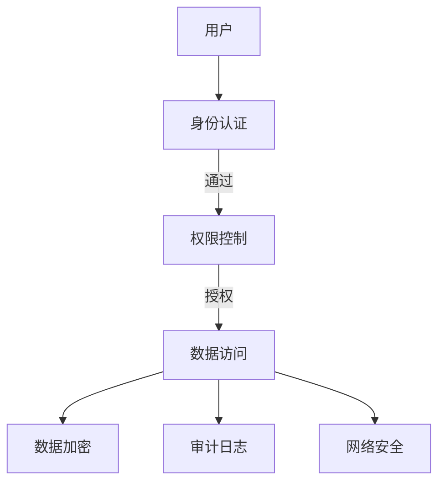
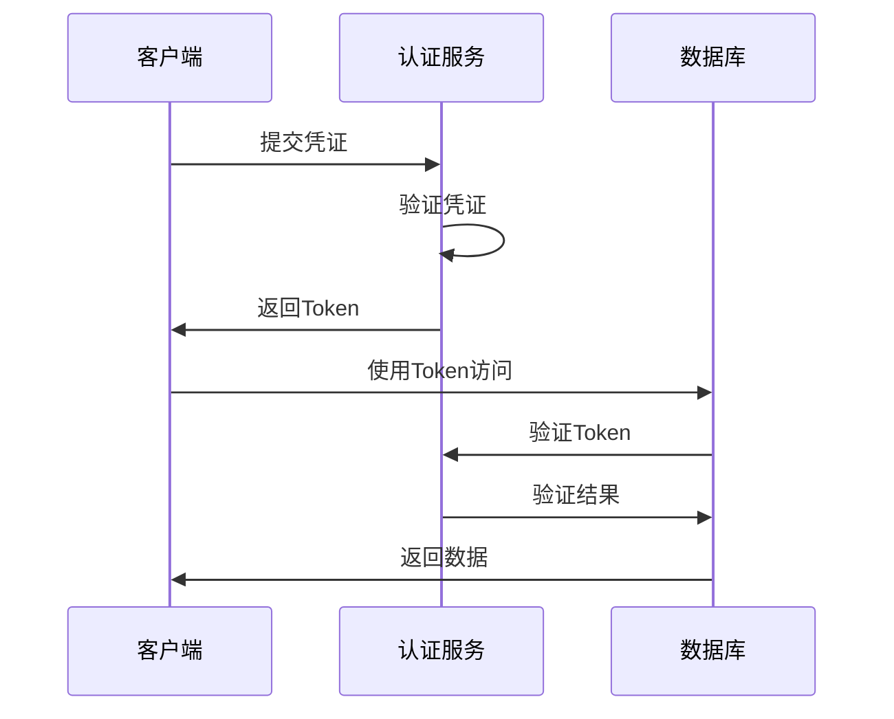
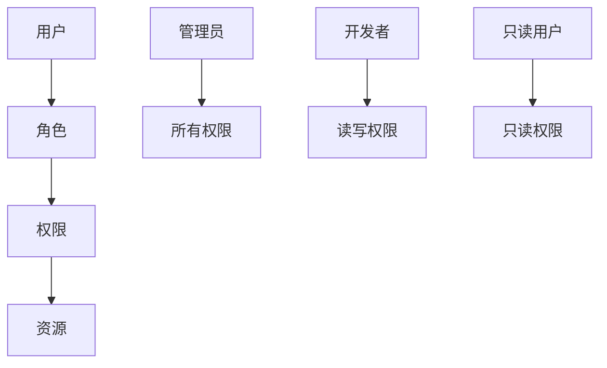
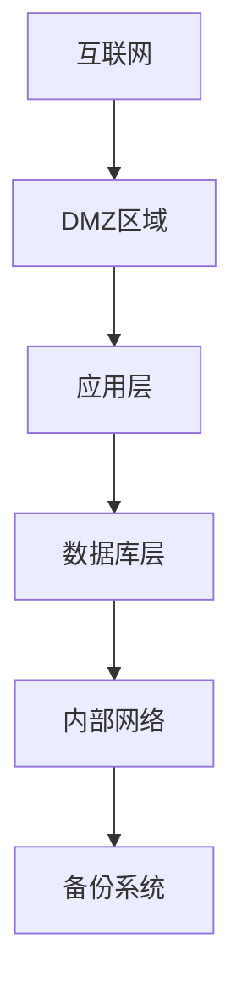
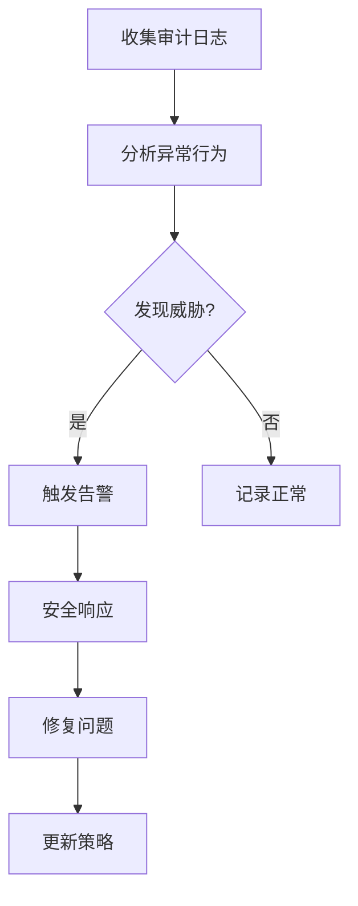

# 1.4.7 NewSQL安全与合规

## 📑 目录

- [1.4.7 NewSQL安全与合规](#147-newsql安全与合规)
  - [📑 目录](#-目录)
  - [1. 概述](#1-概述)
    - [1.1. 安全目标](#11-安全目标)
    - [1.2. 合规要求](#12-合规要求)
  - [2. 安全机制](#2-安全机制)
    - [2.1. 身份认证](#21-身份认证)
      - [2.1.1. 认证方式](#211-认证方式)
      - [2.1.2. 密码策略](#212-密码策略)
      - [2.1.3. 多因素认证（MFA）](#213-多因素认证mfa)
    - [2.2. 权限控制](#22-权限控制)
      - [2.2.1. 基于角色的访问控制（RBAC）](#221-基于角色的访问控制rbac)
      - [2.2.2. 行级安全（RLS）](#222-行级安全rls)
      - [2.2.3. 列级安全](#223-列级安全)
    - [2.3. 数据加密](#23-数据加密)
      - [2.3.1. 传输加密（TLS/SSL）](#231-传输加密tlsssl)
      - [2.3.2. 静态加密（At-Rest Encryption）](#232-静态加密at-rest-encryption)
      - [2.3.3. 应用层加密](#233-应用层加密)
    - [2.4. 审计日志](#24-审计日志)
      - [2.4.1. 审计日志类型](#241-审计日志类型)
      - [2.4.2. 审计日志实现](#242-审计日志实现)
      - [2.4.3. 审计日志分析](#243-审计日志分析)
    - [2.5. 网络安全](#25-网络安全)
      - [2.5.1. 网络隔离](#251-网络隔离)
      - [2.5.2. VPN访问](#252-vpn访问)
    - [2.6. 数据脱敏](#26-数据脱敏)
      - [2.6.1. 静态脱敏](#261-静态脱敏)
      - [2.6.2. 动态脱敏](#262-动态脱敏)
  - [3. 合规标准](#3-合规标准)
    - [3.1. GDPR合规](#31-gdpr合规)
      - [3.1.1. GDPR核心要求](#311-gdpr核心要求)
      - [3.1.2. GDPR实现](#312-gdpr实现)
    - [3.2. SOX合规](#32-sox合规)
      - [3.2.1. SOX核心要求](#321-sox核心要求)
      - [3.2.2. SOX实现](#322-sox实现)
    - [3.3. PCI DSS合规](#33-pci-dss合规)
      - [3.3.1. PCI DSS核心要求](#331-pci-dss核心要求)
      - [3.3.2. PCI DSS实现](#332-pci-dss实现)
    - [3.4. HIPAA合规](#34-hipaa合规)
      - [3.4.1. HIPAA核心要求](#341-hipaa核心要求)
    - [3.5. 其他合规标准](#35-其他合规标准)
  - [4. 实际系统实现](#4-实际系统实现)
    - [4.1. TiDB安全机制](#41-tidb安全机制)
    - [4.2. CockroachDB安全机制](#42-cockroachdb安全机制)
    - [4.3. OceanBase安全机制](#43-oceanbase安全机制)
  - [5. 安全最佳实践](#5-安全最佳实践)
    - [5.1. 安全配置](#51-安全配置)
    - [5.2. 安全审计](#52-安全审计)
    - [5.3. 安全监控](#53-安全监控)
  - [6. 实际应用案例](#6-实际应用案例)
    - [6.1. 金融行业：NewSQL安全架构](#61-金融行业newsql安全架构)
    - [6.2. 互联网行业：分布式安全合规](#62-互联网行业分布式安全合规)
  - [7. 形式化定义](#7-形式化定义)
    - [7.1. 安全模型形式化](#71-安全模型形式化)
    - [7.2. 安全等级形式化](#72-安全等级形式化)
  - [8. 多表征](#8-多表征)
  - [9. 总结与展望](#9-总结与展望)
    - [9.1. 总结](#91-总结)
    - [9.2. 发展趋势](#92-发展趋势)

---

## 1. 概述

### 1.1. 安全目标

**NewSQL安全的核心目标**：

1. **机密性（Confidentiality）**：保护数据不被未授权访问
2. **完整性（Integrity）**：保证数据不被篡改
3. **可用性（Availability）**：保证系统可用
4. **可审计性（Auditability）**：记录所有操作，支持审计

**安全模型**：



### 1.2. 合规要求

**主要合规标准**：

| 合规标准 | 全称 | 适用范围 | 核心要求 |
|---------|------|---------|---------|
| **GDPR** | General Data Protection Regulation | 欧盟 | 数据保护、隐私权 |
| **SOX** | Sarbanes-Oxley Act | 美国上市公司 | 财务审计、内部控制 |
| **PCI DSS** | Payment Card Industry Data Security Standard | 支付卡行业 | 支付数据安全 |
| **HIPAA** | Health Insurance Portability and Accountability Act | 美国医疗 | 医疗数据保护 |

---

## 2. 安全机制

### 2.1. 身份认证

#### 2.1.1. 认证方式

**支持的认证方式**：

1. **密码认证**：用户名+密码
2. **证书认证**：X.509证书
3. **LDAP认证**：企业目录服务
4. **OAuth认证**：第三方认证
5. **Kerberos认证**：企业级认证

**认证流程**：



#### 2.1.2. 密码策略

**密码要求**：

- **最小长度**：至少8-12个字符
- **复杂度**：包含大小写字母、数字、特殊字符
- **过期时间**：定期更换密码
- **历史记录**：不能使用最近N次密码

**实现示例**：

```sql
-- TiDB密码策略配置
SET GLOBAL validate_password.policy = 'STRONG';
SET GLOBAL validate_password.length = 12;
SET GLOBAL validate_password.mixed_case_count = 1;
SET GLOBAL validate_password.number_count = 1;
SET GLOBAL validate_password.special_char_count = 1;

-- 创建用户
CREATE USER 'app_user'@'%' IDENTIFIED BY 'ComplexP@ssw0rd!';
```

#### 2.1.3. 多因素认证（MFA）

**MFA实现**：

```python
class MultiFactorAuth:
    def __init__(self, db, sms_service, totp_service):
        self.db = db
        self.sms_service = sms_service
        self.totp_service = totp_service

    def authenticate(self, username, password, mfa_code):
        """多因素认证"""
        # 第一步：验证密码
        if not self.verify_password(username, password):
            return False

        # 第二步：验证MFA代码
        if not self.verify_mfa(username, mfa_code):
            return False

        return True

    def verify_mfa(self, username, mfa_code):
        """验证MFA代码"""
        # 可以支持TOTP或SMS验证码
        return (self.totp_service.verify(username, mfa_code) or
                self.sms_service.verify(username, mfa_code))
```

### 2.2. 权限控制

#### 2.2.1. 基于角色的访问控制（RBAC）

**RBAC模型**：



**实现示例**：

```sql
-- 创建角色
CREATE ROLE 'admin_role';
CREATE ROLE 'developer_role';
CREATE ROLE 'readonly_role';

-- 授予角色权限
GRANT ALL PRIVILEGES ON *.* TO 'admin_role';
GRANT SELECT, INSERT, UPDATE, DELETE ON app_db.* TO 'developer_role';
GRANT SELECT ON app_db.* TO 'readonly_role';

-- 分配角色给用户
GRANT 'admin_role' TO 'admin_user'@'%';
GRANT 'developer_role' TO 'dev_user'@'%';
GRANT 'readonly_role' TO 'readonly_user'@'%';

-- 激活角色
SET DEFAULT ROLE 'developer_role' FOR 'dev_user'@'%';
```

#### 2.2.2. 行级安全（RLS）

**行级安全实现**：

```sql
-- 创建行级安全策略
CREATE POLICY user_data_policy ON users
    FOR ALL
    TO app_user
    USING (user_id = current_user_id());

-- 启用行级安全
ALTER TABLE users ENABLE ROW LEVEL SECURITY;

-- 用户只能访问自己的数据
SELECT * FROM users;  -- 自动过滤，只返回当前用户的数据
```

#### 2.2.3. 列级安全

**列级安全实现**：

```sql
-- 创建视图，隐藏敏感列
CREATE VIEW user_public AS
SELECT
    user_id,
    username,
    email,
    created_at
FROM users;
-- 不包含password、phone等敏感字段

-- 授予视图权限
GRANT SELECT ON user_public TO 'public_user'@'%';
```

### 2.3. 数据加密

#### 2.3.1. 传输加密（TLS/SSL）

**TLS配置**：

```yaml
# TiDB TLS配置
[security]
ssl-ca = "/path/to/ca.pem"
ssl-cert = "/path/to/server.pem"
ssl-key = "/path/to/server-key.pem"
```

**客户端连接**：

```python
import pymysql

# 使用TLS连接
conn = pymysql.connect(
    host='localhost',
    port=4000,
    user='root',
    password='password',
    ssl={'ca': '/path/to/ca.pem'}
)
```

#### 2.3.2. 静态加密（At-Rest Encryption）

**数据加密实现**：

```sql
-- 创建加密表
CREATE TABLE sensitive_data (
    id BIGINT PRIMARY KEY,
    encrypted_field VARBINARY(255)  -- 加密字段
) ENCRYPTION='Y';

-- 插入加密数据
INSERT INTO sensitive_data (id, encrypted_field)
VALUES (1, AES_ENCRYPT('sensitive_value', 'encryption_key'));
```

**透明数据加密（TDE）**：

```yaml
# TiDB TDE配置
[security]
enable-tde = true
tde-key-id = "arn:aws:kms:region:account:key/key-id"
```

#### 2.3.3. 应用层加密

**应用层加密实现**：

```python
from cryptography.fernet import Fernet

class DataEncryption:
    def __init__(self, key):
        self.cipher = Fernet(key)

    def encrypt(self, data):
        """加密数据"""
        return self.cipher.encrypt(data.encode()).decode()

    def decrypt(self, encrypted_data):
        """解密数据"""
        return self.cipher.decrypt(encrypted_data.encode()).decode()

# 使用示例
encryption = DataEncryption(Fernet.generate_key())

# 存储加密数据
encrypted_ssn = encryption.encrypt("123-45-6789")
db.execute("INSERT INTO users (ssn) VALUES (%s)", (encrypted_ssn,))

# 读取解密数据
encrypted_ssn = db.fetchone()[0]
ssn = encryption.decrypt(encrypted_ssn)
```

### 2.4. 审计日志

#### 2.4.1. 审计日志类型

**审计日志分类**：

1. **访问日志**：记录所有数据库访问
2. **操作日志**：记录所有数据操作（INSERT、UPDATE、DELETE）
3. **权限日志**：记录权限变更
4. **认证日志**：记录认证成功/失败

**审计日志表设计**：

```sql
-- 创建审计日志表
CREATE TABLE audit_log (
    id BIGINT AUTO_INCREMENT PRIMARY KEY,
    event_time TIMESTAMP DEFAULT CURRENT_TIMESTAMP,
    user_name VARCHAR(100),
    host VARCHAR(100),
    database_name VARCHAR(100),
    table_name VARCHAR(100),
    action VARCHAR(50),  -- SELECT, INSERT, UPDATE, DELETE, GRANT, REVOKE
    sql_text TEXT,
    affected_rows INT,
    execution_time_ms INT,
    ip_address VARCHAR(45),
    user_agent VARCHAR(255),
    INDEX idx_event_time (event_time),
    INDEX idx_user_name (user_name),
    INDEX idx_action (action)
) PARTITION BY RANGE (TO_DAYS(event_time)) (
    PARTITION p202401 VALUES LESS THAN (TO_DAYS('2024-02-01')),
    PARTITION p202402 VALUES LESS THAN (TO_DAYS('2024-03-01')),
    PARTITION p_future VALUES LESS THAN MAXVALUE
);
```

#### 2.4.2. 审计日志实现

**触发器实现**：

```sql
-- 创建审计触发器
DELIMITER $$

CREATE TRIGGER audit_users_insert
AFTER INSERT ON users
FOR EACH ROW
BEGIN
    INSERT INTO audit_log (
        user_name, database_name, table_name, action, sql_text
    ) VALUES (
        USER(), DATABASE(), 'users', 'INSERT',
        CONCAT('INSERT INTO users VALUES (', NEW.id, ', ', NEW.username, ')')
    );
END$$

DELIMITER ;
```

**应用层实现**：

```python
class AuditLogger:
    def __init__(self, db):
        self.db = db

    def log_query(self, user, action, sql, affected_rows, execution_time):
        """记录查询日志"""
        self.db.execute("""
            INSERT INTO audit_log
            (user_name, action, sql_text, affected_rows, execution_time_ms)
            VALUES (%s, %s, %s, %s, %s)
        """, (user, action, sql, affected_rows, execution_time))

    def log_access(self, user, ip_address, user_agent):
        """记录访问日志"""
        self.db.execute("""
            INSERT INTO audit_log
            (user_name, action, ip_address, user_agent)
            VALUES (%s, 'ACCESS', %s, %s)
        """, (user, ip_address, user_agent))
```

#### 2.4.3. 审计日志分析

**审计日志查询**：

```sql
-- 查询特定用户的操作
SELECT * FROM audit_log
WHERE user_name = 'admin_user'
  AND event_time >= NOW() - INTERVAL 24 HOUR
ORDER BY event_time DESC;

-- 查询敏感操作
SELECT * FROM audit_log
WHERE action IN ('DELETE', 'DROP', 'TRUNCATE')
  AND event_time >= NOW() - INTERVAL 7 DAY;

-- 查询异常访问
SELECT
    user_name,
    ip_address,
    COUNT(*) as access_count
FROM audit_log
WHERE event_time >= NOW() - INTERVAL 1 HOUR
GROUP BY user_name, ip_address
HAVING access_count > 100;
```

### 2.5. 网络安全

#### 2.5.1. 网络隔离

**网络架构**：



**防火墙规则**：

```bash
# 只允许应用服务器访问数据库
iptables -A INPUT -p tcp --dport 4000 -s 10.0.1.0/24 -j ACCEPT
iptables -A INPUT -p tcp --dport 4000 -j DROP

# 允许管理服务器访问
iptables -A INPUT -p tcp --dport 4000 -s 10.0.2.100 -j ACCEPT
```

#### 2.5.2. VPN访问

**VPN配置**：

```yaml
# OpenVPN配置
client
dev tun
proto udp
remote vpn.example.com 1194
ca ca.crt
cert client.crt
key client.key
```

### 2.6. 数据脱敏

#### 2.6.1. 静态脱敏

**数据脱敏实现**：

```python
import hashlib
import re

class DataMasking:
    def mask_email(self, email):
        """脱敏邮箱"""
        parts = email.split('@')
        if len(parts) == 2:
            username = parts[0]
            domain = parts[1]
            masked_username = username[0] + '*' * (len(username) - 1)
            return f"{masked_username}@{domain}"
        return email

    def mask_phone(self, phone):
        """脱敏手机号"""
        if len(phone) >= 11:
            return phone[:3] + '****' + phone[-4:]
        return phone

    def mask_id_card(self, id_card):
        """脱敏身份证号"""
        if len(id_card) >= 18:
            return id_card[:6] + '*' * 8 + id_card[-4:]
        return id_card

    def hash_sensitive(self, data):
        """哈希敏感数据"""
        return hashlib.sha256(data.encode()).hexdigest()

# 使用示例
masking = DataMasking()
masked_email = masking.mask_email("user@example.com")  # u***@example.com
masked_phone = masking.mask_phone("13812345678")  # 138****5678
```

#### 2.6.2. 动态脱敏

**动态脱敏实现**：

```sql
-- 创建脱敏视图
CREATE VIEW users_masked AS
SELECT
    user_id,
    username,
    CONCAT(LEFT(email, 1), '***', SUBSTRING(email, LOCATE('@', email))) as email,
    CONCAT(LEFT(phone, 3), '****', RIGHT(phone, 4)) as phone
FROM users;

-- 授予视图权限
GRANT SELECT ON users_masked TO 'analyst'@'%';
```

---

## 3. 合规标准

### 3.1. GDPR合规

#### 3.1.1. GDPR核心要求

**GDPR主要要求**：

1. **数据最小化**：只收集必要的数据
2. **目的限制**：数据只能用于指定目的
3. **数据准确性**：保证数据准确
4. **存储限制**：数据不能无限期存储
5. **数据主体权利**：访问、更正、删除、可携带权

#### 3.1.2. GDPR实现

**数据主体权利实现**：

```python
class GDPRCompliance:
    def __init__(self, db):
        self.db = db

    def get_user_data(self, user_id):
        """获取用户数据（访问权）"""
        return self.db.execute("""
            SELECT * FROM users WHERE user_id = %s
        """, (user_id,))

    def update_user_data(self, user_id, data):
        """更新用户数据（更正权）"""
        self.db.execute("""
            UPDATE users SET %s WHERE user_id = %s
        """, (data, user_id))

    def delete_user_data(self, user_id):
        """删除用户数据（删除权）"""
        # 软删除
        self.db.execute("""
            UPDATE users SET deleted_at = NOW() WHERE user_id = %s
        """, (user_id,))

        # 记录删除日志
        self.db.execute("""
            INSERT INTO gdpr_deletion_log (user_id, deleted_at)
            VALUES (%s, NOW())
        """, (user_id,))

    def export_user_data(self, user_id):
        """导出用户数据（可携带权）"""
        data = self.get_user_data(user_id)
        # 导出为JSON格式
        return json.dumps(data, indent=2)
```

**数据保留策略**：

```sql
-- 自动删除过期数据
CREATE EVENT delete_old_data
ON SCHEDULE EVERY 1 DAY
DO
  DELETE FROM user_logs
  WHERE created_at < DATE_SUB(NOW(), INTERVAL 2 YEAR);
```

### 3.2. SOX合规

#### 3.2.1. SOX核心要求

**SOX主要要求**：

1. **财务数据完整性**：保证财务数据准确
2. **访问控制**：限制财务数据访问
3. **审计追踪**：记录所有财务操作
4. **变更管理**：记录所有配置变更

#### 3.2.2. SOX实现

**财务数据审计**：

```sql
-- 创建财务数据审计表
CREATE TABLE financial_audit (
    id BIGINT AUTO_INCREMENT PRIMARY KEY,
    transaction_id BIGINT,
    account_id BIGINT,
    amount DECIMAL(15,2),
    transaction_type VARCHAR(50),
    user_name VARCHAR(100),
    ip_address VARCHAR(45),
    event_time TIMESTAMP DEFAULT CURRENT_TIMESTAMP,
    before_value JSON,
    after_value JSON,
    INDEX idx_transaction_id (transaction_id),
    INDEX idx_event_time (event_time)
);

-- 创建审计触发器
DELIMITER $$

CREATE TRIGGER audit_financial_update
BEFORE UPDATE ON financial_transactions
FOR EACH ROW
BEGIN
    INSERT INTO financial_audit (
        transaction_id, account_id, amount, transaction_type,
        user_name, before_value, after_value
    ) VALUES (
        NEW.id, NEW.account_id, NEW.amount, NEW.type,
        USER(),
        JSON_OBJECT('amount', OLD.amount, 'status', OLD.status),
        JSON_OBJECT('amount', NEW.amount, 'status', NEW.status)
    );
END$$

DELIMITER ;
```

### 3.3. PCI DSS合规

#### 3.3.1. PCI DSS核心要求

**PCI DSS主要要求**：

1. **数据加密**：加密存储和传输
2. **访问控制**：限制支付数据访问
3. **网络安全**：保护网络
4. **监控和测试**：持续监控和测试

#### 3.3.2. PCI DSS实现

**支付数据加密**：

```sql
-- 创建加密支付数据表
CREATE TABLE payment_cards (
    id BIGINT AUTO_INCREMENT PRIMARY KEY,
    user_id BIGINT,
    card_token VARCHAR(255),  -- 加密的卡号token
    last_four_digits CHAR(4),  -- 最后4位
    expiry_month TINYINT,
    expiry_year SMALLINT,
    encrypted_cvv VARBINARY(255),  -- 加密的CVV
    created_at TIMESTAMP DEFAULT CURRENT_TIMESTAMP,
    INDEX idx_user_id (user_id)
) ENCRYPTION='Y';

-- 插入加密数据
INSERT INTO payment_cards (user_id, card_token, last_four_digits, encrypted_cvv)
VALUES (
    123,
    'tok_1234567890abcdef',  -- 由支付网关生成的token
    '1234',
    AES_ENCRYPT('123', 'encryption_key')
);
```

### 3.4. HIPAA合规

#### 3.4.1. HIPAA核心要求

**HIPAA主要要求**：

1. **访问控制**：限制医疗数据访问
2. **审计控制**：记录所有访问
3. **数据加密**：加密医疗数据
4. **传输安全**：安全传输数据

### 3.5. 其他合规标准

**其他重要合规标准**：

- **ISO 27001**：信息安全管理
- **SOC 2**：服务组织控制
- **NIST**：美国国家标准与技术研究院标准

---

## 4. 实际系统实现

### 4.1. TiDB安全机制

**TiDB安全特性**：

1. **身份认证**：支持密码、证书认证
2. **权限控制**：RBAC、行级安全
3. **数据加密**：TLS传输加密、TDE静态加密
4. **审计日志**：完整的审计日志

**配置示例**：

```yaml
# TiDB安全配置
[security]
ssl-ca = "/path/to/ca.pem"
ssl-cert = "/path/to/server.pem"
ssl-key = "/path/to/server-key.pem"
enable-tde = true
audit-log = true
```

### 4.2. CockroachDB安全机制

**CockroachDB安全特性**：

1. **身份认证**：证书认证、密码认证
2. **权限控制**：细粒度权限控制
3. **数据加密**：TLS传输加密
4. **审计日志**：结构化审计日志

**配置示例**：

```bash
# CockroachDB启动配置
cockroach start \
  --certs-dir=/certs \
  --listen-addr=0.0.0.0:26257 \
  --advertise-addr=node1:26257 \
  --sql-audit-dir=/var/log/cockroach/audit
```

### 4.3. OceanBase安全机制

**OceanBase安全特性**：

1. **身份认证**：密码认证、LDAP认证
2. **权限控制**：RBAC、行级安全
3. **数据加密**：TLS传输加密
4. **审计日志**：完整审计日志

---

## 5. 安全最佳实践

### 5.1. 安全配置

**安全配置清单**：

1. ✅ 启用TLS/SSL加密
2. ✅ 配置强密码策略
3. ✅ 启用审计日志
4. ✅ 配置防火墙规则
5. ✅ 定期更新系统
6. ✅ 限制网络访问
7. ✅ 启用数据加密
8. ✅ 配置备份加密

### 5.2. 安全审计

**安全审计流程**：



### 5.3. 安全监控

**安全监控指标**：

- **认证失败次数**：检测暴力破解
- **异常访问模式**：检测异常行为
- **权限变更**：监控权限变更
- **数据访问模式**：检测数据泄露

---

## 6. 实际应用案例

### 6.1. 金融行业：NewSQL安全架构

**场景**：

- 高安全要求
- 严格合规要求
- 实时监控需求

**实现**：

```yaml
# 安全配置
security:
  authentication:
    method: certificate
    mfa: enabled

  authorization:
    rbac: enabled
    rls: enabled

  encryption:
    tls: enabled
    tde: enabled

  audit:
    enabled: true
    retention: 7years
```

### 6.2. 互联网行业：分布式安全合规

**场景**：

- 大规模分布式系统
- 多租户环境
- 数据隐私保护

**实现**：

- 多租户隔离
- 数据脱敏
- 访问控制
- 审计日志

---

## 7. 形式化定义

### 7.1. 安全模型形式化

**访问控制模型**：

设访问控制模型为 $AC = (S, O, A, P)$，其中：

- $S$：主体集合（用户、角色）
- $O$：客体集合（数据、资源）
- $A$：操作集合（SELECT、INSERT、UPDATE、DELETE）
- $P$：权限策略

**访问决策函数**：

$$
access(s, o, a) = \begin{cases}
\text{允许} & \text{if } (s, o, a) \in P \\
\text{拒绝} & \text{otherwise}
\end{cases}
$$

### 7.2. 安全等级形式化

**安全等级定义**：

$$\text{安全等级} = f(\text{认证强度}, \text{加密强度}, \text{审计完整性})$$

其中：

- 认证强度：$A \in [0, 1]$
- 加密强度：$E \in [0, 1]$
- 审计完整性：$I \in [0, 1]$

---

## 8. 多表征

本主题支持多种表征方式：

1. **符号表征**：安全模型公式、权限策略
2. **图结构**：安全架构图、访问控制图
3. **代码实现**：安全配置代码、审计代码
4. **自然语言**：概念定义、最佳实践
5. **可视化**：安全监控面板、审计报告

---

## 9. 总结与展望

### 9.1. 总结

NewSQL安全与合规的核心要点：

1. **安全机制**：身份认证、权限控制、数据加密、审计日志
2. **合规标准**：GDPR、SOX、PCI DSS、HIPAA
3. **最佳实践**：安全配置、安全审计、安全监控
4. **实际实现**：TiDB、CockroachDB、OceanBase等系统

### 9.2. 发展趋势

**未来发展方向**：

1. **零信任架构**：不信任任何网络
2. **AI安全**：AI驱动的安全检测
3. **自动化合规**：自动合规检查
4. **隐私计算**：联邦学习、同态加密

---

**参考文献**：

1. GDPR: <https://gdpr.eu/>
2. SOX: <https://www.soxlaw.com/>
3. PCI DSS: <https://www.pcisecuritystandards.org/>
4. TiDB Security: <https://docs.pingcap.com/tidb/stable/security>

---

[返回NewSQL导航](README.md)
