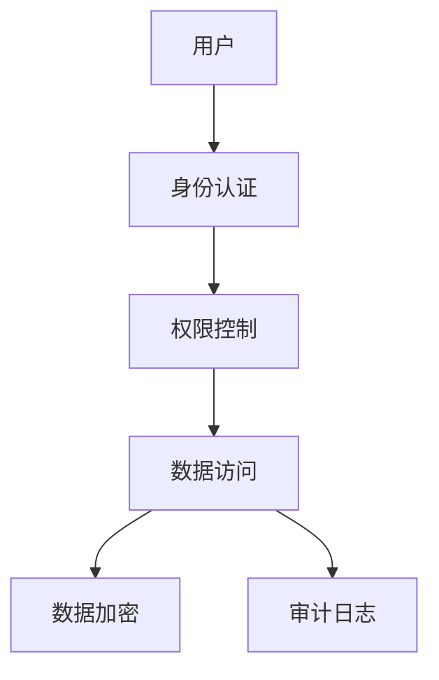

# 1.4.7 安全与合规

## 1.4.7.1 安全机制
- 身份认证、权限控制、数据加密。
- 审计日志、网络安全、数据脱敏。

## 1.4.7.2 合规要求
| 合规标准 | 要求 | NewSQL支持 |
|----------|------|------------|
| GDPR     | 数据保护 | 加密、访问控制 |
| SOX      | 审计追踪 | 审计日志 |
| PCI DSS  | 支付安全 | 数据加密 |

## 1.4.7.3 行业案例与多表征

### 金融行业：NewSQL安全架构


### 互联网行业：分布式安全合规
- 见[5.1.1-金融数据科学基础理论](../../../../5-行业应用与场景/5.1-金融数据分析/5.1.1-金融数据科学基础理论.md)

### Latex公式
$$
\text{安全等级} = \text{认证强度} \times \text{加密强度} \times \text{审计完整性}
$$

### 安全配置示例
```sql
-- TiDB安全配置
CREATE USER 'app_user'@'%' IDENTIFIED BY 'password';
GRANT SELECT, INSERT ON database.* TO 'app_user'@'%';

-- 审计日志
CREATE TABLE audit_log (
  id BIGINT AUTO_INCREMENT PRIMARY KEY,
  user_name VARCHAR(100),
  action VARCHAR(50),
  table_name VARCHAR(100),
  timestamp TIMESTAMP
);
```

[返回NewSQL导航](README.md) 