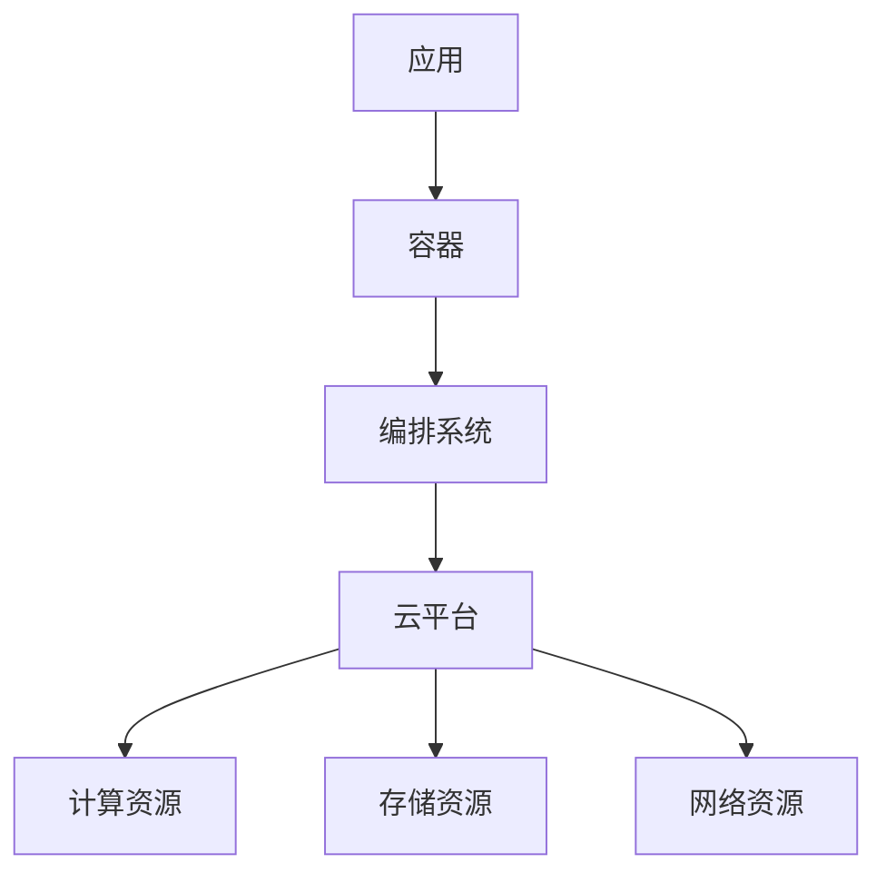
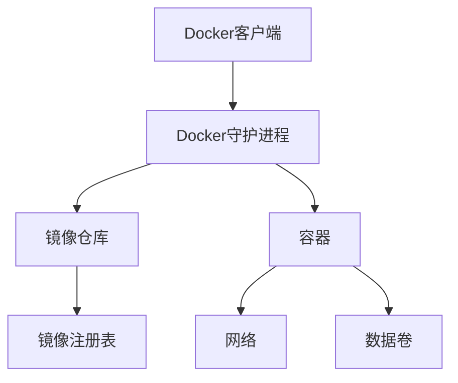
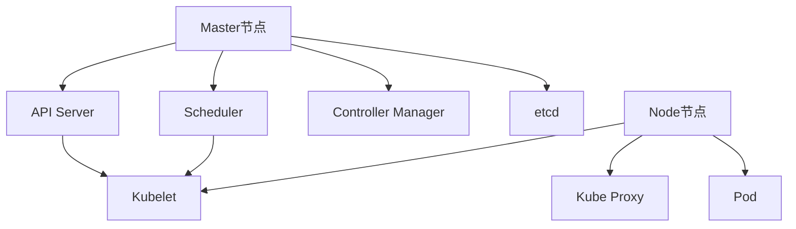
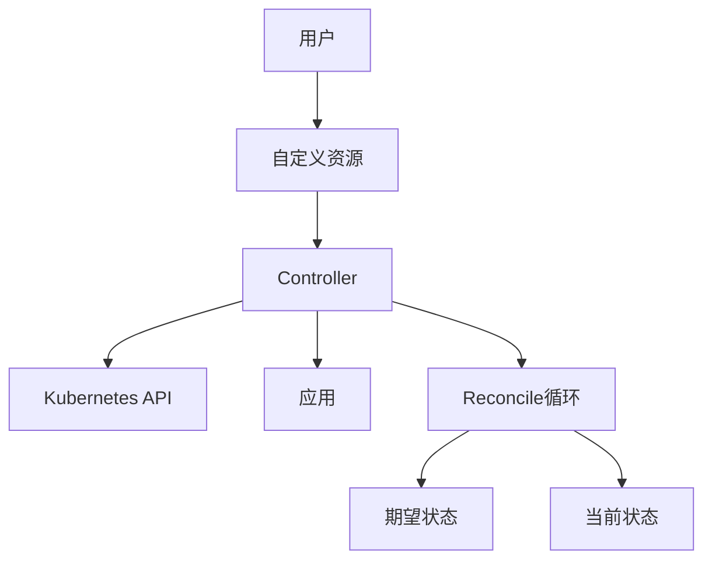
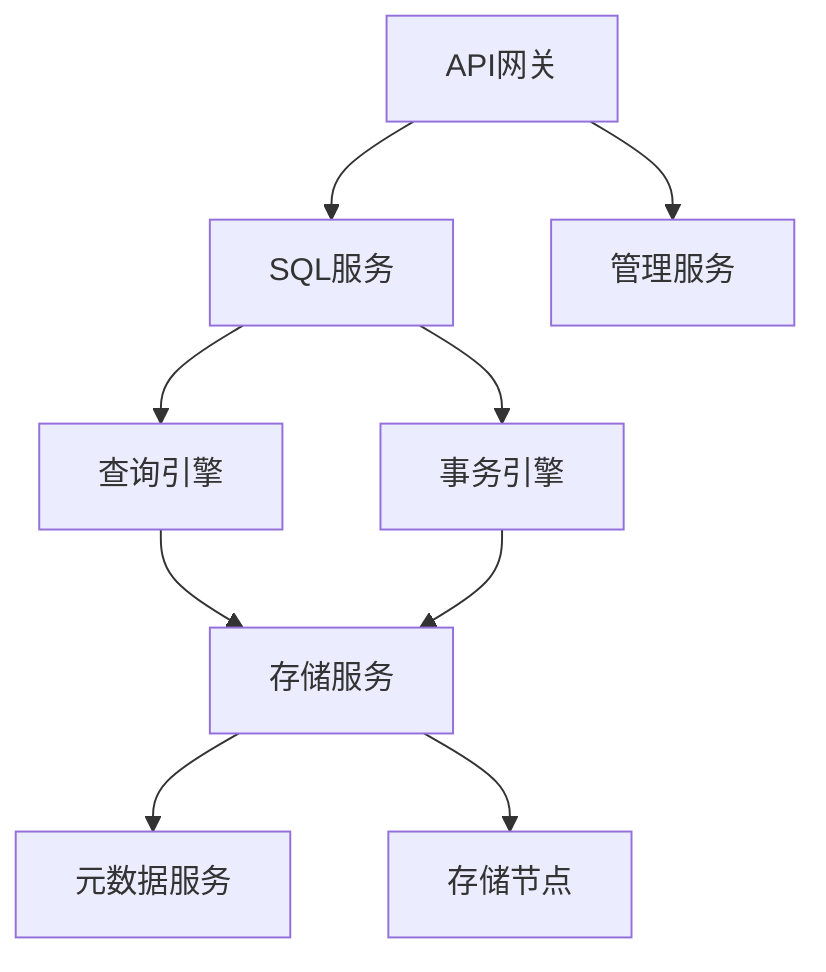
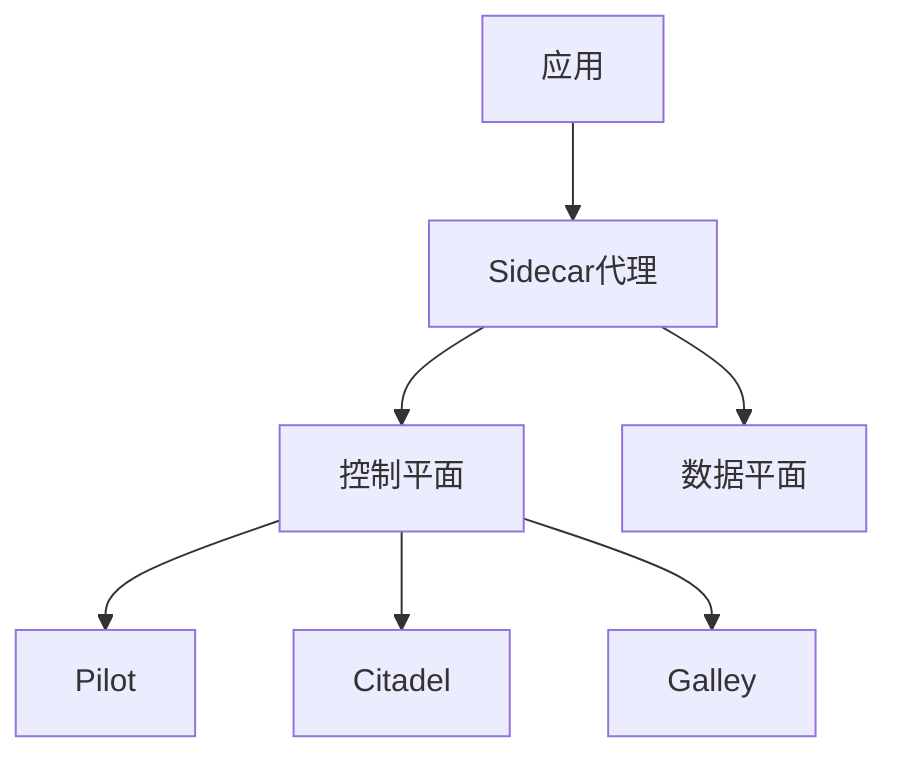
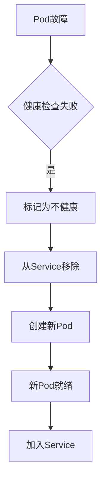
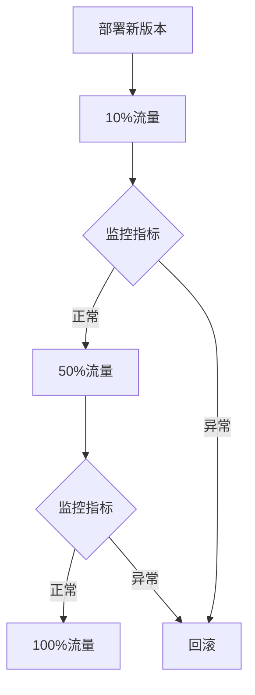

# 1.4.8 NewSQL云原生与容器化部署

## 📑 目录

- [1.4.8 NewSQL云原生与容器化部署](#148-newsql云原生与容器化部署)
  - [📑 目录](#-目录)
  - [1. 概述](#1-概述)
    - [1.1. 云原生定义](#11-云原生定义)
    - [1.2. 容器化优势](#12-容器化优势)
  - [2. 容器化部署](#2-容器化部署)
    - [2.1. Docker容器化](#21-docker容器化)
      - [2.1.1. Docker基础](#211-docker基础)
      - [2.1.2. Dockerfile编写](#212-dockerfile编写)
    - [2.2. 容器镜像构建](#22-容器镜像构建)
      - [2.2.1. 镜像构建最佳实践](#221-镜像构建最佳实践)
      - [2.2.2. 镜像版本管理](#222-镜像版本管理)
    - [2.3. 容器编排](#23-容器编排)
      - [2.3.1. Docker Compose](#231-docker-compose)
  - [3. Kubernetes部署](#3-kubernetes部署)
    - [3.1. Kubernetes基础](#31-kubernetes基础)
      - [3.1.1. Kubernetes架构](#311-kubernetes架构)
      - [3.1.2. 核心概念](#312-核心概念)
    - [3.2. StatefulSet部署](#32-statefulset部署)
      - [3.2.1. StatefulSet特点](#321-statefulset特点)
      - [3.2.2. Service配置](#322-service配置)
    - [3.3. Operator模式](#33-operator模式)
      - [3.3.1. Operator概念](#331-operator概念)
      - [3.3.2. TiDB Operator](#332-tidb-operator)
    - [3.4. Helm Chart](#34-helm-chart)
      - [3.4.1. Helm基础](#341-helm基础)
      - [3.4.2. Helm部署](#342-helm部署)
  - [4. 云原生架构](#4-云原生架构)
    - [4.1. 微服务架构](#41-微服务架构)
      - [4.1.1. 微服务拆分](#411-微服务拆分)
      - [4.1.2. 服务间通信](#412-服务间通信)
    - [4.2. 服务网格](#42-服务网格)
      - [4.2.1. Istio服务网格](#421-istio服务网格)
      - [4.2.2. Istio配置](#422-istio配置)
    - [4.3. 服务发现](#43-服务发现)
      - [4.3.1. Kubernetes服务发现](#431-kubernetes服务发现)
    - [4.4. 配置管理](#44-配置管理)
      - [4.4.1. ConfigMap](#441-configmap)
      - [4.4.2. Secret](#442-secret)
  - [5. 弹性扩展](#5-弹性扩展)
    - [5.1. 水平扩展](#51-水平扩展)
      - [5.1.1. 手动扩展](#511-手动扩展)
      - [5.1.2. 自动扩展](#512-自动扩展)
    - [5.2. 自动扩缩容](#52-自动扩缩容)
      - [5.2.1. 基于CPU的扩缩容](#521-基于cpu的扩缩容)
      - [5.2.2. 基于自定义指标的扩缩容](#522-基于自定义指标的扩缩容)
    - [5.3. 资源管理](#53-资源管理)
      - [5.3.1. 资源请求和限制](#531-资源请求和限制)
      - [5.3.2. 资源配额](#532-资源配额)
  - [6. 高可用与故障恢复](#6-高可用与故障恢复)
    - [6.1. 自动故障恢复](#61-自动故障恢复)
      - [6.1.1. Pod重启策略](#611-pod重启策略)
      - [6.1.2. 故障转移](#612-故障转移)
    - [6.2. 健康检查](#62-健康检查)
      - [6.2.1. Liveness Probe](#621-liveness-probe)
      - [6.2.2. Readiness Probe](#622-readiness-probe)
    - [6.3. 滚动更新](#63-滚动更新)
      - [6.3.1. 滚动更新策略](#631-滚动更新策略)
      - [6.3.2. 金丝雀发布](#632-金丝雀发布)
  - [7. 实际系统部署](#7-实际系统部署)
    - [7.1. TiDB Kubernetes部署](#71-tidb-kubernetes部署)
    - [7.2. CockroachDB Kubernetes部署](#72-cockroachdb-kubernetes部署)
    - [7.3. OceanBase Kubernetes部署](#73-oceanbase-kubernetes部署)
  - [8. 监控与运维](#8-监控与运维)
    - [8.1. 日志管理](#81-日志管理)
      - [8.1.1. 日志收集](#811-日志收集)
    - [8.2. 监控集成](#82-监控集成)
      - [8.2.1. Prometheus监控](#821-prometheus监控)
    - [8.3. 备份与恢复](#83-备份与恢复)
      - [8.3.1. 备份策略](#831-备份策略)
  - [9. 形式化定义](#9-形式化定义)
    - [9.1. 云原生系统形式化](#91-云原生系统形式化)
  - [10. 多表征](#10-多表征)
  - [11. 总结与展望](#11-总结与展望)
    - [11.1. 总结](#111-总结)
    - [11.2. 发展趋势](#112-发展趋势)

---

## 1. 概述

### 1.1. 云原生定义

**云原生（Cloud Native）**是一种构建和运行应用程序的方法，充分利用云计算的优势：

1. **容器化**：使用容器打包应用
2. **微服务**：应用拆分为微服务
3. **动态编排**：使用编排系统管理容器
4. **DevOps**：持续集成和持续部署

**云原生架构**：



### 1.2. 容器化优势

**容器化的优势**：

1. **环境一致性**：开发、测试、生产环境一致
2. **快速部署**：秒级启动和停止
3. **资源隔离**：进程级资源隔离
4. **易于扩展**：水平扩展简单
5. **版本管理**：镜像版本管理

**对比传统部署**：

| 特性 | 传统部署 | 容器化部署 |
|------|---------|-----------|
| **启动时间** | 分钟级 | 秒级 |
| **资源利用率** | 低 | 高 |
| **环境一致性** | 难保证 | 易保证 |
| **扩展性** | 复杂 | 简单 |
| **版本管理** | 复杂 | 简单 |

---

## 2. 容器化部署

### 2.1. Docker容器化

#### 2.1.1. Docker基础

**Docker架构**：



#### 2.1.2. Dockerfile编写

**TiDB Dockerfile示例**：

```dockerfile
# TiDB Dockerfile
FROM ubuntu:20.04

# 安装依赖
RUN apt-get update && apt-get install -y \
    wget \
    curl \
    && rm -rf /var/lib/apt/lists/*

# 安装TiDB
RUN wget https://download.pingcap.org/tidb-latest-linux-amd64.tar.gz && \
    tar -xzf tidb-latest-linux-amd64.tar.gz && \
    mv tidb-latest-linux-amd64/bin/* /usr/local/bin/ && \
    rm -rf tidb-latest-linux-amd64*

# 创建数据目录
RUN mkdir -p /var/lib/tidb/data

# 暴露端口
EXPOSE 4000 10080

# 启动命令
CMD ["tidb-server"]
```

**多阶段构建**：

```dockerfile
# 构建阶段
FROM golang:1.19 AS builder
WORKDIR /app
COPY . .
RUN go build -o tidb-server ./cmd/tidb-server

# 运行阶段
FROM ubuntu:20.04
RUN apt-get update && apt-get install -y ca-certificates
COPY --from=builder /app/tidb-server /usr/local/bin/
CMD ["tidb-server"]
```

### 2.2. 容器镜像构建

#### 2.2.1. 镜像构建最佳实践

**最佳实践**：

1. **使用多阶段构建**：减小镜像大小
2. **使用.dockerignore**：排除不需要的文件
3. **层缓存优化**：合理安排COPY顺序
4. **使用官方基础镜像**：安全可靠
5. **最小化镜像**：只包含必要组件

**.dockerignore示例**：

```dockerignore
# .dockerignore
.git
.gitignore
*.md
*.log
node_modules
.env
.DS_Store
```

#### 2.2.2. 镜像版本管理

**版本标签策略**：

```bash
# 构建镜像
docker build -t tidb:latest .
docker build -t tidb:v6.5.0 .
docker build -t tidb:v6.5.0-20240116 .

# 推送到仓库
docker tag tidb:latest registry.example.com/tidb:latest
docker push registry.example.com/tidb:latest
```

### 2.3. 容器编排

#### 2.3.1. Docker Compose

**docker-compose.yml示例**：

```yaml
version: '3.8'

services:
  pd:
    image: pingcap/pd:latest
    ports:
      - "2379:2379"
    volumes:
      - pd-data:/data
    command:
      - --name=pd1
      - --client-urls=http://0.0.0.0:2379
      - --peer-urls=http://0.0.0.0:2380
      - --data-dir=/data/pd

  tikv:
    image: pingcap/tikv:latest
    ports:
      - "20160:20160"
    volumes:
      - tikv-data:/data
    depends_on:
      - pd
    command:
      - --addr=0.0.0.0:20160
      - --advertise-addr=tikv:20160
      - --pd=pd:2379
      - --data-dir=/data/tikv

  tidb:
    image: pingcap/tidb:latest
    ports:
      - "4000:4000"
      - "10080:10080"
    depends_on:
      - pd
      - tikv
    command:
      - --store=tikv
      - --path=pd:2379

volumes:
  pd-data:
  tikv-data:
```

---

## 3. Kubernetes部署

### 3.1. Kubernetes基础

#### 3.1.1. Kubernetes架构

**Kubernetes组件**：



#### 3.1.2. 核心概念

**Kubernetes核心资源**：

1. **Pod**：最小部署单元
2. **Deployment**：无状态应用部署
3. **StatefulSet**：有状态应用部署
4. **Service**：服务发现和负载均衡
5. **ConfigMap**：配置管理
6. **Secret**：密钥管理
7. **PersistentVolume**：持久化存储

### 3.2. StatefulSet部署

#### 3.2.1. StatefulSet特点

**StatefulSet特性**：

1. **稳定的网络标识**：每个Pod有唯一标识
2. **有序部署**：按顺序创建和删除
3. **持久化存储**：每个Pod有独立的存储

**StatefulSet示例**：

```yaml
apiVersion: apps/v1
kind: StatefulSet
metadata:
  name: tidb-cluster
spec:
  serviceName: "tidb"
  replicas: 3
  selector:
    matchLabels:
      app: tidb
  template:
    metadata:
      labels:
        app: tidb
    spec:
      containers:
      - name: tidb
        image: pingcap/tidb:latest
        ports:
        - containerPort: 4000
          name: mysql
        - containerPort: 10080
          name: status
        volumeMounts:
        - name: data
          mountPath: /var/lib/tidb
        env:
        - name: PD_ADDRESS
          value: "pd-service:2379"
  volumeClaimTemplates:
  - metadata:
      name: data
    spec:
      accessModes: [ "ReadWriteOnce" ]
      resources:
        requests:
          storage: 100Gi
```

#### 3.2.2. Service配置

**Service示例**：

```yaml
apiVersion: v1
kind: Service
metadata:
  name: tidb-service
spec:
  type: LoadBalancer
  ports:
  - port: 4000
    targetPort: 4000
    protocol: TCP
    name: mysql
  selector:
    app: tidb
```

### 3.3. Operator模式

#### 3.3.1. Operator概念

**Operator**是Kubernetes的扩展，用于管理复杂的有状态应用。

**Operator架构**：



#### 3.3.2. TiDB Operator

**TiDB Operator部署**：

```yaml
apiVersion: pingcap.com/v1alpha1
kind: TidbCluster
metadata:
  name: tidb-cluster
spec:
  version: v6.5.0
  pd:
    replicas: 3
    requests:
      storage: "10Gi"
      cpu: 1000m
      memory: 2Gi
  tikv:
    replicas: 3
    requests:
      storage: "100Gi"
      cpu: 2000m
      memory: 4Gi
  tidb:
    replicas: 2
    requests:
      cpu: 1000m
      memory: 2Gi
```

### 3.4. Helm Chart

#### 3.4.1. Helm基础

**Helm**是Kubernetes的包管理工具。

**Helm Chart结构**：

```text
tidb-chart/
├── Chart.yaml
├── values.yaml
├── templates/
│   ├── deployment.yaml
│   ├── service.yaml
│   └── configmap.yaml
└── charts/
```

#### 3.4.2. Helm部署

**使用Helm部署**：

```bash
# 添加Helm仓库
helm repo add pingcap https://charts.pingcap.org
helm repo update

# 安装TiDB
helm install tidb-cluster pingcap/tidb-cluster \
  --set pd.replicas=3 \
  --set tikv.replicas=3 \
  --set tidb.replicas=2

# 升级
helm upgrade tidb-cluster pingcap/tidb-cluster \
  --set tidb.replicas=3

# 卸载
helm uninstall tidb-cluster
```

---

## 4. 云原生架构

### 4.1. 微服务架构

#### 4.1.1. 微服务拆分

**NewSQL微服务架构**：



#### 4.1.2. 服务间通信

**服务通信方式**：

1. **同步通信**：REST API、gRPC
2. **异步通信**：消息队列、事件总线

**gRPC示例**：

```protobuf
// storage.proto
syntax = "proto3";

service StorageService {
  rpc Get(GetRequest) returns (GetResponse);
  rpc Put(PutRequest) returns (PutResponse);
}

message GetRequest {
  string key = 1;
}

message GetResponse {
  bytes value = 1;
}
```

### 4.2. 服务网格

#### 4.2.1. Istio服务网格

**Istio架构**：



#### 4.2.2. Istio配置

**VirtualService示例**：

```yaml
apiVersion: networking.istio.io/v1alpha3
kind: VirtualService
metadata:
  name: tidb-service
spec:
  hosts:
  - tidb-service
  http:
  - match:
    - uri:
        prefix: "/"
    route:
    - destination:
        host: tidb-service
        subset: v1
      weight: 90
    - destination:
        host: tidb-service
        subset: v2
      weight: 10
```

### 4.3. 服务发现

#### 4.3.1. Kubernetes服务发现

**服务发现机制**：

1. **DNS服务发现**：通过Service名称解析
2. **环境变量**：通过环境变量注入
3. **Service Mesh**：通过服务网格发现

**DNS服务发现**：

```python
import socket

# 通过DNS解析服务
def get_service_endpoint(service_name, namespace='default'):
    dns_name = f"{service_name}.{namespace}.svc.cluster.local"
    return socket.gethostbyname(dns_name)

# 使用示例
tidb_host = get_service_endpoint("tidb-service")
```

### 4.4. 配置管理

#### 4.4.1. ConfigMap

**ConfigMap示例**：

```yaml
apiVersion: v1
kind: ConfigMap
metadata:
  name: tidb-config
data:
  config.toml: |
    [log]
    level = "info"

    [performance]
    max-procs = 16
    max-memory = "32GB"
```

**使用ConfigMap**：

```yaml
apiVersion: v1
kind: Pod
spec:
  containers:
  - name: tidb
    image: pingcap/tidb:latest
    volumeMounts:
    - name: config
      mountPath: /etc/tidb
  volumes:
  - name: config
    configMap:
      name: tidb-config
```

#### 4.4.2. Secret

**Secret示例**：

```yaml
apiVersion: v1
kind: Secret
metadata:
  name: tidb-secret
type: Opaque
data:
  password: cGFzc3dvcmQ=  # base64编码
```

---

## 5. 弹性扩展

### 5.1. 水平扩展

#### 5.1.1. 手动扩展

**扩展StatefulSet**：

```bash
# 扩展TiDB实例
kubectl scale statefulset tidb-cluster --replicas=5

# 查看扩展状态
kubectl get pods -l app=tidb
```

#### 5.1.2. 自动扩展

**HPA（Horizontal Pod Autoscaler）配置**：

```yaml
apiVersion: autoscaling/v2
kind: HorizontalPodAutoscaler
metadata:
  name: tidb-hpa
spec:
  scaleTargetRef:
    apiVersion: apps/v1
    kind: StatefulSet
    name: tidb-cluster
  minReplicas: 2
  maxReplicas: 10
  metrics:
  - type: Resource
    resource:
      name: cpu
      target:
        type: Utilization
        averageUtilization: 70
  - type: Resource
    resource:
      name: memory
      target:
        type: Utilization
        averageUtilization: 80
```

### 5.2. 自动扩缩容

#### 5.2.1. 基于CPU的扩缩容

**CPU扩缩容策略**：

```yaml
metrics:
- type: Resource
  resource:
    name: cpu
    target:
      type: Utilization
      averageUtilization: 70
```

#### 5.2.2. 基于自定义指标的扩缩容

**自定义指标扩缩容**：

```yaml
metrics:
- type: Pods
  pods:
    metric:
      name: qps
    target:
      type: AverageValue
      averageValue: "1000"
```

### 5.3. 资源管理

#### 5.3.1. 资源请求和限制

**资源配置**：

```yaml
resources:
  requests:
    cpu: 1000m
    memory: 2Gi
  limits:
    cpu: 2000m
    memory: 4Gi
```

#### 5.3.2. 资源配额

**ResourceQuota示例**：

```yaml
apiVersion: v1
kind: ResourceQuota
metadata:
  name: tidb-quota
spec:
  hard:
    requests.cpu: "10"
    requests.memory: 20Gi
    limits.cpu: "20"
    limits.memory: 40Gi
    persistentvolumeclaims: "10"
```

---

## 6. 高可用与故障恢复

### 6.1. 自动故障恢复

#### 6.1.1. Pod重启策略

**重启策略**：

```yaml
spec:
  restartPolicy: Always  # Always, OnFailure, Never
  containers:
  - name: tidb
    image: pingcap/tidb:latest
```

#### 6.1.2. 故障转移

**故障转移机制**：



### 6.2. 健康检查

#### 6.2.1. Liveness Probe

**存活探针**：

```yaml
livenessProbe:
  httpGet:
    path: /status
    port: 10080
  initialDelaySeconds: 30
  periodSeconds: 10
  timeoutSeconds: 5
  failureThreshold: 3
```

#### 6.2.2. Readiness Probe

**就绪探针**：

```yaml
readinessProbe:
  tcpSocket:
    port: 4000
  initialDelaySeconds: 10
  periodSeconds: 5
  timeoutSeconds: 3
  failureThreshold: 3
```

### 6.3. 滚动更新

#### 6.3.1. 滚动更新策略

**更新策略**：

```yaml
spec:
  updateStrategy:
    type: RollingUpdate
    rollingUpdate:
      maxUnavailable: 1
      maxSurge: 1
```

#### 6.3.2. 金丝雀发布

**金丝雀发布流程**：



---

## 7. 实际系统部署

### 7.1. TiDB Kubernetes部署

**完整部署示例**：

```yaml
apiVersion: pingcap.com/v1alpha1
kind: TidbCluster
metadata:
  name: tidb-cluster
  namespace: tidb
spec:
  version: v6.5.0
  timezone: UTC
  pvReclaimPolicy: Retain
  enableDynamicConfiguration: true

  pd:
    baseImage: pingcap/pd
    replicas: 3
    requests:
      storage: "10Gi"
      cpu: 1000m
      memory: 2Gi
    limits:
      cpu: 2000m
      memory: 4Gi
    config: |
      [log]
      level = "info"

  tikv:
    baseImage: pingcap/tikv
    replicas: 3
    requests:
      storage: "100Gi"
      cpu: 2000m
      memory: 4Gi
    limits:
      cpu: 4000m
      memory: 8Gi
    config: |
      [log]
      level = "info"

  tidb:
    baseImage: pingcap/tidb
    replicas: 2
    requests:
      cpu: 1000m
      memory: 2Gi
    limits:
      cpu: 2000m
      memory: 4Gi
    config: |
      [log]
      level = "info"
```

### 7.2. CockroachDB Kubernetes部署

**CockroachDB部署**：

```yaml
apiVersion: apps/v1
kind: StatefulSet
metadata:
  name: cockroachdb
spec:
  serviceName: "cockroachdb"
  replicas: 3
  template:
    spec:
      containers:
      - name: cockroachdb
        image: cockroachdb/cockroach:latest
        ports:
        - containerPort: 26257
        - containerPort: 8080
        command:
        - /cockroach/cockroach
        - start
        - --join=cockroachdb-0.cockroachdb,cockroachdb-1.cockroachdb,cockroachdb-2.cockroachdb
        - --advertise-host=$(hostname -f)
```

### 7.3. OceanBase Kubernetes部署

**OceanBase部署**：

```yaml
apiVersion: apps/v1
kind: StatefulSet
metadata:
  name: oceanbase
spec:
  serviceName: "oceanbase"
  replicas: 3
  template:
    spec:
      containers:
      - name: oceanbase
        image: oceanbase/oceanbase-ce:latest
        ports:
        - containerPort: 2881
        - containerPort: 2882
```

---

## 8. 监控与运维

### 8.1. 日志管理

#### 8.1.1. 日志收集

**使用Fluentd收集日志**：

```yaml
apiVersion: v1
kind: ConfigMap
metadata:
  name: fluentd-config
data:
  fluent.conf: |
    <source>
      @type tail
      path /var/log/tidb/*.log
      pos_file /var/log/fluentd-tidb.log.pos
      tag tidb.*
      format json
    </source>

    <match tidb.**>
      @type elasticsearch
      host elasticsearch.logging.svc.cluster.local
      port 9200
      index_name tidb
    </match>
```

### 8.2. 监控集成

#### 8.2.1. Prometheus监控

**ServiceMonitor配置**：

```yaml
apiVersion: monitoring.coreos.com/v1
kind: ServiceMonitor
metadata:
  name: tidb-monitor
spec:
  selector:
    matchLabels:
      app: tidb
  endpoints:
  - port: status
    path: /metrics
    interval: 30s
```

### 8.3. 备份与恢复

#### 8.3.1. 备份策略

**CronJob备份**：

```yaml
apiVersion: batch/v1
kind: CronJob
metadata:
  name: tidb-backup
spec:
  schedule: "0 2 * * *"  # 每天凌晨2点
  jobTemplate:
    spec:
      template:
        spec:
          containers:
          - name: backup
            image: pingcap/tidb-backup:latest
            command:
            - /bin/sh
            - -c
            - |
              mysqldump -h tidb-service -u root -p$MYSQL_ROOT_PASSWORD \
                --all-databases > /backup/backup-$(date +%Y%m%d).sql
            volumeMounts:
            - name: backup-volume
              mountPath: /backup
          volumes:
          - name: backup-volume
            persistentVolumeClaim:
              claimName: backup-pvc
```

---

## 9. 形式化定义

### 9.1. 云原生系统形式化

**云原生系统定义**：

设云原生系统为 $CN = (C, O, S, M)$，其中：

- $C$：容器集合
- $O$：编排系统
- $S$：服务集合
- $M$：监控系统

**可用性定义**：

$$Availability = 1 - (1 - p)^n$$

其中 $p$ 是单节点可用性，$n$ 是节点数。

---

## 10. 多表征

本主题支持多种表征方式：

1. **符号表征**：形式化定义、数学公式
2. **图结构**：架构图、部署图
3. **代码实现**：YAML配置、脚本代码
4. **自然语言**：概念定义、最佳实践
5. **可视化**：监控面板、部署视图

---

## 11. 总结与展望

### 11.1. 总结

NewSQL云原生与容器化部署的核心要点：

1. **容器化**：Docker容器化、镜像构建
2. **Kubernetes**：StatefulSet、Operator、Helm
3. **云原生架构**：微服务、服务网格、服务发现
4. **弹性扩展**：水平扩展、自动扩缩容
5. **高可用**：故障恢复、健康检查、滚动更新

### 11.2. 发展趋势

**未来发展方向**：

1. **Serverless**：无服务器架构
2. **边缘计算**：边缘部署
3. **AI运维**：AI驱动的自动化运维
4. **GitOps**：基于Git的运维

---

**参考文献**：

1. Kubernetes Documentation: <https://kubernetes.io/docs/>
2. TiDB Operator: <https://docs.pingcap.com/tidb-in-kubernetes/>
3. Docker Documentation: <https://docs.docker.com/>

---

[返回NewSQL导航](README.md)
