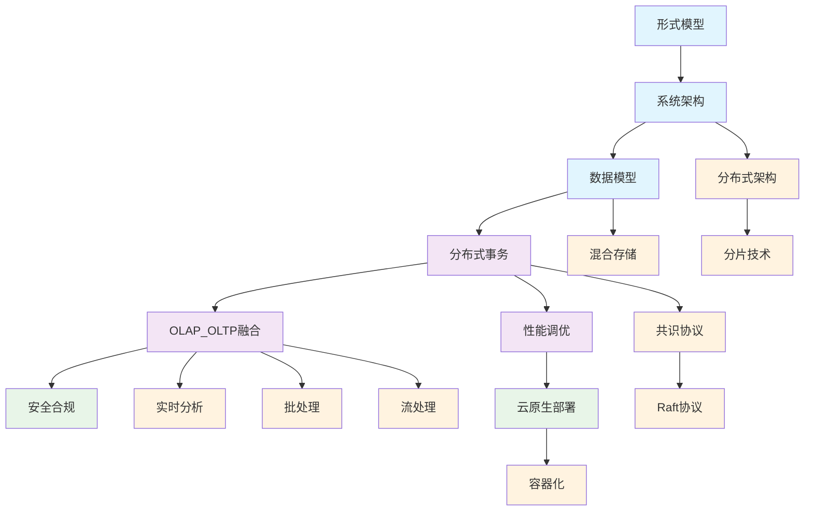

# 1.4-NewSQL - 知识导航索引

## 1. 目录结构

```text
1.4-NewSQL/
├── README.md                           # 本导航文件
├── 1.4.1-形式模型.md                   # NewSQL形式化模型
├── 1.4.2-系统架构.md                   # NewSQL系统架构
├── 1.4.3-数据模型.md                   # NewSQL数据模型
├── 1.4.4-分布式事务与一致性.md         # 分布式事务
├── 1.4.5-OLAP_OLTP融合.md             # HTAP技术
├── 1.4.6-性能调优与监控.md             # 性能优化
├── 1.4.7-安全与合规.md                 # 安全合规
└── 1.4.8-云原生与容器化部署.md         # 云原生部署
```

## 2. 🔗 主题交叉引用表

| 技术分支 | 核心概念 | 关联理论 | 应用领域 |
|---------|---------|---------|---------|
| **形式模型** | 形式化定义、理论证明 | 形式科学理论、数学基础 | 系统验证、理论研究 |
| **系统架构** | 分布式设计、HTAP架构 | 分布式系统理论、软件架构 | 大规模系统、架构优化 |
| **数据模型** | 关系模型、混合存储 | 数据模型算法、类型理论 | 数据建模、应用开发 |
| **分布式事务** | 2PC、3PC、Paxos | 分布式系统理论、时态逻辑 | 分布式应用、事务处理 |
| **OLAP_OLTP融合** | HTAP、混合工作负载 | 数据科学、算法实现 | 实时分析、混合应用 |
| **性能调优** | 参数优化、监控告警 | 性能分析、运维工程 | 系统优化、问题诊断 |
| **安全合规** | 访问控制、数据加密 | 安全理论、合规标准 | 数据保护、审计追踪 |
| **云原生部署** | 容器化、微服务 | 云原生架构、DevOps | 云部署、自动化运维 |

## 3. 🌊 全链路知识流图



## 4. 知识体系特色

### 4.1. ️ **理论严谨性**

- 基于形式化模型的严格定义
- 分布式事务的理论证明
- 一致性协议的数学基础

### 4.2. **技术创新性**

- HTAP混合事务分析处理
- 分布式架构的水平扩展
- 云原生技术的现代化

### 4.3. 🔄 **高可用性**

- 分布式事务的一致性保证
- 故障自动恢复机制
- 跨地域部署能力

### 4.4. **性能优化**

- 混合工作负载优化
- 智能查询优化器
- 实时分析能力

## 5. 学习路径建议

### 5.1. 🥇 **入门路径**

1. **形式模型** → 理解理论基础
2. **系统架构** → 掌握分布式设计
3. **数据模型** → 学习混合存储

### 5.2. 🥈 **进阶路径**

1. **分布式事务** → 深入一致性协议
2. **HTAP融合** → 理解混合工作负载
3. **性能调优** → 系统优化技术

### 5.3. 🥉 **专家路径**

1. **共识协议** → 深入分布式理论
2. **云原生部署** → 现代化运维
3. **安全合规** → 数据安全保护

## 6. 快速导航

- **[形式模型](./1.4.1-形式模型.md)** - NewSQL形式化模型
- **[系统架构](./1.4.2-系统架构.md)** - NewSQL系统架构
- **[数据模型](./1.4.3-数据模型.md)** - NewSQL数据模型
- **[分布式事务与一致性](./1.4.4-分布式事务与一致性.md)** - 分布式事务
- **[OLAP_OLTP融合](./1.4.5-OLAP_OLTP融合.md)** - HTAP技术
- **[性能调优与监控](./1.4.6-性能调优与监控.md)** - 性能优化
- **[安全与合规](./1.4.7-安全与合规.md)** - 安全合规
- **[云原生与容器化部署](./1.4.8-云原生与容器化部署.md)** - 云原生部署

## 7. 技术栈映射

### 7.1. ️ **核心架构**

- **分布式架构**：分片、复制、负载均衡
- **混合存储**：行存储、列存储、内存存储
- **事务处理**：ACID特性、分布式事务
- **查询优化**：智能优化器、自适应执行

### 7.2. **HTAP技术**

- **实时分析**：流式处理、增量计算
- **批处理**：大规模并行处理
- **混合工作负载**：OLTP+OLAP融合
- **内存计算**：内存数据库、缓存优化

### 7.3. 🔄 **分布式事务**

- **2PC协议**：两阶段提交
- **3PC协议**：三阶段提交
- **Paxos算法**：分布式共识
- **Raft协议**：领导者选举

### 7.4. ☁️ **云原生技术**

- **容器化**：Docker、Kubernetes
- **微服务**：服务拆分、API网关
- **自动化运维**：CI/CD、监控告警
- **弹性伸缩**：自动扩缩容

## 8. 应用场景体系

### 8.1. 🏢 **企业应用**

- **金融交易**：高并发事务处理
- **电商平台**：订单处理+实时分析
- **物联网**：设备数据+实时监控
- **游戏系统**：玩家数据+行为分析

### 8.2. **数据分析**

- **实时数据仓库**：HTAP数据仓库
- **流式分析**：实时数据处理
- **混合分析**：OLTP+OLAP融合
- **预测分析**：机器学习集成

### 8.3. ☁️ **云原生应用**

- **微服务数据库**：服务化部署
- **多租户系统**：资源隔离
- **边缘计算**：分布式部署
- **自动化运维**：DevOps实践

### 8.4. **安全应用**

- **数据加密**：透明数据加密
- **访问控制**：细粒度权限管理
- **审计日志**：操作记录追踪
- **合规认证**：GDPR、SOX合规

---

*本导航为NewSQL技术体系提供系统化的知识组织框架，支持从基础理论到实际应用的完整学习路径。*

## 9. 多表征

本分支支持多种表征方式，包括：

- 符号表征（数据模型、查询语言、事务、分布式一致性、OLAP/OLTP等）
- 图结构（ER图、系统架构图、数据流图、事务与一致性图等）
- 向量/张量（数据嵌入、特征向量、参数矩阵）
- 自然语言（定义、注释、描述）
- 图像/可视化（结构图、流程图、查询与事务可视化等）
这些表征可互映，提升NewSQL理论与实践表达力。

## 10. 形式化语义

- 语义域：$D$，如数据对象集、关系空间、查询模型、事务空间、一致性模型、OLAP/OLTP模型
- 解释函数：$I: S \to D$，将符号/结构映射到具体NewSQL语义对象
- 语义一致性：每个结构/查询/事务/一致性规则/融合模型在$D$中有明确定义

## 11. 形式化语法与证明

- 语法规则：如数据模型定义、查询语言语法、事务规则、一致性约束、融合模型定义
- **定理**：本分支的语法系统具一致性与可扩展性。
- **证明**：由数据模型、查询语言、事务与一致性规则递归定义，保证系统一致与可扩展。
