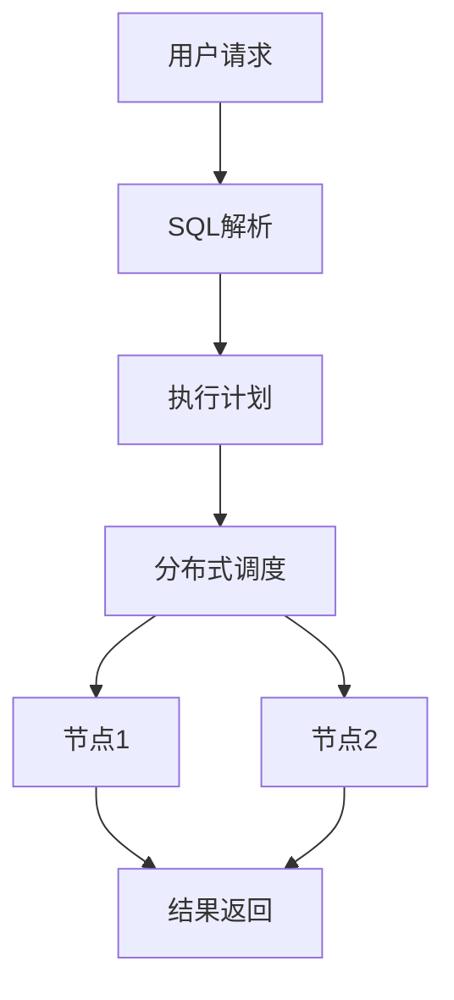

# 1.4 NewSQL 主题导航与多表征案例

## 目录结构与本地跳转

- 1.4.1 形式模型（预留）
- 1.4.2 系统架构（预留）
- 1.4.3 数据模型（预留）
- 1.4.4 分布式事务与一致性（预留）
- 1.4.5 OLAP/OLTP融合（预留）

---

## 行业案例与多表征

### 1.4.x 典型行业案例

- 金融级分布式事务与强一致性（详见3.3.3-并发控制算法、7-持续集成与演进）
- 云原生数据库：弹性扩展与高可用（详见4.3-微服务架构、3.5.7-数据存储与访问）
- 实时分析：HTAP架构与混合负载（详见3.5-数据分析与ETL、1.1-PostgreSQL）

### 1.4.x 多表征示例

- 分布式事务流程、HTAP架构图、OLAP/OLTP融合流程、强一致性协议、Latex公式等

---

[返回数据库系统导航](../README.md)
