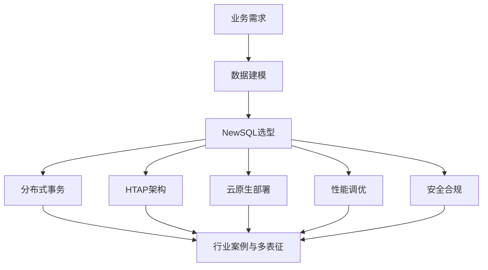

# 1.4-NewSQL 分支导航

## 目录结构与本地跳转

- [1.4.1-形式模型](1.4.1-形式模型.md)
- [1.4.2-系统架构](1.4.2-系统架构.md)
- [1.4.3-数据模型](1.4.3-数据模型.md)
- [1.4.4-分布式事务与一致性](1.4.4-分布式事务与一致性.md)
- [1.4.5-OLAP_OLTP融合](1.4.5-OLAP_OLTP融合.md)
- [1.4.6-性能调优与监控](1.4.6-性能调优与监控.md)
- [1.4.7-安全与合规](1.4.7-安全与合规.md)
- [1.4.8-云原生与容器化部署](1.4.8-云原生与容器化部署.md)

---

## 主题交叉引用

| 主题      | 形式模型 | 系统架构 | 数据模型 | 分布式事务 | OLAP/OLTP融合 | 性能调优 | 安全合规 | 云原生 |
|-----------|----------|----------|----------|------------|---------------|----------|----------|--------|
| NewSQL    | ✓        | ✓        | ✓        | ✓          | ✓             | ✓        | ✓        | ✓      |

- 交叉引用：[3.5-数据分析与ETL](../../../3-数据模型与算法/3.5-数据分析与ETL/README.md)、[4.3-微服务架构](../../../4-软件架构与工程/4.3-微服务架构/README.md)、[7-持续集成与演进](../../../7-持续集成与演进/README.md)

---

## 全链路知识流（Mermaid流程图）

---

[返回数据库系统总导航](../README.md)
