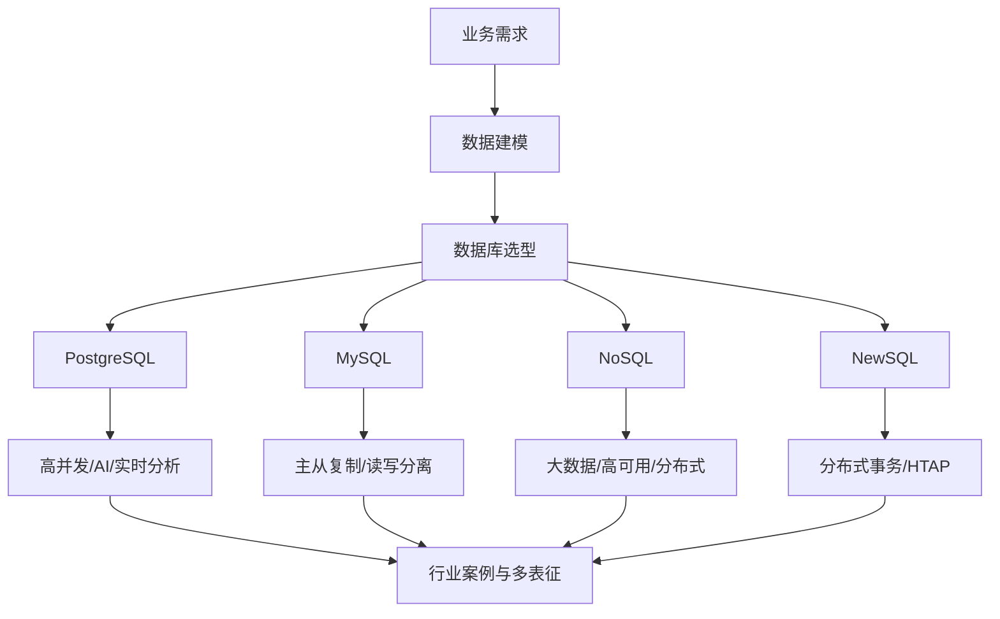

# 1-数据库系统 总导航

## 目录结构与本地跳转
- [1.1-PostgreSQL](1.1-PostgreSQL/README.md)
- [1.2-MySQL](1.2-MySQL/README.md)
- [1.3-NoSQL](1.3-NoSQL/README.md)
- [1.4-NewSQL](1.4-NewSQL/README.md)

---

## 主题交叉引用
| 分支      | 形式模型 | 系统架构 | 数据模型 | 查询优化/索引 | 分布式/高可用 | OLAP/OLTP融合 |
|-----------|----------|----------|----------|---------------|--------------|---------------|
| PostgreSQL| ✓        | ✓        | ✓        | ✓             | ✓            | ✓             |
| MySQL     | ✓        | ✓        | ✓        | ✓             | ✓            |               |
| NoSQL     | ✓        | ✓        | ✓        | ✓             | ✓            |               |
| NewSQL    | ✓        | ✓        | ✓        |               | ✓            | ✓             |

- 交叉引用：[3.5-数据分析与ETL](../3-数据模型与算法/3.5-数据分析与ETL/README.md)、[4.3-微服务架构](../4-软件架构与工程/4.3-微服务架构/README.md)、[7-持续集成与演进](../7-持续集成与演进/README.md)

---

## 全链路知识流（Mermaid流程图）

---

[返回Analysis总导航](../README.md)
