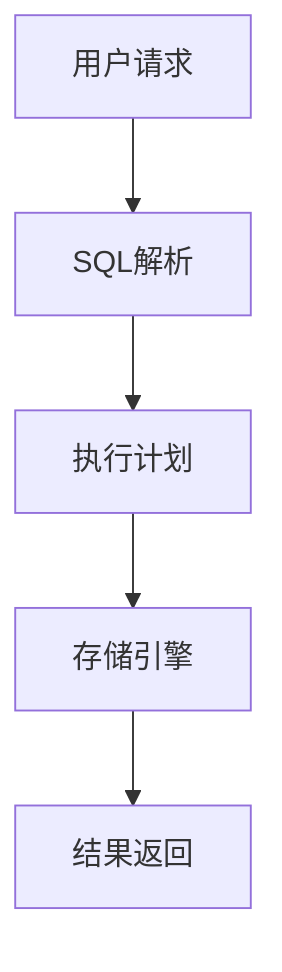

# 1 数据库系统 主题导航与多表征案例

## 目录结构与本地跳转

- [1.1 PostgreSQL](./1.1-PostgreSQL/README.md)

---

## 行业案例与多表征

### 1.x 典型行业案例
- 金融行业：高并发交易与风控、合规审计（详见5.1-金融数据分析、3.3.3-并发控制算法、7-持续集成与演进）
- AI平台：向量数据库与AI检索、模型数据管理（详见1.1.7-向量数据库扩展、1.1.6-AI与PostgreSQL集成、3.5.7-数据存储与访问）
- 实时分析：流式数据处理与ETL（详见3.5.5-数据流处理与架构、3.5.2-ETL理论与实践）

### 1.x 多表征示例
- 系统架构图、数据流图、MVCC时序图、SQL执行计划、合规审计流程、Latex公式等

---

[返回知识体系总览](../README.md) 