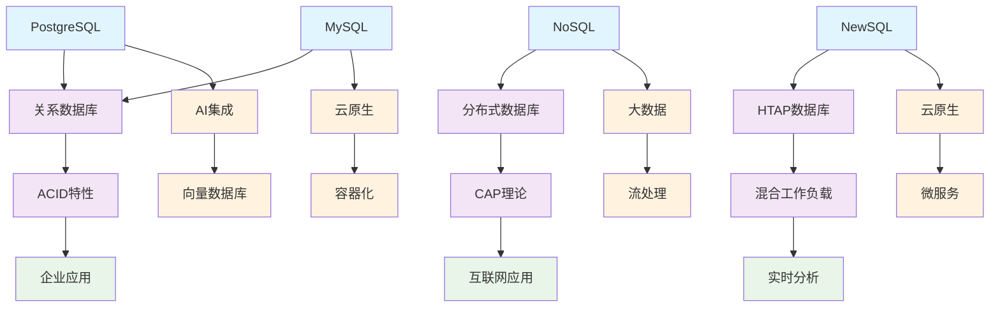

# 1-数据库系统 - 知识导航索引

## 1. 目录结构

```text
1-数据库系统/
├── README.md                           # 本导航文件
├── 1.1-PostgreSQL/                     # PostgreSQL数据库
│   ├── 1.1.1-形式模型.md
│   ├── 1.1.2-关系数据模型.md
│   ├── 1.1.3-查询语言.md
│   ├── 1.1.4-事务管理.md
│   ├── 1.1.5-并发控制.md
│   ├── 1.1.6-索引优化.md
│   ├── 1.1.7-存储引擎.md
│   ├── 1.1.8-备份恢复.md
│   ├── 1.1.9-性能调优.md
│   ├── 1.1.10-MVCC对比分析.md
│   ├── 1.1.11-系统设计分析.md
│   ├── 1.1.12-AI集成与智能数据库.md
│   ├── 1.1.13-系统架构.md
│   ├── 1.1.14-查询优化.md
│   ├── 1.1.15-分布式与高可用.md
│   ├── 1.1.16-向量数据库扩展.md
│   ├── 1.1.17-MVCC高级分析与形式证明.md
│   ├── 1.1.18-分布式PostgreSQL架构设计.md
│   ├── 1.1.19-实时流处理与CEP.md
│   ├── 1.1.20-云原生与容器化部署.md
│   ├── 1.1.21-性能调优与监控.md
│   ├── 1.1.22-安全与合规.md
│   ├── 1.1.23-与主流数据库系统对比分析.md
│   ├── 1.1.24-未解难题与未来研究方向.md
│   └── README.md
├── 1.2-MySQL/                         # MySQL数据库
│   ├── 1.2.1-形式模型.md
│   ├── 1.2.2-系统架构.md
│   ├── 1.2.3-数据模型.md
│   ├── 1.2.4-查询优化.md
│   ├── 1.2.5-分布式与高可用.md
│   ├── 1.2.6-性能调优与监控.md
│   ├── 1.2.7-安全与合规.md
│   └── README.md
├── 1.3-NoSQL/                         # NoSQL数据库
│   ├── 1.3.1-形式模型.md
│   ├── 1.3.2-系统架构.md
│   ├── 1.3.3-数据模型.md
│   ├── 1.3.4-查询与索引.md
│   ├── 1.3.5-分布式一致性与CAP.md
│   ├── 1.3.6-性能调优与监控.md
│   ├── 1.3.7-安全与合规.md
│   └── README.md
├── 1.4-NewSQL/                        # NewSQL数据库
│   ├── 1.4.1-形式模型.md
│   ├── 1.4.2-系统架构.md
│   ├── 1.4.3-数据模型.md
│   ├── 1.4.4-分布式事务与一致性.md
│   ├── 1.4.5-OLAP_OLTP融合.md
│   ├── 1.4.6-性能调优与监控.md
│   ├── 1.4.7-安全与合规.md
│   ├── 1.4.8-云原生与容器化部署.md
│   └── README.md
└── 导航索引.md                         # 详细导航索引
```

## 2. 🔗 主题交叉引用表

| 数据库类型 | 核心概念 | 关联理论 | 应用领域 |
|-----------|---------|---------|---------|
| **PostgreSQL** | 关系数据库、MVCC、扩展性 | 形式科学理论、AI算法 | 企业应用、AI集成 |
| **MySQL** | 关系数据库、主从复制、存储引擎 | 分布式系统理论、运维工程 | Web应用、云原生 |
| **NoSQL** | 分布式、CAP理论、多数据模型 | 分布式系统理论、图论 | 大数据、互联网应用 |
| **NewSQL** | HTAP、分布式事务、云原生 | 分布式系统理论、数据科学 | 混合工作负载、实时分析 |

## 3. 🌊 全链路知识流图



## 4. 知识体系特色

### 4.1. ️ **理论严谨性**

- 基于形式科学理论的严格定义
- 分布式系统理论的数学基础
- 可证明的系统正确性

### 4.2. **技术创新性**

- AI与数据库的深度集成
- 云原生架构的现代化
- HTAP混合工作负载

### 4.3. 🔄 **高可用性**

- 分布式集群部署
- 故障自动恢复机制
- 跨地域部署能力

### 4.4. **性能优化**

- 智能查询优化器
- 自适应索引管理
- 实时性能监控

## 5. 学习路径建议

### 5.1. 🥇 **入门路径**

1. **MySQL** → 掌握关系数据库基础
2. **PostgreSQL** → 理解高级特性
3. **NoSQL** → 学习分布式概念

### 5.2. 🥈 **进阶路径**

1. **NewSQL** → 理解HTAP技术
2. **分布式理论** → 深入CAP理论
3. **云原生部署** → 现代化运维

### 5.3. 🥉 **专家路径**

1. **AI集成** → 智能数据库技术
2. **向量数据库** → 新型数据模型
3. **实时分析** → 流式处理技术

## 6. 快速导航

- **[PostgreSQL](./1.1-PostgreSQL/)** - PostgreSQL数据库
- **[MySQL](./1.2-MySQL/)** - MySQL数据库
- **[NoSQL](./1.3-NoSQL/)** - NoSQL数据库
- **[NewSQL](./1.4-NewSQL/)** - NewSQL数据库
- **[导航索引](./导航索引.md)** - 详细导航索引

## 7. 技术栈映射

### 7.1. ️ **关系数据库**

- **PostgreSQL**：MVCC、扩展性、AI集成
- **MySQL**：主从复制、存储引擎、云原生
- **Oracle**：企业级、高可用、安全
- **SQL Server**：Windows生态、BI集成

### 7.2. **NoSQL数据库**

- **文档数据库**：MongoDB、CouchDB
- **键值数据库**：Redis、DynamoDB
- **列族数据库**：Cassandra、HBase
- **图数据库**：Neo4j、ArangoDB

### 7.3. 🤖 **NewSQL数据库**

- **TiDB**：分布式、HTAP、MySQL兼容
- **CockroachDB**：分布式、强一致性
- **YugabyteDB**：分布式、PostgreSQL兼容
- **SingleStore**：内存优先、实时分析

### 7.4. ☁️ **云原生数据库**

- **AWS RDS**：托管关系数据库
- **Azure SQL**：云原生SQL数据库
- **Google Cloud SQL**：托管MySQL/PostgreSQL
- **阿里云RDS**：企业级云数据库

## 8. 应用场景体系

### 8.1. 🏢 **企业应用**

- **OLTP系统**：高并发事务处理
- **数据仓库**：大规模数据分析
- **内容管理**：文档存储、版本控制
- **地理信息**：空间数据、GIS应用

### 8.2. **互联网应用**

- **Web应用**：动态网站、内容管理
- **电商平台**：订单处理、库存管理
- **社交网络**：用户关系、实时消息
- **游戏系统**：玩家数据、游戏状态

### 8.3. **大数据应用**

- **日志分析**：系统日志存储
- **时序数据**：监控数据存储
- **搜索引擎**：全文索引
- **实时分析**：流数据处理

### 8.4. 🤖 **AI应用**

- **推荐系统**：向量相似度检索
- **图像识别**：特征向量存储
- **自然语言处理**：文本向量化
- **预测分析**：时间序列建模

---

*本导航为数据库系统技术体系提供系统化的知识组织框架，支持从基础理论到实际应用的完整学习路径。*

## 9. 多表征

本分支支持多种表征方式，包括：

- 符号表征（数据模型、查询语言、事务、约束等）
- 图结构（ER图、关系图、数据流图等）
- 向量/张量（数据嵌入、特征向量、参数矩阵）
- 自然语言（定义、注释、描述）
- 图像/可视化（结构图、流程图、查询可视化等）
这些表征可互映，提升数据库系统理论与实践表达力。

## 10. 形式化语义

- 语义域：$D$，如数据对象集、关系空间、查询模型、事务空间
- 解释函数：$I: S \to D$，将符号/结构映射到具体数据库语义对象
- 语义一致性：每个结构/查询/事务在$D$中有明确定义

## 11. 形式化语法与证明

- 语法规则：如数据模型定义、查询语言语法、事务规则、约束条件
- **定理**：本分支的语法系统具一致性与可扩展性。
- **证明**：由数据模型、查询语言与事务规则递归定义，保证系统一致与可扩展。
