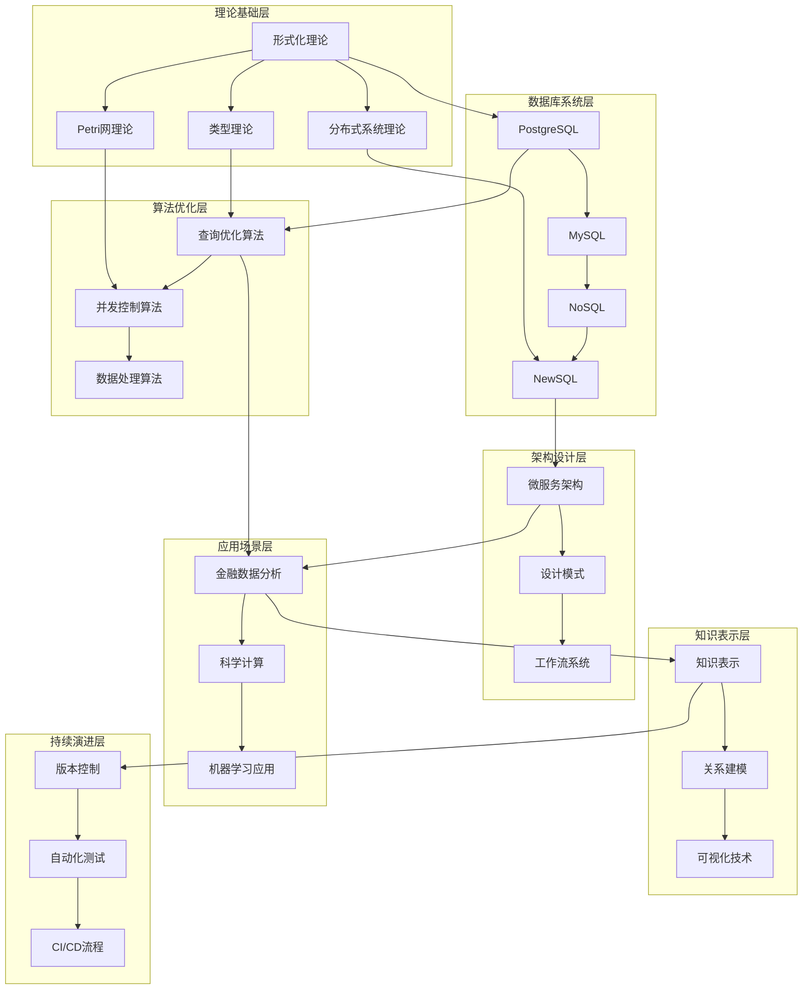

# 数据库系统导航索引

## 分支概述

数据库系统分支涵盖了从传统关系数据库到现代分布式数据库的完整技术栈，包括PostgreSQL、MySQL、NoSQL和NewSQL四大核心领域。本分支重点关注数据库的形式化理论、系统架构、性能优化和实际应用场景。

## 目录结构

### 1.1 PostgreSQL
- [1.1.1 形式模型](1.1-PostgreSQL/1.1.1-形式模型.md) - 数据库形式化理论基础
- [1.1.2 数据模型](1.1-PostgreSQL/1.1.2-数据模型.md) - 关系数据模型设计
- [1.1.3 查询语言](1.1-PostgreSQL/1.1.3-查询语言.md) - SQL语言理论与优化
- [1.1.4 事务管理](1.1-PostgreSQL/1.1.4-事务管理.md) - ACID事务理论与实现
- [1.1.5 并发控制](1.1-PostgreSQL/1.1.5-并发控制.md) - 并发控制机制与算法
- [1.1.6 索引优化](1.1-PostgreSQL/1.1.6-索引优化.md) - 索引策略与性能优化
- [1.1.7 存储引擎](1.1-PostgreSQL/1.1.7-存储引擎.md) - 存储引擎架构设计
- [1.1.8 备份恢复](1.1-PostgreSQL/1.1.8-备份恢复.md) - 数据备份与恢复策略
- [1.1.9 性能调优](1.1-PostgreSQL/1.1.9-性能调优.md) - 系统性能优化技术
- [1.1.10 MVCC对比分析](1.1-PostgreSQL/1.1.10-MVCC与其他并发控制模型对比与极限分析.md) - 并发控制深度分析
- [1.1.11 系统设计分析](1.1-PostgreSQL/1.1.11-PostgreSQL系统设计与现代硬件AI场景适配性分析.md) - 现代硬件适配性分析

### 1.2 MySQL
- [1.2.1 形式模型](1.2-MySQL/1.2.1-形式模型.md) - MySQL形式化理论
- [1.2.2 数据模型](1.2-MySQL/1.2.2-数据模型.md) - MySQL数据模型设计
- [1.2.3 查询优化](1.2-MySQL/1.2.3-查询优化.md) - MySQL查询优化技术
- [1.2.4 存储引擎](1.2-MySQL/1.2.4-存储引擎.md) - InnoDB与MyISAM引擎
- [1.2.5 事务管理](1.2-MySQL/1.2.5-事务管理.md) - MySQL事务处理机制
- [1.2.6 复制与高可用](1.2-MySQL/1.2.6-复制与高可用.md) - 主从复制与集群
- [1.2.7 性能调优](1.2-MySQL/1.2.7-性能调优.md) - MySQL性能优化
- [1.2.8 安全与权限](1.2-MySQL/1.2.8-安全与权限.md) - 安全机制与权限管理

### 1.3 NoSQL
- [1.3.1 形式模型](1.3-NoSQL/1.3.1-形式模型.md) - NoSQL形式化理论
- [1.3.2 数据模型](1.3-NoSQL/1.3.2-数据模型.md) - 键值、文档、列族、图数据库
- [1.3.3 一致性模型](1.3-NoSQL/1.3.3-一致性模型.md) - CAP理论与一致性
- [1.3.4 分布式架构](1.3-NoSQL/1.3.4-分布式架构.md) - 分布式系统设计
- [1.3.5 性能优化](1.3-NoSQL/1.3.5-性能优化.md) - NoSQL性能调优
- [1.3.6 应用场景](1.3-NoSQL/1.3.6-应用场景.md) - 实际应用案例分析

### 1.4 NewSQL
- [1.4.1 形式模型](1.4-NewSQL/1.4.1-形式模型.md) - NewSQL形式化理论
- [1.4.2 系统架构](1.4-NewSQL/1.4.2-系统架构.md) - 分布式架构设计
- [1.4.3 数据模型](1.4-NewSQL/1.4.3-数据模型.md) - 混合数据模型
- [1.4.4 分布式事务与一致性](1.4-NewSQL/1.4.4-分布式事务与一致性.md) - 分布式事务处理
- [1.4.5 OLAP_OLTP融合](1.4-NewSQL/1.4.5-OLAP_OLTP融合.md) - 混合工作负载
- [1.4.6 性能调优与监控](1.4-NewSQL/1.4.6-性能调优与监控.md) - 性能优化技术
- [1.4.7 安全与合规](1.4-NewSQL/1.4.7-安全与合规.md) - 安全机制设计
- [1.4.8 云原生与容器化部署](1.4-NewSQL/1.4.8-云原生与容器化部署.md) - 云原生架构

## 主题交叉引用

### 形式化理论
- **理论基础**：[1.1.1](1.1-PostgreSQL/1.1.1-形式模型.md) → [2.1.1](../2-形式科学理论/2.1-类型理论/2.1.1-基础类型理论.md)
- **并发控制**：[1.1.5](1.1-PostgreSQL/1.1.5-并发控制.md) → [2.3.1](../2-形式科学理论/2.3-Petri网理论/2.3.1-Petri网理论基础.md)
- **分布式理论**：[1.4.4](1.4-NewSQL/1.4.4-分布式事务与一致性.md) → [2.5.1](../2-形式科学理论/2.5-分布式系统理论/2.5.1-分布式系统理论基础.md)

### 算法与优化
- **查询优化**：[1.1.6](1.1-PostgreSQL/1.1.6-索引优化.md) → [3.3.2](../3-数据模型与算法/3.3-算法实现/3.3.2-查询优化算法.md)
- **并发算法**：[1.1.10](1.1-PostgreSQL/1.1.10-MVCC与其他并发控制模型对比与极限分析.md) → [3.3.3](../3-数据模型与算法/3.3-算法实现/3.3.3-并发控制算法.md)
- **数据模型**：[1.2.2](1.2-MySQL/1.2.2-数据模型.md) → [3.2.1](../3-数据模型与算法/3.2-形式化模型/3.2.1-数据模型的形式化理论.md)

### 系统架构
- **微服务架构**：[1.4.8](1.4-NewSQL/1.4.8-云原生与容器化部署.md) → [4.3.1](../4-软件架构与工程/4.3-微服务架构/4.3.1-微服务架构基础理论.md)
- **设计模式**：[1.4.2](1.4-NewSQL/1.4.2-系统架构.md) → [4.2.1](../4-软件架构与工程/4.2-设计模式/4.2.1-设计模式基础理论.md)
- **工作流**：[1.4.6](1.4-NewSQL/1.4.6-性能调优与监控.md) → [4.5.1](../4-软件架构与工程/4.5-WorkflowDomain/4.5.1-工作流基础理论.md)

### 行业应用
- **金融数据**：[1.4.5](1.4-NewSQL/1.4.5-OLAP_OLTP融合.md) → [5.1.1](../5-行业应用与场景/5.1-金融数据分析/5.1.1-金融数据科学基础理论.md)
- **科学计算**：[1.3.6](1.3-NoSQL/1.3.6-应用场景.md) → [5.2](../5-行业应用与场景/5.2-科学计算/)
- **机器学习**：[1.1.11](1.1-PostgreSQL/1.1.11-PostgreSQL系统设计与现代硬件AI场景适配性分析.md) → [5.3](../5-行业应用与场景/5.3-机器学习/)

### 知识图谱
- **关系建模**：[1.3.2](1.3-NoSQL/1.3.2-数据模型.md) → [6.2.1](../6-知识图谱与可视化/6.2-关系建模/6.2.1-关系建模基础理论.md)
- **知识表示**：[1.4.3](1.4-NewSQL/1.4.3-数据模型.md) → [6.1.1](../6-知识图谱与可视化/6.1-知识表示/6.1.1-知识表示基础理论.md)

### 持续集成
- **版本控制**：[1.4.8](1.4-NewSQL/1.4.8-云原生与容器化部署.md) → [7.1.1](../7-持续集成与演进/7.1-版本控制/7.1.1-版本控制基础理论.md)
- **自动化测试**：[1.4.7](1.4-NewSQL/1.4.7-安全与合规.md) → [7.2.1](../7-持续集成与演进/7.2-自动化测试/7.2.1-自动化测试基础理论.md)
- **CI/CD**：[1.4.8](1.4-NewSQL/1.4.8-云原生与容器化部署.md) → [7.4.1](../7-持续集成与演进/7.4-CI_CD/7.4.1-CI_CD最佳实践.md)

## 全链路知识流

## 多表征体系

### 理论表征
- **形式化模型**：基于数学逻辑的严格定义
- **类型系统**：静态类型检查与类型安全
- **并发理论**：Petri网与状态机模型

### 实践表征
- **系统架构**：分布式与微服务设计
- **性能优化**：查询优化与索引策略
- **安全机制**：访问控制与数据保护

### 行业表征
- **金融场景**：高并发交易处理
- **科学计算**：大规模数据分析
- **AI应用**：机器学习数据支撑

## 行业案例体系

### 金融行业
- **高频交易**：PostgreSQL MVCC机制
- **风险控制**：分布式事务一致性
- **监管合规**：数据安全与审计

### 互联网行业
- **用户画像**：NoSQL数据模型
- **推荐系统**：NewSQL混合负载
- **实时分析**：流式数据处理

### 制造业
- **设备监控**：时序数据库应用
- **质量控制**：数据一致性保证
- **供应链**：分布式数据管理

## 技术融合趋势

### 云原生架构
- **容器化部署**：Docker与Kubernetes
- **服务网格**：Istio与Linkerd
- **无服务器**：Serverless数据库

### AI集成
- **智能优化**：机器学习驱动的查询优化
- **自动调优**：自适应参数调整
- **预测分析**：基于历史数据的性能预测

### 边缘计算
- **边缘数据库**：轻量级数据存储
- **实时处理**：边缘节点计算
- **数据同步**：边缘与云端数据一致性

## 学习路径建议

### 初级路径
1. **基础理论**：形式模型 → 数据模型 → 查询语言
2. **实践应用**：事务管理 → 并发控制 → 性能调优
3. **系统设计**：存储引擎 → 备份恢复 → 系统架构

### 中级路径
1. **分布式系统**：分布式事务 → 一致性模型 → 高可用设计
2. **性能优化**：查询优化 → 索引策略 → 监控调优
3. **安全合规**：访问控制 → 数据加密 → 审计日志

### 高级路径
1. **云原生**：容器化部署 → 服务网格 → 无服务器架构
2. **AI集成**：智能优化 → 自动调优 → 预测分析
3. **边缘计算**：边缘数据库 → 实时处理 → 数据同步

## 技术栈关联

### 编程语言
- **SQL**：标准查询语言
- **Python**：数据分析与机器学习
- **Java**：企业级应用开发
- **Go**：云原生服务开发

### 框架工具
- **ORM**：对象关系映射
- **连接池**：数据库连接管理
- **监控工具**：性能监控与分析
- **备份工具**：数据备份与恢复

### 云服务
- **AWS RDS**：托管数据库服务
- **Azure SQL**：微软云数据库
- **Google Cloud SQL**：谷歌云数据库
- **阿里云RDS**：国内云数据库服务 