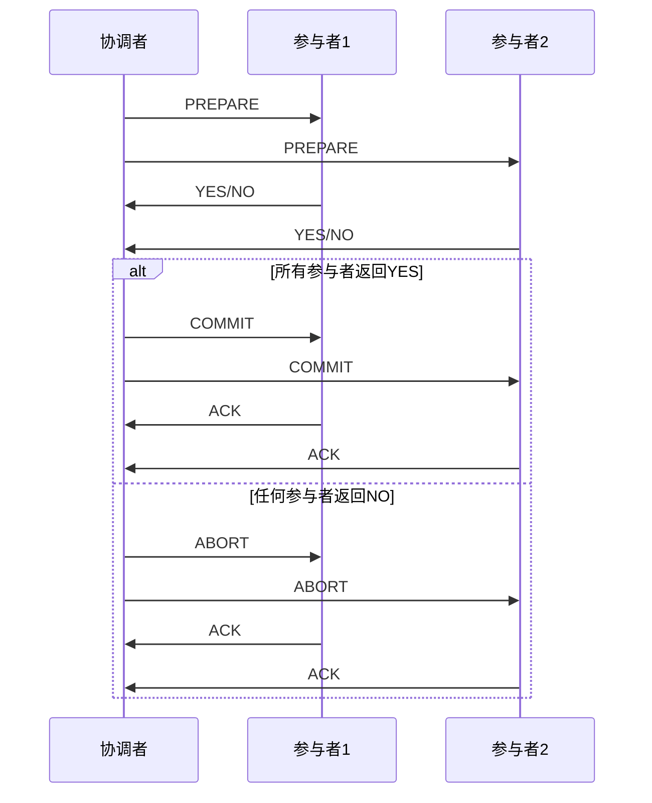
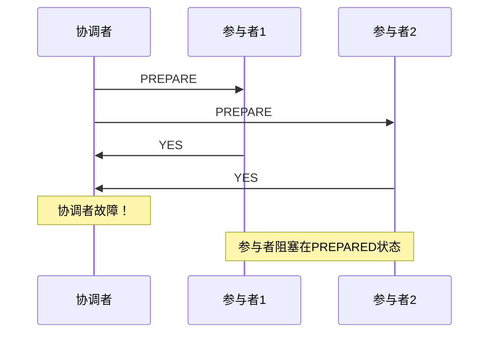
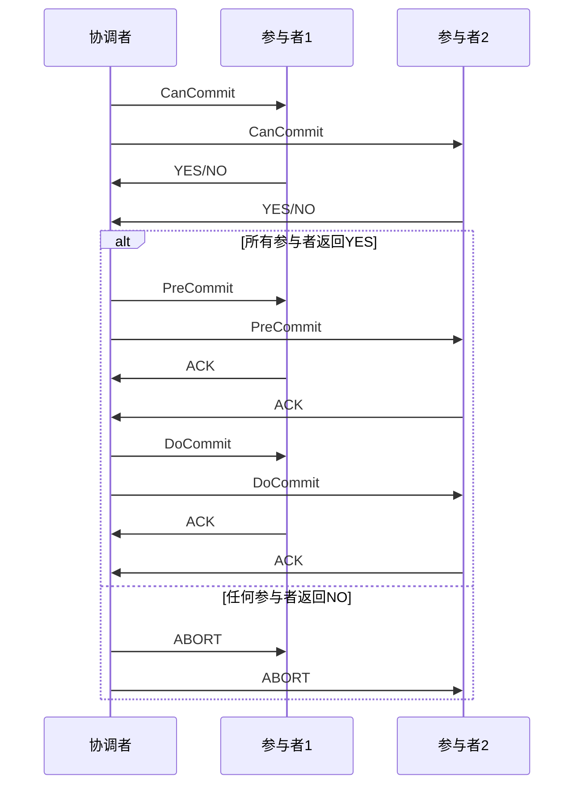
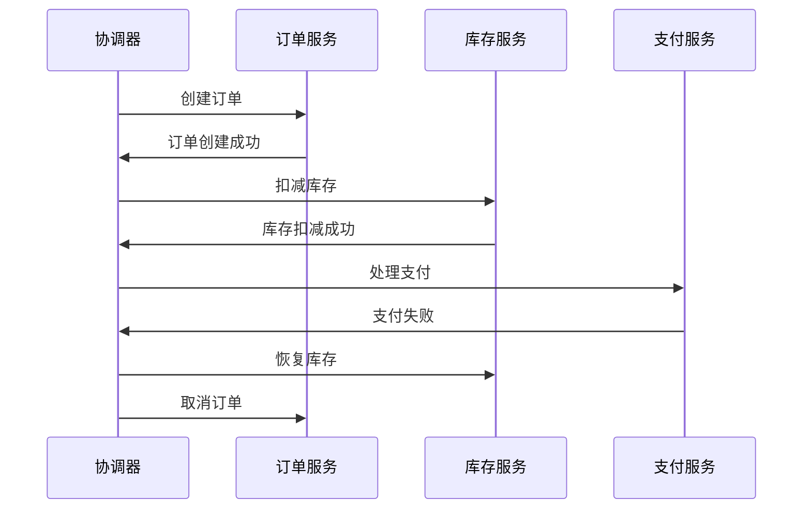
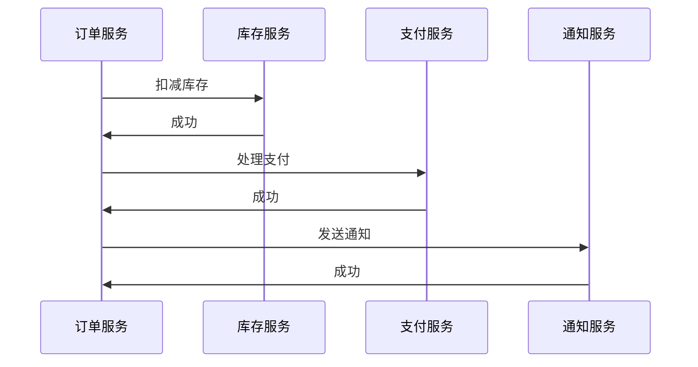

# 1.4.4 分布式事务与一致性

## 📑 目录

- [1.4.4 分布式事务与一致性](#144-分布式事务与一致性)
  - [📑 目录](#-目录)
  - [1. 概述](#1-概述)
    - [1.1. 定义与背景](#11-定义与背景)
    - [1.2. 历史发展](#12-历史发展)
    - [1.3. 核心挑战](#13-核心挑战)
  - [2. 理论基础](#2-理论基础)
    - [2.1. ACID特性在分布式环境](#21-acid特性在分布式环境)
      - [2.1.1. 原子性（Atomicity）](#211-原子性atomicity)
      - [2.1.2. 一致性（Consistency）](#212-一致性consistency)
      - [2.1.3. 隔离性（Isolation）](#213-隔离性isolation)
      - [2.1.4. 持久性（Durability）](#214-持久性durability)
    - [2.2. CAP定理与分布式一致性](#22-cap定理与分布式一致性)
    - [2.3. BASE理论](#23-base理论)
    - [2.4. 一致性模型分类](#24-一致性模型分类)
  - [3. 分布式事务协议](#3-分布式事务协议)
    - [3.1. 两阶段提交（2PC）](#31-两阶段提交2pc)
      - [3.1.1. 协议流程](#311-协议流程)
      - [3.1.2. 形式化定义](#312-形式化定义)
      - [3.1.3. 2PC的问题](#313-2pc的问题)
      - [3.1.4. 2PC的优化](#314-2pc的优化)
    - [3.2. 三阶段提交（3PC）](#32-三阶段提交3pc)
      - [3.2.1. 协议流程](#321-协议流程)
      - [3.2.2. 3PC的优势](#322-3pc的优势)
      - [3.2.3. 3PC的问题](#323-3pc的问题)
    - [3.3. TCC模式](#33-tcc模式)
      - [3.3.1. 协议流程](#331-协议流程)
      - [3.3.2. TCC的优势](#332-tcc的优势)
      - [3.3.3. TCC的挑战](#333-tcc的挑战)
    - [3.4. Saga模式](#34-saga模式)
      - [3.4.1. 两种实现方式](#341-两种实现方式)
      - [3.4.2. Saga的补偿机制](#342-saga的补偿机制)
      - [3.4.3. Saga的优缺点](#343-saga的优缺点)
    - [3.5. 其他协议](#35-其他协议)
      - [3.5.1. XA协议](#351-xa协议)
      - [3.5.2. Seata](#352-seata)
  - [4. 共识算法与一致性](#4-共识算法与一致性)
    - [4.1. Paxos算法](#41-paxos算法)
      - [4.1.1. 问题定义](#411-问题定义)
      - [4.1.2. 算法流程](#412-算法流程)
      - [4.1.3. Paxos的变种](#413-paxos的变种)
    - [4.2. Raft算法](#42-raft算法)
      - [4.2.1. 核心概念](#421-核心概念)
      - [4.2.2. Leader选举](#422-leader选举)
      - [4.2.3. 日志复制](#423-日志复制)
      - [4.2.4. Raft vs Paxos](#424-raft-vs-paxos)
    - [4.3. PBFT算法](#43-pbft算法)
      - [4.3.1. 拜占庭故障](#431-拜占庭故障)
      - [4.3.2. PBFT流程](#432-pbft流程)
    - [4.4. 算法对比与选择](#44-算法对比与选择)
  - [5. NewSQL系统中的实现](#5-newsql系统中的实现)
    - [5.1. TiDB的分布式事务](#51-tidb的分布式事务)
      - [5.1.1. Percolator模型](#511-percolator模型)
    - [5.2. CockroachDB的一致性模型](#52-cockroachdb的一致性模型)
      - [5.2.1. 时间戳分配](#521-时间戳分配)
      - [5.2.2. 事务执行](#522-事务执行)
    - [5.3. OceanBase的2PC实现](#53-oceanbase的2pc实现)
      - [5.3.1. 优化策略](#531-优化策略)
      - [5.3.2. 故障恢复](#532-故障恢复)
    - [5.4. YugabyteDB的分布式事务](#54-yugabytedb的分布式事务)
      - [5.4.1. DocDB存储](#541-docdb存储)
      - [5.4.2. 分布式事务实现](#542-分布式事务实现)
  - [6. 隔离级别与并发控制](#6-隔离级别与并发控制)
    - [6.1. 分布式环境下的隔离级别](#61-分布式环境下的隔离级别)
      - [6.1.1. Read Uncommitted](#611-read-uncommitted)
      - [6.1.2. Read Committed](#612-read-committed)
      - [6.1.3. Repeatable Read](#613-repeatable-read)
      - [6.1.4. Serializable](#614-serializable)
    - [6.2. 分布式锁机制](#62-分布式锁机制)
      - [6.2.1. 基于数据库的分布式锁](#621-基于数据库的分布式锁)
      - [6.2.2. 基于Redis的分布式锁](#622-基于redis的分布式锁)
      - [6.2.3. 基于ZooKeeper的分布式锁](#623-基于zookeeper的分布式锁)
    - [6.3. 多版本并发控制（MVCC）](#63-多版本并发控制mvcc)
      - [6.3.1. MVCC原理](#631-mvcc原理)
      - [6.3.2. MVCC实现](#632-mvcc实现)
    - [6.4. 时间戳排序](#64-时间戳排序)
      - [6.4.1. 基本规则](#641-基本规则)
      - [6.4.2. 时间戳分配](#642-时间戳分配)
  - [7. 故障处理与恢复](#7-故障处理与恢复)
    - [7.1. 故障类型与检测](#71-故障类型与检测)
    - [7.2. 故障恢复策略](#72-故障恢复策略)
      - [7.2.1. 基于日志的恢复](#721-基于日志的恢复)
      - [7.2.2. 基于复制的恢复](#722-基于复制的恢复)
    - [7.3. 数据一致性保证](#73-数据一致性保证)
  - [8. 性能优化](#8-性能优化)
    - [8.1. 事务优化策略](#81-事务优化策略)
    - [8.2. 减少网络开销](#82-减少网络开销)
    - [8.3. 批量处理与流水线](#83-批量处理与流水线)
  - [9. 实际应用案例](#9-实际应用案例)
    - [9.1. 金融交易系统](#91-金融交易系统)
    - [9.2. 电商订单系统](#92-电商订单系统)
    - [9.3. 分布式账本系统](#93-分布式账本系统)
  - [10. 形式化定义与证明](#10-形式化定义与证明)
    - [10.1. 分布式事务的形式化模型](#101-分布式事务的形式化模型)
    - [10.2. 2PC协议的正确性证明](#102-2pc协议的正确性证明)
  - [11. 多表征](#11-多表征)
  - [12. 总结与展望](#12-总结与展望)
    - [12.1. 总结](#121-总结)
    - [12.2. 发展趋势](#122-发展趋势)
    - [12.3. 挑战与机遇](#123-挑战与机遇)

---

## 1. 概述

### 1.1. 定义与背景

**分布式事务**是指在分布式系统中，涉及多个节点（数据库、服务或资源）的事务操作，需要保证这些操作的原子性、一致性、隔离性和持久性（ACID特性）。

在NewSQL数据库系统中，分布式事务是核心功能之一，它使得系统能够在保持ACID特性的同时，实现水平扩展和高可用性。

**形式化定义**：

设分布式系统 $S = \{N_1, N_2, \ldots, N_n\}$ 由 $n$ 个节点组成，分布式事务 $T$ 可以定义为：

$$T = \{T_1, T_2, \ldots, T_n\}$$

其中 $T_i$ 是在节点 $N_i$ 上执行的子事务，满足：

1. **原子性（Atomicity）**：要么所有 $T_i$ 都提交，要么都回滚
   $$\forall i, j: \text{commit}(T_i) \Leftrightarrow \text{commit}(T_j)$$

2. **一致性（Consistency）**：事务执行前后，系统状态满足所有约束
   $$C_{\text{before}}(S) \land T \Rightarrow C_{\text{after}}(S)$$

3. **隔离性（Isolation）**：并发事务的执行结果与串行执行等价
   $$\text{serializable}(T_1, T_2, \ldots, T_k)$$

4. **持久性（Durability）**：已提交的事务结果永久保存
   $$\text{commit}(T) \Rightarrow \forall i: \text{persist}(T_i)$$

### 1.2. 历史发展

分布式事务理论的发展历程：

1. **1970s-1980s**：两阶段提交（2PC）协议提出
   - 1978年，Jim Gray在《Notes on Database Operating Systems》中首次提出2PC
   - 成为分布式事务的标准协议

2. **1990s**：三阶段提交（3PC）和优化
   - 1990年，Skeen提出3PC，解决2PC的阻塞问题
   - X/Open XA标准制定

3. **2000s**：CAP定理和BASE理论
   - 2000年，Eric Brewer提出CAP定理
   - 2008年，Dan Pritchett提出BASE理论

4. **2010s**：NewSQL和现代共识算法
   - 2012年，Raft算法提出
   - NewSQL数据库系统（TiDB、CockroachDB等）兴起

5. **2020s**：云原生和混合事务
   - 云原生分布式事务
   - HTAP（混合事务分析处理）系统

### 1.3. 核心挑战

分布式事务面临的主要挑战：

1. **网络分区**：节点间网络中断导致无法通信
2. **节点故障**：部分节点崩溃或不可用
3. **时钟不同步**：分布式系统中没有全局时钟
4. **性能开销**：多轮网络通信增加延迟
5. **一致性与可用性权衡**：CAP定理的限制

---

## 2. 理论基础

### 2.1. ACID特性在分布式环境

在分布式系统中，ACID特性的实现面临新的挑战：

#### 2.1.1. 原子性（Atomicity）

**本地事务的原子性**：

- 单个节点内的事务要么全部成功，要么全部失败
- 通过日志（WAL）和回滚机制保证

**分布式事务的原子性**：

- 需要协调多个节点的提交或回滚
- 使用两阶段提交（2PC）或三阶段提交（3PC）协议

**形式化定义**：

$$\text{Atomic}(T) = \forall i: (\text{commit}(T_i) \lor \text{abort}(T_i)) \land (\exists i: \text{commit}(T_i) \Rightarrow \forall j: \text{commit}(T_j))$$

#### 2.1.2. 一致性（Consistency）

**本地一致性**：

- 事务执行前后，数据库满足所有完整性约束
- 外键约束、唯一性约束、检查约束等

**分布式一致性**：

- 跨节点的数据一致性
- 需要全局约束检查
- 可能涉及最终一致性

**一致性级别**：

1. **强一致性（Strong Consistency）**：
   - 所有节点同时看到相同的数据
   - 读操作总是返回最新写入的值

2. **最终一致性（Eventual Consistency）**：
   - 系统最终会达到一致状态
   - 允许暂时的数据不一致

3. **弱一致性（Weak Consistency）**：
   - 不保证何时达到一致
   - 可能永远不一致

#### 2.1.3. 隔离性（Isolation）

**隔离级别**（从弱到强）：

1. **Read Uncommitted**：允许脏读
2. **Read Committed**：防止脏读
3. **Repeatable Read**：防止不可重复读
4. **Serializable**：完全隔离，可串行化

**分布式环境下的隔离性**：

- 需要分布式锁或时间戳机制
- 可能降低性能以换取隔离性

#### 2.1.4. 持久性（Durability）

**本地持久性**：

- 通过WAL（Write-Ahead Log）保证
- 数据写入磁盘后才返回成功

**分布式持久性**：

- 需要多个副本的持久化
- 使用复制和共识算法保证

### 2.2. CAP定理与分布式一致性

**CAP定理**（Brewer's Theorem）指出，在分布式系统中，以下三个特性不能同时满足：

- **C（Consistency）**：一致性
- **A（Availability）**：可用性
- **P（Partition tolerance）**：分区容错性

**形式化表述**：

$$\neg(\text{Consistency} \land \text{Availability} \land \text{PartitionTolerance})$$

**CAP定理的证明**：

假设系统满足C、A、P，考虑网络分区场景：

1. 节点 $N_1$ 和 $N_2$ 被分区
2. 客户端向 $N_1$ 写入数据 $v$
3. 由于分区，$N_2$ 无法收到更新
4. 客户端从 $N_2$ 读取数据，可能读到旧值（违反C）
5. 如果 $N_2$ 拒绝服务以保持一致性，则违反A

因此，C、A、P不能同时满足。

**CAP定理的实际应用**：

| 系统类型 | 选择 | 说明 |
|---------|------|------|
| **CP系统** | 一致性+分区容错 | 放弃可用性，如分布式锁服务 |
| **AP系统** | 可用性+分区容错 | 放弃强一致性，如DNS、CDN |
| **CA系统** | 一致性+可用性 | 放弃分区容错，如单机数据库 |

**NewSQL系统的CAP选择**：

- **TiDB**：优先保证CP，通过Raft保证一致性
- **CockroachDB**：可配置的CAP权衡，默认偏向CP
- **MongoDB**：默认AP，可配置为CP

### 2.3. BASE理论

**BASE理论**是对CAP定理的补充，强调在分布式系统中采用更灵活的一致性模型：

- **BA（Basically Available）**：基本可用
- **S（Soft state）**：软状态
- **E（Eventual consistency）**：最终一致性

**BASE vs ACID**：

| 特性 | ACID | BASE |
|------|------|------|
| **一致性** | 强一致性 | 最终一致性 |
| **可用性** | 可能牺牲可用性 | 优先保证可用性 |
| **性能** | 较低 | 较高 |
| **适用场景** | 金融交易 | 互联网应用 |

### 2.4. 一致性模型分类

**一致性模型的层次结构**：

```text
一致性模型
├── 强一致性
│   ├── 线性一致性（Linearizability）
│   ├── 顺序一致性（Sequential Consistency）
│   └── 因果一致性（Causal Consistency）
├── 弱一致性
│   ├── 最终一致性（Eventual Consistency）
│   ├── 会话一致性（Session Consistency）
│   └── 单调读一致性（Monotonic Read Consistency）
└── 无一致性保证
```

**线性一致性（Linearizability）**：

最强的单对象一致性模型，要求：

1. 所有操作都有全局顺序
2. 读操作返回最新写入的值
3. 操作顺序与实时顺序一致

**形式化定义**：

操作 $op$ 的执行历史 $H$ 是线性一致的，当且仅当存在一个线性化点 $L(op)$，使得：

$$\forall op_1, op_2: L(op_1) < L(op_2) \Rightarrow op_1 \prec op_2$$

其中 $\prec$ 表示程序顺序。

---

## 3. 分布式事务协议

### 3.1. 两阶段提交（2PC）

**两阶段提交（Two-Phase Commit, 2PC）**是最经典的分布式事务协议。

#### 3.1.1. 协议流程

**阶段1：准备阶段（Prepare Phase）**:

1. 协调者（Coordinator）向所有参与者（Participants）发送 `PREPARE` 消息
2. 参与者执行事务，但不提交，将结果写入日志
3. 参与者向协调者返回 `YES`（可以提交）或 `NO`（需要中止）

**阶段2：提交阶段（Commit Phase）**:

1. 如果所有参与者都返回 `YES`：
   - 协调者向所有参与者发送 `COMMIT` 消息
   - 参与者提交事务，释放资源
   - 参与者向协调者返回 `ACK`

2. 如果任何参与者返回 `NO`：
   - 协调者向所有参与者发送 `ABORT` 消息
   - 参与者回滚事务，释放资源
   - 参与者向协调者返回 `ACK`

**流程图**：



#### 3.1.2. 形式化定义

**2PC协议的状态机**：

设协调者状态为 $S_c \in \{\text{INIT}, \text{WAIT}, \text{COMMIT}, \text{ABORT}\}$，参与者状态为 $S_p \in \{\text{INIT}, \text{PREPARED}, \text{COMMITTED}, \text{ABORTED}\}$。

**状态转换规则**：

$$
\begin{align}
\text{INIT}_c &\xrightarrow{\text{start}} \text{WAIT}_c \\
\text{WAIT}_c &\xrightarrow{\text{all YES}} \text{COMMIT}_c \\
\text{WAIT}_c &\xrightarrow{\text{any NO}} \text{ABORT}_c \\
\text{INIT}_p &\xrightarrow{\text{PREPARE}} \text{PREPARED}_p \\
\text{PREPARED}_p &\xrightarrow{\text{COMMIT}} \text{COMMITTED}_p \\
\text{PREPARED}_p &\xrightarrow{\text{ABORT}} \text{ABORTED}_p
\end{align}
$$

#### 3.1.3. 2PC的问题

**主要问题**：

1. **阻塞问题**：
   - 如果协调者故障，参与者可能永远阻塞在 `PREPARED` 状态
   - 需要人工干预或超时机制

2. **单点故障**：
   - 协调者是单点故障
   - 协调者故障可能导致整个事务无法完成

3. **性能开销**：
   - 需要两轮网络通信
   - 同步等待所有参与者响应

4. **数据不一致风险**：
   - 网络分区可能导致部分节点提交，部分节点未提交

**阻塞问题的示例**：



#### 3.1.4. 2PC的优化

**优化策略**：

1. **超时机制**：
   - 参与者设置超时，超时后可以查询协调者状态
   - 协调者设置超时，超时后可以中止事务

2. **协调者备份**：
   - 使用主备模式，主协调者故障时切换到备份

3. **并行提交**：
   - 参与者可以并行执行，减少等待时间

### 3.2. 三阶段提交（3PC）

**三阶段提交（Three-Phase Commit, 3PC）**是对2PC的改进，增加了预提交阶段以减少阻塞。

#### 3.2.1. 协议流程

**阶段1：CanCommit（询问阶段）**:

1. 协调者向所有参与者发送 `CanCommit` 消息
2. 参与者检查是否可以提交，返回 `YES` 或 `NO`
3. 如果所有参与者返回 `YES`，进入下一阶段；否则中止

**阶段2：PreCommit（预提交阶段）**:

1. 协调者向所有参与者发送 `PreCommit` 消息
2. 参与者执行事务，但不提交，进入 `PREPARED` 状态
3. 参与者向协调者返回 `ACK`

**阶段3：DoCommit（提交阶段）**:

1. 协调者向所有参与者发送 `DoCommit` 消息
2. 参与者提交事务，释放资源
3. 参与者向协调者返回 `ACK`

**流程图**：



#### 3.2.2. 3PC的优势

**相比2PC的改进**：

1. **减少阻塞**：
   - 在 `PreCommit` 阶段，如果协调者故障，参与者可以超时后提交
   - 避免了2PC中的无限阻塞

2. **更好的故障恢复**：
   - 参与者可以根据状态判断事务结果

**3PC的状态转换**：

$$
\begin{align}
\text{INIT}_p &\xrightarrow{\text{CanCommit}} \text{READY}_p \\
\text{READY}_p &\xrightarrow{\text{PreCommit}} \text{PREPARED}_p \\
\text{PREPARED}_p &\xrightarrow{\text{DoCommit}} \text{COMMITTED}_p \\
\text{PREPARED}_p &\xrightarrow{\text{timeout}} \text{COMMITTED}_p \quad \text{(关键改进)}
\end{align}
$$

#### 3.2.3. 3PC的问题

**仍然存在的问题**：

1. **复杂度增加**：需要三轮网络通信
2. **网络分区问题**：仍然可能出现数据不一致
3. **实际应用较少**：大多数系统仍使用2PC或更现代的协议

### 3.3. TCC模式

**TCC（Try-Confirm-Cancel）**是一种补偿型分布式事务模式，适用于需要高可用性的场景。

#### 3.3.1. 协议流程

**三个阶段**：

1. **Try（尝试）**：
   - 尝试执行业务操作
   - 预留资源，但不提交
   - 返回是否可以继续

2. **Confirm（确认）**：
   - 如果所有Try都成功，执行确认操作
   - 提交事务，释放预留资源

3. **Cancel（取消）**：
   - 如果任何Try失败，执行取消操作
   - 回滚操作，释放预留资源

**示例：转账操作**：

```java
// Try阶段
public boolean tryTransfer(Account from, Account to, BigDecimal amount) {
    // 冻结转出账户资金
    from.freeze(amount);
    // 预留转入账户额度
    to.reserve(amount);
    return true;
}

// Confirm阶段
public void confirmTransfer(Account from, Account to, BigDecimal amount) {
    // 扣减转出账户
    from.debit(amount);
    // 增加转入账户
    to.credit(amount);
}

// Cancel阶段
public void cancelTransfer(Account from, Account to, BigDecimal amount) {
    // 解冻转出账户
    from.unfreeze(amount);
    // 释放转入账户预留
    to.unreserve(amount);
}
```

#### 3.3.2. TCC的优势

1. **高可用性**：不依赖协调者，避免单点故障
2. **性能较好**：不需要同步等待
3. **灵活性高**：可以自定义补偿逻辑

#### 3.3.3. TCC的挑战

1. **业务复杂度**：需要实现Try、Confirm、Cancel三个方法
2. **幂等性要求**：Confirm和Cancel必须幂等
3. **资源预留**：需要额外的资源管理机制

### 3.4. Saga模式

**Saga模式**将长事务分解为多个短事务，每个短事务有对应的补偿操作。

#### 3.4.1. 两种实现方式

**编排式Saga（Orchestration）**：

- 中央协调器控制整个流程
- 协调器调用各个服务，处理补偿逻辑

**协同式Saga（Choreography）**：

- 没有中央协调器
- 各个服务通过事件通信
- 每个服务知道自己的补偿操作

**编排式Saga示例**：



#### 3.4.2. Saga的补偿机制

**补偿操作的特点**：

1. **幂等性**：可以安全地多次执行
2. **可交换性**：补偿操作的顺序可以交换
3. **可组合性**：多个补偿操作可以组合

**补偿操作示例**：

```java
// 订单创建
Order createOrder(OrderRequest request) {
    return orderRepository.save(new Order(request));
}

// 补偿：取消订单
void cancelOrder(Order order) {
    order.setStatus(CANCELLED);
    orderRepository.save(order);
}

// 库存扣减
void deductInventory(Product product, int quantity) {
    product.setStock(product.getStock() - quantity);
    productRepository.save(product);
}

// 补偿：恢复库存
void restoreInventory(Product product, int quantity) {
    product.setStock(product.getStock() + quantity);
    productRepository.save(product);
}
```

#### 3.4.3. Saga的优缺点

**优点**：

1. **避免长时间锁定**：每个短事务快速完成
2. **高可用性**：不依赖中央协调器（协同式）
3. **灵活性**：可以处理复杂的业务流程

**缺点**：

1. **最终一致性**：不保证强一致性
2. **补偿逻辑复杂**：需要仔细设计补偿操作
3. **调试困难**：分布式流程难以追踪

### 3.5. 其他协议

#### 3.5.1. XA协议

**XA（eXtended Architecture）**是X/Open组织定义的分布式事务标准。

**XA接口**：

```c
// XA接口定义
int xa_open(char *xa_info, int rmid, long flags);
int xa_close(char *xa_info, int rmid, long flags);
int xa_start(XID *xid, int rmid, long flags);
int xa_end(XID *xid, int rmid, long flags);
int xa_prepare(XID *xid, int rmid, long flags);
int xa_commit(XID *xid, int rmid, long flags);
int xa_rollback(XID *xid, int rmid, long flags);
```

**XA事务管理器（TM）和资源管理器（RM）**：

- **TM**：协调分布式事务
- **RM**：管理本地资源（如数据库）

#### 3.5.2. Seata

**Seata（Simple Extensible Autonomous Transaction Architecture）**是阿里巴巴开源的分布式事务解决方案。

**Seata的三种模式**：

1. **AT模式**：自动补偿，基于SQL解析
2. **TCC模式**：手动补偿，需要实现Try-Confirm-Cancel
3. **Saga模式**：长事务，基于状态机

---

## 4. 共识算法与一致性

共识算法是分布式系统实现一致性的基础，NewSQL数据库系统广泛使用共识算法来保证数据一致性。

### 4.1. Paxos算法

**Paxos算法**是分布式共识算法的经典实现，由Leslie Lamport在1990年提出。

#### 4.1.1. 问题定义

**共识问题**：多个进程就某个值达成一致。

**Paxos的基本假设**：

1. 进程可能故障，但不会恶意行为（非拜占庭故障）
2. 消息可能丢失、重复、乱序，但不会被篡改
3. 网络可能分区

#### 4.1.2. 算法流程

**Paxos的两个阶段**：

**阶段1：Prepare（准备）**:

1. Proposer选择一个提案编号 $n$，向多数Acceptor发送 `Prepare(n)` 消息
2. Acceptor收到 `Prepare(n)`：
   - 如果 $n > \text{max\_promised}$，则承诺不再接受编号小于 $n$ 的提案
   - 返回已接受的最大编号提案（如果有）

**阶段2：Accept（接受）**:

1. 如果Proposer收到多数Acceptor的响应：
   - 如果响应中包含已接受的提案，选择编号最大的提案值
   - 否则，使用自己的提案值
   - 向多数Acceptor发送 `Accept(n, v)` 消息

2. Acceptor收到 `Accept(n, v)`：
   - 如果 $n \geq \text{max\_promised}$，则接受该提案
   - 返回 `Accepted`

**形式化定义**：

$$
\begin{align}
\text{Prepare}(n) &: \text{Proposer} \to \text{Acceptor} \\
\text{Promise}(n, v) &: \text{Acceptor} \to \text{Proposer} \\
\text{Accept}(n, v) &: \text{Proposer} \to \text{Acceptor} \\
\text{Accepted}(n, v) &: \text{Acceptor} \to \text{Proposer}
\end{align}
$$

**Paxos算法示例**：

```rust
// Paxos算法的简化实现
struct PaxosNode {
    id: NodeId,
    proposers: HashMap<ProposalId, Proposer>,
    acceptors: HashMap<ProposalId, Acceptor>,
}

impl PaxosNode {
    fn propose(&mut self, value: Value) -> Result<Value, Error> {
        let proposal_id = self.generate_proposal_id();

        // Phase 1: Prepare
        let promises = self.prepare_phase(proposal_id)?;

        // 选择提案值
        let chosen_value = self.choose_value(&promises, value);

        // Phase 2: Accept
        let accepts = self.accept_phase(proposal_id, chosen_value)?;

        if accepts.len() > self.quorum_size() {
            Ok(chosen_value)
        } else {
            Err(Error::NotAccepted)
        }
    }

    fn prepare_phase(&mut self, proposal_id: ProposalId) -> Result<Vec<Promise>, Error> {
        let mut promises = Vec::new();
        for acceptor in &self.acceptors {
            if let Ok(promise) = acceptor.prepare(proposal_id) {
                promises.push(promise);
            }
        }
        Ok(promises)
    }

    fn accept_phase(&mut self, proposal_id: ProposalId, value: Value) -> Result<Vec<Accept>, Error> {
        let mut accepts = Vec::new();
        for acceptor in &mut self.acceptors {
            if let Ok(accept) = acceptor.accept(proposal_id, value.clone()) {
                accepts.push(accept);
            }
        }
        Ok(accepts)
    }
}
```

#### 4.1.3. Paxos的变种

**Multi-Paxos**：

- 优化多次Paxos实例
- 选举Leader，减少Prepare阶段
- 提高性能

**Fast Paxos**：

- 在无冲突情况下，只需要一轮通信
- 冲突时回退到经典Paxos

### 4.2. Raft算法

**Raft算法**是Paxos的简化版本，由Diego Ongaro和John Ousterhout在2013年提出，更容易理解和实现。

#### 4.2.1. 核心概念

**Raft的三个子问题**：

1. **Leader选举**：选举一个Leader节点
2. **日志复制**：Leader将日志复制到其他节点
3. **安全性**：保证一致性

**Raft的节点状态**：

- **Leader**：处理所有客户端请求
- **Follower**：被动接收Leader的日志
- **Candidate**：选举过程中的临时状态

#### 4.2.2. Leader选举

**选举流程**：

1. Follower在超时后变为Candidate
2. Candidate增加自己的term，发起选举
3. 向其他节点发送 `RequestVote` 请求
4. 如果获得多数票，成为Leader
5. Leader定期发送 `AppendEntries` 心跳

**选举超时**：

- 随机化超时时间，避免同时选举
- 通常设置为150-300ms

**Raft选举示例**：

```rust
// Raft选举的简化实现
impl RaftNode {
    fn start_election(&mut self) {
        self.state = NodeState::Candidate;
        self.current_term += 1;
        self.voted_for = Some(self.id);
        self.votes_received = 1;

        for peer in &self.peers {
            self.send_request_vote(peer.clone());
        }

        // 设置选举超时
        self.reset_election_timer();
    }

    fn handle_request_vote(&mut self, request: RequestVoteRequest) -> RequestVoteResponse {
        if request.term > self.current_term {
            self.current_term = request.term;
            self.state = NodeState::Follower;
            self.voted_for = None;
        }

        if request.term == self.current_term
            && (self.voted_for.is_none() || self.voted_for == Some(request.candidate_id))
            && request.last_log_index >= self.log.last_index() {
            self.voted_for = Some(request.candidate_id);
            RequestVoteResponse { term: self.current_term, vote_granted: true }
        } else {
            RequestVoteResponse { term: self.current_term, vote_granted: false }
        }
    }
}
```

#### 4.2.3. 日志复制

**日志复制流程**：

1. 客户端向Leader发送请求
2. Leader将操作追加到本地日志
3. Leader并行向所有Follower发送 `AppendEntries` 请求
4. Follower验证日志一致性，追加日志
5. 当多数节点确认后，Leader提交日志
6. Leader通知Follower提交日志

**日志一致性检查**：

Follower检查：

- 前一条日志的term和index是否匹配
- 如果不匹配，拒绝并回退

**Raft日志结构**：

```text
Index:  1   2   3   4   5
Term:   1   1   2   2   3
Entry:  x   y   z   w   v
```

#### 4.2.4. Raft vs Paxos

| 特性 | Paxos | Raft |
|------|-------|------|
| **复杂度** | 高 | 低 |
| **可理解性** | 困难 | 容易 |
| **Leader选举** | 无明确Leader | 有明确Leader |
| **日志复制** | 复杂 | 简单 |
| **实际应用** | 较少 | 广泛 |

### 4.3. PBFT算法

**PBFT（Practical Byzantine Fault Tolerance）**是拜占庭容错的共识算法，可以容忍恶意节点。

#### 4.3.1. 拜占庭故障

**拜占庭故障**：节点可能发送错误消息或恶意行为。

**拜占庭容错要求**：

- 系统有 $n$ 个节点
- 最多 $f$ 个拜占庭节点
- 需要 $n \geq 3f + 1$ 才能达成共识

#### 4.3.2. PBFT流程

**PBFT的三个阶段**：

1. **Pre-prepare**：Primary节点广播请求
2. **Prepare**：所有节点验证并广播Prepare消息
3. **Commit**：所有节点验证并广播Commit消息

**PBFT的视图变更**：

- 如果Primary故障，触发视图变更
- 选举新的Primary节点

### 4.4. 算法对比与选择

**共识算法对比**：

| 算法 | 容错类型 | 消息复杂度 | 延迟 | 吞吐量 | 应用 |
|------|---------|-----------|------|--------|------|
| **Paxos** | 崩溃故障 | $O(n^2)$ | 低 | 中 | Chubby |
| **Raft** | 崩溃故障 | $O(n)$ | 低 | 高 | etcd, TiDB |
| **PBFT** | 拜占庭故障 | $O(n^2)$ | 高 | 低 | 区块链 |
| **PoW** | 拜占庭故障 | $O(1)$ | 高 | 低 | Bitcoin |

**NewSQL系统的选择**：

- **TiDB**：使用Raft算法
- **CockroachDB**：使用Raft算法
- **YugabyteDB**：使用Raft算法
- **OceanBase**：使用Paxos算法

---

## 5. NewSQL系统中的实现

### 5.1. TiDB的分布式事务

**TiDB**使用Percolator模型实现分布式事务。

#### 5.1.1. Percolator模型

**Percolator**是Google提出的分布式事务模型，基于两阶段提交和MVCC。

**关键概念**：

1. **Primary Lock**：事务的主锁
2. **Secondary Lock**：事务的从锁
3. **Write Intent**：写入意图，包含锁信息

**Percolator事务流程**：

1. **Prewrite阶段**：
   - 选择Primary Key
   - 对所有Key执行Prewrite，写入Write Intent
   - Primary Key的Prewrite成功表示事务可以提交

2. **Commit阶段**：
   - 先提交Primary Key
   - 然后异步提交Secondary Keys

**TiDB的分布式事务示例**：

```sql
-- TiDB分布式事务
BEGIN;
UPDATE accounts SET balance = balance - 100 WHERE id = 1;
UPDATE accounts SET balance = balance + 100 WHERE id = 2;
COMMIT;
```

**TiDB的事务隔离级别**：

- **Read Committed**：默认隔离级别
- **Repeatable Read**：通过MVCC实现
- **Serializable**：通过悲观锁实现

### 5.2. CockroachDB的一致性模型

**CockroachDB**使用时间戳排序（Timestamp Ordering）实现分布式事务。

#### 5.2.1. 时间戳分配

**HLC（Hybrid Logical Clock）**：

- 结合物理时钟和逻辑时钟
- 保证全局有序的时间戳

**时间戳分配规则**：

$$T_i = \max(\text{wall\_clock}, T_{i-1} + 1)$$

#### 5.2.2. 事务执行

**CockroachDB的事务阶段**：

1. **Write Intent**：写入时创建Intent
2. **Transaction Record**：在事务协调者创建事务记录
3. **Commit**：更新事务记录为Committed
4. **Resolve Intent**：异步解析Intent

**CockroachDB的隔离级别**：

- **Serializable**：默认隔离级别，最强一致性
- **Snapshot Isolation**：可选的弱隔离级别

### 5.3. OceanBase的2PC实现

**OceanBase**使用优化的2PC协议实现分布式事务。

#### 5.3.1. 优化策略

1. **并行2PC**：多个分区并行执行2PC
2. **异步提交**：非关键路径异步化
3. **批量处理**：批量提交减少网络开销

#### 5.3.2. 故障恢复

**OceanBase的故障恢复机制**：

1. **协调者故障**：通过Paxos选举新协调者
2. **参与者故障**：通过日志恢复事务状态
3. **网络分区**：使用多数派保证一致性

### 5.4. YugabyteDB的分布式事务

**YugabyteDB**使用DocDB存储引擎和分布式事务层。

#### 5.4.1. DocDB存储

**DocDB特点**：

- 基于RocksDB的LSM树
- 支持JSON文档和关系数据
- 使用Raft保证一致性

#### 5.4.2. 分布式事务实现

**YugabyteDB的事务模型**：

1. **本地事务**：单分片内使用本地事务
2. **分布式事务**：跨分片使用2PC
3. **一致性**：通过Raft保证强一致性

---

## 6. 隔离级别与并发控制

### 6.1. 分布式环境下的隔离级别

**SQL标准的隔离级别**在分布式环境下的实现：

#### 6.1.1. Read Uncommitted

**特点**：允许脏读

**分布式实现**：

- 不需要分布式锁
- 性能最高，但数据可能不一致

#### 6.1.2. Read Committed

**特点**：防止脏读

**分布式实现**：

- 使用读锁或MVCC
- 读操作完成后释放锁

#### 6.1.3. Repeatable Read

**特点**：防止不可重复读

**分布式实现**：

- 使用快照隔离（Snapshot Isolation）
- 事务开始时获取快照

#### 6.1.4. Serializable

**特点**：完全隔离，可串行化

**分布式实现**：

- 使用严格的两阶段锁定（S2PL）
- 或使用可串行化快照隔离（SSI）

### 6.2. 分布式锁机制

**分布式锁的实现方式**：

#### 6.2.1. 基于数据库的分布式锁

```sql
-- 基于数据库的分布式锁
CREATE TABLE distributed_lock (
    lock_name VARCHAR(255) PRIMARY KEY,
    owner_id VARCHAR(255),
    expire_time TIMESTAMP
);

-- 获取锁
INSERT INTO distributed_lock (lock_name, owner_id, expire_time)
VALUES ('resource_1', 'node_1', NOW() + INTERVAL 30 SECOND)
ON DUPLICATE KEY UPDATE
    owner_id = IF(expire_time < NOW(), VALUES(owner_id), owner_id),
    expire_time = IF(expire_time < NOW(), VALUES(expire_time), expire_time);

-- 释放锁
DELETE FROM distributed_lock
WHERE lock_name = 'resource_1' AND owner_id = 'node_1';
```

#### 6.2.2. 基于Redis的分布式锁

```python
# 基于Redis的分布式锁
import redis
import time
import uuid

class DistributedLock:
    def __init__(self, redis_client, lock_name, timeout=30):
        self.redis = redis_client
        self.lock_name = lock_name
        self.timeout = timeout
        self.identifier = str(uuid.uuid4())

    def acquire(self):
        end = time.time() + self.timeout
        while time.time() < end:
            if self.redis.set(
                self.lock_name,
                self.identifier,
                nx=True,
                ex=self.timeout
            ):
                return True
            time.sleep(0.001)
        return False

    def release(self):
        pipe = self.redis.pipeline(True)
        while True:
            try:
                pipe.watch(self.lock_name)
                if pipe.get(self.lock_name) == self.identifier:
                    pipe.multi()
                    pipe.delete(self.lock_name)
                    pipe.execute()
                    return True
                pipe.unwatch()
                break
            except redis.WatchError:
                pass
        return False
```

#### 6.2.3. 基于ZooKeeper的分布式锁

```java
// 基于ZooKeeper的分布式锁
public class DistributedLock {
    private ZooKeeper zk;
    private String lockPath;
    private String currentPath;

    public boolean tryLock() throws Exception {
        currentPath = zk.create(
            lockPath + "/lock-",
            null,
            ZooDefs.Ids.OPEN_ACL_UNSAFE,
            CreateMode.EPHEMERAL_SEQUENTIAL
        );

        List<String> children = zk.getChildren(lockPath, false);
        Collections.sort(children);

        if (currentPath.equals(lockPath + "/" + children.get(0))) {
            return true; // 获得锁
        }

        // 监听前一个节点
        String previousPath = lockPath + "/" + children.get(
            Collections.binarySearch(children,
                currentPath.substring(currentPath.lastIndexOf('/') + 1)) - 1
        );

        CountDownLatch latch = new CountDownLatch(1);
        zk.exists(previousPath, event -> {
            if (event.getType() == EventType.NodeDeleted) {
                latch.countDown();
            }
        });

        latch.await();
        return true;
    }

    public void unlock() throws Exception {
        zk.delete(currentPath, -1);
    }
}
```

### 6.3. 多版本并发控制（MVCC）

**MVCC（Multi-Version Concurrency Control）**通过维护数据的多个版本来实现并发控制。

#### 6.3.1. MVCC原理

**MVCC的基本思想**：

1. 每个事务有唯一的时间戳
2. 数据项有多个版本，每个版本有时间戳
3. 读操作读取时间戳小于等于事务时间戳的最新版本
4. 写操作创建新版本

**MVCC的优势**：

- 读操作不阻塞写操作
- 写操作不阻塞读操作
- 提高并发性能

#### 6.3.2. MVCC实现

**版本存储方式**：

1. **追加存储**：新版本追加到存储
2. **时间戳索引**：通过时间戳索引版本

**版本清理**：

- 定期清理旧版本
- 保证没有活跃事务读取旧版本

### 6.4. 时间戳排序

**时间戳排序（Timestamp Ordering）**使用时间戳决定事务的执行顺序。

#### 6.4.1. 基本规则

**读操作**：

- 如果数据项的时间戳 $TS(W) < TS(T)$，允许读取
- 否则，回滚事务

**写操作**：

- 如果数据项的读时间戳 $TS(R) < TS(T)$ 且写时间戳 $TS(W) < TS(T)$，允许写入
- 否则，回滚事务

#### 6.4.2. 时间戳分配

**时间戳来源**：

1. **物理时钟**：使用系统时钟
2. **逻辑时钟**：使用逻辑计数器
3. **混合时钟**：结合物理和逻辑时钟（HLC）

---

## 7. 故障处理与恢复

### 7.1. 故障类型与检测

**分布式系统中的故障类型**：

1. **崩溃故障（Crash Failure）**：
   - 节点停止响应
   - 最常见故障类型

2. **遗漏故障（Omission Failure）**：
   - 节点遗漏发送或接收消息
   - 网络丢包

3. **时序故障（Timing Failure）**：
   - 消息延迟超出预期
   - 时钟不同步

4. **拜占庭故障（Byzantine Failure）**：
   - 节点恶意行为
   - 发送错误消息

**故障检测方法**：

1. **心跳机制**：
   - 定期发送心跳消息
   - 超时未收到则认为故障

2. **租约机制**：
   - 节点获得租约
   - 租约过期则认为故障

3. **多数派投票**：
   - 多个节点投票决定故障
   - 避免误判

### 7.2. 故障恢复策略

**故障恢复的步骤**：

1. **故障检测**：检测到节点故障
2. **状态恢复**：从日志恢复状态
3. **数据同步**：同步丢失的数据
4. **服务恢复**：恢复服务可用性

**恢复策略**：

#### 7.2.1. 基于日志的恢复

**WAL（Write-Ahead Log）**：

- 所有修改先写日志
- 故障后从日志恢复

**检查点（Checkpoint）**：

- 定期创建检查点
- 减少恢复时间

#### 7.2.2. 基于复制的恢复

**主从复制**：

- 主节点故障，切换到从节点
- 从节点提升为主节点

**多副本复制**：

- 多个副本保证可用性
- 故障后从其他副本恢复

### 7.3. 数据一致性保证

**故障后的数据一致性**：

1. **最终一致性**：
   - 系统最终达到一致状态
   - 允许暂时不一致

2. **强一致性**：
   - 故障恢复后立即一致
   - 需要额外的同步机制

**一致性检查**：

- 定期校验数据一致性
- 发现不一致时自动修复

---

## 8. 性能优化

### 8.1. 事务优化策略

**优化方法**：

1. **减少事务范围**：
   - 只锁定必要的数据
   - 缩短事务执行时间

2. **批量处理**：
   - 批量提交减少网络开销
   - 批量读取提高吞吐量

3. **异步处理**：
   - 非关键路径异步化
   - 提高响应速度

### 8.2. 减少网络开销

**优化策略**：

1. **本地优先**：
   - 优先访问本地数据
   - 减少跨节点访问

2. **批量通信**：
   - 批量发送消息
   - 减少网络往返

3. **压缩传输**：
   - 压缩消息内容
   - 减少网络带宽

### 8.3. 批量处理与流水线

**批量处理**：

```sql
-- 批量插入
INSERT INTO table (col1, col2) VALUES
  (val1, val2),
  (val3, val4),
  (val5, val6);

-- 批量更新
UPDATE table SET col = CASE id
  WHEN 1 THEN val1
  WHEN 2 THEN val2
  WHEN 3 THEN val3
END WHERE id IN (1, 2, 3);
```

**流水线处理**：

- 重叠执行多个操作
- 提高并发性能

---

## 9. 实际应用案例

### 9.1. 金融交易系统

**需求**：

- 强一致性要求
- 高可用性
- 低延迟

**实现方案**：

- 使用2PC保证原子性
- 使用Raft保证一致性
- 使用多副本保证可用性

**示例：转账操作**：

```sql
-- 分布式转账事务
BEGIN;
  UPDATE accounts SET balance = balance - 100 WHERE id = 1;
  UPDATE accounts SET balance = balance + 100 WHERE id = 2;
COMMIT;
```

### 9.2. 电商订单系统

**需求**：

- 高并发
- 最终一致性可接受
- 高可用性

**实现方案**：

- 使用Saga模式
- 异步处理非关键步骤
- 使用消息队列保证可靠性

**示例：订单处理Saga**：



### 9.3. 分布式账本系统

**需求**：

- 去中心化
- 防篡改
- 可追溯

**实现方案**：

- 使用区块链技术
- 使用共识算法（PoW、PoS等）
- 使用密码学保证安全性

---

## 10. 形式化定义与证明

### 10.1. 分布式事务的形式化模型

**状态转换系统**：

设分布式事务系统为状态转换系统 $M = (S, S_0, T, L)$，其中：

- $S$：状态集合
- $S_0 \subseteq S$：初始状态集合
- $T \subseteq S \times S$：状态转换关系
- $L: S \to 2^{AP}$：标签函数，$AP$ 为原子命题集合

**原子性属性**：

$$\text{Atomicity} = \Box(\text{commit}(T) \Rightarrow \forall i: \text{commit}(T_i))$$

**一致性属性**：

$$\text{Consistency} = \Box(C(S) \land T \Rightarrow C(S'))$$

### 10.2. 2PC协议的正确性证明

**定理**：2PC协议保证分布式事务的原子性。

**证明**：

1. **情况1**：所有参与者返回YES
   - 协调者发送COMMIT
   - 所有参与者提交
   - 原子性满足

2. **情况2**：任何参与者返回NO
   - 协调者发送ABORT
   - 所有参与者回滚
   - 原子性满足

3. **情况3**：协调者故障
   - 参与者阻塞在PREPARED状态
   - 需要恢复机制
   - 通过日志恢复保证原子性

因此，2PC协议在正常情况和故障恢复情况下都保证原子性。□

---

## 11. 多表征

本主题支持多种表征方式：

1. **符号表征**：
   - 形式化定义和数学公式
   - 协议状态机描述

2. **图结构**：
   - 序列图展示协议流程
   - 状态转换图
   - 系统架构图

3. **代码实现**：
   - 协议实现示例
   - 系统集成代码

4. **自然语言**：
   - 概念定义和解释
   - 应用场景描述

5. **可视化**：
   - 性能对比图表
   - 一致性模型层次图

---

## 12. 总结与展望

### 12.1. 总结

分布式事务与一致性是NewSQL数据库系统的核心功能，涉及：

1. **理论基础**：ACID特性、CAP定理、BASE理论
2. **协议实现**：2PC、3PC、TCC、Saga
3. **共识算法**：Paxos、Raft、PBFT
4. **系统实现**：TiDB、CockroachDB、OceanBase、YugabyteDB
5. **性能优化**：并发控制、故障恢复、性能调优

### 12.2. 发展趋势

**未来发展方向**：

1. **云原生分布式事务**：
   - 更好的弹性扩展
   - 自动故障恢复

2. **混合事务分析**：
   - HTAP系统的发展
   - 实时分析能力

3. **跨云分布式事务**：
   - 跨云部署
   - 全球一致性

4. **AI驱动的优化**：
   - 智能事务调度
   - 自适应一致性

### 12.3. 挑战与机遇

**主要挑战**：

1. 性能与一致性的权衡
2. 跨地域延迟问题
3. 故障恢复的复杂性

**发展机遇**：

1. 新硬件技术（NVMe、RDMA）
2. 新的共识算法
3. 云原生架构的成熟

---

**参考文献**：

1. Gray, J. (1978). Notes on Database Operating Systems.
2. Lamport, L. (1998). The Part-Time Parliament.
3. Ongaro, D., & Ousterhout, J. (2014). In Search of an Understandable Consensus Algorithm.
4. Brewer, E. (2000). Towards Robust Distributed Systems.
5. Pritchett, D. (2008). BASE: An ACID Alternative.

---

[返回NewSQL导航](../1-数据库系统/1.4-NewSQL/README.md)
