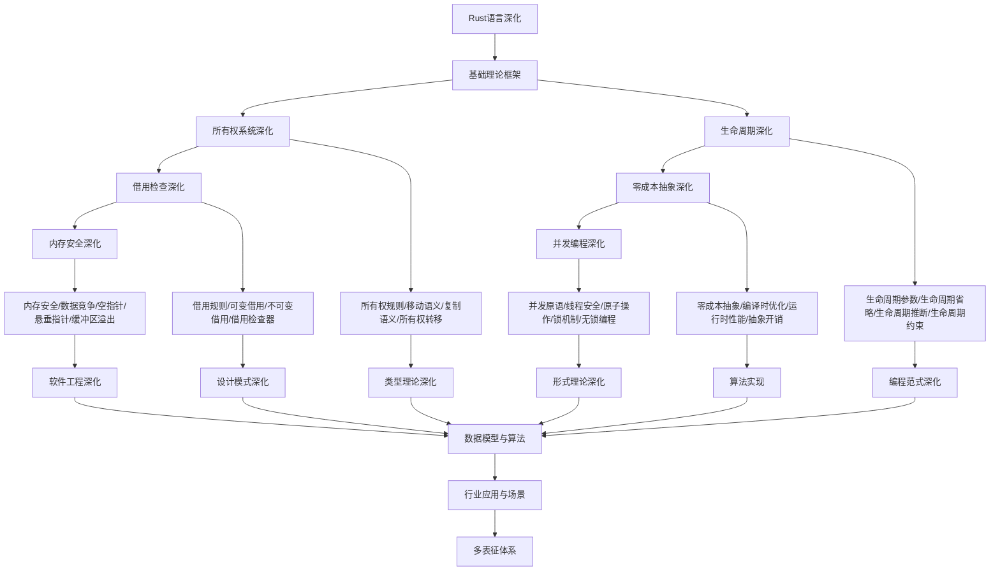

# 10.1-Rust语言深化 分支导航

## 目录结构与本地跳转
- [10.1.1-所有权系统深化](10.1.1-所有权系统深化.md) - 预留分支
- [10.1.2-生命周期深化](10.1.2-生命周期深化.md) - 预留分支
- [10.1.3-借用检查深化](10.1.3-借用检查深化.md) - 预留分支
- [10.1.4-零成本抽象深化](10.1.4-零成本抽象深化.md) - 预留分支
- [10.1.5-内存安全深化](10.1.5-内存安全深化.md) - 预留分支
- [10.1.6-并发编程深化](10.1.6-并发编程深化.md) - 预留分支

---

## 主题交叉引用
| 主题      | 基础理论 | 所有权系统 | 生命周期 | 借用检查 | 零成本抽象 | 内存安全 | 并发编程 | 多表征 |
|-----------|----------|------------|----------|----------|------------|----------|----------|--------|
| 所有权系统深化| 预留     | 预留       | 预留     | 预留     | 预留       | 预留     | 预留     | 预留   |
| 生命周期深化| 预留     | 预留       | 预留     | 预留     | 预留       | 预留     | 预留     | 预留   |
| 借用检查深化| 预留     | 预留       | 预留     | 预留     | 预留       | 预留     | 预留     | 预留   |
| 零成本抽象深化| 预留   | 预留       | 预留     | 预留     | 预留       | 预留     | 预留     | 预留   |
| 内存安全深化| 预留     | 预留       | 预留     | 预留     | 预留       | 预留     | 预留     | 预留   |
| 并发编程深化| 预留     | 预留       | 预留     | 预留     | 预留       | 预留     | 预留     | 预留   |

- 交叉引用：[8.1-类型理论深化](../8-形式理论深化/8.1-类型理论深化/README.md)、[10.2-编程范式深化](../10.2-编程范式深化/README.md)、[9.1-设计模式深化](../9-软件工程深化/9.1-设计模式深化/README.md)

---

## 全链路知识流（Mermaid流程图）

---

## 知识体系特色
- **所有权系统**: Rust独特的所有权模型和内存管理
- **生命周期**: 复杂生命周期参数的设计和使用
- **借用检查**: 编译时借用检查器的原理和实现
- **零成本抽象**: 高级抽象的低成本实现
- **内存安全**: 编译时内存安全保证
- **并发编程**: 线程安全的并发编程模型

---

[返回编程语言深化总导航](../README.md) 