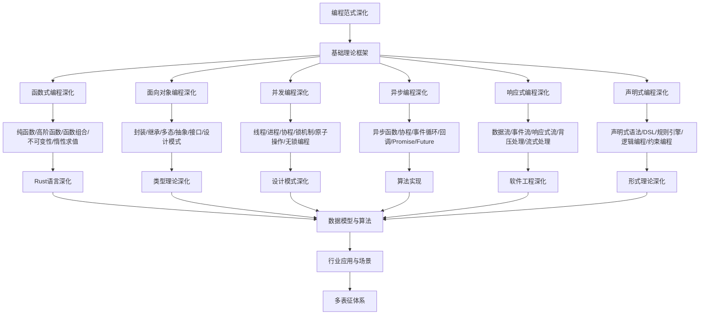

# 10.2-编程范式深化 分支导航

## 目录结构与本地跳转
- [10.2.1-函数式编程深化](10.2.1-函数式编程深化.md) - 预留分支
- [10.2.2-面向对象编程深化](10.2.2-面向对象编程深化.md) - 预留分支
- [10.2.3-并发编程深化](10.2.3-并发编程深化.md) - 预留分支
- [10.2.4-异步编程深化](10.2.4-异步编程深化.md) - 预留分支
- [10.2.5-响应式编程深化](10.2.5-响应式编程深化.md) - 预留分支
- [10.2.6-声明式编程深化](10.2.6-声明式编程深化.md) - 预留分支

---

## 主题交叉引用
| 主题      | 基础理论 | 函数式编程 | 面向对象编程 | 并发编程 | 异步编程 | 响应式编程 | 声明式编程 | 多表征 |
|-----------|----------|------------|--------------|----------|----------|------------|------------|--------|
| 函数式编程深化| 预留     | 预留       | 预留         | 预留     | 预留     | 预留       | 预留       | 预留   |
| 面向对象编程深化| 预留   | 预留       | 预留         | 预留     | 预留     | 预留       | 预留       | 预留   |
| 并发编程深化| 预留     | 预留       | 预留         | 预留     | 预留     | 预留       | 预留       | 预留   |
| 异步编程深化| 预留     | 预留       | 预留         | 预留     | 预留     | 预留       | 预留       | 预留   |
| 响应式编程深化| 预留   | 预留       | 预留         | 预留     | 预留     | 预留       | 预留       | 预留   |
| 声明式编程深化| 预留   | 预留       | 预留         | 预留     | 预留     | 预留       | 预留       | 预留   |

- 交叉引用：[10.1-Rust语言深化](../10.1-Rust语言深化/README.md)、[8.1-类型理论深化](../8-形式理论深化/8.1-类型理论深化/README.md)、[9.1-设计模式深化](../9-软件工程深化/9.1-设计模式深化/README.md)

---

## 全链路知识流（Mermaid流程图）

---

## 知识体系特色
- **函数式编程**: 纯函数、高阶函数、函数组合等核心概念
- **面向对象编程**: 封装、继承、多态等OOP核心特性
- **并发编程**: 多线程、进程、协程等并发模型
- **异步编程**: 异步函数、协程、事件循环等异步模式
- **响应式编程**: 数据流、事件流、响应式流等流式处理
- **声明式编程**: DSL、规则引擎、逻辑编程等声明式方法

---

[返回编程语言深化总导航](../README.md) 