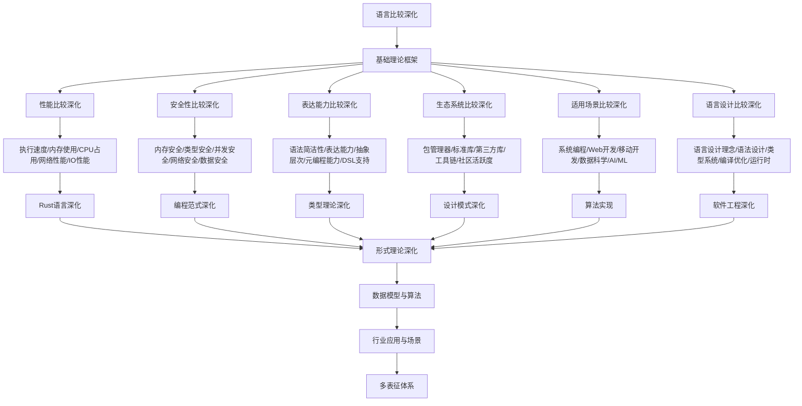

# 10.3-语言比较深化 分支导航

## 目录结构与本地跳转

- [10.3.1-性能比较深化](10.3.1-性能比较深化.md) - 预留分支
- [10.3.2-安全性比较深化](10.3.2-安全性比较深化.md) - 预留分支
- [10.3.3-表达能力比较深化](10.3.3-表达能力比较深化.md) - 预留分支
- [10.3.4-生态系统比较深化](10.3.4-生态系统比较深化.md) - 预留分支
- [10.3.5-适用场景比较深化](10.3.5-适用场景比较深化.md) - 预留分支
- [10.3.6-语言设计比较深化](10.3.6-语言设计比较深化.md) - 预留分支

---

## 主题交叉引用

| 主题      | 基础理论 | 性能比较 | 安全性比较 | 表达能力比较 | 生态系统比较 | 适用场景比较 | 语言设计比较 | 多表征 |
|-----------|----------|----------|------------|--------------|--------------|--------------|--------------|--------|
| 性能比较深化| 预留     | 预留     | 预留       | 预留         | 预留         | 预留         | 预留         | 预留   |
| 安全性比较深化| 预留   | 预留     | 预留       | 预留         | 预留         | 预留         | 预留         | 预留   |
| 表达能力比较深化| 预留   | 预留     | 预留       | 预留         | 预留         | 预留         | 预留         | 预留   |
| 生态系统比较深化| 预留   | 预留     | 预留       | 预留         | 预留         | 预留         | 预留         | 预留   |
| 适用场景比较深化| 预留   | 预留     | 预留       | 预留         | 预留         | 预留         | 预留         | 预留   |
| 语言设计比较深化| 预留   | 预留     | 预留       | 预留         | 预留         | 预留         | 预留         | 预留   |

- 交叉引用：[10.1-Rust语言深化](../10.1-Rust语言深化/README.md)、[10.2-编程范式深化](../10.2-编程范式深化/README.md)、[8.1-类型理论深化](../8-形式理论深化/8.1-类型理论深化/README.md)

---

## 全链路知识流（Mermaid流程图）

---

## 知识体系特色

- **性能比较**: 不同编程语言的性能特点和优化策略
- **安全性比较**: 各种语言的安全特性和安全模型
- **表达能力比较**: 语言的表达能力和抽象层次
- **生态系统比较**: 语言生态系统的完整性和活跃度
- **适用场景比较**: 不同语言的最佳应用场景
- **语言设计比较**: 语言设计理念和实现差异

---

[返回编程语言深化总导航](../README.md)
