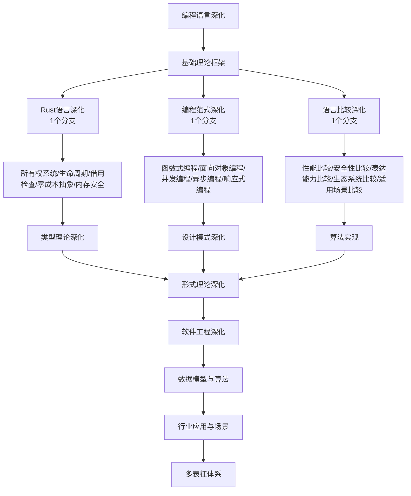

# 10-编程语言深化 总导航

## 目录结构与完成情况
- [10.1-Rust语言深化](10.1-Rust语言深化/README.md) - **1个分支，预留框架**
- [10.2-编程范式深化](10.2-编程范式深化/README.md) - **1个分支，预留框架**
- [10.3-语言比较深化](10.3-语言比较深化/README.md) - **1个分支，预留框架**

---

## 主题交叉引用
| 分支      | 基础理论 | Rust语言 | 编程范式 | 语言比较 | 多表征 |
|-----------|----------|----------|----------|----------|--------|
| Rust语言深化| 预留     | 预留     | 预留     | 预留     | 预留   |
| 编程范式深化| 预留     | 预留     | 预留     | 预留     | 预留   |
| 语言比较深化| 预留     | 预留     | 预留     | 预留     | 预留   |

- 交叉引用：[8.1-类型理论深化](../8-形式理论深化/8.1-类型理论深化/README.md)、[9.1-设计模式深化](../9-软件工程深化/9.1-设计模式深化/README.md)、[3.3-算法实现](../3-数据模型与算法/3.3-算法实现/README.md)

---

## 全链路知识流（Mermaid流程图）

---

## 知识体系特色
- **Rust语言**: 系统级编程语言的安全性和性能
- **编程范式**: 多种编程范式的理论和实践
- **语言比较**: 不同编程语言的深度对比分析
- **类型系统**: 现代类型系统的设计和实现
- **性能优化**: 编程语言层面的性能优化技术

---

[返回Analysis总导航](../README.md) 