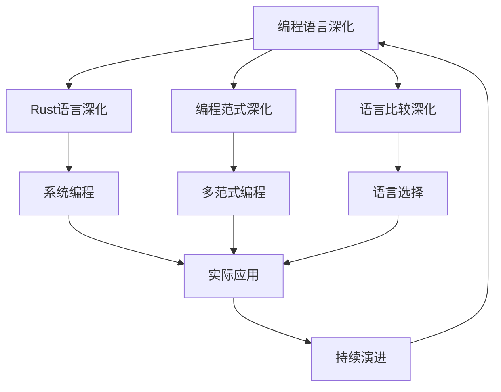

# 10-编程语言深化

## 📁 目录结构

```
10-编程语言深化/
├── 10.1-Rust语言深化/
│   └── README.md
├── 10.2-编程范式深化/
│   └── README.md
├── 10.3-语言比较深化/
│   └── README.md
└── README.md
```

## 🔗 主题交叉引用表

| 语言分支 | 关联理论 | 技术应用 | 实践场景 |
|---------|---------|---------|---------|
| **Rust语言深化** | 内存安全、零成本抽象 | 系统编程、并发编程 | 操作系统、网络服务 |
| **编程范式深化** | 函数式编程、面向对象 | 多范式编程、语言设计 | 软件架构、代码设计 |
| **语言比较深化** | 语言理论、类型系统 | 语言选择、性能优化 | 技术选型、系统设计 |

## 🔄 全链路知识流图



## 🎯 知识体系特色

### 理论严谨性
- **语言理论**：基于严格的编程语言理论
- **类型系统**：先进的类型系统设计
- **内存模型**：安全的内存管理模型

### 技术创新性
- **内存安全**：零成本的内存安全保证
- **并发编程**：安全的并发编程模型
- **多范式融合**：多种编程范式的有机结合

### 实践导向
- **系统编程**：直接应用于系统级编程
- **性能优化**：高性能编程的最佳实践
- **工程实践**：大型项目的工程化实践

### 持续演进
- **语言发展**：跟随编程语言发展趋势
- **技术融合**：与新兴技术领域深度融合
- **应用拓展**：向更多应用场景扩展

## 📚 学习路径建议

### 🚀 入门路径
1. **Rust语言基础** → 掌握Rust核心概念
2. **编程范式** → 理解不同编程范式
3. **语言比较** → 学习语言选择和比较
4. **实际应用** → 了解语言在实际项目中的应用

### 🔄 进阶路径
1. **系统编程** → 深入系统级编程技术
2. **并发编程** → 掌握安全的并发编程
3. **性能优化** → 学习高性能编程技术
4. **语言设计** → 理解编程语言设计原理

### 🎯 专家路径
1. **编译器设计** → 参与编程语言编译器开发
2. **语言创新** → 设计新的编程语言特性
3. **工具开发** → 开发编程语言相关工具
4. **社区贡献** → 为开源项目做出贡献

## 🚀 快速导航

### 语言深化
- [Rust语言深化](10.1-Rust语言深化/README.md)
- [编程范式深化](10.2-编程范式深化/README.md)
- [语言比较深化](10.3-语言比较深化/README.md)

## 🛠️ 技术栈映射

### Rust技术
- **核心语言**：Rust、Cargo、Crates.io
- **系统编程**：操作系统、驱动程序、嵌入式
- **网络编程**：Web框架、网络协议、微服务
- **并发编程**：异步编程、多线程、Actor模型
- **WebAssembly**：Rust到WASM编译、前端开发

### 编程范式
- **函数式编程**：Haskell、OCaml、F#
- **面向对象**：Java、C#、Python
- **逻辑编程**：Prolog、Mercury、Datalog
- **并发编程**：Erlang、Go、Scala
- **数据流编程**：LabVIEW、Pure Data

### 语言比较
- **性能比较**：C/C++、Rust、Go、Java
- **安全性比较**：Rust、Ada、SPARK
- **生产力比较**：Python、JavaScript、TypeScript
- **生态系统比较**：包管理、工具链、社区

### 开发工具
- **IDE支持**：IntelliJ Rust、VS Code、CLion
- **调试工具**：GDB、LLDB、Rust Analyzer
- **性能分析**：perf、Valgrind、Rust profilers
- **测试框架**：cargo test、proptest、quickcheck

## 🎯 应用场景体系

### 系统编程
- **操作系统**：内核开发、驱动程序
- **嵌入式系统**：IoT设备、实时系统
- **网络服务**：高性能服务器、代理服务
- **安全软件**：加密库、安全工具

### Web开发
- **后端服务**：API服务、微服务
- **前端开发**：WebAssembly、JavaScript互操作
- **全栈应用**：前后端统一开发
- **移动应用**：跨平台移动开发

### 数据科学
- **数值计算**：科学计算、机器学习
- **数据处理**：ETL管道、数据分析
- **可视化**：图表生成、交互式可视化
- **并行计算**：GPU编程、分布式计算

### 游戏开发
- **游戏引擎**：高性能游戏引擎
- **图形编程**：OpenGL、Vulkan、DirectX
- **物理引擎**：碰撞检测、物理模拟
- **音频处理**：音频引擎、音效处理

### 区块链应用
- **智能合约**：安全合约开发
- **共识算法**：区块链核心算法
- **密码学**：加密算法、数字签名
- **去中心化应用**：DApp开发

### 新兴技术
- **量子计算**：量子算法实现
- **边缘计算**：边缘设备编程
- **AI/ML**：机器学习框架
- **IoT应用**：物联网设备编程

---

**📖 相关导航**
- [返回总导航](../README.md)
- [2-形式科学理论](../2-形式科学理论/README.md)
- [Matter/ProgrammingLanguage](../Matter/ProgrammingLanguage/)
