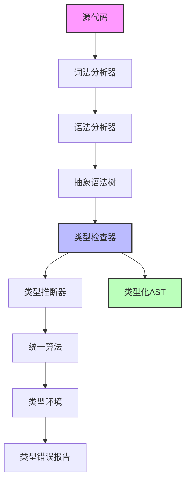

# 基础类型理论

## 摘要

基础类型理论是类型理论的起点，从简单类型λ演算开始，建立了类型系统的基本概念和理论框架。本文档详细介绍了类型上下文、类型判断、类型安全性和类型推断算法，为理解更高级的类型系统奠定基础。

## 1. 理论基础

### 1.1 简单类型λ演算

**定义 1.1.1 (类型)**
简单类型λ演算的类型集合 $\mathcal{T}$ 由以下语法定义：
$$\tau ::= \text{Bool} \mid \text{Nat} \mid \tau_1 \rightarrow \tau_2$$

**定义 1.1.2 (项)**
简单类型λ演算的项集合 $\mathcal{E}$ 由以下语法定义：
$$e ::= x \mid \lambda x:\tau.e \mid e_1 e_2 \mid \text{true} \mid \text{false} \mid \text{if } e_1 \text{ then } e_2 \text{ else } e_3 \mid 0 \mid \text{succ } e \mid \text{pred } e \mid \text{iszero } e$$

**定义 1.1.3 (类型上下文)**
类型上下文 $\Gamma$ 是变量到类型的有限映射：
$$\Gamma : \text{Var} \rightarrow \text{Type}$$

### 1.2 类型判断规则

**公理 1.1.1 (变量规则)**
$$\frac{x : \tau \in \Gamma}{\Gamma \vdash x : \tau}$$

**公理 1.1.2 (抽象规则)**
$$\frac{\Gamma, x : \tau_1 \vdash e : \tau_2}{\Gamma \vdash \lambda x:\tau_1.e : \tau_1 \rightarrow \tau_2}$$

**公理 1.1.3 (应用规则)**
$$\frac{\Gamma \vdash e_1 : \tau_1 \rightarrow \tau_2 \quad \Gamma \vdash e_2 : \tau_1}{\Gamma \vdash e_1 e_2 : \tau_2}$$

**公理 1.1.4 (布尔常量)**
$$\frac{}{\Gamma \vdash \text{true} : \text{Bool}} \quad \frac{}{\Gamma \vdash \text{false} : \text{Bool}}$$

**公理 1.1.5 (条件规则)**
$$\frac{\Gamma \vdash e_1 : \text{Bool} \quad \Gamma \vdash e_2 : \tau \quad \Gamma \vdash e_3 : \tau}{\Gamma \vdash \text{if } e_1 \text{ then } e_2 \text{ else } e_3 : \tau}$$

**公理 1.1.6 (自然数常量)**
$$\frac{}{\Gamma \vdash 0 : \text{Nat}}$$

**公理 1.1.7 (后继规则)**
$$\frac{\Gamma \vdash e : \text{Nat}}{\Gamma \vdash \text{succ } e : \text{Nat}}$$

**公理 1.1.8 (前驱规则)**
$$\frac{\Gamma \vdash e : \text{Nat}}{\Gamma \vdash \text{pred } e : \text{Nat}}$$

**公理 1.1.9 (零测试规则)**
$$\frac{\Gamma \vdash e : \text{Nat}}{\Gamma \vdash \text{iszero } e : \text{Bool}}$$

## 2. 类型安全性

### 2.1 类型保持性

**定理 2.1.1 (类型保持性 - Type Preservation)**
如果 $\Gamma \vdash e : \tau$ 且 $e \rightarrow e'$，则 $\Gamma \vdash e' : \tau$。

**证明：** 通过结构归纳法证明。对于每个归约规则，需要证明类型在归约后保持不变。

**归约规则：**

1. **β归约**：$(\lambda x:\tau.e_1) e_2 \rightarrow e_1[x \mapsto e_2]$
2. **条件归约**：$\text{if true then } e_1 \text{ else } e_2 \rightarrow e_1$
3. **条件归约**：$\text{if false then } e_1 \text{ else } e_2 \rightarrow e_2$
4. **后继归约**：$\text{pred (succ } e) \rightarrow e$
5. **零测试归约**：$\text{iszero 0} \rightarrow \text{true}$
6. **零测试归约**：$\text{iszero (succ } e) \rightarrow \text{false}$

### 2.2 进展性

**定理 2.1.2 (进展性 - Progress)**
如果 $\emptyset \vdash e : \tau$，则要么 $e$ 是值，要么存在 $e'$ 使得 $e \rightarrow e'$。

**证明：** 通过结构归纳法证明。对于每个语法构造，证明要么是值，要么可以继续归约。

**值的定义：**

- $\text{true}$, $\text{false}$ 是布尔值
- $0$ 是自然数值
- $\text{succ } v$ 是自然数值（如果 $v$ 是自然数值）
- $\lambda x:\tau.e$ 是函数值

## 3. 类型推断算法

### 3.1 Hindley-Milner 类型系统

**定义 3.1.1 (类型变量)**
类型变量 $\alpha, \beta, \gamma, \ldots$ 表示未知类型。

**定义 3.1.2 (类型模式)**
类型模式 $\sigma$ 定义为：
$$\sigma ::= \tau \mid \forall \alpha.\sigma$$

**定义 3.1.3 (类型替换)**
类型替换 $\theta$ 是类型变量到类型的映射：
$$\theta : \text{TVar} \rightarrow \text{Type}$$

### 3.2 统一算法

**算法 W (Robinson's Unification)**:

```haskell
unify :: Type -> Type -> Maybe Substitution
unify (TVar a) t = 
  if a `elem` ftv t then Nothing 
  else Just [(a, t)]
unify t (TVar a) = unify (TVar a) t
unify (TArrow t1 t2) (TArrow t1' t2') = do
  s1 <- unify t1 t1'
  s2 <- unify (apply s1 t2) (apply s1 t2')
  return (compose s2 s1)
unify (TCon a) (TCon b) = 
  if a == b then Just [] else Nothing
unify _ _ = Nothing
```

**定理 3.1.1 (算法 W 的正确性)**
如果算法 W 成功，则返回的替换是最一般的一致替换。

### 3.3 类型推断算法

```haskell
infer :: Context -> Expr -> Either TypeError (Type, Substitution)
infer ctx (Var x) = case lookup x ctx of
  Just t -> Right (t, [])
  Nothing -> Left (UnboundVariable x)
infer ctx (App e1 e2) = do
  (t1, s1) <- infer ctx e1
  (t2, s2) <- infer (apply s1 ctx) e2
  t3 <- freshTVar
  s3 <- unify (apply s2 t1) (TArrow t2 t3)
  return (apply s3 t3, compose s3 (compose s2 s1))
infer ctx (Abs x e) = do
  t1 <- freshTVar
  (t2, s) <- infer ((x, t1) : ctx) e
  return (TArrow (apply s t1) t2, s)
```

## 4. 系统设计

### 4.1 类型检查器架构



### 4.2 类型环境管理

```rust
#[derive(Debug, Clone)]
pub struct TypeEnv {
    bindings: HashMap<String, Type>,
    parent: Option<Box<TypeEnv>>,
}

impl TypeEnv {
    pub fn new() -> Self {
        TypeEnv {
            bindings: HashMap::new(),
            parent: None,
        }
    }
    
    pub fn extend(&self, name: String, ty: Type) -> Self {
        let mut new_env = self.clone();
        new_env.bindings.insert(name, ty);
        new_env.parent = Some(Box::new(self.clone()));
        new_env
    }
    
    pub fn lookup(&self, name: &str) -> Option<Type> {
        self.bindings.get(name).cloned()
            .or_else(|| self.parent.as_ref().and_then(|p| p.lookup(name)))
    }
}
```

## 5. 工程实践

### 5.1 类型检查器实现

```rust
pub fn type_check(env: &TypeEnv, expr: &Expr) -> Result<Type, TypeError> {
    match expr {
        Expr::Var(name) => {
            env.lookup(name)
                .ok_or(TypeError::UnboundVariable(name.clone()))
        }
        Expr::App(fun, arg) => {
            let fun_type = type_check(env, fun)?;
            let arg_type = type_check(env, arg)?;
            
            match fun_type {
                Type::Arrow(param_type, return_type) => {
                    if *param_type == arg_type {
                        Ok(*return_type)
                    } else {
                        Err(TypeError::TypeMismatch {
                            expected: *param_type,
                            found: arg_type,
                        })
                    }
                }
                _ => Err(TypeError::NotAFunction(fun_type)),
            }
        }
        Expr::Abs(param, body) => {
            let param_type = Type::Var(format!("T_{}", param));
            let new_env = env.extend(param.clone(), param_type.clone());
            let body_type = type_check(&new_env, body)?;
            Ok(Type::Arrow(Box::new(param_type), Box::new(body_type)))
        }
        Expr::Bool(_) => Ok(Type::Bool),
        Expr::Int(_) => Ok(Type::Int),
    }
}
```

### 5.2 类型推断实现

```rust
pub fn type_infer(env: &TypeEnv, expr: &Expr) -> Result<(Type, Substitution), TypeError> {
    match expr {
        Expr::Var(name) => {
            let ty = env.lookup(name)
                .ok_or(TypeError::UnboundVariable(name.clone()))?;
            Ok((ty, Substitution::new()))
        }
        Expr::App(fun, arg) => {
            let (fun_type, s1) = type_infer(env, fun)?;
            let (arg_type, s2) = type_infer(&env.apply(&s1), arg)?;
            let result_type = Type::fresh_var();
            
            let s3 = unify(
                &fun_type.apply(&s2),
                &Type::Arrow(Box::new(arg_type), Box::new(result_type.clone()))
            )?;
            
            Ok((result_type.apply(&s3), s3.compose(&s2).compose(&s1)))
        }
        Expr::Abs(param, body) => {
            let param_type = Type::fresh_var();
            let new_env = env.extend(param.clone(), param_type.clone());
            let (body_type, s) = type_infer(&new_env, body)?;
            
            Ok((
                Type::Arrow(Box::new(param_type.apply(&s)), Box::new(body_type)),
                s
            ))
        }
        Expr::Bool(_) => Ok((Type::Bool, Substitution::new())),
        Expr::Int(_) => Ok((Type::Int, Substitution::new())),
    }
}
```

### 5.3 性能分析

**时间复杂度分析：**

- 类型检查：$O(n)$，其中 $n$ 是表达式的大小
- 类型推断：$O(n^2)$，主要瓶颈在统一算法
- 统一算法：$O(n^2)$，最坏情况下需要 $O(n^2)$ 次比较

**空间复杂度分析：**

- 类型环境：$O(v)$，其中 $v$ 是变量数量
- 类型推断：$O(n)$，用于存储类型变量和替换

## 6. 应用场景

### 6.1 编程语言设计

- **静态类型检查**：在编译时捕获类型错误
- **类型安全保证**：确保程序运行时不会出现类型错误
- **代码优化**：基于类型信息进行编译器优化
- **文档生成**：自动生成API文档

### 6.2 程序验证

- **形式化规范**：使用类型作为程序规范
- **定理证明**：通过类型系统证明程序性质
- **安全验证**：验证程序的安全属性
- **正确性保证**：确保程序满足预期行为

### 6.3 软件工程

- **重构支持**：类型信息支持安全重构
- **IDE功能**：代码补全、错误检测、导航
- **测试生成**：基于类型信息生成测试用例
- **代码分析**：静态分析工具的基础

## 7. 未来展望

### 7.1 理论发展

- **依赖类型系统**：更强大的类型表达能力
- **线性类型系统**：资源管理和内存安全
- **量子类型系统**：量子计算的安全保证
- **同伦类型理论**：数学形式化的统一框架

### 7.2 工程应用

- **智能编译器**：基于机器学习的类型推断
- **增量类型检查**：支持大型项目的快速检查
- **分布式类型检查**：支持大规模并行检查
- **类型系统互操作**：不同语言间的类型安全交互

## 参考文献

1. Pierce, B. C. (2002). Types and programming languages. MIT press.
2. Hindley, J. R. (1969). The principal type-scheme of an object in combinatory logic. Transactions of the American Mathematical Society, 146, 29-60.
3. Milner, R. (1978). A theory of type polymorphism in programming. Journal of computer and system sciences, 17(3), 348-375.
4. Damas, L., & Milner, R. (1982). Principal type-schemes for functional programs. In Proceedings of the 9th ACM SIGPLAN-SIGACT symposium on Principles of programming languages (pp. 207-212).
5. Tait, W. W. (1967). Intensional interpretations of functionals of finite type I. The Journal of Symbolic Logic, 32(2), 198-212.

---

*基础类型理论为现代编程语言提供了坚实的理论基础，从简单的类型检查到复杂的程序验证，类型系统已经成为软件工程不可或缺的工具。*
