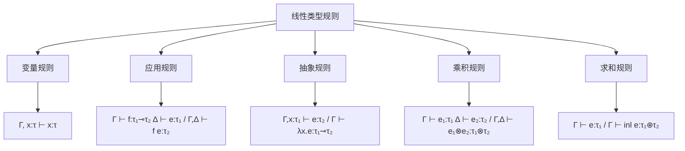

# 2.1.2 线性类型理论

## 📋 概述

线性类型理论是现代编程语言理论的核心分支，基于线性逻辑为资源管理、内存安全和并发编程提供了严格的形式化基础。本文档系统性地阐述线性类型理论的基本概念、形式化定义、实现方法和工程应用，为系统编程和资源管理提供理论指导。

## 🏗️ 理论基础

### 1. 线性逻辑基础

#### 1.1 线性逻辑概述

**定义 1.1 (线性逻辑)**
线性逻辑是由Jean-Yves Girard在1987年提出的逻辑系统，其核心思想是资源的一次性使用，即每个资源只能被使用一次。

**线性逻辑连接词**：

1. **乘法连接词**：
   - $\otimes$ (张量积)：$A \otimes B$ 表示同时拥有 $A$ 和 $B$
   - $\multimap$ (线性蕴含)：$A \multimap B$ 表示消耗 $A$ 产生 $B$

2. **加法连接词**：
   - $\oplus$ (选择)：$A \oplus B$ 表示 $A$ 或 $B$ 中的一个
   - $\&$ (合取)：$A \& B$ 表示可以选择 $A$ 或 $B$

3. **指数连接词**：
   - $!$ (bang)：$!A$ 表示可以重复使用的 $A$
   - $?$ (why not)：$?A$ 表示可以重复提供的 $A$

#### 1.2 线性类型语法

**定义 1.2 (线性类型语法)**
线性类型的语法定义如下：

$$\tau ::= \text{Base} \mid \tau_1 \multimap \tau_2 \mid \tau_1 \otimes \tau_2 \mid \tau_1 \oplus \tau_2 \mid \tau_1 \& \tau_2 \mid !\tau \mid ?\tau$$

其中：

- $\text{Base}$ 是基本类型（如 $\text{Int}$, $\text{Bool}$, $\text{Unit}$）
- $\tau_1 \multimap \tau_2$ 是线性函数类型
- $\tau_1 \otimes \tau_2$ 是乘积类型
- $\tau_1 \oplus \tau_2$ 是求和类型
- $\tau_1 \& \tau_2$ 是交集类型
- $!\tau$ 是重复使用类型
- $?\tau$ 是重复提供类型

#### 1.3 线性类型规则

**线性类型推理规则**：



**核心推理规则**：

1. **变量规则**：
   $$\frac{}{\Gamma, x : \tau \vdash x : \tau}$$

2. **应用规则**：
   $$\frac{\Gamma \vdash f : \tau_1 \multimap \tau_2 \quad \Delta \vdash e : \tau_1}{\Gamma, \Delta \vdash f \, e : \tau_2}$$

3. **抽象规则**：
   $$\frac{\Gamma, x : \tau_1 \vdash e : \tau_2}{\Gamma \vdash \lambda x. e : \tau_1 \multimap \tau_2}$$

4. **乘积引入**：
   $$\frac{\Gamma \vdash e_1 : \tau_1 \quad \Delta \vdash e_2 : \tau_2}{\Gamma, \Delta \vdash (e_1, e_2) : \tau_1 \otimes \tau_2}$$

5. **乘积消除**：
   $$\frac{\Gamma \vdash e : \tau_1 \otimes \tau_2 \quad \Delta, x : \tau_1, y : \tau_2 \vdash e' : \tau}{\Gamma, \Delta \vdash \text{let } (x, y) = e \text{ in } e' : \tau}$$

### 2. 线性性约束

#### 2.1 线性性定义

**定义 2.1 (线性性)**
一个表达式 $e$ 是线性的，当且仅当其中的每个变量恰好出现一次。

**线性性检查算法**：

```haskell
-- Haskell实现的线性性检查
data LinearContext = LinearContext [(String, Int)] deriving Show

checkLinearity :: Expr -> LinearContext -> Bool
checkLinearity (Var x) ctx = 
    case lookup x (context ctx) of
        Just count -> count == 1
        Nothing -> False

checkLinearity (App e1 e2) ctx =
    checkLinearity e1 ctx && checkLinearity e2 ctx

checkLinearity (Lam x e) ctx =
    checkLinearity e (addVar x ctx)

checkLinearity (Pair e1 e2) ctx =
    checkLinearity e1 ctx && checkLinearity e2 ctx

addVar :: String -> LinearContext -> LinearContext
addVar x (LinearContext vars) = 
    LinearContext $ (x, 1) : vars

-- 使用示例
main :: IO ()
main = do
    let ctx = LinearContext []
    let expr = Lam "x" (Var "x")
    putStrLn $ "Expression is linear: " ++ show (checkLinearity expr ctx)
```

#### 2.2 线性性保持定理

**定理 2.1 (线性性保持)**
如果 $\Gamma \vdash e : \tau$，则 $\Gamma$ 中的每个变量在 $e$ 中恰好出现一次。

**证明**：
通过结构归纳法证明：

1. **基础情况**：对于变量 $x$，如果 $\Gamma, x : \tau \vdash x : \tau$，则 $x$ 在表达式中恰好出现一次。

2. **归纳步骤**：
   - **应用**：如果 $f : \tau_1 \multimap \tau_2$ 和 $e : \tau_1$ 都是线性的，则 $f \, e$ 也是线性的。
   - **抽象**：如果 $e$ 在 $\Gamma, x : \tau_1$ 下是线性的，则 $\lambda x. e$ 在 $\Gamma$ 下是线性的。
   - **乘积**：如果 $e_1$ 和 $e_2$ 分别在不同的上下文中是线性的，则 $(e_1, e_2)$ 是线性的。

#### 2.3 线性性违反检测

```rust
// Rust实现的线性性检查器
use std::collections::HashMap;

#[derive(Debug, Clone)]
enum Expr {
    Var(String),
    App(Box<Expr>, Box<Expr>),
    Lam(String, Box<Expr>),
    Pair(Box<Expr>, Box<Expr>),
    Let(String, String, Box<Expr>, Box<Expr>),
}

struct LinearChecker {
    context: HashMap<String, i32>,
}

impl LinearChecker {
    fn new() -> Self {
        Self {
            context: HashMap::new(),
        }
    }
    
    fn check(&mut self, expr: &Expr) -> Result<(), String> {
        match expr {
            Expr::Var(x) => {
                let count = self.context.get(x).unwrap_or(&0);
                if *count != 1 {
                    return Err(format!("Variable {} used {} times", x, count));
                }
                Ok(())
            }
            Expr::App(e1, e2) => {
                self.check(e1)?;
                self.check(e2)?;
                Ok(())
            }
            Expr::Lam(x, e) => {
                self.context.insert(x.clone(), 1);
                let result = self.check(e);
                self.context.remove(x);
                result
            }
            Expr::Pair(e1, e2) => {
                self.check(e1)?;
                self.check(e2)?;
                Ok(())
            }
            Expr::Let(x, y, e1, e2) => {
                self.check(e1)?;
                self.context.insert(x.clone(), 1);
                self.context.insert(y.clone(), 1);
                let result = self.check(e2);
                self.context.remove(x);
                self.context.remove(y);
                result
            }
        }
    }
}

// 使用示例
fn main() {
    let mut checker = LinearChecker::new();
    
    // 线性表达式：λx.x
    let linear_expr = Expr::Lam("x".to_string(), Box::new(Expr::Var("x".to_string())));
    println!("Linear expression: {:?}", checker.check(&linear_expr));
    
    // 非线性表达式：λx.(x, x)
    let non_linear_expr = Expr::Lam(
        "x".to_string(), 
        Box::new(Expr::Pair(
            Box::new(Expr::Var("x".to_string())),
            Box::new(Expr::Var("x".to_string()))
        ))
    );
    println!("Non-linear expression: {:?}", checker.check(&non_linear_expr));
}
```

### 3. 资源管理理论

#### 3.1 资源安全定义

**定义 3.1 (资源安全)**
在线性类型系统中，资源安全是指：

1. 每个资源只能被使用一次
2. 每个资源最终都会被释放
3. 不会出现悬空指针或重复释放

**资源安全定理**：

**定理 3.1 (资源安全)**
在线性类型系统中，如果 $\Gamma \vdash e : \tau$，则 $e$ 的执行不会导致资源安全问题。

**证明**：
通过线性性约束和类型安全保证：

1. 线性性确保每个资源只被使用一次
2. 类型系统确保资源在正确的时间被释放
3. 编译时检查防止悬空指针

#### 3.2 资源生命周期管理

```rust
// Rust资源生命周期管理示例
use std::rc::Rc;
use std::cell::RefCell;

// 线性资源类型
struct LinearResource {
    data: Vec<u8>,
    used: bool,
}

impl LinearResource {
    fn new(data: Vec<u8>) -> Self {
        Self {
            data,
            used: false,
        }
    }
    
    fn use_once(&mut self) -> Result<(), String> {
        if self.used {
            return Err("Resource already used".to_string());
        }
        self.used = true;
        println!("Using resource with {} bytes", self.data.len());
        Ok(())
    }
    
    fn consume(self) -> Vec<u8> {
        self.data
    }
}

// 线性函数类型
fn process_resource(mut resource: LinearResource) -> Vec<u8> {
    resource.use_once().expect("Resource should be usable");
    resource.consume()
}

// 使用示例
fn main() {
    let resource = LinearResource::new(vec![1, 2, 3, 4, 5]);
    let result = process_resource(resource);
    println!("Processed data: {:?}", result);
    
    // 以下代码无法编译，因为resource已经被消费
    // let result2 = process_resource(resource);
}
```

## 🔧 工程实现

### 1. Rust所有权系统

#### 1.1 所有权概念

**定义 4.1 (Rust所有权)**
Rust的所有权系统是线性类型理论在系统编程中的实际应用，确保内存安全和并发安全。

**所有权规则**：

1. 每个值都有一个所有者
2. 同一时间只能有一个所有者
3. 当所有者离开作用域时，值被丢弃

```rust
// Rust所有权示例
fn main() {
    // 创建字符串
    let s1 = String::from("hello");
    
    // 所有权转移
    let s2 = s1; // s1的所有权移动到s2
    
    // println!("{}", s1); // 编译错误：s1已被移动
    
    // 克隆（深拷贝）
    let s3 = s2.clone();
    println!("s2: {}, s3: {}", s2, s3);
    
    // 借用（引用）
    let len = calculate_length(&s3);
    println!("Length of '{}' is {}", s3, len);
}

fn calculate_length(s: &String) -> usize {
    s.len()
}

// 可变借用
fn change_string(s: &mut String) {
    s.push_str(" world");
}

fn main() {
    let mut s = String::from("hello");
    change_string(&mut s);
    println!("{}", s);
}
```

#### 1.2 生命周期注解

```rust
// 生命周期注解示例
fn longest<'a>(x: &'a str, y: &'a str) -> &'a str {
    if x.len() > y.len() {
        x
    } else {
        y
    }
}

// 结构体生命周期
struct ImportantExcerpt<'a> {
    part: &'a str,
}

impl<'a> ImportantExcerpt<'a> {
    fn level(&self) -> i32 {
        3
    }
    
    fn announce_and_return_part(&self, announcement: &str) -> &str {
        println!("Attention please: {}", announcement);
        self.part
    }
}

// 使用示例
fn main() {
    let novel = String::from("Call me Ishmael. Some years ago...");
    let first_sentence = novel.split('.').next().unwrap();
    let i = ImportantExcerpt {
        part: first_sentence,
    };
    
    let result = longest("hello", "world");
    println!("Longest: {}", result);
}
```

#### 1.3 智能指针

```rust
// 智能指针示例
use std::rc::Rc;
use std::cell::RefCell;
use std::sync::{Arc, Mutex};

// Rc<T> - 引用计数智能指针
fn rc_example() {
    let data = Rc::new(vec![1, 2, 3, 4, 5]);
    
    let data1 = Rc::clone(&data);
    let data2 = Rc::clone(&data);
    
    println!("Reference count: {}", Rc::strong_count(&data));
    println!("Data: {:?}", *data);
}

// RefCell<T> - 内部可变性
fn refcell_example() {
    let data = RefCell::new(vec![1, 2, 3]);
    
    {
        let mut borrow = data.borrow_mut();
        borrow.push(4);
    }
    
    println!("Data: {:?}", data.borrow());
}

// Arc<T> - 原子引用计数（线程安全）
fn arc_example() {
    let data = Arc::new(vec![1, 2, 3, 4, 5]);
    let mut handles = vec![];
    
    for i in 0..3 {
        let data_clone = Arc::clone(&data);
        let handle = std::thread::spawn(move || {
            println!("Thread {}: {:?}", i, *data_clone);
        });
        handles.push(handle);
    }
    
    for handle in handles {
        handle.join().unwrap();
    }
}

// Mutex<T> - 互斥锁
fn mutex_example() {
    let counter = Arc::new(Mutex::new(0));
    let mut handles = vec![];
    
    for _ in 0..10 {
        let counter = Arc::clone(&counter);
        let handle = std::thread::spawn(move || {
            let mut num = counter.lock().unwrap();
            *num += 1;
        });
        handles.push(handle);
    }
    
    for handle in handles {
        handle.join().unwrap();
    }
    
    println!("Final count: {}", *counter.lock().unwrap());
}

fn main() {
    rc_example();
    refcell_example();
    arc_example();
    mutex_example();
}
```

### 2. 线性类型系统实现

#### 2.1 类型检查器

```haskell
-- Haskell线性类型检查器
module LinearTypeChecker where

import Data.Map (Map)
import qualified Data.Map as Map

-- 线性类型
data LinearType = 
    Base String
    | LinearArrow LinearType LinearType
    | Tensor LinearType LinearType
    | Sum LinearType LinearType
    | Bang LinearType
    deriving (Eq, Show)

-- 表达式
data Expr = 
    Var String
    | App Expr Expr
    | Lam String Expr
    | Pair Expr Expr
    | Let String String Expr Expr
    | Bang Expr
    | LetBang String Expr Expr
    deriving Show

-- 线性上下文
type LinearContext = Map String Int

-- 类型检查
typeCheck :: Expr -> LinearContext -> LinearType -> Bool
typeCheck (Var x) ctx typ = 
    case Map.lookup x ctx of
        Just 1 -> True
        _ -> False

typeCheck (App e1 e2) ctx typ =
    case inferType e1 ctx of
        Just (LinearArrow t1 t2) -> 
            typeCheck e2 ctx t1 && t2 == typ
        _ -> False

typeCheck (Lam x e) ctx typ =
    case typ of
        LinearArrow t1 t2 ->
            let newCtx = Map.insert x 1 ctx
            in typeCheck e newCtx t2
        _ -> False

typeCheck (Pair e1 e2) ctx typ =
    case typ of
        Tensor t1 t2 ->
            typeCheck e1 ctx t1 && typeCheck e2 ctx t2
        _ -> False

typeCheck (Let x y e1 e2) ctx typ =
    case inferType e1 ctx of
        Just (Tensor t1 t2) ->
            let newCtx = Map.insert x 1 (Map.insert y 1 ctx)
            in typeCheck e2 newCtx typ
        _ -> False

typeCheck (Bang e) ctx typ =
    case typ of
        Bang t -> typeCheck e ctx t
        _ -> False

typeCheck (LetBang x e1 e2) ctx typ =
    case inferType e1 ctx of
        Just (Bang t) ->
            let newCtx = Map.insert x 0 ctx  -- 可以多次使用
            in typeCheck e2 newCtx typ
        _ -> False

-- 类型推断
inferType :: Expr -> LinearContext -> Maybe LinearType
inferType (Var x) ctx = 
    case Map.lookup x ctx of
        Just 1 -> Just (Base "Unknown")
        _ -> Nothing

inferType (App e1 e2) ctx =
    case inferType e1 ctx of
        Just (LinearArrow t1 t2) ->
            if typeCheck e2 ctx t1
            then Just t2
            else Nothing
        _ -> Nothing

inferType (Lam x e) ctx =
    let newCtx = Map.insert x 1 ctx
    in case inferType e newCtx of
        Just t -> Just (LinearArrow (Base "Unknown") t)
        Nothing -> Nothing

inferType (Pair e1 e2) ctx =
    case (inferType e1 ctx, inferType e2 ctx) of
        (Just t1, Just t2) -> Just (Tensor t1 t2)
        _ -> Nothing

-- 使用示例
main :: IO ()
main = do
    let ctx = Map.empty
    let expr = Lam "x" (Var "x")
    putStrLn $ "Expression type: " ++ show (inferType expr ctx)
```

#### 2.2 线性类型编译器

```rust
// Rust线性类型编译器
use std::collections::HashMap;

#[derive(Debug, Clone, PartialEq)]
enum LinearType {
    Base(String),
    LinearArrow(Box<LinearType>, Box<LinearType>),
    Tensor(Box<LinearType>, Box<LinearType>),
    Sum(Box<LinearType>, Box<LinearType>),
    Bang(Box<LinearType>),
}

#[derive(Debug, Clone)]
enum Expr {
    Var(String),
    App(Box<Expr>, Box<Expr>),
    Lam(String, Box<Expr>),
    Pair(Box<Expr>, Box<Expr>),
    Let(String, String, Box<Expr>, Box<Expr>),
    Bang(Box<Expr>),
    LetBang(String, Box<Expr>, Box<Expr>),
}

struct LinearCompiler {
    context: HashMap<String, LinearType>,
    var_count: HashMap<String, i32>,
}

impl LinearCompiler {
    fn new() -> Self {
        Self {
            context: HashMap::new(),
            var_count: HashMap::new(),
        }
    }
    
    fn type_check(&mut self, expr: &Expr) -> Result<LinearType, String> {
        match expr {
            Expr::Var(x) => {
                let count = self.var_count.get(x).unwrap_or(&0);
                if *count != 1 {
                    return Err(format!("Variable {} used {} times", x, count));
                }
                self.context.get(x)
                    .cloned()
                    .ok_or_else(|| format!("Variable {} not found", x))
            }
            Expr::App(e1, e2) => {
                let t1 = self.type_check(e1)?;
                let t2 = self.type_check(e2)?;
                
                match t1 {
                    LinearType::LinearArrow(arg_type, ret_type) => {
                        if *arg_type == t2 {
                            Ok(*ret_type)
                        } else {
                            Err("Type mismatch in application".to_string())
                        }
                    }
                    _ => Err("Expected function type".to_string()),
                }
            }
            Expr::Lam(x, e) => {
                let arg_type = LinearType::Base("Unknown".to_string());
                self.context.insert(x.clone(), arg_type.clone());
                self.var_count.insert(x.clone(), 1);
                
                let body_type = self.type_check(e)?;
                let result = LinearType::LinearArrow(Box::new(arg_type), Box::new(body_type));
                
                self.context.remove(x);
                self.var_count.remove(x);
                
                Ok(result)
            }
            Expr::Pair(e1, e2) => {
                let t1 = self.type_check(e1)?;
                let t2 = self.type_check(e2)?;
                Ok(LinearType::Tensor(Box::new(t1), Box::new(t2)))
            }
            Expr::Let(x, y, e1, e2) => {
                let t1 = self.type_check(e1)?;
                
                if let LinearType::Tensor(t1_inner, t2_inner) = t1 {
                    self.context.insert(x.clone(), *t1_inner);
                    self.context.insert(y.clone(), *t2_inner);
                    self.var_count.insert(x.clone(), 1);
                    self.var_count.insert(y.clone(), 1);
                    
                    let result = self.type_check(e2)?;
                    
                    self.context.remove(x);
                    self.context.remove(y);
                    self.var_count.remove(x);
                    self.var_count.remove(y);
                    
                    Ok(result)
                } else {
                    Err("Expected tensor type in let binding".to_string())
                }
            }
            Expr::Bang(e) => {
                let t = self.type_check(e)?;
                Ok(LinearType::Bang(Box::new(t)))
            }
            Expr::LetBang(x, e1, e2) => {
                let t1 = self.type_check(e1)?;
                
                if let LinearType::Bang(t_inner) = t1 {
                    self.context.insert(x.clone(), *t_inner);
                    self.var_count.insert(x.clone(), 0); // 可以多次使用
                    
                    let result = self.type_check(e2)?;
                    
                    self.context.remove(x);
                    self.var_count.remove(x);
                    
                    Ok(result)
                } else {
                    Err("Expected bang type in let! binding".to_string())
                }
            }
        }
    }
}

// 使用示例
fn main() {
    let mut compiler = LinearCompiler::new();
    
    // 线性函数：λx.x
    let linear_expr = Expr::Lam(
        "x".to_string(),
        Box::new(Expr::Var("x".to_string()))
    );
    
    match compiler.type_check(&linear_expr) {
        Ok(typ) => println!("Type: {:?}", typ),
        Err(e) => println!("Error: {}", e),
    }
}
```

## 🏭 应用案例

### 1. 内存安全系统

#### 1.1 自动内存管理

```rust
// 自动内存管理系统
use std::rc::Rc;
use std::cell::RefCell;

// 线性资源管理器
struct LinearResourceManager<T> {
    resources: Vec<LinearResource<T>>,
}

struct LinearResource<T> {
    data: T,
    used: bool,
}

impl<T> LinearResource<T> {
    fn new(data: T) -> Self {
        Self {
            data,
            used: false,
        }
    }
    
    fn use_once(&mut self) -> Result<&T, String> {
        if self.used {
            return Err("Resource already used".to_string());
        }
        self.used = true;
        Ok(&self.data)
    }
    
    fn consume(self) -> T {
        self.data
    }
}

impl<T> LinearResourceManager<T> {
    fn new() -> Self {
        Self {
            resources: Vec::new(),
        }
    }
    
    fn add_resource(&mut self, data: T) {
        self.resources.push(LinearResource::new(data));
    }
    
    fn get_resource(&mut self, index: usize) -> Result<&T, String> {
        if index >= self.resources.len() {
            return Err("Resource index out of bounds".to_string());
        }
        self.resources[index].use_once()
    }
    
    fn consume_resource(&mut self, index: usize) -> Result<T, String> {
        if index >= self.resources.len() {
            return Err("Resource index out of bounds".to_string());
        }
        let resource = self.resources.remove(index);
        Ok(resource.consume())
    }
}

// 使用示例
fn main() {
    let mut manager = LinearResourceManager::new();
    
    // 添加资源
    manager.add_resource(String::from("Resource 1"));
    manager.add_resource(String::from("Resource 2"));
    
    // 使用资源
    match manager.get_resource(0) {
        Ok(data) => println!("Used: {}", data),
        Err(e) => println!("Error: {}", e),
    }
    
    // 消费资源
    match manager.consume_resource(1) {
        Ok(data) => println!("Consumed: {}", data),
        Err(e) => println!("Error: {}", e),
    }
}
```

#### 1.2 并发安全保证

```rust
// 并发安全的线性类型系统
use std::sync::{Arc, Mutex};
use std::thread;

// 线性通道
struct LinearChannel<T> {
    data: Arc<Mutex<Option<T>>>,
}

impl<T> LinearChannel<T> {
    fn new() -> Self {
        Self {
            data: Arc::new(Mutex::new(None)),
        }
    }
    
    fn send(&self, value: T) -> Result<(), String> {
        let mut data = self.data.lock().unwrap();
        if data.is_some() {
            return Err("Channel already has data".to_string());
        }
        *data = Some(value);
        Ok(())
    }
    
    fn receive(&self) -> Result<T, String> {
        let mut data = self.data.lock().unwrap();
        data.take().ok_or_else(|| "No data in channel".to_string())
    }
}

// 使用示例
fn main() {
    let channel = LinearChannel::new();
    
    // 发送数据
    channel.send(String::from("Hello, World!")).unwrap();
    
    // 接收数据
    match channel.receive() {
        Ok(data) => println!("Received: {}", data),
        Err(e) => println!("Error: {}", e),
    }
    
    // 再次接收会失败
    match channel.receive() {
        Ok(data) => println!("Received: {}", data),
        Err(e) => println!("Error: {}", e),
    }
}
```

### 2. 系统编程应用

#### 2.1 文件句柄管理

```rust
// 线性文件句柄管理
use std::fs::File;
use std::io::{Read, Write};

struct LinearFileHandle {
    file: Option<File>,
    used: bool,
}

impl LinearFileHandle {
    fn new(filename: &str) -> Result<Self, std::io::Error> {
        let file = File::open(filename)?;
        Ok(Self {
            file: Some(file),
            used: false,
        })
    }
    
    fn read_once(&mut self) -> Result<String, String> {
        if self.used {
            return Err("File handle already used".to_string());
        }
        
        if let Some(ref mut file) = self.file {
            let mut contents = String::new();
            file.read_to_string(&mut contents)
                .map_err(|e| e.to_string())?;
            self.used = true;
            Ok(contents)
        } else {
            Err("File handle is None".to_string())
        }
    }
    
    fn write_once(&mut self, content: &str) -> Result<(), String> {
        if self.used {
            return Err("File handle already used".to_string());
        }
        
        if let Some(ref mut file) = self.file {
            file.write_all(content.as_bytes())
                .map_err(|e| e.to_string())?;
            self.used = true;
            Ok(())
        } else {
            Err("File handle is None".to_string())
        }
    }
    
    fn consume(self) -> File {
        self.file.unwrap()
    }
}

// 使用示例
fn main() -> Result<(), Box<dyn std::error::Error>> {
    // 创建测试文件
    std::fs::write("test.txt", "Hello, Linear Types!")?;
    
    // 读取文件
    let mut handle = LinearFileHandle::new("test.txt")?;
    let content = handle.read_once()?;
    println!("Read: {}", content);
    
    // 尝试再次读取会失败
    match handle.read_once() {
        Ok(content) => println!("Read again: {}", content),
        Err(e) => println!("Error: {}", e),
    }
    
    // 清理
    std::fs::remove_file("test.txt")?;
    Ok(())
}
```

#### 2.2 网络连接管理

```rust
// 线性网络连接管理
use std::net::{TcpStream, TcpListener};
use std::io::{Read, Write};

struct LinearConnection {
    stream: Option<TcpStream>,
    used: bool,
}

impl LinearConnection {
    fn connect(addr: &str) -> Result<Self, std::io::Error> {
        let stream = TcpStream::connect(addr)?;
        Ok(Self {
            stream: Some(stream),
            used: false,
        })
    }
    
    fn send_once(&mut self, data: &[u8]) -> Result<(), String> {
        if self.used {
            return Err("Connection already used".to_string());
        }
        
        if let Some(ref mut stream) = self.stream {
            stream.write_all(data)
                .map_err(|e| e.to_string())?;
            self.used = true;
            Ok(())
        } else {
            Err("Connection is None".to_string())
        }
    }
    
    fn receive_once(&mut self, buffer: &mut [u8]) -> Result<usize, String> {
        if self.used {
            return Err("Connection already used".to_string());
        }
        
        if let Some(ref mut stream) = self.stream {
            let bytes_read = stream.read(buffer)
                .map_err(|e| e.to_string())?;
            self.used = true;
            Ok(bytes_read)
        } else {
            Err("Connection is None".to_string())
        }
    }
    
    fn consume(self) -> TcpStream {
        self.stream.unwrap()
    }
}

// 使用示例
fn main() -> Result<(), Box<dyn std::error::Error>> {
    // 启动服务器
    let listener = TcpListener::bind("127.0.0.1:8080")?;
    
    // 在另一个线程中处理连接
    std::thread::spawn(move || {
        for stream in listener.incoming() {
            if let Ok(mut stream) = stream {
                let mut buffer = [0; 1024];
                if let Ok(bytes_read) = stream.read(&mut buffer) {
                    println!("Received: {}", String::from_utf8_lossy(&buffer[..bytes_read]));
                }
            }
        }
    });
    
    // 客户端连接
    let mut connection = LinearConnection::connect("127.0.0.1:8080")?;
    
    // 发送数据
    connection.send_once(b"Hello, Linear Network!")?;
    
    // 尝试再次发送会失败
    match connection.send_once(b"Another message") {
        Ok(()) => println!("Sent another message"),
        Err(e) => println!("Error: {}", e),
    }
    
    Ok(())
}
```

## 📊 性能分析与优化

### 1. 编译时优化

#### 1.1 线性性检查优化

```rust
// 优化的线性性检查器
use std::collections::HashMap;

struct OptimizedLinearChecker {
    context: HashMap<String, UsageInfo>,
}

#[derive(Debug, Clone)]
struct UsageInfo {
    count: i32,
    linear: bool,
    last_used: Option<usize>,
}

impl OptimizedLinearChecker {
    fn new() -> Self {
        Self {
            context: HashMap::new(),
        }
    }
    
    fn check_expression(&mut self, expr: &Expr, position: usize) -> Result<(), String> {
        match expr {
            Expr::Var(x) => {
                let info = self.context.get_mut(x)
                    .ok_or_else(|| format!("Variable {} not found", x))?;
                
                if info.linear && info.count > 0 {
                    return Err(format!("Variable {} used multiple times", x));
                }
                
                info.count += 1;
                info.last_used = Some(position);
                Ok(())
            }
            Expr::App(e1, e2) => {
                self.check_expression(e1, position)?;
                self.check_expression(e2, position + 1)?;
                Ok(())
            }
            Expr::Lam(x, e) => {
                self.context.insert(x.clone(), UsageInfo {
                    count: 0,
                    linear: true,
                    last_used: None,
                });
                
                let result = self.check_expression(e, position + 1);
                self.context.remove(x);
                result
            }
            _ => Ok(()),
        }
    }
    
    fn optimize_context(&mut self) {
        // 移除未使用的变量
        self.context.retain(|_, info| info.count > 0);
        
        // 标记非线性变量
        for info in self.context.values_mut() {
            if info.count > 1 {
                info.linear = false;
            }
        }
    }
}
```

#### 1.2 内存布局优化

```rust
// 优化的内存布局
#[repr(C)]
struct OptimizedLinearStruct {
    data: [u8; 64],
    used: bool,
    _padding: [u8; 7], // 确保8字节对齐
}

impl OptimizedLinearStruct {
    fn new(data: [u8; 64]) -> Self {
        Self {
            data,
            used: false,
            _padding: [0; 7],
        }
    }
    
    fn use_once(&mut self) -> Result<&[u8], String> {
        if self.used {
            return Err("Already used".to_string());
        }
        self.used = true;
        Ok(&self.data)
    }
    
    fn consume(self) -> [u8; 64] {
        self.data
    }
}

// 批量处理优化
struct BatchProcessor<T> {
    items: Vec<LinearResource<T>>,
    batch_size: usize,
}

impl<T> BatchProcessor<T> {
    fn new(batch_size: usize) -> Self {
        Self {
            items: Vec::new(),
            batch_size,
        }
    }
    
    fn add_item(&mut self, item: T) {
        self.items.push(LinearResource::new(item));
    }
    
    fn process_batch<F>(&mut self, processor: F) -> Result<Vec<T>, String>
    where
        F: Fn(T) -> T,
    {
        let mut results = Vec::new();
        
        for _ in 0..self.batch_size {
            if let Some(item) = self.items.pop() {
                let processed = processor(item.consume());
                results.push(processed);
            } else {
                break;
            }
        }
        
        Ok(results)
    }
}
```

### 2. 运行时优化

#### 2.1 零拷贝优化

```rust
// 零拷贝线性类型
use std::borrow::Cow;

struct ZeroCopyLinearString<'a> {
    data: Cow<'a, str>,
    used: bool,
}

impl<'a> ZeroCopyLinearString<'a> {
    fn new(data: &'a str) -> Self {
        Self {
            data: Cow::Borrowed(data),
            used: false,
        }
    }
    
    fn use_once(&mut self) -> Result<&str, String> {
        if self.used {
            return Err("Already used".to_string());
        }
        self.used = true;
        Ok(&self.data)
    }
    
    fn to_owned(self) -> String {
        self.data.into_owned()
    }
}

// 使用示例
fn main() {
    let original = "Hello, World!";
    let mut linear_str = ZeroCopyLinearString::new(original);
    
    // 使用字符串（零拷贝）
    match linear_str.use_once() {
        Ok(s) => println!("Used: {}", s),
        Err(e) => println!("Error: {}", e),
    }
    
    // 转换为拥有所有权的字符串
    let owned = linear_str.to_owned();
    println!("Owned: {}", owned);
}
```

#### 2.2 并发优化

```rust
// 并发优化的线性类型
use std::sync::{Arc, Mutex};
use std::thread;

struct ConcurrentLinearResource<T> {
    data: Arc<Mutex<Option<T>>>,
    used: Arc<Mutex<bool>>,
}

impl<T> ConcurrentLinearResource<T> {
    fn new(data: T) -> Self {
        Self {
            data: Arc::new(Mutex::new(Some(data))),
            used: Arc::new(Mutex::new(false)),
        }
    }
    
    fn use_once(&self) -> Result<T, String> {
        let mut used = self.used.lock().unwrap();
        if *used {
            return Err("Already used".to_string());
        }
        
        let mut data = self.data.lock().unwrap();
        if let Some(value) = data.take() {
            *used = true;
            Ok(value)
        } else {
            Err("No data available".to_string())
        }
    }
    
    fn clone(&self) -> Self {
        Self {
            data: Arc::clone(&self.data),
            used: Arc::clone(&self.used),
        }
    }
}

// 使用示例
fn main() {
    let resource = ConcurrentLinearResource::new(String::from("Shared Data"));
    
    let mut handles = vec![];
    
    for i in 0..3 {
        let resource_clone = resource.clone();
        let handle = thread::spawn(move || {
            match resource_clone.use_once() {
                Ok(data) => println!("Thread {} got: {}", i, data),
                Err(e) => println!("Thread {} error: {}", i, e),
            }
        });
        handles.push(handle);
    }
    
    for handle in handles {
        handle.join().unwrap();
    }
}
```

## 🔗 相关链接

- [2.1.1-基础类型理论](2.1.1-基础类型理论.md) - 基础类型理论
- [4.1.1-Rust语言系统](../../../4-编程语言与范式/4.1-Rust语言/4.1.1-Rust语言系统.md) - Rust语言系统
- [1.1.9-分布式PostgreSQL架构设计](../../../1-数据库系统/1.1-PostgreSQL/1.1.9-分布式PostgreSQL架构设计.md) - 分布式架构设计
- [3.1.1-数据科学基础理论](../../../3-数据模型与算法/3.1-数据科学基础理论/3.1.1-数据科学基础理论.md) - 数据科学基础

[返回类型理论导航](../README.md)
