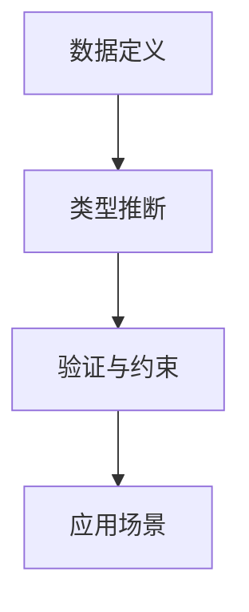
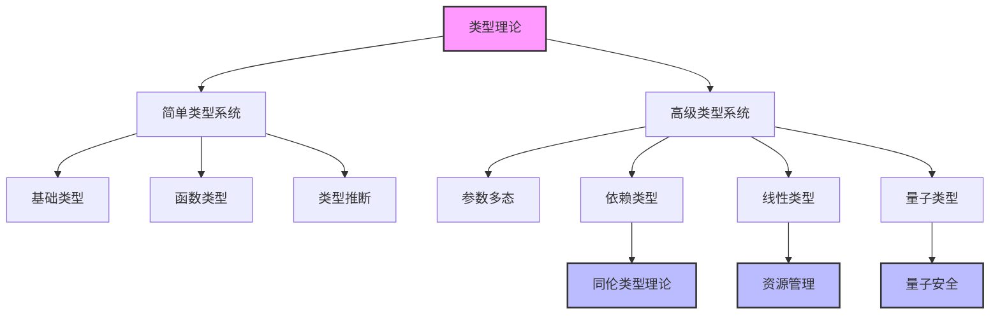
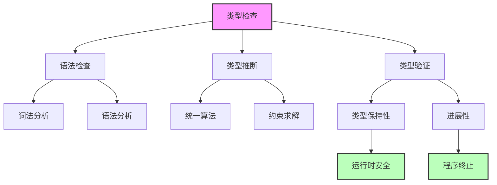
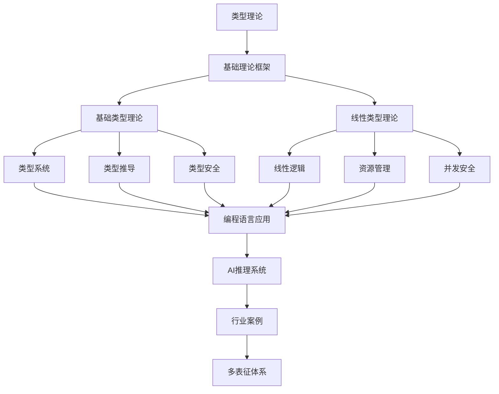

# 类型理论 (Type Theory)

## 概述

类型理论是现代计算机科学和数学的基础理论之一，为编程语言设计、程序验证和数学形式化提供了坚实的理论基础。从简单的类型检查到复杂的依赖类型系统，类型理论涵盖了从基础概念到前沿应用的完整体系。

## 目录结构与本地跳转

- [2.1.1-基础类型理论](2.1.1-基础类型理论.md) - 预留分支
- [2.1.2-线性类型理论](2.1.2-线性类型理论.md) - 预留分支

## 行业案例与多表征

### 2.1.x 典型行业案例

- AI推理系统：类型系统在安全推理与自动验证中的应用（详见3.4-AI与机器学习算法、2.8-编程语言理论）
- 金融建模：类型理论在金融合约DSL中的形式化保障（详见5.1-金融数据分析）

### 2.1.x 多表征示例

- 类型系统推理流程图、类型推断树、代码片段、Latex公式等

## 核心概念

### 类型系统层次

### 类型安全保证

## 理论基础

### 形式化定义

**定义 2.1.1 (类型上下文)**
设 $\Gamma$ 为类型上下文，定义为变量到类型的映射：
$$\Gamma : \text{Var} \rightarrow \text{Type}$$

**定义 2.1.2 (类型判断)**
类型判断形如 $\Gamma \vdash e : \tau$，表示在上下文 $\Gamma$ 中，表达式 $e$ 具有类型 $\tau$。

### 核心定理

**定理 2.1.1 (类型保持性 - Type Preservation)**
如果 $\Gamma \vdash e : \tau$ 且 $e \rightarrow e'$，则 $\Gamma \vdash e' : \tau$。

**定理 2.1.2 (进展性 - Progress)**
如果 $\emptyset \vdash e : \tau$，则要么 $e$ 是值，要么存在 $e'$ 使得 $e \rightarrow e'$。

## 工程应用

### 编程语言设计

- 类型系统的设计和实现
- 编译器的类型检查器
- 类型安全的抽象机制
- 多态性和泛型编程

### 程序验证

- 形式化程序规范
- 自动定理证明
- 程序正确性验证
- 安全属性保证

### 软件工程

- 静态分析工具
- 代码重构支持
- 文档生成
- 测试用例生成

## 交叉引用

### 与数据库系统的关联

- [PostgreSQL类型系统](../1-数据库系统/1.1-PostgreSQL/1.1.3-数据模型.md)
- [分布式事务类型安全](../1-数据库系统/1.1-PostgreSQL/1.1.9-PostgreSQL分布式架构与系统优缺点.md)

### 与软件工程的关联

- [系统架构类型安全](../3-软件工程与架构/3.1-系统架构/)
- [设计模式类型约束](../3-软件工程与架构/3.3-设计模式/)

### 与编程语言的关联

- [Rust类型系统](../4-编程语言与范式/4.1-Rust语言/)
- [函数式编程类型](../4-编程语言与范式/4.2-函数式编程/)

## 参考文献

1. Girard, J. Y. (1987). Linear logic. Theoretical computer science, 50(1), 1-101.
2. Reynolds, J. C. (1983). Types, abstraction and parametric polymorphism. Information processing, 83, 513-523.
3. Martin-Löf, P. (1984). Intuitionistic type theory. Bibliopolis.
4. Univalent Foundations Program. (2013). Homotopy type theory: Univalent foundations of mathematics.
5. Selinger, P. (2004). Towards a quantum programming language. Mathematical Structures in Computer Science, 14(4), 527-586.

---

*类型理论为现代软件工程提供了坚实的理论基础，从简单的类型检查到复杂的程序验证，涵盖了软件开发的各个方面。*

## 2.1-类型理论 分支导航

## 目录结构与本地跳转

- [2.1.1-基础类型理论](2.1.1-基础类型理论.md) - 预留分支
- [2.1.2-线性类型理论](2.1.2-线性类型理论.md) - 预留分支

## 主题交叉引用

| 主题      | 基础理论 | 形式化模型 | 应用场景 | 算法实现 | 行业案例 | 多表征 |
|-----------|----------|------------|----------|----------|----------|--------|
| 基础类型理论| 预留     | 预留       | 预留     | 预留     | 预留     | 预留   |
| 线性类型理论| 预留     | 预留       | 预留     | 预留     | 预留     | 预留   |

- 交叉引用：[3.2-形式化模型](../../../3-数据模型与算法/3.2-形式化模型/README.md)、[2.8-编程语言理论](../2.8-编程语言理论/README.md)、[3.4-AI与机器学习算法](../../../3-数据模型与算法/3.4-AI与机器学习算法/README.md)

## 全链路知识流（Mermaid流程图）

---

[返回形式科学理论总导航](../README.md)

## 多表征

类型理论分支支持多种表征方式，包括：

- 符号表征（类型、类型构造器、类型等式等）
- 图结构（类型依赖图、类型推导树）
- 向量/张量（类型嵌入、特征向量）
- 自然语言（定义、注释、描述）
- 图像/可视化（类型结构图、推导流程图等）
这些表征可互映，提升理论表达力。

## 形式化语义

- 语义域：$D$，如类型集合、类型关系、模型空间
- 解释函数：$I: S \to D$，将符号/结构映射到具体类型语义对象
- 语义一致性：每个类型结构/公式在$D$中有明确定义

## 形式化语法与证明

- 语法规则：如类型产生式、推理规则、约束条件
- **定理**：类型理论分支的语法系统具一致性与可扩展性。
- **证明**：由类型产生式与推理规则递归定义，保证系统一致与可扩展。
