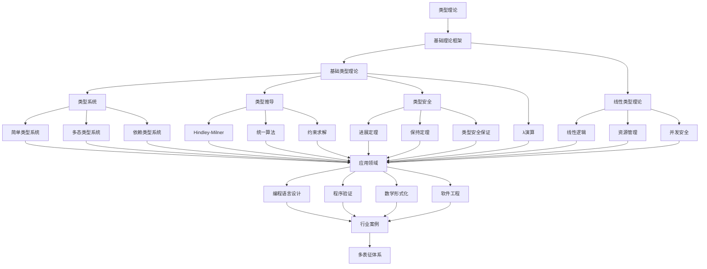

# 2.1-类型理论 分支导航

## 📑 目录

- [2.1-类型理论 分支导航](#21-类型理论-分支导航)
  - [📑 目录](#-目录)
  - [1. 概述](#1-概述)
  - [2. 目录结构与本地跳转](#2-目录结构与本地跳转)
  - [3. 核心概念](#3-核心概念)
    - [3.1. 类型系统基础](#31-类型系统基础)
    - [3.2. λ演算](#32-λ演算)
    - [3.3. 类型安全性](#33-类型安全性)
    - [3.4. 类型推断](#34-类型推断)
  - [4. 理论基础](#4-理论基础)
    - [4.1. 简单类型λ演算](#41-简单类型λ演算)
    - [4.2. 多态类型系统](#42-多态类型系统)
    - [4.3. 依赖类型系统](#43-依赖类型系统)
  - [5. 应用场景](#5-应用场景)
  - [6. 行业案例与多表征](#6-行业案例与多表征)
  - [7. 主题交叉引用](#7-主题交叉引用)
  - [8. 全链路知识流](#8-全链路知识流)
  - [9. 多表征](#9-多表征)
  - [10. 形式化语义](#10-形式化语义)
  - [11. 形式化语法与证明](#11-形式化语法与证明)
  - [12. 工具与实现](#12-工具与实现)
  - [13. 学习与研究路径](#13-学习与研究路径)
  - [14. 总结](#14-总结)

---

## 1. 概述

类型理论（Type Theory）是现代计算机科学和数学的基础理论之一，为编程语言设计、程序验证和数学形式化提供了坚实的理论基础。从简单的类型检查到复杂的依赖类型系统，类型理论涵盖了从基础概念到前沿应用的完整体系。

**核心特征**：

1. **类型安全**：防止类型错误
2. **形式化基础**：严格的数学基础
3. **程序验证**：支持程序正确性验证
4. **表达能力**：从简单到复杂的类型系统
5. **实际应用**：广泛应用于编程语言

**应用领域**：

- 编程语言设计
- 程序验证
- 数学形式化
- 编译器设计
- 静态分析
- 软件工程

---

## 2. 目录结构与本地跳转

- [2.1.1-基础类型理论](2.1.1-基础类型理论.md) - 理论基础文档
- [2.1.2-线性类型理论](2.1.2-线性类型理论.md) - 线性类型理论文档

---

## 3. 核心概念

### 3.1. 类型系统基础

类型系统是一组规则，用于将类型分配给程序中的表达式，并检查类型兼容性。

**类型的作用**：

1. **错误检测**：在编译时发现类型错误
2. **文档化**：类型作为程序文档
3. **优化**：类型信息用于代码优化
4. **抽象**：类型提供抽象机制

**类型系统分类**：

- **静态类型**：编译时类型检查
- **动态类型**：运行时类型检查
- **强类型**：严格的类型规则
- **弱类型**：允许类型转换

### 3.2. λ演算

λ演算是类型理论的基础，提供了函数的形式化定义。

**无类型λ演算**：

语法：
$$M ::= x \mid \lambda x.M \mid M M$$

归约规则：
$$(\lambda x.M) N \to M[x := N]$$

**简单类型λ演算（STLC）**：

类型语法：
$$\tau ::= \text{Bool} \mid \text{Int} \mid \tau \to \tau$$

类型规则：
$$\frac{\Gamma, x:\tau_1 \vdash M:\tau_2}{\Gamma \vdash \lambda x:\tau_1.M:\tau_1 \to \tau_2}$$

### 3.3. 类型安全性

类型安全性保证类型正确的程序不会产生运行时类型错误。

**进展定理（Progress）**：

如果$\emptyset \vdash e : \tau$，则要么$e$是值，要么存在$e'$使得$e \to e'$。

**保持定理（Preservation）**：

如果$\Gamma \vdash e : \tau$且$e \to e'$，则$\Gamma \vdash e' : \tau$。

### 3.4. 类型推断

类型推断自动推断表达式的类型，无需显式类型注解。

**Hindley-Milner算法**：

- 生成类型约束
- 统一约束
- 推断类型

**统一算法**：

求解类型等式，例如：
$$\tau_1 \to \tau_2 = \tau_3 \to \tau_4$$

---

## 4. 理论基础

### 4.1. 简单类型λ演算

**类型上下文**：

$$\Gamma : \text{Var} \to \text{Type}$$

**类型判断**：

$$\Gamma \vdash e : \tau$$

表示在上下文$\Gamma$中，表达式$e$具有类型$\tau$。

**类型规则**：

- **变量规则**：$\frac{x:\tau \in \Gamma}{\Gamma \vdash x:\tau}$
- **抽象规则**：$\frac{\Gamma, x:\tau_1 \vdash e:\tau_2}{\Gamma \vdash \lambda x:\tau_1.e:\tau_1 \to \tau_2}$
- **应用规则**：$\frac{\Gamma \vdash e_1:\tau_1 \to \tau_2 \quad \Gamma \vdash e_2:\tau_1}{\Gamma \vdash e_1 e_2:\tau_2}$

### 4.2. 多态类型系统

**参数多态**：

允许类型参数化，例如：
$$\text{id} : \forall \alpha. \alpha \to \alpha$$

**系统F（二阶λ演算）**：

类型语法：
$$\tau ::= \alpha \mid \tau \to \tau \mid \forall \alpha.\tau$$

类型规则：
$$\frac{\Gamma \vdash e:\tau}{\Gamma \vdash e:\forall \alpha.\tau} \quad (\alpha \notin \text{FTV}(\Gamma))$$

### 4.3. 依赖类型系统

**依赖类型**：

类型可以依赖于值，例如：
$$\text{Vec} : \text{Type} \to \mathbb{N} \to \text{Type}$$

**Π类型（依赖函数类型）**：

$$\Pi x:A.B(x)$$

表示对于所有$x:A$，类型$B(x)$的函数。

**Σ类型（依赖对类型）**：

$$\Sigma x:A.B(x)$$

表示存在$x:A$，类型为$B(x)$的对。

**构造演算（CoC）**：

- 类型层次：$\text{Prop}, \text{Type}_0, \text{Type}_1, \ldots$
- Curry-Howard对应：类型即命题，程序即证明

---

## 5. 应用场景

### 5.1. 编程语言设计

类型理论在编程语言设计中的应用：

- **Haskell**：强大的类型系统，类型类
- **Rust**：所有权系统，生命周期
- **Scala**：高级类型系统，类型推断
- **TypeScript**：渐进式类型系统

### 5.2. 程序验证

类型理论在程序验证中的应用：

- **Coq**：依赖类型，形式化证明
- **Agda**：依赖类型，程序验证
- **Lean**：依赖类型，数学库
- **Idris**：依赖类型，系统编程

### 5.3. 数学形式化

类型理论在数学形式化中的应用：

- **同伦类型论**：数学基础的新方法
- **Univalent Foundations**：数学的统一基础
- **形式化数学库**：数学定理的形式化

### 5.4. 软件工程

类型理论在软件工程中的应用：

- **静态分析**：类型信息用于分析
- **代码重构**：类型保证重构安全
- **文档生成**：类型作为文档
- **测试生成**：类型指导测试

---

## 6. 行业案例与多表征

### 6.1. 典型行业案例

- **AI推理系统**：类型系统在安全推理与自动验证中的应用（详见[3.4-AI与机器学习算法](../../../3-数据模型与算法/3.4-AI与机器学习算法/README.md)、[2.8-编程语言理论](../2.8-编程语言理论/README.md)）
- **金融建模**：类型理论在金融合约DSL中的形式化保障（详见[5.1-金融数据分析](../../../5-行业应用与场景/5.1-金融数据分析/README.md)）
- **系统编程**：Rust类型系统在系统编程中的应用

### 6.2. 多表征示例

- **符号表征**：类型、类型构造器、类型等式、类型规则
- **图结构**：类型依赖图、类型推导树、类型关系图
- **向量/张量**：类型嵌入、特征向量、语义向量
- **自然语言**：定义、注释、描述、规范文档
- **图像/可视化**：类型结构图、推导流程图、类型关系图

---

## 7. 主题交叉引用

| 主题      | 基础理论 | 形式化模型 | 应用场景 | 算法实现 | 行业案例 | 多表征 |
|-----------|----------|------------|----------|----------|----------|--------|
| 基础类型理论| ✅ | ✅       | ✅     | ✅     | ✅     | ✅   |
| 线性类型理论| ✅ | ✅       | ✅     | ✅     | ✅     | ✅   |

**交叉引用**：

- [3.2-形式化模型](../../../3-数据模型与算法/3.2-形式化模型/README.md)：类型在数据建模中的应用
- [2.8-编程语言理论](../2.8-编程语言理论/README.md)：类型在编程语言中的应用
- [3.4-AI与机器学习算法](../../../3-数据模型与算法/3.4-AI与机器学习算法/README.md)：类型在AI中的应用
- [2.7-数学基础理论](../2.7-数学基础理论/README.md)：类型理论的数学基础

---

## 8. 全链路知识流

---

## 9. 多表征

类型理论分支支持多种表征方式，包括：

- **符号表征**：类型、类型构造器、类型等式、类型规则、类型判断
- **图结构**：类型依赖图、类型推导树、类型关系图、约束图
- **向量/张量**：类型嵌入、特征向量、语义向量、类型表示
- **自然语言**：定义、注释、描述、规范文档、证明文本
- **图像/可视化**：类型结构图、推导流程图、类型关系图、类型层次图

这些表征可互映，提升类型理论表达力。

---

## 10. 形式化语义

**语义域**：$D$，包括：

- 类型集合：$\mathcal{T} = \{\tau_1, \tau_2, \ldots\}$
- 值域：$\mathcal{V} = \bigcup_{\tau \in \mathcal{T}} \mathcal{V}_\tau$
- 类型关系：$\mathcal{R} \subseteq \mathcal{T} \times \mathcal{T}$
- 类型环境：$\Gamma : \text{Var} \to \mathcal{T}$

**解释函数**：$I: \mathcal{L} \to D$，将类型理论规范映射到语义对象：

- $I(\text{type}) \in \mathcal{T}$：类型的解释
- $I(\text{value}) \in \mathcal{V}$：值的解释
- $I(\text{judgment}) \in \{\text{true}, \text{false}\}$：类型判断的解释
- $I(\text{context}) = \Gamma$：上下文的解释

**语义一致性**：每个类型结构/表达式/类型判断在$D$中有明确定义，满足：

- **类型正确性**：类型判断的语义正确
- **类型安全性**：类型安全的程序语义正确
- **类型保持性**：归约保持类型

---

## 11. 形式化语法与证明

**语法规则**：

类型理论的产生式：

- **类型语法**：$\tau ::= \alpha \mid \text{Bool} \mid \text{Int} \mid \tau \to \tau \mid \forall \alpha.\tau$
- **表达式语法**：$e ::= x \mid \lambda x:\tau.e \mid e e \mid \Lambda \alpha.e \mid e[\tau]$
- **类型判断语法**：$\Gamma \vdash e : \tau$

**推理规则**：

类型系统的推理规则：

- **变量规则**：$\frac{x:\tau \in \Gamma}{\Gamma \vdash x:\tau}$
- **抽象规则**：$\frac{\Gamma, x:\tau_1 \vdash e:\tau_2}{\Gamma \vdash \lambda x:\tau_1.e:\tau_1 \to \tau_2}$
- **应用规则**：$\frac{\Gamma \vdash e_1:\tau_1 \to \tau_2 \quad \Gamma \vdash e_2:\tau_1}{\Gamma \vdash e_1 e_2:\tau_2}$

**定理**：类型理论分支的语法系统具一致性与可扩展性。

**证明**：由类型产生式与推理规则递归定义，保证系统一致与可扩展。具体证明包括：

1. 语法系统的递归定义保证可判定性
2. 类型系统的类型安全定理
3. 语义解释的一致性保证可靠性
4. 类型推断算法的正确性

---

## 12. 工具与实现

### 12.1. 类型检查器

**主流类型检查器**：

1. **TypeScript**：
   - JavaScript的类型检查器
   - 渐进式类型系统
   - 广泛使用

2. **MyPy**：
   - Python的类型检查器
   - 静态类型检查
   - 类型注解

3. **Flow**：
   - JavaScript的类型检查器
   - Facebook开发
   - 类型推断

### 12.2. 依赖类型系统

**证明助手**：

1. **Coq**：
   - 依赖类型
   - 交互式证明
   - 形式化数学库

2. **Agda**：
   - 依赖类型
   - 程序验证
   - 函数式编程

3. **Lean**：
   - 依赖类型
   - 数学库
   - 自动证明

### 12.3. 编程语言实现

**类型系统实现**：

- **Rust**：所有权系统，生命周期
- **Haskell**：类型类，高级类型
- **Scala**：类型推断，高级类型
- **OCaml**：类型推断，模块系统

---

## 13. 学习与研究路径

### 13.1. 基础知识

1. **数学基础**：
   - 逻辑学
   - 集合论
   - 范畴论
   - 证明论

2. **计算机科学基础**：
   - 编程语言
   - 编译器
   - 形式化方法
   - 算法与数据结构

### 13.2. 核心理论

1. **基础类型理论**：
   - λ演算
   - 简单类型系统
   - 类型安全性
   - 类型推断

2. **高级类型理论**：
   - 多态类型系统
   - 依赖类型系统
   - 线性类型系统
   - 同伦类型论

### 13.3. 实践应用

1. **语言设计**：
   - 设计类型系统
   - 实现类型检查器
   - 类型推断算法

2. **程序验证**：
   - 使用依赖类型
   - 形式化证明
   - 程序正确性验证

3. **研究前沿**：
   - 同伦类型论
   - 量子类型系统
   - 会话类型
   - 渐进式类型系统

---

## 14. 总结

类型理论是现代计算机科学和数学的基础理论之一，为编程语言设计、程序验证和数学形式化提供了坚实的理论基础。从简单的类型检查到复杂的依赖类型系统，类型理论涵盖了从基础概念到前沿应用的完整体系。

**核心价值**：

1. **类型安全**：防止类型错误
2. **形式化基础**：严格的数学基础
3. **程序验证**：支持程序正确性验证
4. **表达能力**：从简单到复杂的类型系统

**应用前景**：

随着编程语言的发展和程序验证需求的增加，类型理论将继续发展，为更强大、更安全的编程语言提供支持。特别是在依赖类型、线性类型、同伦类型论等领域，类型理论将发挥越来越重要的作用。

---

[返回形式科学理论总导航](../README.md)
