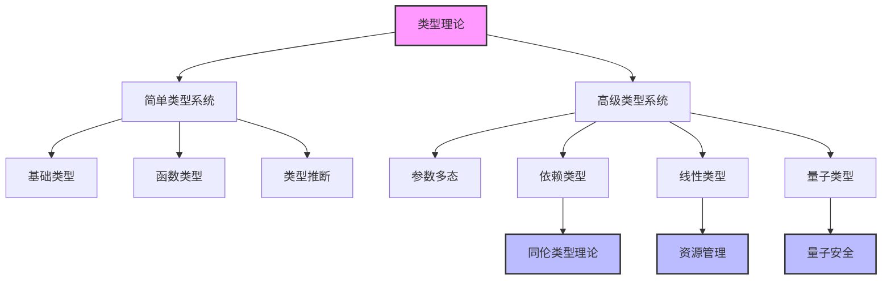
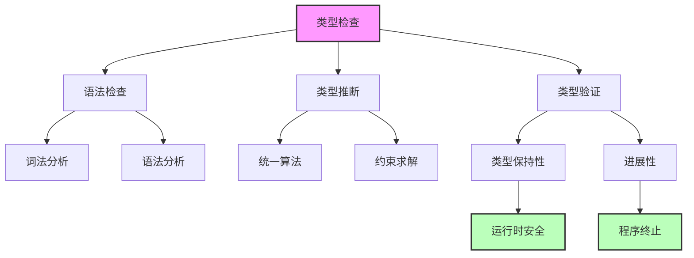

# 类型理论 (Type Theory)

## 概述

类型理论是现代计算机科学和数学的基础理论之一，为编程语言设计、程序验证和数学形式化提供了坚实的理论基础。从简单的类型检查到复杂的依赖类型系统，类型理论涵盖了从基础概念到前沿应用的完整体系。

## 目录结构

### 2.1.1 基础类型理论

- 简单类型λ演算
- 类型上下文和类型判断
- 类型安全性和进展性
- 类型推断算法

### 2.1.2 线性类型理论

- 线性逻辑基础
- 资源管理和内存安全
- 线性类型系统设计
- Rust语言中的应用

### 2.1.3 仿射类型理论

- 所有权和生命周期
- 借用检查器设计
- 内存安全保证
- 并发安全模型

### 2.1.4 时态类型理论

- 实时系统建模
- 时间约束表达
- 时态类型检查
- 实时编程语言

### 2.1.5 依赖类型理论

- Π类型和Σ类型
- 程序验证和规范
- 依赖类型检查
- 定理证明辅助

### 2.1.6 同伦类型理论

- 数学形式化基础
- 类型作为空间
- 同伦等价性
- 数学证明自动化

### 2.1.7 量子类型理论

- 量子计算安全
- 量子类型系统
- 量子程序验证
- 量子错误纠正

## 核心概念

### 类型系统层次

### 类型安全保证

## 理论基础

### 形式化定义

**定义 2.1.1 (类型上下文)**
设 $\Gamma$ 为类型上下文，定义为变量到类型的映射：
$$\Gamma : \text{Var} \rightarrow \text{Type}$$

**定义 2.1.2 (类型判断)**
类型判断形如 $\Gamma \vdash e : \tau$，表示在上下文 $\Gamma$ 中，表达式 $e$ 具有类型 $\tau$。

### 核心定理

**定理 2.1.1 (类型保持性 - Type Preservation)**
如果 $\Gamma \vdash e : \tau$ 且 $e \rightarrow e'$，则 $\Gamma \vdash e' : \tau$。

**定理 2.1.2 (进展性 - Progress)**
如果 $\emptyset \vdash e : \tau$，则要么 $e$ 是值，要么存在 $e'$ 使得 $e \rightarrow e'$。

## 工程应用

### 编程语言设计

- 类型系统的设计和实现
- 编译器的类型检查器
- 类型安全的抽象机制
- 多态性和泛型编程

### 程序验证

- 形式化程序规范
- 自动定理证明
- 程序正确性验证
- 安全属性保证

### 软件工程

- 静态分析工具
- 代码重构支持
- 文档生成
- 测试用例生成

## 交叉引用

### 与数据库系统的关联

- [PostgreSQL类型系统](../1-数据库系统/1.1-PostgreSQL/1.1.3-数据模型.md)
- [分布式事务类型安全](../1-数据库系统/1.1-PostgreSQL/1.1.9-PostgreSQL分布式架构与系统优缺点.md)

### 与软件工程的关联

- [系统架构类型安全](../3-软件工程与架构/3.1-系统架构/)
- [设计模式类型约束](../3-软件工程与架构/3.3-设计模式/)

### 与编程语言的关联

- [Rust类型系统](../4-编程语言与范式/4.1-Rust语言/)
- [函数式编程类型](../4-编程语言与范式/4.2-函数式编程/)

## 参考文献

1. Girard, J. Y. (1987). Linear logic. Theoretical computer science, 50(1), 1-101.
2. Reynolds, J. C. (1983). Types, abstraction and parametric polymorphism. Information processing, 83, 513-523.
3. Martin-Löf, P. (1984). Intuitionistic type theory. Bibliopolis.
4. Univalent Foundations Program. (2013). Homotopy type theory: Univalent foundations of mathematics.
5. Selinger, P. (2004). Towards a quantum programming language. Mathematical Structures in Computer Science, 14(4), 527-586.

---

*类型理论为现代软件工程提供了坚实的理论基础，从简单的类型检查到复杂的程序验证，涵盖了软件开发的各个方面。*
