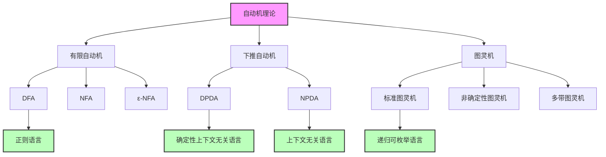
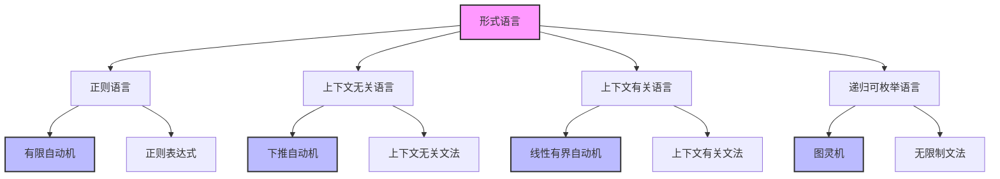
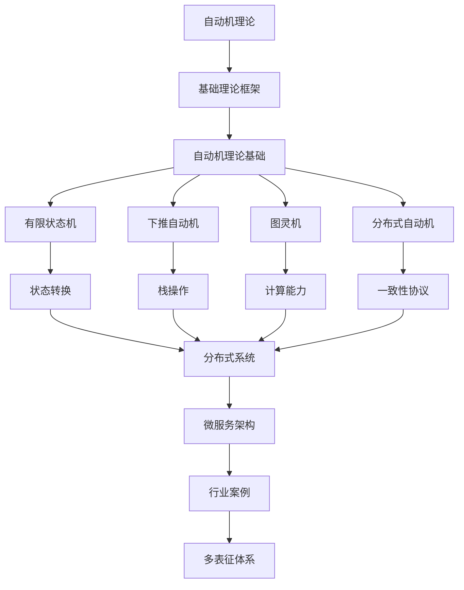

# 自动机理论 (Automata Theory)

## 概述

自动机理论是形式语言理论的基础，研究抽象计算模型和语言识别能力。从最简单的有限自动机到最强大的图灵机，自动机理论为计算机科学提供了重要的理论基础。

## 目录结构与本地跳转

- [2.2.1-自动机理论基础](2.2.1-自动机理论基础.md) - 预留分支

## 行业案例与多表征

### 2.2.x 典型行业案例

- 分布式系统：一致性协议的自动机建模（详见2.5-分布式系统理论、3.3.3-并发控制算法）
- 编译器设计：词法分析与状态机（详见2.8-编程语言理论）

### 2.2.x 多表征示例

- 状态转移图、自动机流程图、协议时序图、代码片段等

## 核心概念

### 自动机层次结构

### 语言层次结构

## 理论基础

### 形式化定义

**定义 2.2.1 (自动机)**
自动机是一个抽象计算模型，由状态集、输入字母表、转移函数和初始状态组成。

**定义 2.2.2 (语言识别)**
自动机 M 识别的语言 L(M) 是所有被 M 接受的字符串集合。

### 核心定理

**定理 2.2.1 (DFA 与 NFA 等价)**
对于每个 NFA，存在等价的 DFA。

**定理 2.2.2 (图灵机计算能力)**
图灵机可以计算任何可计算函数。

**定理 2.2.3 (丘奇-图灵论题)**
所有合理的计算模型都与图灵机等价。

## 工程应用

### 编译器设计

- 词法分析器构造
- 语法分析器设计
- 代码优化算法

### 软件验证

- 模型检查
- 程序分析
- 形式化验证

### 人工智能

- 自然语言处理
- 模式识别
- 机器学习

## 交叉引用

### 与形式科学理论的关联

- [类型理论](../2.1-类型理论/) - 类型检查与自动机
- [Petri网理论](../2.3-Petri网理论/) - 并发系统建模
- [时态逻辑](../2.4-时态逻辑/) - 模型检查

### 与软件工程的关联

- [编译器设计](../3-软件工程与架构/3.1-系统架构/) - 词法分析和语法分析
- [程序验证](../3-软件工程与架构/3.4-软件验证/) - 形式化验证

### 与编程语言的关联

- [语言设计](../4-编程语言与范式/4.1-Rust语言/) - 编程语言理论
- [函数式编程](../4-编程语言与范式/4.2-函数式编程/) - λ演算与自动机

## 参考文献

1. Hopcroft, J. E., Motwani, R., & Ullman, J. D. (2006). Introduction to automata theory, languages, and computation.
2. Sipser, M. (2012). Introduction to the theory of computation.
3. Chomsky, N. (1956). Three models for the description of language.
4. Turing, A. M. (1936). On computable numbers, with an application to the Entscheidungsproblem.

---

*自动机理论为现代计算机科学提供了坚实的理论基础，从简单的语言识别到复杂的计算模型，涵盖了计算理论的各个方面。*

[返回形式科学理论导航](../README.md)

## 2.2-自动机理论 分支导航

## 目录结构与本地跳转1

- [2.2.1-自动机理论基础](2.2.1-自动机理论基础.md) - 预留分支

---

## 主题交叉引用

| 主题      | 基础理论 | 形式化模型 | 应用场景 | 算法实现 | 行业案例 | 多表征 |
|-----------|----------|------------|----------|----------|----------|--------|
| 自动机理论基础| 预留   | 预留       | 预留     | 预留     | 预留     | 预留   |

- 交叉引用：[2.5-分布式系统理论](../2.5-分布式系统理论/README.md)、[3.3-算法实现](../../../3-数据模型与算法/3.3-算法实现/README.md)、[4.3-微服务架构](../../../4-软件架构与工程/4.3-微服务架构/README.md)

---

## 全链路知识流（Mermaid流程图）

---

[返回形式科学理论总导航](../README.md)

## 多表征

本分支支持多种表征方式，包括：

- 符号表征（状态、转换、输入输出符号等）
- 图结构（状态转换图、自动机网络）
- 向量/张量（状态向量、嵌入）
- 自然语言（定义、注释、描述）
- 图像/可视化（状态图、流程图等）
这些表征可互映，提升自动机理论表达力。

## 形式化语义

- 语义域：$D$，如状态集合、转换关系、输入输出空间
- 解释函数：$I: S \to D$，将符号/结构映射到具体自动机语义对象
- 语义一致性：每个自动机结构/公式在$D$中有明确定义

## 形式化语法与证明

- 语法规则：如自动机产生式、推理规则、约束条件
- **定理**：自动机理论分支的语法系统具一致性与可扩展性。
- **证明**：由自动机产生式与推理规则递归定义，保证系统一致与可扩展。
