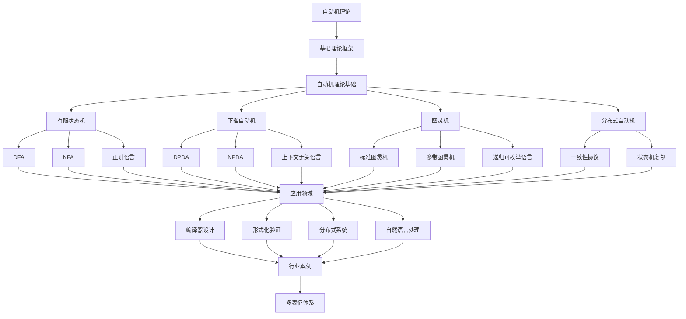

# 2.2-自动机理论 分支导航

## 📑 目录

- [2.2-自动机理论 分支导航](#22-自动机理论-分支导航)
  - [📑 目录](#-目录)
  - [1. 概述](#1-概述)
  - [2. 目录结构与本地跳转](#2-目录结构与本地跳转)
  - [3. 核心概念](#3-核心概念)
    - [3.1. 有限自动机](#31-有限自动机)
    - [3.2. 下推自动机](#32-下推自动机)
    - [3.3. 图灵机](#33-图灵机)
    - [3.4. 形式语言](#34-形式语言)
  - [4. 理论基础](#4-理论基础)
    - [4.1. 自动机形式化定义](#41-自动机形式化定义)
    - [4.2. 计算复杂性](#42-计算复杂性)
    - [4.3. 可计算性理论](#43-可计算性理论)
  - [5. 应用场景](#5-应用场景)
  - [6. 行业案例与多表征](#6-行业案例与多表征)
  - [7. 主题交叉引用](#7-主题交叉引用)
  - [8. 全链路知识流](#8-全链路知识流)
  - [9. 多表征](#9-多表征)
  - [10. 形式化语义](#10-形式化语义)
  - [11. 形式化语法与证明](#11-形式化语法与证明)
  - [12. 工具与实现](#12-工具与实现)
  - [13. 学习与研究路径](#13-学习与研究路径)
  - [14. 总结](#14-总结)

---

## 1. 概述

自动机理论（Automata Theory）是形式语言理论的基础，研究抽象计算模型和语言识别能力。从最简单的有限自动机到最强大的图灵机，自动机理论为计算机科学提供了重要的理论基础，是计算理论、编译器设计、形式化验证等领域的核心。

**核心特征**：

1. **抽象计算模型**：研究计算的形式化模型
2. **语言识别**：研究语言的识别能力
3. **计算能力**：研究不同自动机的计算能力
4. **形式化方法**：严格的数学基础
5. **实际应用**：广泛应用于计算机科学

**应用领域**：

- 编译器设计
- 形式化验证
- 分布式系统
- 自然语言处理
- 模式识别
- 软件工程

---

## 2. 目录结构与本地跳转

- [2.2.1-自动机理论基础](2.2.1-自动机理论基础.md) - 理论基础文档

---

## 3. 核心概念

### 3.1. 有限自动机

有限自动机（Finite Automaton）是最简单的自动机模型，用于识别正则语言。

**确定性有限自动机（DFA）**：

DFA是一个五元组$M = (Q, \Sigma, \delta, q_0, F)$，其中：

- $Q$：有限状态集合
- $\Sigma$：输入字母表
- $\delta: Q \times \Sigma \to Q$：转移函数
- $q_0 \in Q$：初始状态
- $F \subseteq Q$：接受状态集合

**非确定性有限自动机（NFA）**：

NFA的转移函数为：$\delta: Q \times (\Sigma \cup \{\epsilon\}) \to 2^Q$

**DFA与NFA等价性**：

对于每个NFA，存在等价的DFA（子集构造法）。

### 3.2. 下推自动机

下推自动机（Pushdown Automaton, PDA）扩展了有限自动机，增加了栈，用于识别上下文无关语言。

**PDA形式化定义**：

PDA是一个七元组$M = (Q, \Sigma, \Gamma, \delta, q_0, Z_0, F)$，其中：

- $Q$：状态集合
- $\Sigma$：输入字母表
- $\Gamma$：栈字母表
- $\delta$：转移函数
- $q_0$：初始状态
- $Z_0$：初始栈符号
- $F$：接受状态集合

**上下文无关文法与PDA**：

上下文无关语言（CFL）与PDA识别的语言等价。

### 3.3. 图灵机

图灵机（Turing Machine, TM）是最强大的自动机模型，可以计算任何可计算函数。

**图灵机形式化定义**：

TM是一个七元组$M = (Q, \Sigma, \Gamma, \delta, q_0, B, F)$，其中：

- $Q$：状态集合
- $\Sigma$：输入字母表
- $\Gamma$：带字母表（$\Sigma \subseteq \Gamma$）
- $\delta$：转移函数
- $q_0$：初始状态
- $B \in \Gamma$：空白符号
- $F$：接受状态集合

**丘奇-图灵论题**：

所有合理的计算模型都与图灵机等价。

### 3.4. 形式语言

形式语言是字符串的集合，由自动机或文法定义。

**Chomsky层次结构**：

1. **类型0**：递归可枚举语言（图灵机）
2. **类型1**：上下文有关语言（线性有界自动机）
3. **类型2**：上下文无关语言（下推自动机）
4. **类型3**：正则语言（有限自动机）

**语言类包含关系**：

$$\text{正则} \subset \text{上下文无关} \subset \text{上下文有关} \subset \text{递归可枚举}$$

---

## 4. 理论基础

### 4.1. 自动机形式化定义

**自动机**：

自动机是一个抽象计算模型，由状态集、输入字母表、转移函数和初始状态组成。

**语言识别**：

自动机$M$识别的语言$L(M)$是所有被$M$接受的字符串集合。

**接受条件**：

- **DFA**：输入结束后处于接受状态
- **PDA**：输入结束后处于接受状态且栈为空
- **TM**：进入接受状态

### 4.2. 计算复杂性

**时间复杂性**：

算法的时间复杂性$T(n)$是输入长度为$n$时所需的最大步数。

**空间复杂性**：

算法的空间复杂性$S(n)$是输入长度为$n$时所需的最大存储空间。

**复杂性类**：

- **P类**：多项式时间可判定
- **NP类**：非确定性多项式时间可判定
- **PSPACE类**：多项式空间可判定
- **EXPTIME类**：指数时间可判定

### 4.3. 可计算性理论

**可判定性**：

问题$P$是可判定的，如果存在算法可以判定$P$的所有实例。

**不可判定问题**：

- **停机问题**：判定图灵机是否停机
- **Post对应问题**：字符串匹配问题
- **一阶逻辑有效性**：一阶逻辑公式的有效性

**递归可枚举性**：

语言$L$是递归可枚举的，如果存在图灵机可以枚举$L$的所有字符串。

---

## 5. 应用场景

### 5.1. 编译器设计

自动机在编译器设计中的应用：

- **词法分析**：使用DFA识别词法单元
- **语法分析**：使用PDA进行语法分析
- **代码优化**：使用自动机进行代码优化

### 5.2. 形式化验证

自动机在形式化验证中的应用：

- **模型检查**：使用自动机建模系统
- **程序分析**：使用自动机分析程序性质
- **协议验证**：使用自动机验证协议

### 5.3. 分布式系统

自动机在分布式系统中的应用：

- **一致性协议**：使用自动机建模一致性协议
- **状态机复制**：使用状态机实现复制
- **分布式算法**：使用自动机设计分布式算法

### 5.4. 自然语言处理

自动机在自然语言处理中的应用：

- **词法分析**：识别词汇
- **句法分析**：分析句子结构
- **模式匹配**：使用正则表达式匹配模式

---

## 6. 行业案例与多表征

### 6.1. 典型行业案例

- **分布式系统**：一致性协议的自动机建模（详见[2.5-分布式系统理论](../2.5-分布式系统理论/README.md)、[3.3-算法实现](../../../3-数据模型与算法/3.3-算法实现/README.md)）
- **编译器设计**：词法分析与状态机（详见[2.8-编程语言理论](../2.8-编程语言理论/README.md)）
- **微服务架构**：状态机在微服务中的应用（详见[4.3-微服务架构](../../../4-软件架构与工程/4.3-微服务架构/README.md)）

### 6.2. 多表征示例

- **符号表征**：状态、转换、输入输出符号、自动机定义
- **图结构**：状态转换图、自动机网络、状态空间图
- **向量/张量**：状态向量、嵌入、特征表示
- **自然语言**：定义、注释、描述、规范文档
- **图像/可视化**：状态图、流程图、自动机可视化

---

## 7. 主题交叉引用

| 主题      | 基础理论 | 形式化模型 | 应用场景 | 算法实现 | 行业案例 | 多表征 |
|-----------|----------|------------|----------|----------|----------|--------|
| 自动机理论基础| ✅ | ✅       | ✅     | ✅     | ✅     | ✅   |

**交叉引用**：

- [2.5-分布式系统理论](../2.5-分布式系统理论/README.md)：分布式系统中的自动机
- [3.3-算法实现](../../../3-数据模型与算法/3.3-算法实现/README.md)：算法中的自动机
- [4.3-微服务架构](../../../4-软件架构与工程/4.3-微服务架构/README.md)：微服务中的状态机
- [2.8-编程语言理论](../2.8-编程语言理论/README.md)：编译器中的自动机

---

## 8. 全链路知识流



---

## 9. 多表征

本分支支持多种表征方式，包括：

- **符号表征**：状态、转换、输入输出符号、自动机定义、形式化表示
- **图结构**：状态转换图、自动机网络、状态空间图、转移图
- **向量/张量**：状态向量、嵌入、特征表示、状态空间表示
- **自然语言**：定义、注释、描述、规范文档、算法描述
- **图像/可视化**：状态图、流程图、自动机可视化、状态空间可视化

这些表征可互映，提升自动机理论表达力。

---

## 10. 形式化语义

**语义域**：$D$，包括：

- 状态集合：$Q = \{q_1, q_2, \ldots, q_n\}$
- 输入字母表：$\Sigma = \{a_1, a_2, \ldots, a_m\}$
- 转移关系：$\delta \subseteq Q \times \Sigma \times Q$
- 语言：$L \subseteq \Sigma^*$

**解释函数**：$I: \mathcal{L} \to D$，将自动机规范映射到语义对象：

- $I(\text{state}) \in Q$：状态的解释
- $I(\text{transition}) \in \delta$：转移的解释
- $I(\text{language}) = L$：语言的解释
- $I(\text{automaton}) = M$：自动机的解释

**语义一致性**：每个自动机结构/语言/计算在$D$中有明确定义，满足：

- **确定性**：DFA的转移是确定的
- **接受性**：字符串被接受当且仅当存在接受计算
- **语言性**：自动机识别的语言是明确定义的

---

## 11. 形式化语法与证明

**语法规则**：

自动机的产生式：

- **状态语法**：$q ::= q_1 \mid q_2 \mid \ldots \mid q_n$
- **转移语法**：$\delta ::= (q, a, q') \mid \delta, \delta$
- **自动机语法**：$M ::= (Q, \Sigma, \delta, q_0, F)$

**推理规则**：

自动机的推理规则：

- **转移规则**：$\frac{(q, a, q') \in \delta}{q \xrightarrow{a} q'}$
- **接受规则**：$\frac{q_0 \xrightarrow{w} q_f \quad q_f \in F}{w \in L(M)}$

**定理**：自动机理论分支的语法系统具一致性与可扩展性。

**证明**：由自动机产生式与推理规则递归定义，保证系统一致与可扩展。具体证明包括：

1. 语法系统的递归定义保证可判定性
2. 自动机的语言识别能力
3. 不同自动机模型的等价性
4. 计算复杂性和可计算性理论

---

## 12. 工具与实现

### 12.1. 自动机工具

**自动机可视化工具**：

1. **JFLAP**：
   - 自动机可视化
   - 自动机构造
   - 语言测试

2. **Automata Simulator**：
   - 自动机模拟
   - 状态转换可视化
   - 语言识别

### 12.2. 形式化验证工具

**模型检查工具**：

1. **SPIN**：
   - 显式状态模型检查
   - Promela语言
   - 并发系统验证

2. **NuSMV**：
   - 符号模型检查
   - LTL和CTL支持
   - BDD技术

### 12.3. 编程实现

**Python实现示例**：

```python
class DFA:
    def __init__(self, states, alphabet, transitions, start_state, accept_states):
        self.states = states
        self.alphabet = alphabet
        self.transitions = transitions
        self.current_state = start_state
        self.accept_states = accept_states

    def process(self, input_string):
        self.current_state = self.start_state
        for symbol in input_string:
            if symbol not in self.alphabet:
                return False
            self.current_state = self.transitions[self.current_state][symbol]
        return self.current_state in self.accept_states
```

**Rust实现示例**：

```rust
struct DFA {
    states: Vec<usize>,
    alphabet: Vec<char>,
    transitions: HashMap<(usize, char), usize>,
    start_state: usize,
    accept_states: HashSet<usize>,
}

impl DFA {
    fn process(&self, input: &str) -> bool {
        let mut current_state = self.start_state;
        for symbol in input.chars() {
            if let Some(&next_state) = self.transitions.get(&(current_state, symbol)) {
                current_state = next_state;
            } else {
                return false;
            }
        }
        self.accept_states.contains(&current_state)
    }
}
```

---

## 13. 学习与研究路径

### 13.1. 基础知识

1. **数学基础**：
   - 集合论
   - 图论
   - 逻辑学
   - 离散数学

2. **计算机科学基础**：
   - 算法与数据结构
   - 形式化方法
   - 计算理论
   - 编程语言

### 13.2. 核心理论

1. **基础自动机**：
   - 有限自动机
   - 下推自动机
   - 图灵机

2. **形式语言**：
   - 正则语言
   - 上下文无关语言
   - Chomsky层次

3. **计算理论**：
   - 计算复杂性
   - 可计算性理论
   - 复杂度类

### 13.3. 实践应用

1. **编译器设计**：
   - 词法分析
   - 语法分析
   - 代码生成

2. **形式化验证**：
   - 模型检查
   - 程序分析
   - 协议验证

3. **研究前沿**：
   - 量子自动机
   - 概率自动机
   - 细胞自动机
   - 分布式自动机

---

## 14. 总结

自动机理论是形式语言理论的基础，研究抽象计算模型和语言识别能力。从最简单的有限自动机到最强大的图灵机，自动机理论为计算机科学提供了重要的理论基础，是计算理论、编译器设计、形式化验证等领域的核心。

**核心价值**：

1. **理论基础**：为计算理论提供基础
2. **语言识别**：研究语言的识别能力
3. **计算能力**：研究不同自动机的计算能力
4. **实际应用**：广泛应用于计算机科学

**应用前景**：

随着编译器技术、形式化验证、分布式系统等领域的发展，自动机理论将继续发挥重要作用，特别是在模型检查、程序分析、协议验证等领域，自动机理论将提供关键的理论支撑和实用工具。

---

[返回形式科学理论总导航](../README.md)
