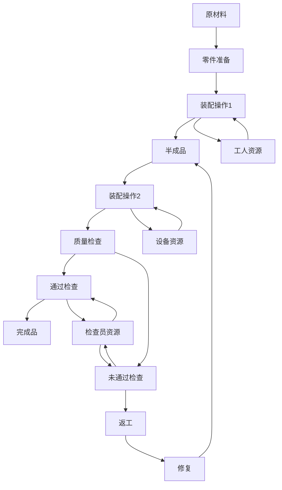

# Petri网高级理论与应用

## 1. 高级Petri网模型

### 1.1 时间Petri网 (Timed Petri Nets)

**定义 1.1.1** 时间Petri网是一个六元组 $N = (P, T, F, M_0, I, D)$，其中：

- $(P, T, F, M_0)$ 是基本Petri网
- $I: T \rightarrow \mathbb{R}^+ \times (\mathbb{R}^+ \cup \{\infty\})$ 是时间间隔函数
- $D: T \rightarrow \mathbb{R}^+$ 是延迟函数

**定义 1.1.2** 时间状态是一个对 $(M, \tau)$，其中：

- $M$ 是标识
- $\tau: T \rightarrow \mathbb{R}^+$ 是时钟函数

**定理 1.1.1** (时间可达性) 时间Petri网的可达性问题比基本Petri网更复杂，但在特定约束下可解。

**证明**：

1. 时间约束增加了状态空间维度
2. 连续时间可能导致无限状态空间
3. 通过区域抽象(region abstraction)可将无限状态空间转化为有限状态空间
4. 区域图构造算法的复杂度为指数级

```rust
// Rust实现：时间Petri网的区域抽象
struct TimedPetriNet {
    places: Vec<Place>,
    transitions: Vec<Transition>,
    flow: HashMap<(NodeId, NodeId), u32>,
    timing: HashMap<TransitionId, (f64, Option<f64>)>,
}

struct Region {
    marking: Vec<u32>,
    constraints: Vec<TimeConstraint>,
}

impl TimedPetriNet {
    // 构建区域图
    fn build_region_graph(&self) -> RegionGraph {
        let initial_region = self.create_initial_region();
        let mut region_graph = RegionGraph::new(initial_region);
        let mut queue = VecDeque::new();
        queue.push_back(initial_region);
        
        while let Some(region) = queue.pop_front() {
            for transition in &self.transitions {
                if self.is_enabled_in_region(&region, transition) {
                    let next_region = self.fire_transition(&region, transition);
                    if !region_graph.contains(&next_region) {
                        region_graph.add_region(next_region.clone());
                        queue.push_back(next_region);
                    }
                    region_graph.add_edge(&region, &next_region, transition);
                }
            }
        }
        
        region_graph
    }
}
```

### 1.2 着色Petri网 (Colored Petri Nets)

**定义 1.2.1** 着色Petri网是一个七元组 $N = (P, T, F, \Sigma, C, G, E)$，其中：

- $(P, T, F)$ 是Petri网结构
- $\Sigma$ 是非空颜色集合
- $C: P \rightarrow \mathcal{P}(\Sigma)$ 是库所颜色函数
- $G: T \rightarrow \text{Bool}$ 是守卫函数
- $E: F \rightarrow \text{Expr}$ 是弧表达式函数

**定义 1.2.2** 颜色标识是一个函数 $M: P \rightarrow \text{Bag}(C(p))$，其中 $\text{Bag}(A)$ 表示集合 $A$ 的多重集。

**定理 1.2.1** (着色表达能力) 着色Petri网与图灵机等价，具有更强的表达能力。

**实现示例**：

```python
# Python实现：着色Petri网模拟器
class ColoredPetriNet:
    def __init__(self, places, transitions, arcs, color_sets, guards, expressions):
        self.places = places
        self.transitions = transitions
        self.arcs = arcs
        self.color_sets = color_sets
        self.guards = guards
        self.expressions = expressions
        self.marking = {p: MultiSet() for p in places}
    
    def is_enabled(self, transition, binding):
        """检查给定绑定下变迁是否使能"""
        if not self.guards[transition](binding):
            return False
            
        for p, t in self.arcs:
            if t == transition:  # 输入弧
                tokens_needed = self.expressions[(p, t)](binding)
                if not tokens_needed.is_subset_of(self.marking[p]):
                    return False
        return True
    
    def fire(self, transition, binding):
        """在给定绑定下发生变迁"""
        if not self.is_enabled(transition, binding):
            return False
            
        # 移除输入弧的标记
        for p, t in self.arcs:
            if t == transition:  # 输入弧
                tokens = self.expressions[(p, t)](binding)
                self.marking[p].subtract(tokens)
                
        # 添加输出弧的标记
        for t, p in self.arcs:
            if t == transition:  # 输出弧
                tokens = self.expressions[(t, p)](binding)
                self.marking[p].add(tokens)
                
        return True
```

### 1.3 层次Petri网 (Hierarchical Petri Nets)

**定义 1.3.1** 层次Petri网是一个结构 $N = (S, \text{SN}, \text{SA}, \text{PS}, \text{FS})$，其中：

- $S$ 是页面集合
- $\text{SN}$ 是子网函数
- $\text{SA}$ 是子网赋值函数
- $\text{PS}$ 是端口-套接字关系
- $\text{FS}$ 是融合集合

**定理 1.3.1** (层次分析) 层次Petri网可以通过展平(flattening)转换为等价的非层次网。

**应用**：

1. 模块化系统设计
2. 复杂系统的分层建模
3. 支持自顶向下和自底向上设计方法

## 2. 并发语义与分析技术

### 2.1 部分序语义 (Partial Order Semantics)

**定义 2.1.1** 过程是一个偏序集 $(E, \leq)$，其中：

- $E$ 是事件集
- $\leq$ 是因果序关系

**定义 2.1.2** 展开(unfolding)是Petri网的一种表示，捕获所有可能的并发行为。

**定理 2.1.1** (展开完备性) Petri网的完全展开包含了所有可能的执行。

**应用**：

1. 并发系统的验证
2. 死锁检测
3. 异步电路分析

### 2.2 归约技术 (Reduction Techniques)

**定义 2.2.1** 归约规则是保持特定性质的网络变换。

**定理 2.2.1** (归约有效性) 适当的归约可以显著减小状态空间而不影响关键性质。

**常见归约规则**：

1. 串行库所消除
2. 并行变迁融合
3. 隐式库所消除

```go
// Go实现：Petri网归约
type PetriNet struct {
    Places      []Place
    Transitions []Transition
    Arcs        []Arc
}

func (pn *PetriNet) ApplyReductions() {
    changed := true
    for changed {
        changed = false
        changed = changed || pn.EliminateSerialPlaces()
        changed = changed || pn.FuseParallelTransitions()
        changed = changed || pn.EliminateImplicitPlaces()
    }
}

func (pn *PetriNet) EliminateSerialPlaces() bool {
    // 实现串行库所消除算法
    for _, p := range pn.Places {
        if len(p.InputArcs) == 1 && len(p.OutputArcs) == 1 {
            // 检查是否可以安全消除
            if canSafelyEliminate(p) {
                pn.EliminatePlace(p)
                return true
            }
        }
    }
    return false
}
```

### 2.3 模型检验 (Model Checking)

**定义 2.3.1** Petri网模型检验是验证Petri网是否满足给定时态逻辑公式的过程。

**定理 2.3.1** (状态爆炸) Petri网模型检验面临状态爆炸问题，但可通过结构化方法缓解。

**技术**：

1. 符号模型检验
2. 部分序归约
3. 抽象解释

## 3. 应用领域与实践

### 3.1 工作流管理系统 (Workflow Management Systems)

**定理 3.1.1** (工作流建模) 工作流网是Petri网的特殊子类，适合建模业务流程。

**工作流网性质**：

1. 健全性(Soundness)：流程可以正确完成
2. 无死锁：不存在死锁状态
3. 适当完成：流程可以到达最终状态

**实现**：

```java
// 工作流网验证算法伪代码
public boolean checkSoundness(WorkflowNet wfNet) {
    // 1. 构建可达图
    ReachabilityGraph graph = buildReachabilityGraph(wfNet);
    
    // 2. 检查从初始状态是否可以到达任何状态
    for (State s : graph.getStates()) {
        if (!isReachable(graph.getInitialState(), s)) {
            return false; // 存在不可达状态
        }
    }
    
    // 3. 检查从任何状态是否可以到达最终状态
    for (State s : graph.getStates()) {
        if (!isReachable(s, graph.getFinalState())) {
            return false; // 存在无法完成的状态
        }
    }
    
    // 4. 检查最终状态是否为唯一的标记状态
    if (graph.getMarkedStates().size() > 1) {
        return false; // 存在多个标记状态
    }
    
    return true; // 工作流网是健全的
}
```

### 3.2 制造系统 (Manufacturing Systems)

**应用场景**：

1. 柔性制造系统(FMS)建模
2. 资源分配与调度
3. 性能评估与优化

**案例研究**：使用Petri网优化汽车装配线



### 3.3 软件系统设计 (Software System Design)

**应用**：

1. 并发软件验证
2. 通信协议分析
3. 分布式系统建模

**示例**：两阶段提交协议的Petri网模型

```rust
// Rust实现：两阶段提交协议的Petri网模型
struct TwoPhaseCommitNet {
    coordinator: Place,
    participants: Vec<Place>,
    prepare_phase: Transition,
    commit_phase: Transition,
    abort_phase: Transition,
    prepared_states: Vec<Place>,
    committed_states: Vec<Place>,
    aborted_states: Vec<Place>,
}

impl TwoPhaseCommitNet {
    fn new(num_participants: usize) -> Self {
        // 创建两阶段提交协议的Petri网模型
        let mut net = TwoPhaseCommitNet {
            coordinator: Place::new("coordinator_ready"),
            participants: vec![],
            prepare_phase: Transition::new("prepare"),
            commit_phase: Transition::new("commit"),
            abort_phase: Transition::new("abort"),
            prepared_states: vec![],
            committed_states: vec![],
            aborted_states: vec![],
        };
        
        // 初始化参与者
        for i in 0..num_participants {
            net.participants.push(Place::new(&format!("participant_{}_ready", i)));
            net.prepared_states.push(Place::new(&format!("participant_{}_prepared", i)));
            net.committed_states.push(Place::new(&format!("participant_{}_committed", i)));
            net.aborted_states.push(Place::new(&format!("participant_{}_aborted", i)));
        }
        
        // 构建网络结构
        // ...
        
        net
    }
    
    fn analyze_deadlock_freedom(&self) -> bool {
        // 分析协议是否无死锁
        // ...
        true
    }
}
```

## 4. 扩展理论与前沿研究

### 4.1 随机Petri网 (Stochastic Petri Nets)

**定义 4.1.1** 随机Petri网是一个五元组 $N = (P, T, F, M_0, \Lambda)$，其中：

- $(P, T, F, M_0)$ 是基本Petri网
- $\Lambda: T \rightarrow \mathbb{R}^+$ 是速率函数

**定理 4.1.1** (马尔可夫性质) 指数随机Petri网可映射为连续时间马尔可夫链。

**应用**：

1. 性能评估
2. 可靠性分析
3. 排队系统建模

### 4.2 对象Petri网 (Object Petri Nets)

**定义 4.2.1** 对象Petri网将面向对象概念与Petri网结合，托肯可以是对象。

**特性**：

1. 封装
2. 继承
3. 多态

**应用场景**：

1. 面向对象系统建模
2. 智能代理系统
3. 复杂业务流程

### 4.3 递归Petri网 (Recursive Petri Nets)

**定义 4.3.1** 递归Petri网允许托肯本身是Petri网，支持动态创建子网。

**定理 4.3.1** (表达能力) 递归Petri网比基本Petri网具有更强的表达能力。

**应用**：

1. 移动代理系统
2. 动态工作流
3. 自适应系统

## 5. 与其他形式化方法的集成

### 5.1 Petri网与时态逻辑 (Petri Nets and Temporal Logic)

**集成方法**：

1. 使用时态逻辑表达Petri网性质
2. 基于Petri网的模型检验算法
3. 时态逻辑控制合成

**应用**：

1. 安全关键系统验证
2. 实时系统分析
3. 控制器合成

### 5.2 Petri网与进程代数 (Petri Nets and Process Algebra)

**关系**：

1. 语义映射
2. 双模态规范
3. 互补分析技术

**优势**：

1. 结合图形化表示与代数规范
2. 支持组合分析
3. 增强表达能力

### 5.3 Petri网与神经网络 (Petri Nets and Neural Networks)

**新兴研究方向**：

1. 神经-符号集成
2. 可解释AI
3. 混合智能系统

**应用前景**：

1. 智能工作流系统
2. 自适应控制
3. 认知架构

## 6. 结论与未来展望

Petri网理论为并发分布式系统提供了强大的形式化基础，从基础理论到各种扩展，形成了完整的理论体系。随着计算技术的发展，Petri网理论也在不断演进，与人工智能、量子计算等新兴领域融合，开辟新的研究方向。

未来研究方向包括：

1. 大规模Petri网的高效分析技术
2. 与机器学习的深度集成
3. 量子Petri网理论
4. 自适应与进化Petri网

## 参考文献

1. Petri, C. A. (1962). Kommunikation mit Automaten. PhD thesis, Universität Hamburg.
2. Reisig, W. (2013). Understanding Petri nets: Modeling techniques, analysis methods, case studies.
3. Jensen, K., & Kristensen, L. M. (2009). Colored Petri nets: Modeling and validation of concurrent systems.
4. Murata, T. (1989). Petri nets: Properties, analysis and applications. Proceedings of the IEEE, 77(4), 541-580.
5. van der Aalst, W. M. P. (2011). Process Mining: Discovery, Conformance and Enhancement of Business Processes.
6. Balbo, G. (2007). Introduction to stochastic Petri nets. Lectures on Formal Methods and Performance Analysis.
7. Esparza, J., & Nielsen, M. (1994). Decidability issues for Petri nets - a survey. Journal of Information Processing and Cybernetics, 30(3), 143-160.
8. Valk, R. (1998). Petri nets as token objects: An introduction to elementary object nets. Application and Theory of Petri Nets.

## 多表征

Petri网高级理论与应用支持多种表征方式，包括：

- 符号表征（库所、变迁、标识、Petri网公式、高阶扩展等）
- 图结构（Petri网图、变迁图、状态图、层次化Petri网等）
- 向量/张量（库所向量、标识嵌入、属性向量）
- 自然语言（定义、注释、描述）
- 图像/可视化（Petri网结构图、流程图、应用场景可视化等）
这些表征可互映，提升Petri网高级理论与应用的表达力。

## 形式化语义

- 语义域：$D$，如库所集合、变迁集合、标识空间、Petri网模型空间、高阶属性空间
- 解释函数：$I: S \to D$，将符号/结构映射到具体Petri网语义对象
- 语义一致性：每个Petri网结构/公式/高阶扩展在$D$中有明确定义

## 形式化语法与证明

- 语法规则：如Petri网产生式、高阶扩展规则、推理规则、约束条件
- **定理**：Petri网高级理论与应用的语法系统具一致性与可扩展性。
- **证明**：由Petri网产生式、高阶扩展与推理规则递归定义，保证系统一致与可扩展。
