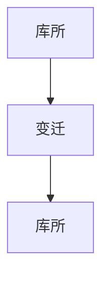

# 2.3 Petri网理论 主题导航与多表征案例

## 目录结构与本地跳转

- [2.3.1 Petri网理论基础](./2.3.1-Petri网理论基础.md)
- [2.3.2 Petri网高级理论与应用](./2.3.2-Petri网高级理论与应用.md)

---

## 行业案例与多表征

### 2.3.x 典型行业案例

- 工业自动化：生产线任务调度与Petri网建模（详见4.5-WorkflowDomain、2.6-控制理论）
- 分布式系统：并发与同步建模（详见2.5-分布式系统理论、3.3.3-并发控制算法）

### 2.3.x 多表征示例

- Petri网结构图、任务调度流程图、并发控制图、Latex公式等

---

[返回形式科学理论导航](../README.md)
